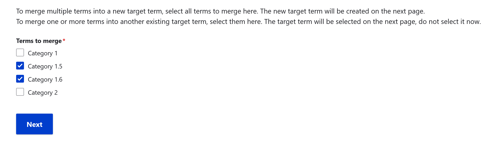
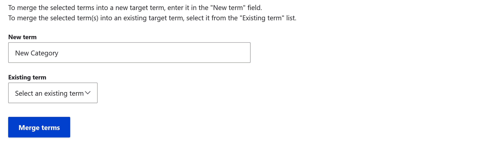

---
tags:
    - categories
    - taxonomies
---
# Manage Categories

!!! roles "User role"
    Mukurtu administrator

Categories are the cultural categories to which digital content refers. Associating content with one or more categories facilitates browsing. Sometimes communities may need to edit, combine, or otherwise manage the category terms on their site.

!!! tip
    For more information on adding new categories, visit [Create Categories](CreateCategories.md).

## Edit a category 

1. Select **Manage Categories**. 
2. Select the **Edit** link for the category you want to make changes to. 

    

3. Edit your *Category Name*, *Description*, or **Thumbnail Image**, then select "Save".

## Merge categories

Unnecessary or unwanted categories can be merged into other categories, so that digital heritage items are reassigned from one category to the new category. Reasons to merge categories may include 

- Categories that were mistakenly added through misspellings when batch importing digital heritage items can be merged into the correct category spelling.
- Categories that were useful may need to be removed due to site restructing or digital heritage item review. 

1. To manage the category taxonomy, navigate to your **Dashboard**. 
2. Under the **Categories and taxonomies** heading select the **Manage categories link** or navigate directly to `/admin/structure/taxonomy/manage/category/overview`. From this page you can merge categories.
3. Navigate to the **Merge** tab.
4. Select the checkbox by the terms you want to merge into a new or existing term. 

    

    !!! tip
        To merge multiple terms into a new target term, select all terms to merge here. The new target term will be created on the next page.
        To merge one or more terms into another existing target term, select them here. The target term will be selected on the next page, do not select it now. 

5. Select "Next".
6. Determine whether to merge the selected terms into a new target term or into an existing term.

    - To merge the selected terms into a new target term, enter it in the "New term" field. 

    
    
    - To merge the selected term(s) into an existing target term, select it from the "Existing term" list.

    

7. Select the "Merge terms" button. This will take you to a confirmation page. 
8. Review the terms to be merged and the target term on the confirmation page. If all the information is correct, select the "Confirm merge" button.

    !!! warning
        This action cannot be undone. 

    

9. After you confirm your merge, you will see a status message that you have successfully merge your terms into your target category.

