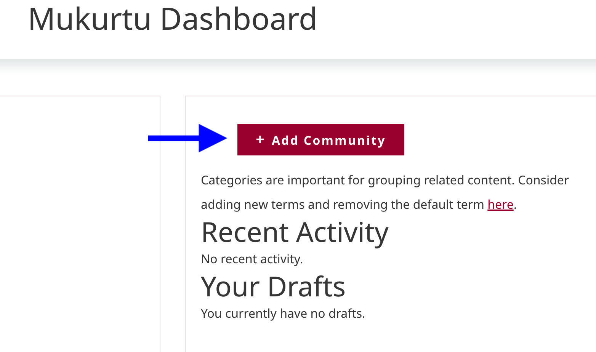
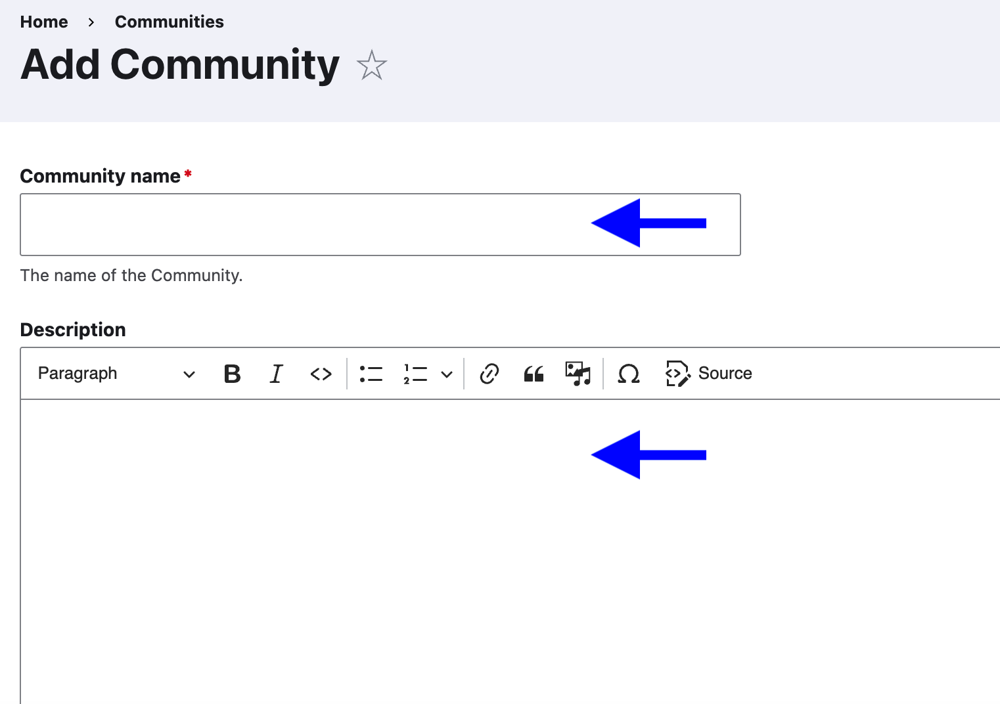
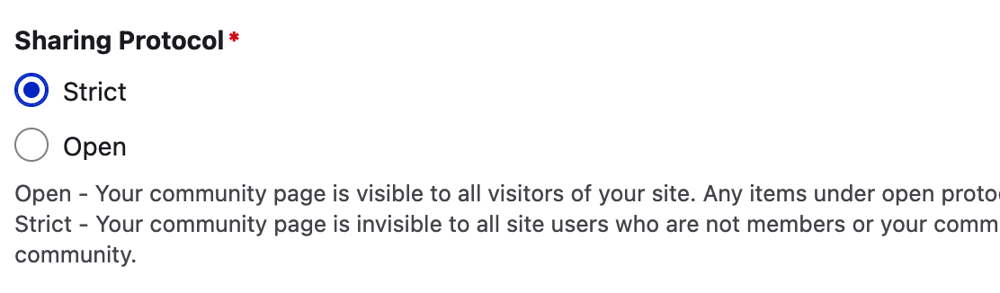
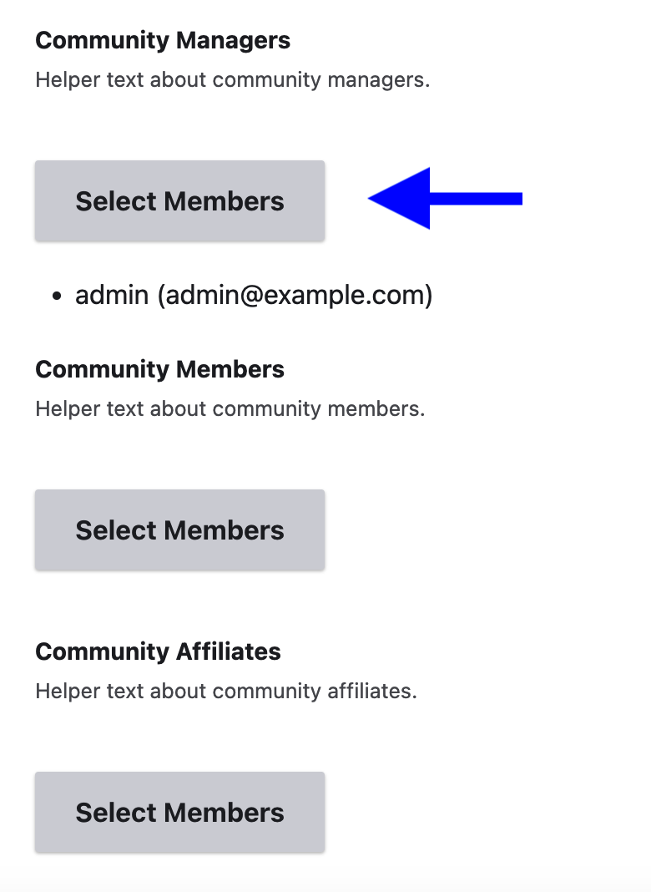
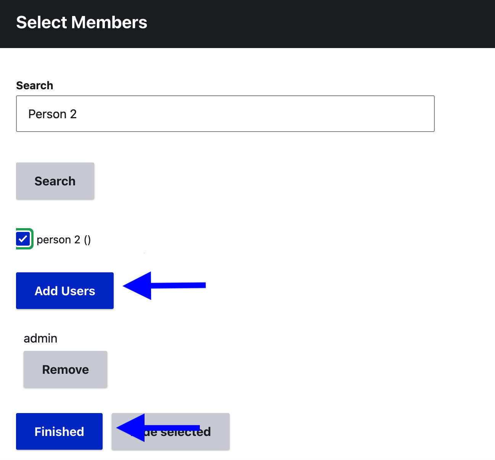
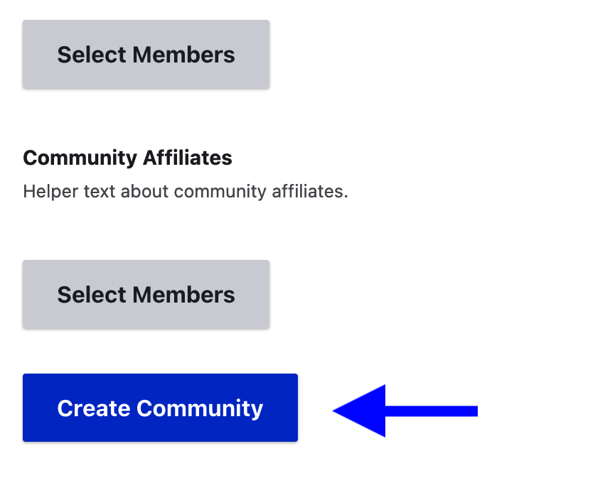
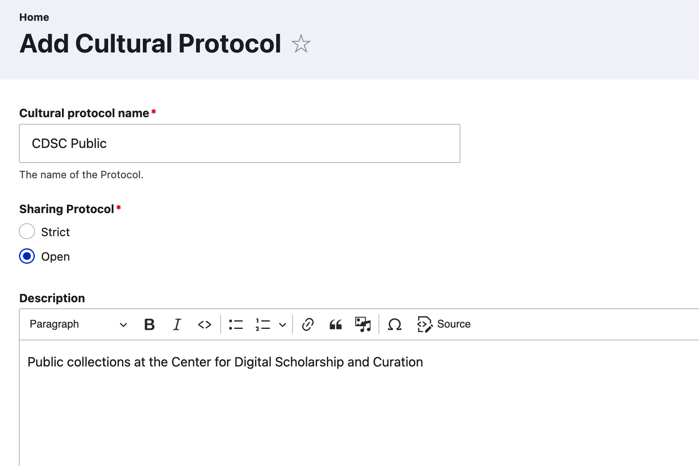
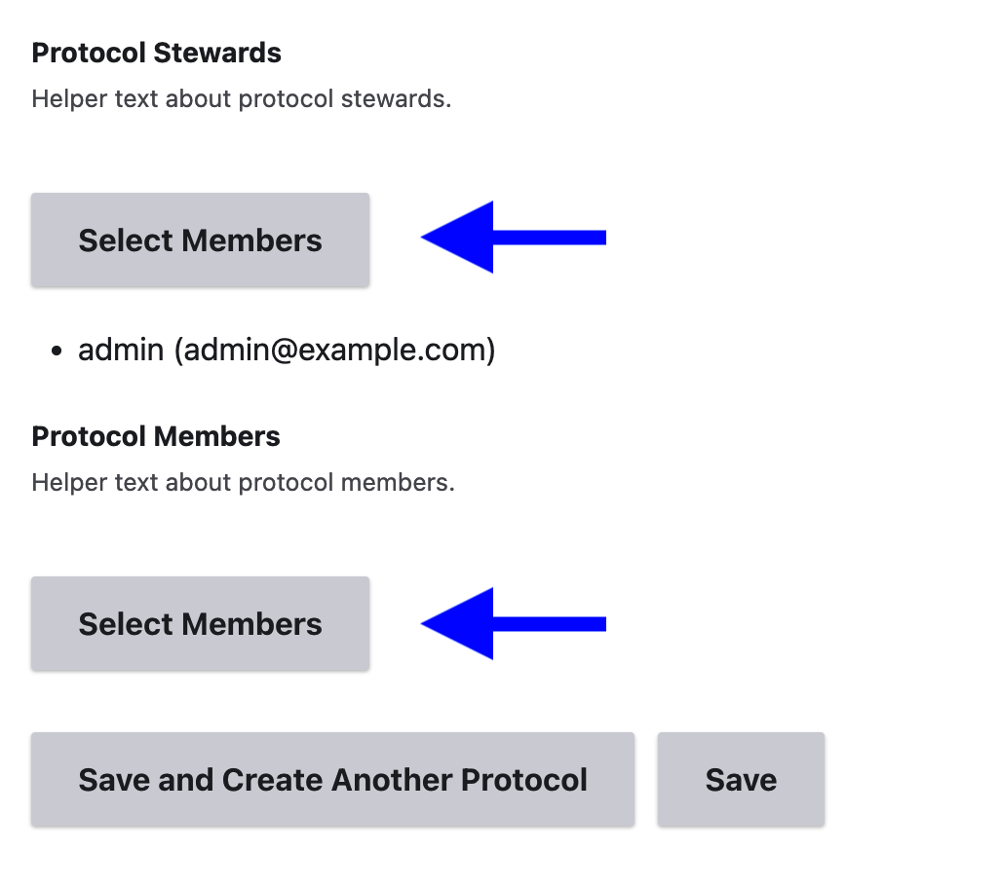
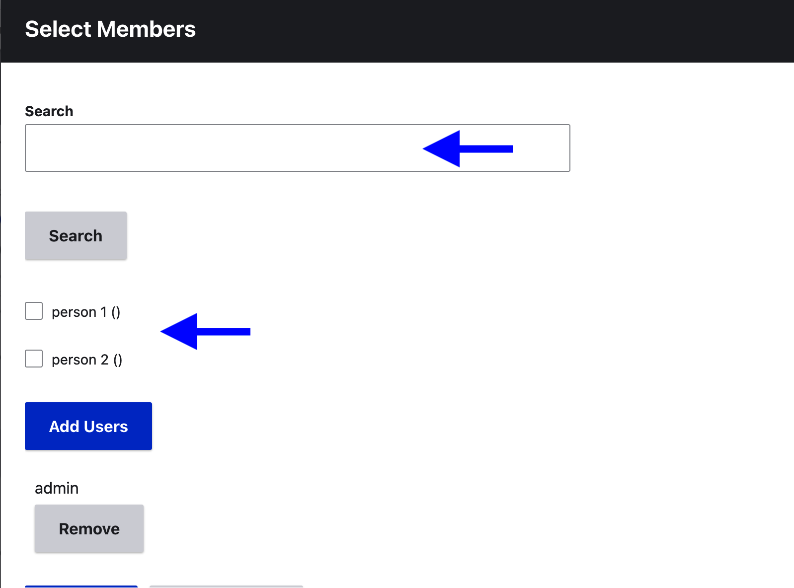
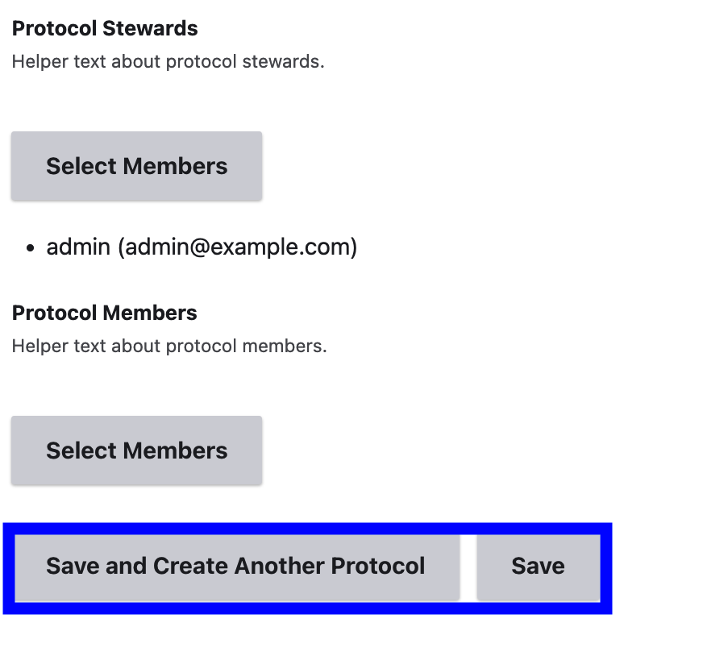

# Create a community and initial cultural protocol

>User Role: Mukurtu Administrator
## Stage 1: Create a community

From the Mukurtu dashboard, select **Add Community**

Enter a community name and description.

Under *Sharing Protocol*, select *Strict* to limit  access to the community page to community members only, or *Open* to allow public access to the community page.

Next, select community managers, community members and community affiliates. Each of these follows the same workflow: 

>Reminder: Individuals must create user accounts before they can be added to a community. If a name is not listed and does not turn up in search results, it is likely because no user account exists under that name.

Under *Community Managers* select **Select Members**. A window will open where you will make your selections.

Use the search bar to quickly find users, or find them in the list below the search bar and check the box next to their name. 

Once all the desired names have been checked, select **Add Users**.

You can also remove users by selecting **Remove** under their name.

When you're done adding users to your community, select **Finished**

Repeat these steps for community members and community affiliates.

When you're finished, select **Create Community**.

## Stage 2: Create a protocol

Once you have created a community, you will be directed to create a cultural protocol for that community. Every community must have at least one cultural protocol. 

Name your cultural protocol. It is best for protocol names to describe the group and access level. i.e. CDSC Community Only or CDSC Public

Under *Sharing Protocol* determine whether the protocol will be strict or open. Select *Strict* to limit access to protocol members and *Open* to allow for public access to the item.

Add a protocol description. 

Select protocol stewards and members using the same steps we used to add community members:

Under *Protocol Stewards,* Select **Select Members**

Use the search bar to quickly find users, or find them in the list below the search bar and check the box next to their name. 

Once all the desired names have been checked, select **Add Users**.

You can also remove users by selecting **Remove** under their name.

When you're done adding users to your protocol, select **Finished**

Select either **Save and Create Another Protocol** if you have additional protocols to add, or **Save** if you are done. You can always add additional protocols at a later time.
