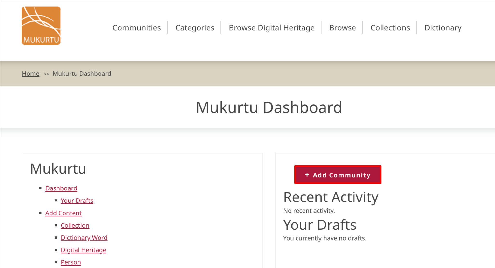
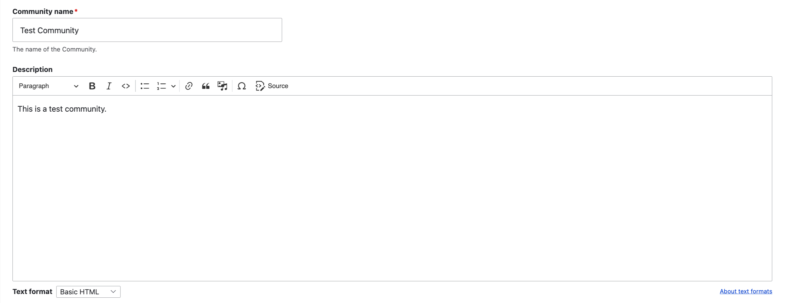
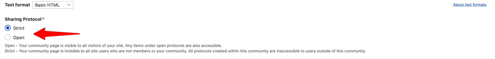
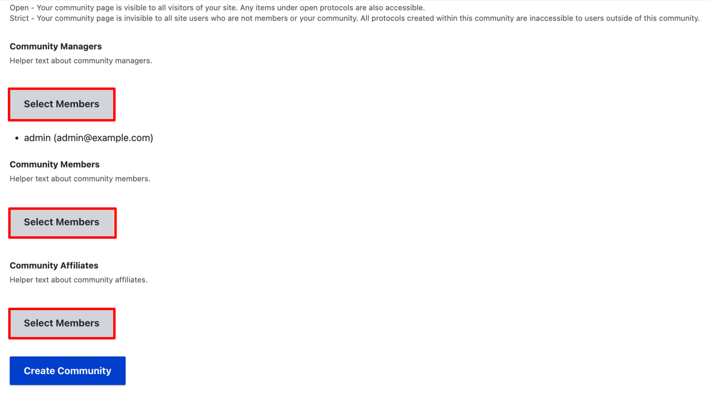
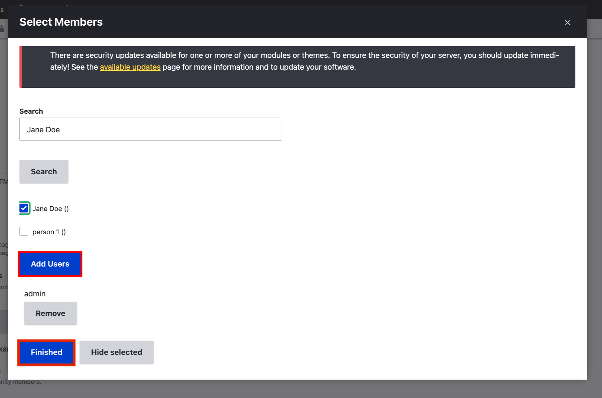
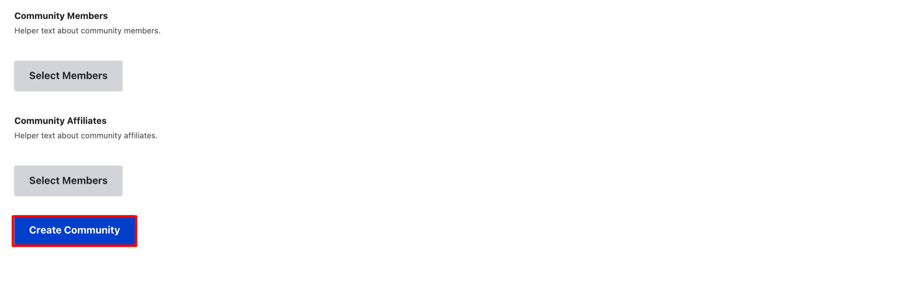
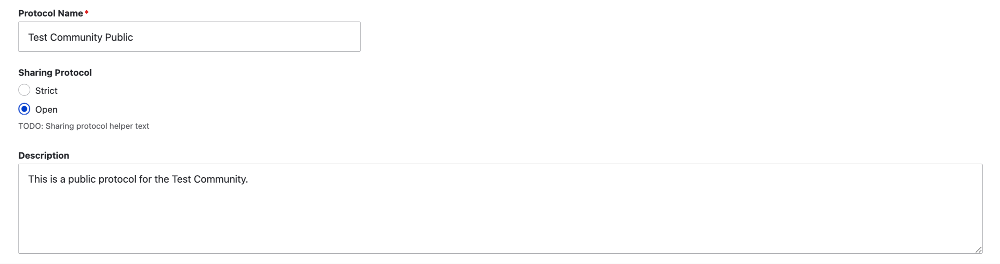
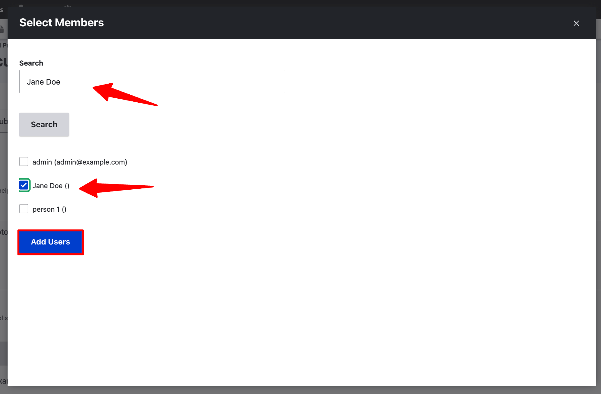
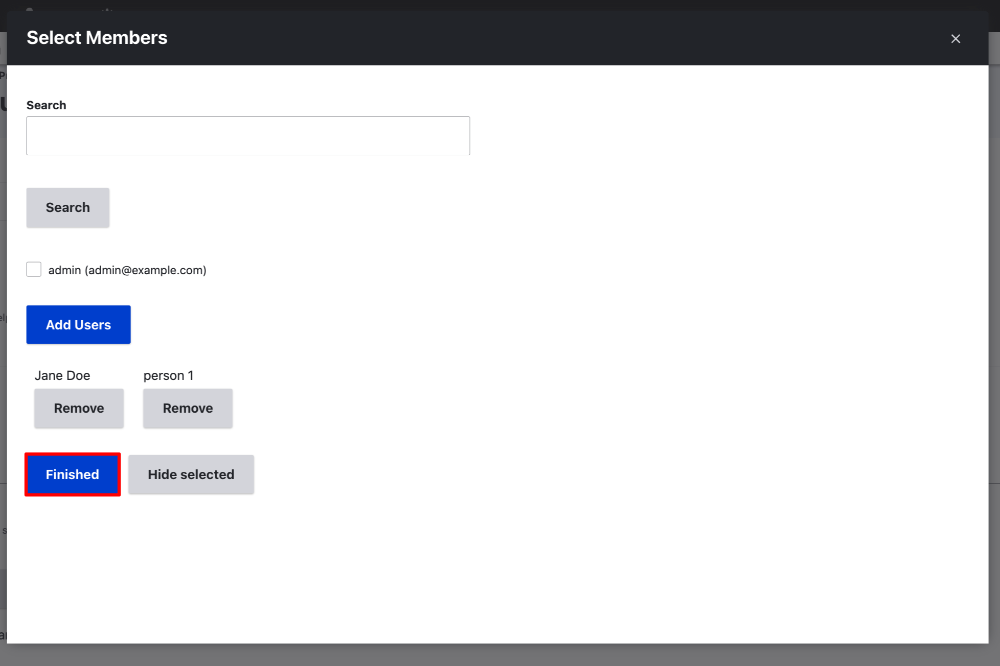

---
tags:
    - communities, cultural protocols, and categories
---
# Create a Community and Initial Cultural Protocol

!!! User roles 
    Mukurtu administrator

In Mukurtu 4, creating a new community will automatically prompt you to create a cultural protocol for that community. This article walks you through that initial setup. 

## Create a community

1. From the dashboard, select "Add Community"

    

2. Enter a *community name* and *description*. You can use the *description* field to introduce your community, share background and history, information about who to contact with questions, and any other information you would like visitors to know. 

    

3. In the *community page visibility field*, select **Strict** or **Open**:

    - **Strict** limits community page access to community members only.
    - **Open** allows public access to the community page.

    

    At this point, you have the option to add community members and assign user roles. If you are currently unsure about role assignments, or you have not yet created the necessary user accounts, you can skip this step and manage membership later. By default, the Mukurtu administrator will be added to the community and assigned to the community manager role. The instructions for adding members and assigning roles are the same:

    !!! tip
        Only registered users of the site will be able to be added to a community.

    There are three community roles. To read more, see [User Role Types](../users/user-role-types.md)

    - community manager - manages community membership and creates new protocols.

    - community affiliate - does not belong to a given community in real life, but works with the community in some capacity that necessitates inclusion in the community. This role helps to differentiate outsiders (i.e. researcher).

    - community member - views content within the community.

    
4. Under the user role to which you wish to enroll members, select "Select Members". A window will open where you will make your selections.

    

    - Begin typing a username into the search bar. Usernames will autocomplete as you type, or find them in the list below the search bar and check the box next to their name. 
    - Once all the desired users have been selected, select "Add Users".

        

    - To remove users, select "Remove" under their name.
    - Select "Finished" when your are done adding users.
    - Repeat these steps for any other user roles you would like to assign at this time.

5. When you're finished, select "Create Community". 

    

## Create a protocol

Once you have created a community, you will be directed to create a cultural protocol for that community. Every community must have at least one cultural protocol. 

1. Name your cultural protocol. It's helpful to name the community associated with this protocol and indicate the type of access provided. For example, public collections at the Washington State University Library Manuscripts, Archives and Special Collections (WSU-MASC) might use the protocol, WSU-MASC Public.

2.  Under *Protocol Type*, select **open** or **strict**. 

    - **Open**: Items under open protocol are accessible to all visitors, including those without user accounts.
    - **Strict**: Items under strict protocol are only visible to logged in protocol members. The protocol page will not be visible to the public.

3. Add an optional description. Descriptions display on the protocol page and may include information about the purpose of the protocol, the type of content under this protocol, and who to contact if you have questions.

    

4. At this point, you can add protocol members and assign user roles using the same steps  used to add community members. If you do not have community members yet, or are currently unsure of role assignments, you can skip this step and manage protocol membership later.

    There are several different user roles for protocols for you to use as needed:

    --- THIS WHOLE SECTION NEEDS MORE INFO---

    - Protocol Stewards - manage protocol membership and content
    - Protocol Member - can view content under this protocol, unless the content is under other protocols, in which case they may need to be a member of those protocols as well.
    - Protocol Affiliate - ???
    - Language Steward - manages dictionary words - under the protocol
    - Language Contributor - can make dictionary words under the protocol
    - Contributor - can create digital heritage items under the protocol
    - Community Record Steward - manages community records

    !!! tip
        Protocol members MUST belong to the same community as the protocol in order to be added to it.

    !!! tip
        For more in-depth information about user roles, see [User Role Types](../users/user-role-types.md)

    

5. When you're done adding users and assigning user roles to your protocol, select "Finished."

    

6. Select either "Save and Create Another Protocol" if you have additional protocols to add, or "Save" if you are done. You can always add additional protocols later.

    - "Save and create another protocol" generates a fresh form with a confirmation message.
    - "Save" takes you to the manage community page with a confirmation message.

 

--SCREENSHOT OF THE NEWLY CREATED COMMUNITY PAGE AND CONFIRMATION MESSAGE--
