---
tags:
    - communities, cultural protocols, and categories
---
# Create a Community and Initial Cultural Protocol

!!! User roles 
    Mukurtu manager

In Mukurtu 4, creating a new community will automatically prompt you to create a cultural protocol for that community. This article walks you through that initial setup. 

## Create a community

1. As a Mukurtu manager, from the dashboard, select "Add Community"

    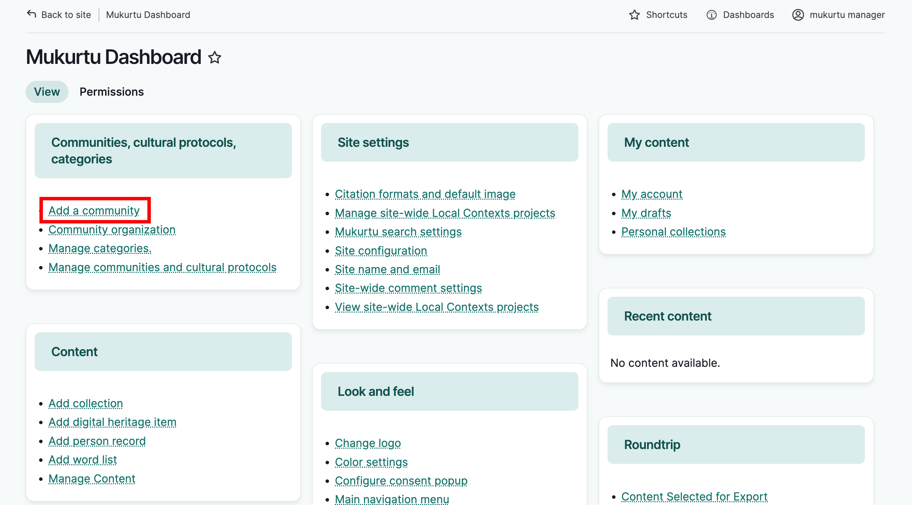

2. Enter a *community name* and *description*. You can use the *description* field to introduce your community, share background and history, information about who to contact with questions, and any other information you would like visitors to know. 

    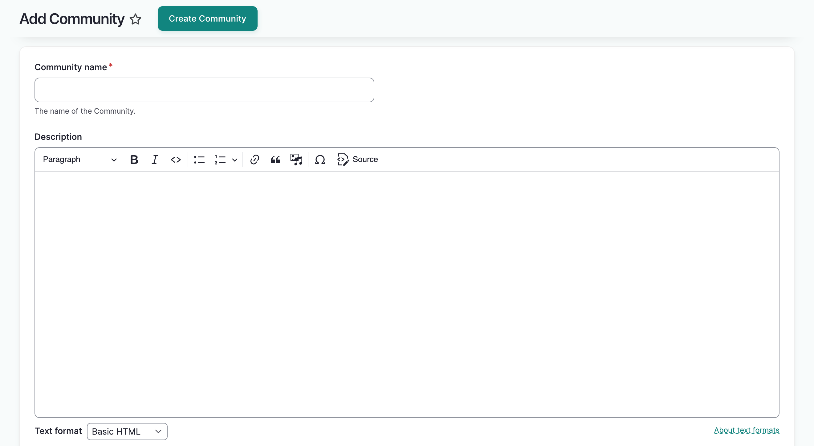

3. In the *community page visibility field*, select **Community Only** or **Public**:

    - **Community Only** limits community page access to community members only.
    - **Public** allows public access to the community page.

    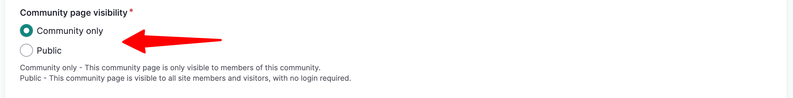

4. In the *membership display* field, select **Do not display any community members, Only display community managers,** or **Display all community members**
    - **Do not display any community members** does not display any community members on the community page.
    - **Only display community managers** displays community managers and not community members on the community page.
    - **Display all community members** displays all members on the community page.

    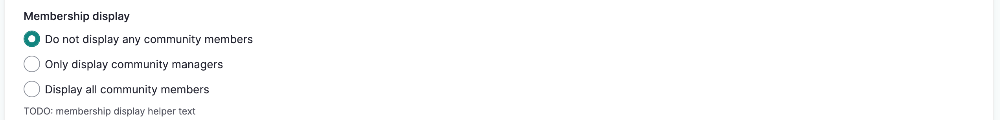

    At this point, you have the option to add community members and assign user roles. If you are currently unsure about role assignments, or you have not yet created the necessary user accounts, you can skip this step and manage membership later. By default, the Mukurtu administrator will be added to the community and assigned to the community manager role. The instructions for adding members and assigning roles are the same:

    !!! tip
        Only registered users of the site will be able to be added to a community.

    There are three community roles. To read more, see [User Role Types](../users/user-role-types.md)

    - community manager - manages community membership and creates new protocols.

    - community affiliate - This is a designation for community partners. They can view the community page and be added to protocols within the community.

    - community member - can view the community page and be added to protocols within the community.

    
5. Under the user role to which you wish to enroll members, select "Select Members". A window will open where you will make your selections.

    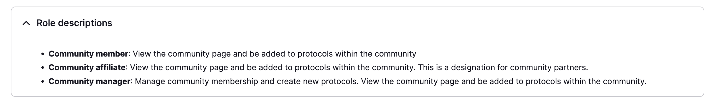

    - Begin typing a username into the search bar. Usernames will autocomplete as you type, or find them in the list below the search bar and check the box next to their name. 
    - Once all the desired users have been selected, select "Add Users".

        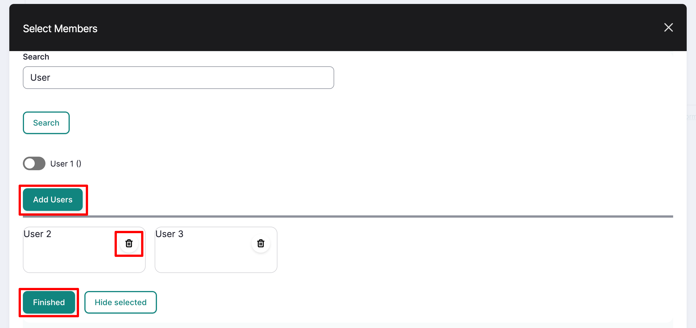

    - To remove users, select the trash can icon next to their name.
    - Select "Finished" when you are done adding users.
    - Repeat these steps for any other user roles you would like to assign at this time.

6. When you're finished, select "Create Community," which is sticky at the top of the page.  

    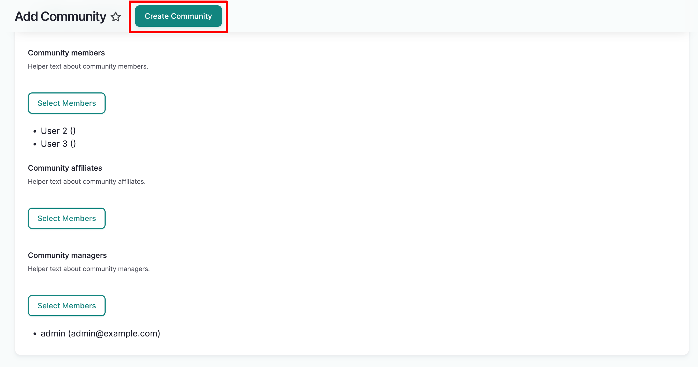

## Create a protocol

Once you have created a community, you will be directed to create a cultural protocol for that community. Every community must have at least one cultural protocol. 

1. Name your cultural protocol. It's helpful to name the community associated with this protocol and indicate the type of access provided. For example, public collections at the Washington State University Library Manuscripts, Archives and Special Collections (WSU-MASC) might use the protocol, WSU-MASC Public.

2.  Under *Protocol Type*, select **open** or **strict**. 

    - **Open**: Items under open protocol are accessible to all visitors, including those without user accounts.
    - **Strict**: Items under strict protocol are only visible to logged in protocol members. The protocol page will not be visible to the public.

3. Add an optional description. Descriptions display on the protocol page and may include information about the purpose of the protocol, the type of content under this protocol, and who to contact if you have questions.

    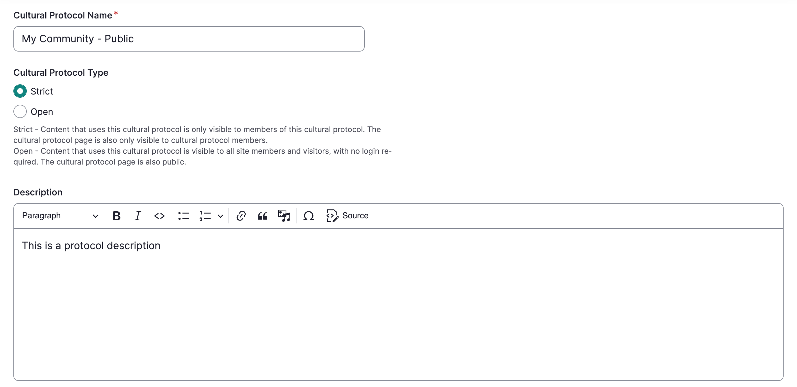

4. In the *membership display* field, select **Do not display any protocol members, Only display cultural protocol stewards,** or **Display all protocol members**
    - **Do not display any community members** does not display any community members on the community page.
    - **Only display community managers** displays community managers and not community members on the community page.
    - **Display all community members** displays all members on the community page.

    At this point, you can add protocol members and assign user roles using the same steps  used to add community members. If you do not have community members yet, or are currently unsure of role assignments, you can skip this step and manage protocol membership later.

    There are several different user roles for protocols for you to use as needed:

    - protocol member - views content but cannot add or edit.
    - protocol affiliate - views content but cannot add or edit. This is a designation for community partners that mirrors the community affiliate role.
    - contributor - can create, edit and delete their own digital heritage items, person records and media assets.
    - curator - can create, edit and delete their own collections and upload media assets. 
    - community record steward - can add community records to content, as well as edit and delete them.
    - language contributor - can add, edit and delete their own dictionary words and word lists.
    - language steward - can add, edit and delete ALL dictonary words and word lists and also add media assets.
    - protocol steward - manages protocol membership, can add edit and delete all content and media assets, manage the look and feel of the protocol page, and manage Local Contexts labels and notices.

        

    !!! tip
        Protocol members MUST belong to the same community as the protocol in order to be added to it.

    !!! tip
        For more in-depth information about user roles, see [User Role Types](../users/user-role-types.md)
    
5. Add users to a protocol role by selecting "Select Members" under the appropriate role. Use the search bar to narrow down your options and select each member you want to assign. 

    

6. When you're done adding users and assigning user roles to your protocol, select "Finished."

    

7. Select either "Save and Create Another Protocol" if you have additional protocols to add, or "Save" if you are done. You can always add additional protocols later. These buttons are sticky at the top of the page.

    - "Save and create another protocol" generates a fresh form with a confirmation message.
    - "Save" takes you to the manage community page with a confirmation message.

 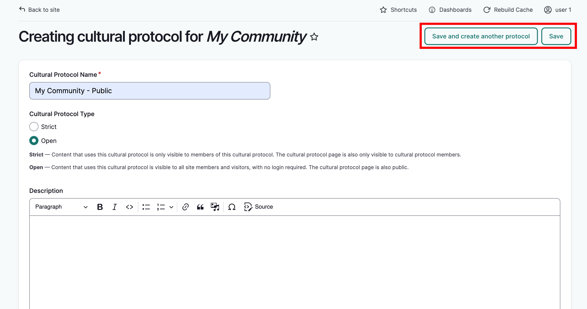

This is the manage community page.
 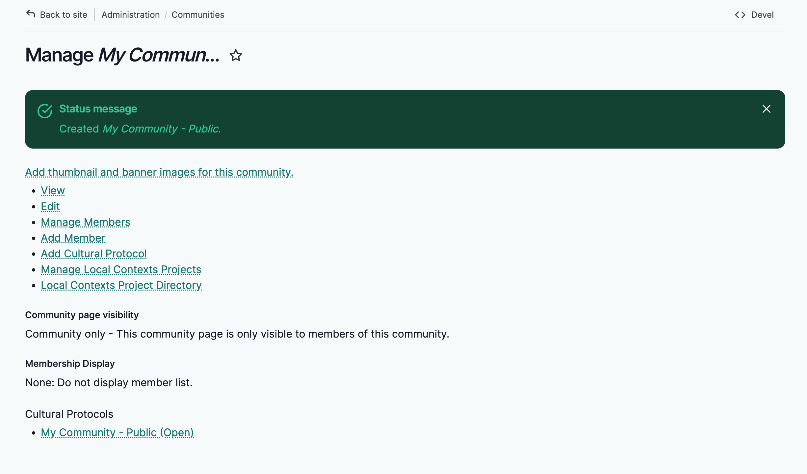

This is the community page.
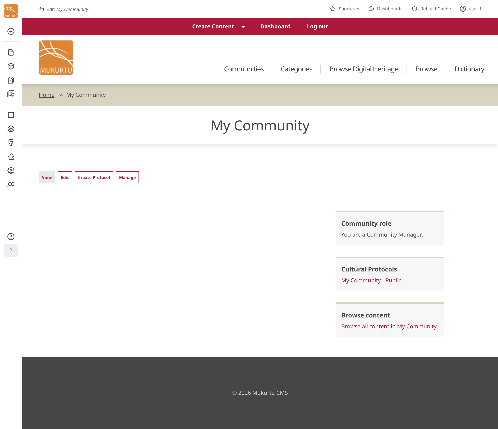