---
tags:
    - communities, cultural protocols, and categories
---

# Create a Cultural Protocol

!!! roles "User Roles"
    Community Manager 

There are several ways to create a new cultural protocol. A separate article discusses [creating a community and initial cultural protocol](Create-a-community-and-initial-cultural-protocol.md).

This article covers two other methods for creating a cultural protocol - from the dashboard and through an existing community.

## Create a cultural protocol from the dashboard

1. From the Mukurtu Dashboard, select **Cultural Protocols**, then select "Add Protocol."

      

     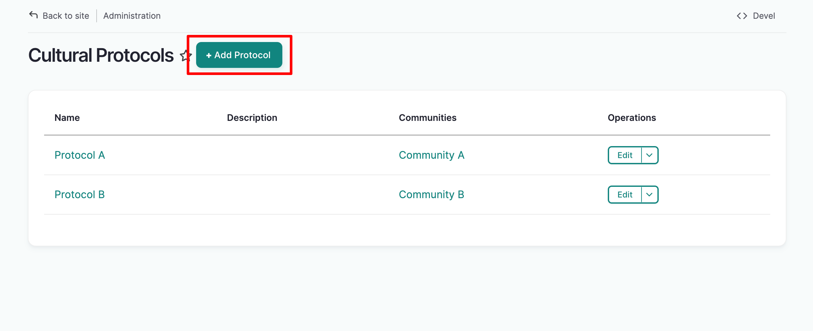 

2. Name your protocol. It's helpful to name the community associated with this protocol and indicate type of access provided. For example, public collections at the Washington State University Library Manuscripts, Archives and Special Collections (WSU-MASC) might use the protocol, WSU-MASC Public.

3. Select a cultural protocol type. Cultural protocol types determine who can access the protocol page and items under this protocol.

    - **Strict**: Items under strict protocol will only be visible to logged in protocol members. The protocol page will not be visible to the public.

    - **Open**: Items under open protocol are accessible to all visitors, including those without user accounts.

     

It's possible that related families, villages, clans, or other communities might want to keep their communities distinct and manage access to certain shared pieces of content with the same set of protocols. This is possible by adding multiple communities to a protocol.

4. Select "Select Communities." A window will open that lists all communities of which you are a community manager. Check the box next to each community you wish to add, and select "Add communities."

     

      

    !!! Tip
        You must be a community manager in every community you wish to add.

5. Add an optional description. Descriptions display on the protocol page and may include information about the purpose of the protocol, the type of content under this protocol, and who to contact if you have qustions.

    

6. Select the *membership display setting* Choose from one of: 

    - **Do not display** does not display any protocol members on the protocol page.
    - **Display protocol stewards** displays protocol stewards and not protocol stewards on the community page.
    - **Display all members** displays all members on the protocol page.

        

7. When you are finished, select **Save**, which is sticky at the top of the page. 

       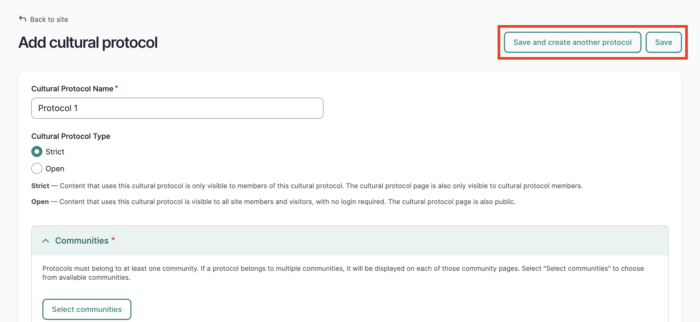

       You will be taken to the new protocol page. If you've added a  description, it will display on this page along with a confirmation message.

       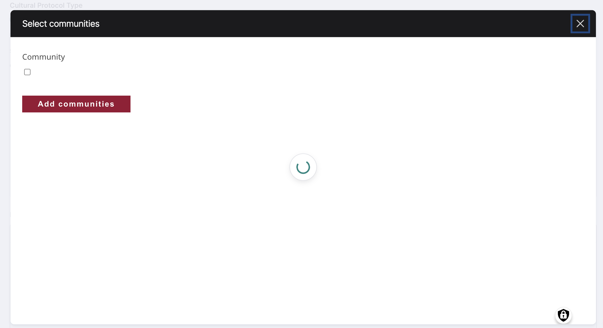

## Create a cultural protocol through an existing community

!!! roles "User Roles"
    Community Manager

1. To add a protocol through an existing community, navigate to that community's page. 

    You can view community pages through the main menu above your dashboard, or on the dashboard under **Communities**. 

    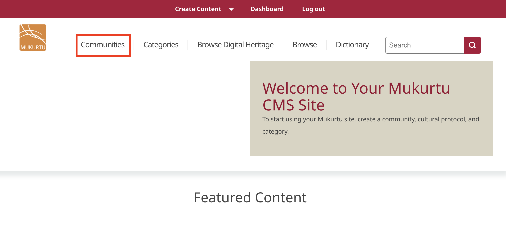

    If you are accessing communities through the menu, select the appropriate community, then select **Create Protocol**.

    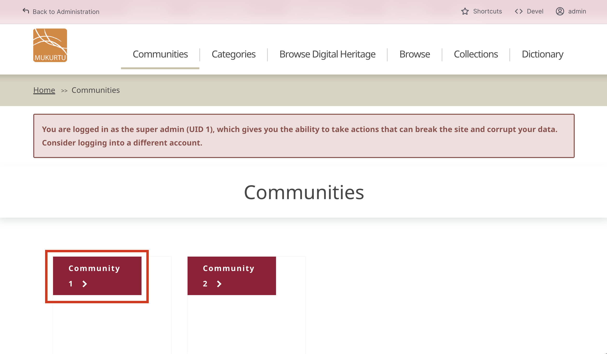
    

    If you are accessing communities through the dashboard, select the appropriate community, then select **Add Cultural Protocol**

    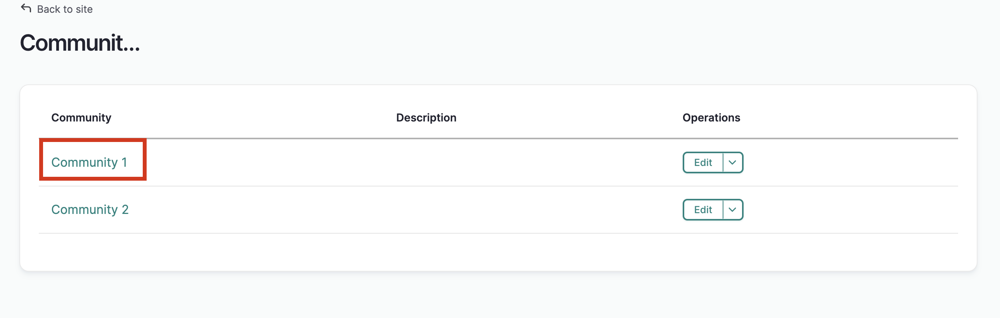
    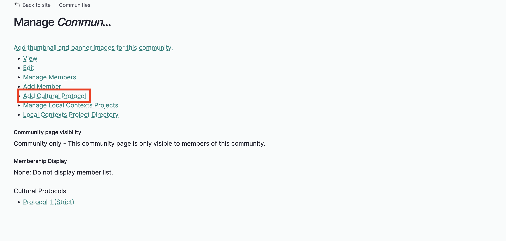

2. Add a *protocol name*, select a *protocol type* and add a *description* to your protocol. 

    

3. Select the *membership display setting* Choose from one of: 

    - **Do not display any protocol members** does not display any protocol members on the protocol page.
    - **Only display cultural protocol stewards** displays protocol stewards and not protocol stewards on the community page.
    - **Display all protocol members** displays all members on the protocol page.

        

    At this point, you can add protocol members and assign user roles or skip this step and add members at another time.

    

    In order of responsibilitiy, protocol user roles are: 

    - Protocol members can view content but cannot add or edit.
    - Protocol affiliates can view content but cannot add or edit. This is a designation for community partners that mirrors the community affiliate role.
    - Contributors can create, edit and delete their own digital heritage items, person records and media assets.
    - Curators can create, edit and delete their own collections and upload media assets. 
    - Community record stewards can add community records to content, as well as edit and delete them.
    - Language contributors can add, edit and delete their own dictionary words and word lists.
    - Language stewards can add, edit and delete ALL dictonary words and word lists and also add media assets.
    - Protocol stewards can manage protocol membership, add edit and delete all content and media assets, manage the look and feel of the protocol page, and manage Local Contexts labels and notices.

4. Under the appropriate user role, select "Select Member"

    -  User the search bar to search for a community or select from the list of community members below. Select "Add Users." 
    - Once added, you can remove users by selecting the trash can icon under their username. 
    - When you are finished adding users, select "Finished."

    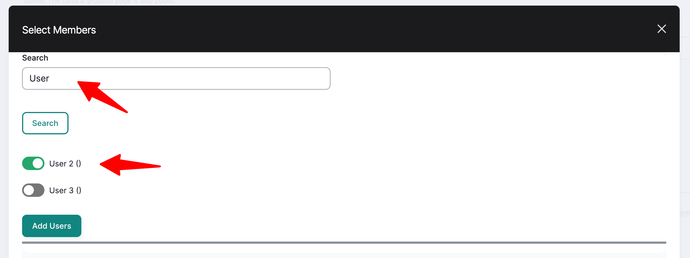

5. When you're done adding users and assigning user roles to your protocol, select "Finished."

    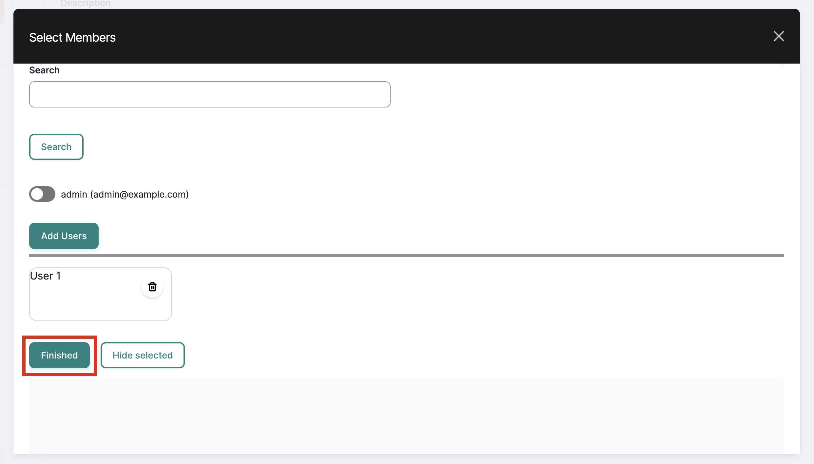

6. When you are finished, select "Save and Create Another Protocol" if you have additional protocols to add, or "Save" if you are finished. These buttons are sticky at the top of the page. You can add additional protocols later using these steps.

    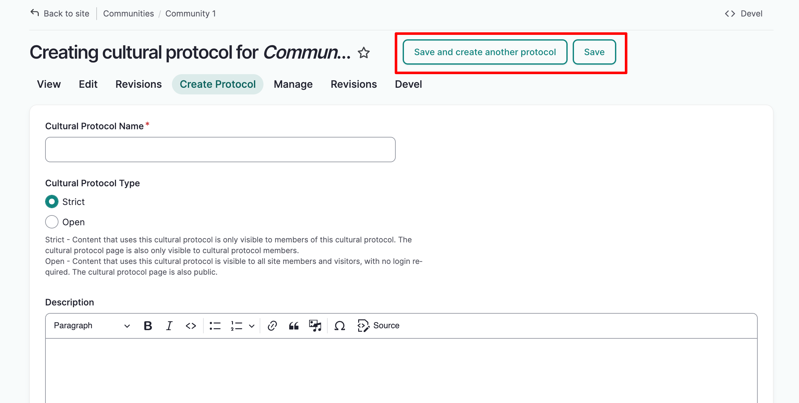

    - "Save and create another protocol" generates a fresh form with a confirmation message.
    - "Save" takes you to the manage community page with a confirmation message.
    
    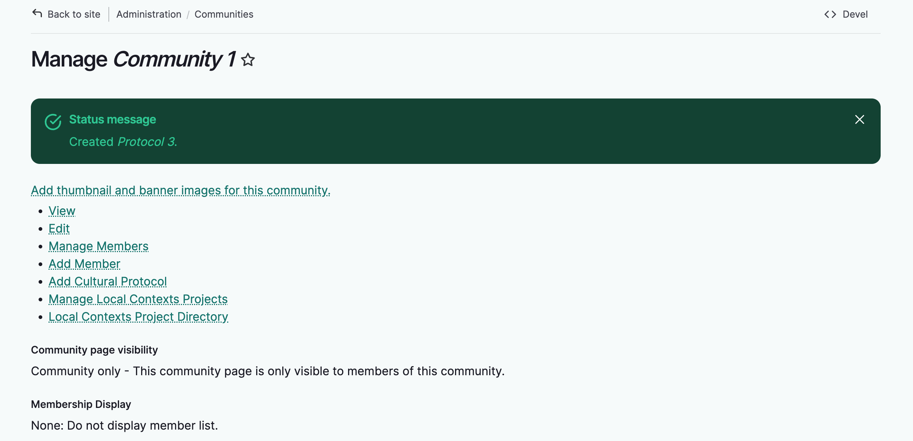
