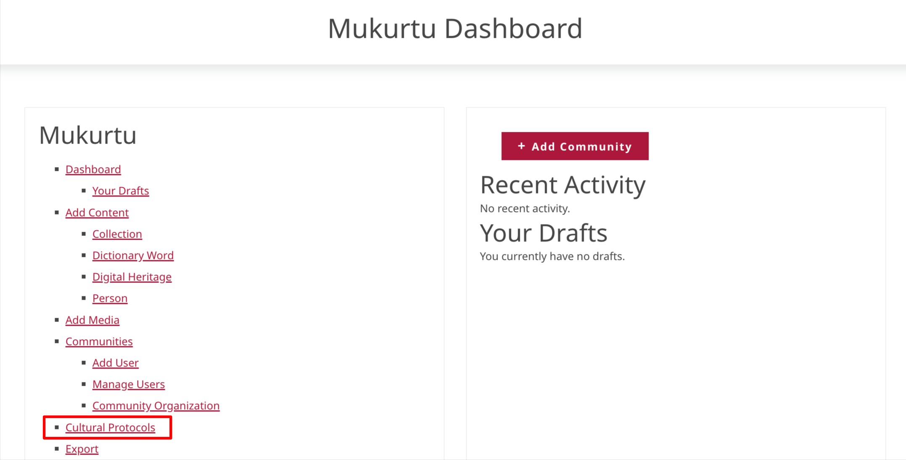
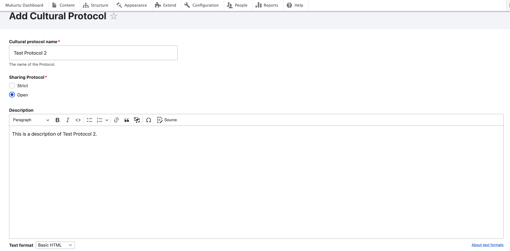
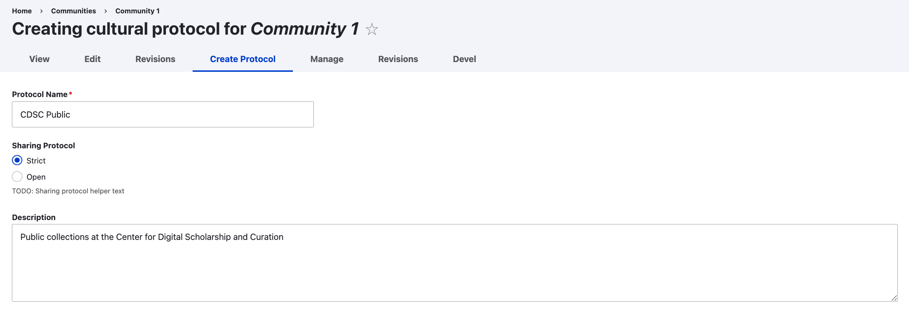

---
tags:
    - communities, cultural protocols, and categories
---

# Create a cultural protocol

!!! roles "User Roles"
    Community Manager 

There are several ways to create a new cultural protocol. A separate article discusses [creating a community and initial cultural protocol](Create-a-community-and-initial-cultural-protocol.md).

This article covers two other methods for creating a cultural protocol - from the dashboard and through an existing community.

## Create a cultural protocol from the dashboard

1. From the Mukurtu Dashboard, select **Cultural Protocols**, then select "Add Protocol."

      

      

2. Name your protocol. It's helpful to name the community associated with this protocol and indicate type of access provided. For example, public collections at the Washington State University Library Manuscripts, Archives and Special Collections (WSU-MASC) might use the protocol, WSU-MASC Public.

3. Select a sharing protocol. Sharing protocols determine who can access the protocol page and items under this protocol.

    - **Open**: Items under open protocol are accessible to all visitors, including those without user accounts.

    - **Strict**: Items under strict protocol will only be visible to logged in protocol members. The protocol page will not be visible to the public.

4. Add an optional description. Descriptions display on the protocol page and may include information about the purpose of the protocol, the type of content under this protocol, and who to contact if you have qustions.

    

5. In *communities* enter the community name. A list of communities of which you are the community administrator will autopopulate. ---THIS WILL CHANGE TO A DROP DOWN MENU EVENTUALLY SO YOU'LL HAVE TO UPDATE THIS--- 

    ---UPDATE THIS SCREENSHOT AFTER THE FEATURED CONTENT FIELD IS REMOVED---
     

    It's possible that related families, villages, clans, or other communities might want to keep their communities distinct and manage access to certain shared pieces of content with the same set of protocols. This is possible by adding additional communities to a protocol.

    To do this, select "Add another item" and a new field will appear where you can add another community. Repeat this step to add as many communities as needed.

    !!! Tip
        You must be a community manager in every community you wish to add.

6. When you are finished, select **Save**. You will be taken to the new protocol page. If you've added a  description, it should be able to see them here. A confirmation message will also be displayed.

## Create a cultural protocol through an existing community

!!! roles "User Roles"
    Community Manager

1. Navigate to the page of the community to which you would like to add a protocol and select **Add cultural protocol**.

    You can view community pages through the main menu above your dashboard, or on the dashboard under **Communities**. 

    

2. Add a *protocol name*, select a *sharing protocol* and add a *description* to your protocol. 

    

    At this point, you can add protocol members and assign user roles using the same steps we used to add community members, or, skip this step and add members at another time.

    Protocol user roles are: 

      --- THIS WHOLE SECTION NEEDS MORE INFO---

    - Protocol Steward - manages protocol membership and content
    - Protocol Member - can view content under this protocol, unless the content is under other protocols, in which case they may need to be a member of those protocols as well.
    - Protocol Affiliate - ???
    - Language Steward - manages dictionary words 
    - Language Contributor - makes new dictionary words
    - Protocol Contributor - creates digital heritage items
    - Community Record Steward - manages community records

3. The steps to enroll a community member into any protocol user role are the same:

    -  Under the appropriate user role, select "Select Member"

    -  Enter their username in the search bar or select from the list of community members below. Select "Add Users." 
    - Once added, you can remove users by selecting "Remove" under their username. ---THE SEARCH BAR WILL CHANGE---
    - When you are finished adding users, select "Finished."

     

4. When you are finished, select "Save and Create Another Protocol" if you have additional protocols to add, or "Save" if you are finished. You can add additional protocols later using these steps.

    

    - "Save and create another protocol" generates a fresh form with a confirmation message.
    - "Save" takes you to the manage community page with a confirmation message.
