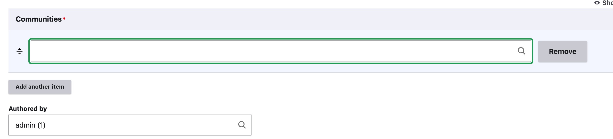
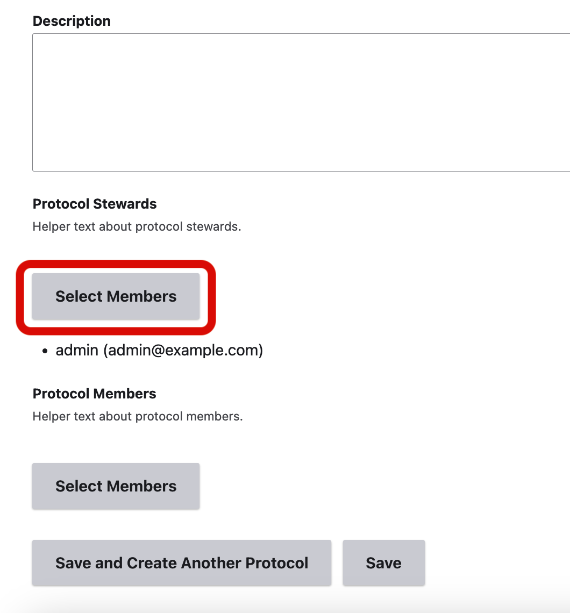

# Create a cultural protocol

!!! roles "User Roles"
    Mukurtu administrator, protocol steward

There are several ways to create a new cultural protocol. A separate article discusses [creating a community and initial cultural protocol](Create-a-community-and-initial-cultural-protocol.md).

This article covers two other methods for creating a cultural protocol - from the dashboard and through an existing community.

## Create a cultural protocol from the dashboard

1. From the Mukurtu Dashboard, select **Cultural Protocols**, then select "Add Protocol."

     

     

2. Name your protocol. It's helpful to name the organization or group associated with this protocol and indicate an access level. (i.e. CDSC Public).

3. Select a sharing protocol. **Any** means that a user must be a member of at least one of the assigned protocols to view the item. **All** means that a user must be a member of all assigned protocols to view the item. 

4. Add a description (if desired).

    

    !!! tip
        Items with just one protocol can use either setting. For more information, see [Sharing Settings](SharingSettings.md) 

5. In *communities* enter the community name. A list of communities you belong to will autopopulate. You may add additional communities to this protocol by selecting "Add another item". 

    

    !!! Tip
        You must be a community member of the community you wish to add.

6. The remaining fields are optional. You may edit the author of the protocol in the *Authored by* field, specify a URL alias, and log any revisions. 

7. Check or uncheck *Published* and select "Save."

     

## Create a cultural protocol through an existing community

!!! roles "User Roles"
    Community Manager

1. From the Mukurtu dashboard, select "Communities". On the right hand side, a list of communities will populate. Select the community to which you would like to add your new protocol.

    

    

2. Select **Add cultural protocol**

    

3. Add a *protocol name*, select a *sharing protcol* and add a *description* to your protocol. 

    

4. Next, choose *protocol stewards* by selecting **Select Members**. 

    

5. Search for community members or select from the list of protocol members shown. When you have made your selections, select "Add Users." You may also remove users by selecting "Remove" under any user who has already been added. --INSERT LINK TO READ MORE ABOUT PROTOCOL STEWARDS--

    

5. Repeat this step to add *protocol members*.

6. When you are finished, select "Save and Create Another Protocol" if you have additional protocols to add, or "Save" if you are finished. You can add additional protocols later using these steps.

    