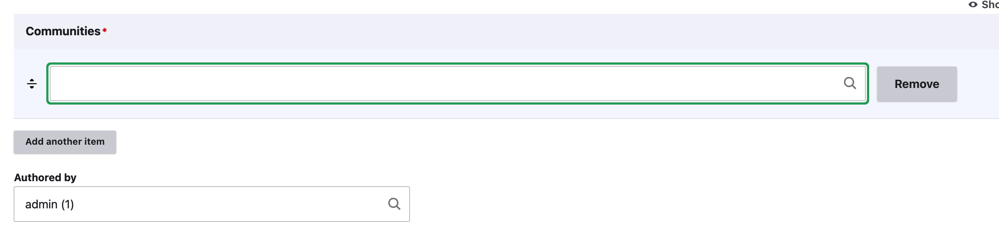
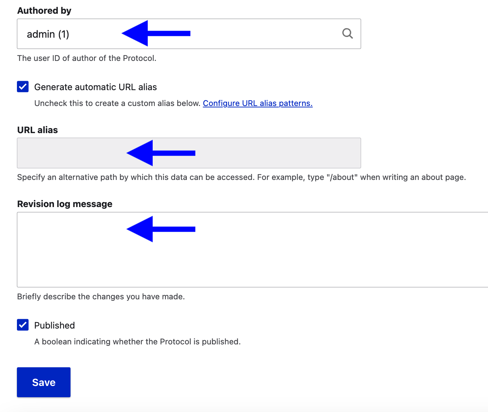

# Create a cultural protocol from the dashboard

>User role: Mukurtu Administrator
>
Reminder: You must have existing communities before creating a cultural protocol.

From the Mukurtu Dashboard, scroll down and select "Cultural Protocols" on the left menu. 

Next, select "Add Protocol" on the top right. This will open a form for the new protocol.

Name your protocol. It's helpful to describe the organization or group associated with this protocol and the access level. (i.e. CDSC Public)

Select a *Sharing Protocol*: Select **Strict** to limit access to protocol members and **Open** to allow access to the public.

Add a description to your protocol if desired.

Add a community in the *Communities* field. Begin typing to auto-populate the field with existing communities. Select "Add another item" to add additional communities.

>Note that you must be a community manager in the other communities to add them to the protocol.

The remaining fields are optional.

In the *Authored by* field, you may identify a different user as the protocol author. Note that they must have a user account.

Add a custom URL to the *URL Alias* field if desired.

You can add notes about changes you have made in the *Revision log message* field.

When you're done, select "Save". 

