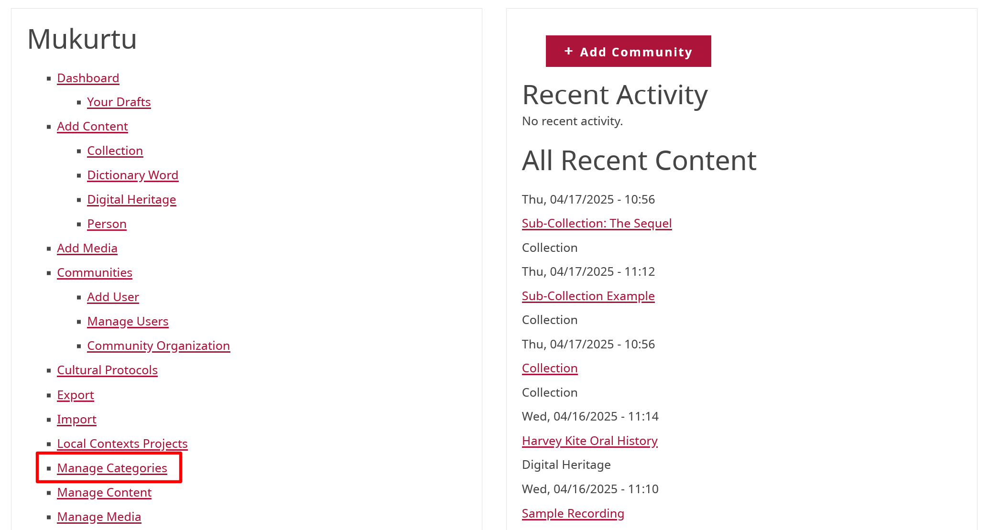
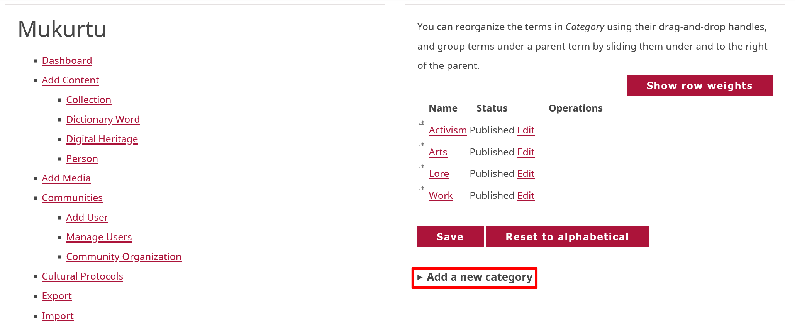
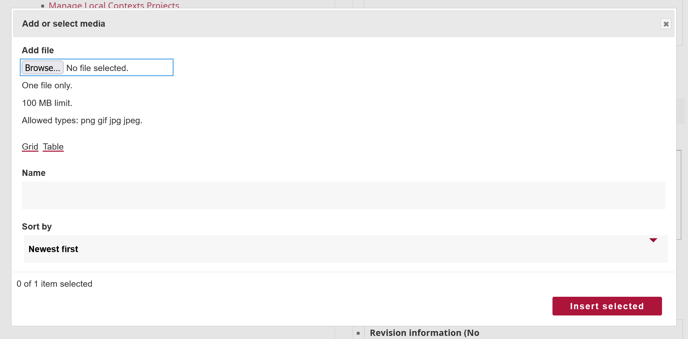

# Create and Edit Categories

!!! roles "User role"
    Mukurtu administrators

Categories are high-level descriptive terms that help Mukurtu users discover digital heritage items. They are shared by all communities on a site. Each digital heritage item must belong to one or more category. Categories should reflect the type of content within your site. If the categories are too broad they won’t help users narrow down their search, but if they are too narrow they may not represent the scope of the site. Ensure that the category terms you choose make sense to your users by avoiding jargon and overly technical terms. 

## Create a category 

1. Navigate to your dashboard and select **Manage Categories**. 

    

2. Select **Add a New Category**

    

    - Enter the name of your category in the **Category Name** field.
    - Enter any descriptive information in the **Description** field. This is a rich text field that can support text, links, media items, and other formats. 

3. Apply a thumbnail image to your category. The thumbnail image appears on your "browse by category" page and corresponding block. Thumbnails can help further clarify your category for users. 
    - Select **Add media**. Select **Browse** to upload a file or scroll down to select images that have already been uploaded.  

    !!! requirement "Allowed file types are .png, .gif, .jpg, or .jpeg."

    

    - Select **Insert selected** to apply the image to your category as a thumbnail. 

4. Select the "Save" button to save your category.

## Edit a category 

1. Select **Manage Categories**. 
2. Select the **Edit** link for the category you want to make changes to. 

    

3. Edit your *Category Name*, *Description*, or **Thumbnail Image**, then select "Save".