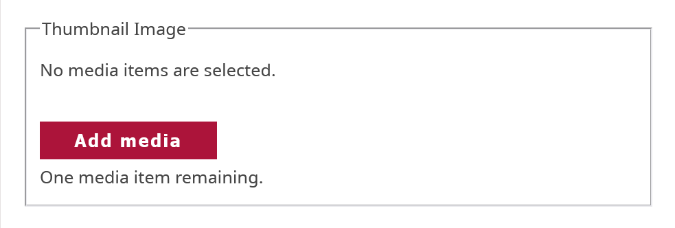
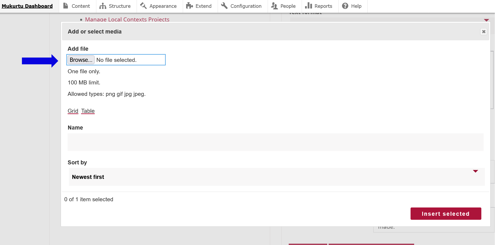

# Creating and Editing Categories

!!! roles "User roles:"
    Mukurtu Administrators

## To create a new category, navigate to your Dashboard. 

1. Select **Manage Categories**. 

    

2. Select **Add a New Category**

    

    - Enter the name of your category in the **Category Name** field.  
    - Enter any descriptive information in the **Description** field. This is a rich text field that can support text, links, media items, and other formats. 

    

3. Apply a thumbnail image to your category. The thumbnail image appears on your front page and can help further clarify your category for users. 
4. Select **Add media**. Select **Browse** to upload a file or scroll down to select images that have already been uploaded.  

    !!! requirement "Allowed file types are .png, .gif, .jpg, or .jpeg."

    

5. Select **Insert selected** to apply the image to your category as a thumbnail. 
6. Select the checkbox by “Published” to publish your category or leave unselected to save your category as a draft. 

## To edit your category, navigate to your Dashboard.  

1. Select **Manage Categories**. 
2. Select the **Edit** button for the category you want to make changes to. 
3. Edit your **Category Name**, **Description**, or **Thumbnail Image**, then select **Save**.