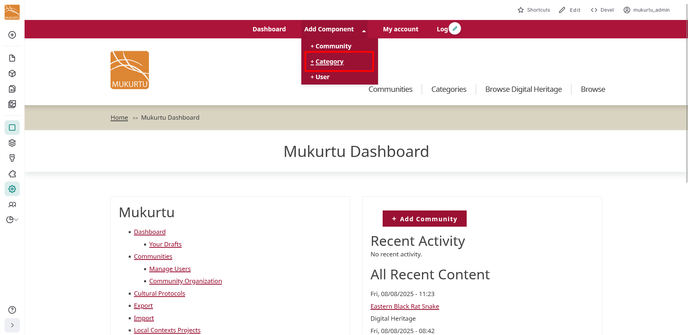

# Create Categories

!!! roles "User role"
    Mukurtu administrators

Categories are high-level descriptive terms that help Mukurtu users discover digital heritage items. For more information about how to plan categories see [Understanding Categories](UnderstandingCategories.md). For more information on managing categories visit [Manage Categories](CategoryTaxonomy.md).

You can get to the Create Categories through the top-level Add Component menu or through the Dashboard. Follow the instructions below to create a category.

## From the Add Component menu

1. Hover over the **Add Component** menu. 

    

2. Select the **+Category** link. 

    

## From the Dashboard

1. Navigate to your dashboard and select **Manage Categories**. 

    

2. Select **Add a New Category**

    

## Category form

1. Enter the name of your category in the **Category Name** field.
2. Enter any descriptive information in the **Description** field. This is a rich text field that can support text, links, media items, and other formats. 
3. Apply a thumbnail image to your category. The thumbnail image appears on your "browse by category" page and corresponding block. Thumbnails can help further clarify your category for users. 
    - Select **Add media**. Select **Browse** to upload a file or scroll down to select images that have already been uploaded.  

    !!! requirement "Allowed file types are .png, .gif, .jpg, or .jpeg."

    

    - Select **Insert selected** to apply the image to your category as a thumbnail. 

4. Select the "Save" button to save your category.
