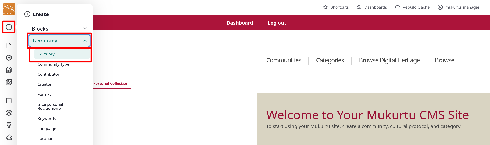
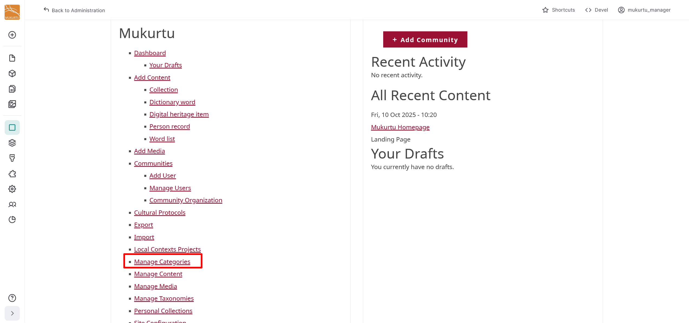
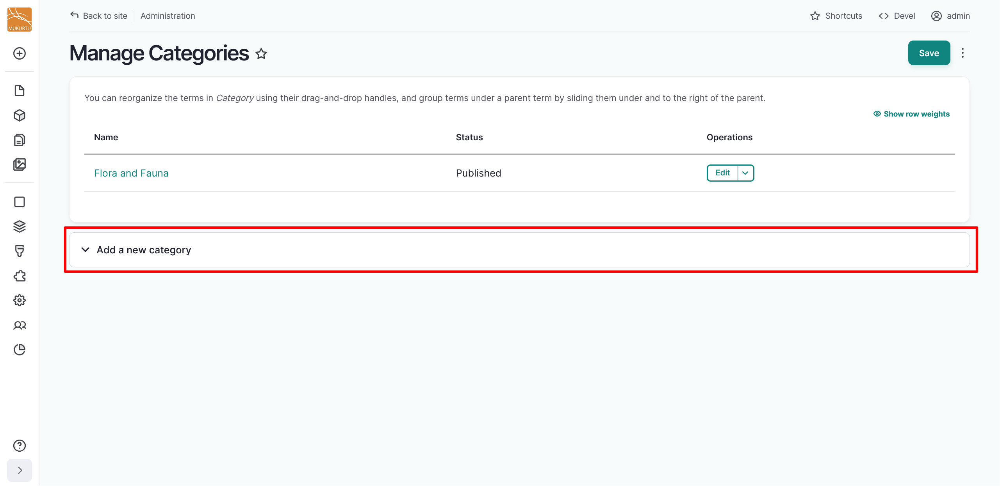
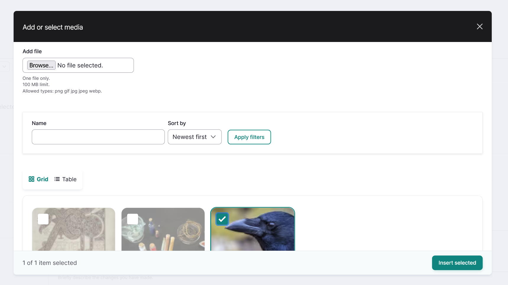

# Create Categories

!!! roles "User role"
    Mukurtu manager

Categories are high-level descriptive terms that help Mukurtu users browse and discover digital heritage items. For more information about how to plan categories see [Understanding Categories](UnderstandingCategories.md). For more information on managing categories refer to [Manage Categories](CategoryTaxonomy.md).

You can create categories through the top-level Add Component menu or through the Dashboard. Follow the instructions below to create a category.

## From the Add Component menu

1. Hover over the **Add Component** menu. 
2. Select the **+Category** link. 

    

## From the Dashboard

1. Navigate to your dashboard and select **Manage Categories**. 

    

2. Select **Add a New Category**

    

## Create a category

1. A category name is required. Enter the name of your category as you want it to appear to users in the **Category name** field. 
2. The description is not normally shown to end users. It may be used for internal documentation to clarify or define the content that should be included in the category, or to provide additional details about the category.
3. The thumbnail image is used in the "browse by category" page and landing page block. A thumbnail could be a photograph, graphic, or other image that represents the content or concept of the category. If a thumbnail image is not provided, a placeholder graphic will be displayed instead.
    - Select **Add media**. Select **Choose file** to upload a file or scroll down to select images that have already been uploaded.  

    !!! requirement "Allowed file types are .png, .gif, .jpg, or .jpeg."

    

    - Select **Insert selected** to apply the image to your category as a thumbnail. 

4. Select the "Save" button to save your category.
