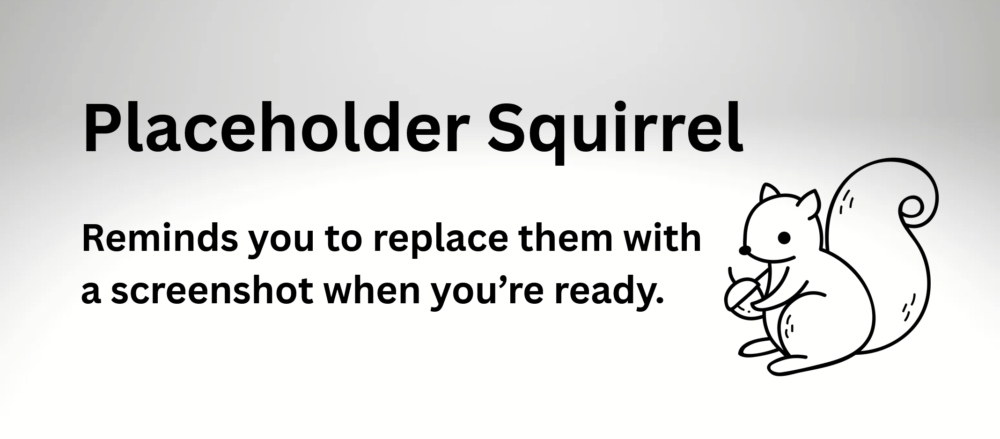

---
tags:
    - communities, cultural protocols, and categories
---

# Edit community settings

!!! Roles "User Roles" 
	Community Manager

Once a community is created, you can edit your original settings at any time. This edit form also includes some settings that are not present in the initial **add community** form. 

## Name, description, and sharing protocol

Navigate to the community you wish to edit.

From the community menu options, select **edit**.

From here you can edit the *community name*, *description* and *sharing protocol*.

!!! WARNING 
	Sharing protocols affect the community page visibility. A strict protocol will limit visibility to community members, and an open protocol opens visibility to the public. Be careful when making changes to this setting.

--SCREENSHOT OF COMMUNITY NAME, DESCRIPTION AND SHARING PROTOCOL--	

## Community Type

!!! requirement
	A Mukurtu administrator must configure community types in the taxonomy settings before they can be assigned here. 

Community types help to organize the communities on your Mukurtu site. For example, a site might have tribal communities, libraries, and families contributing to a site. These can all be assigned a type for streamlined display and easy browse and search. To learn more about configuring community types, see [Create and Manage Community Types](../3Cs/CreateAndManageCommunityTypes.md)

- From the *community type* dropdown menu, select the appropriate term for your community. 

--SCREENSHOT OF THE COMMUNITY TYPE FIELD WITH A DROPDOWN MENU OF AVAILABLE COMMUNITY TYPES--

## Banner and thumbnail images

Banner and thumbnail images are optional, but can help to make a community more easily recognizable, especially if there are many communities represented on your site. Repeat these steps for each image.

- Under the image type you want to add, select "Add media."
- Browse for image files on your computer or select existing images.
- Add alt text and protocols to any new images. 
- Populate optional fields as needed.
- Save your changes, then select "Insert Selected." 

--SCREENSHOT OF THE MEDIA UPLOAD MODAL--

## Featured content

*Featured content* is also optional, and gives users a visual preview of the content contributed by the community.

- Expand *featured content* and select "Select Content." 
- Use the dropdown menu to narrow your search by content type, and the *search* field to search for specific content.
- All available content is displayed below the search bar. Check the box next to each piece of content you wish to feature.
- Select "Add Content."
- Remove featured content by selecting the grey "Remove" button below each piece of content.

!!! tip
	Protocols still apply to this content and media assets, so make sure to choose content that will be viewable by your target audience.

SCREENSHOT OF THE FEATURED CONTENT MODAL

## Sub-communities 

Communities can be organized into sub-communities to add additional structure and organization to your site. To read more about sub-communities and community struture, see [Manage Community Organization](../3Cs/ManageCommunityOrganization.md)

 - In the *sub-communitites* field, begin typing the name of the community you wish to add. You will only see communities of which you are the community manager. 
 - Select the community you wish to add. 

--SCREENSHOT ADDING A SUB-COMMUNITY--
 

## Save
When your changes are complete, select "Save." You will be taken to your community page and all changes will be displayed.

