# Manage Community Members

!!! roles "User role"
    Community manager

Community managers are responsible for adding and managing community members. This article provides instruction for managing existing members both individually and in bulk. For details on adding new members as a community manager, see [Create User Accounts](/docs/users/creating-account.md)

## Manage members page

To begin, navigate to the community you wish to manage and select "Manage", then **Manage Members.** 

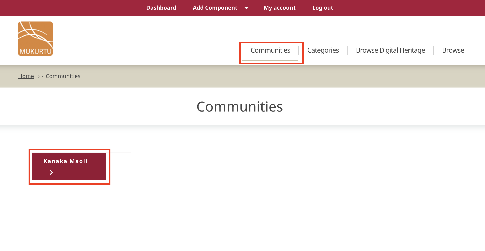

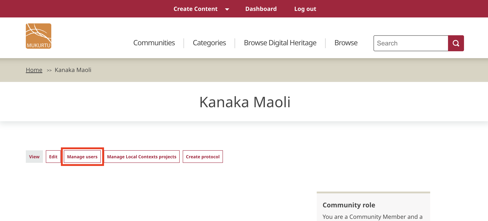

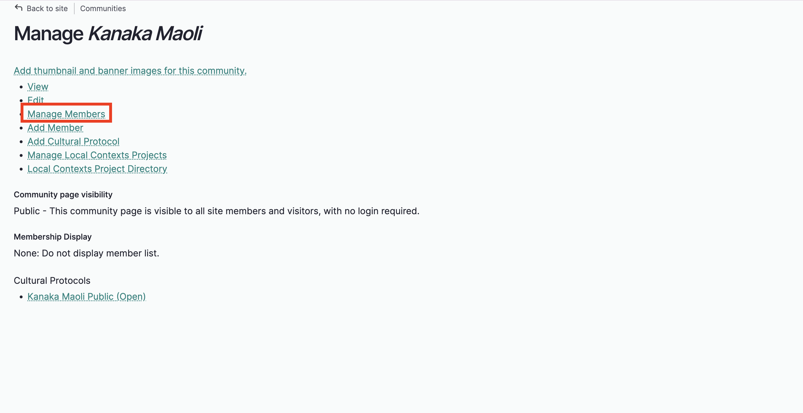

The manage members page lists all of the community members. You can see how long they've been a community member, their assigned roles and membership state. 

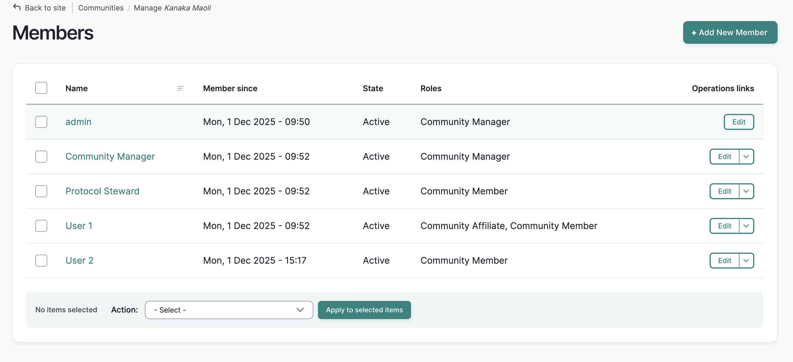

There are three community roles: Community manager, community member, and community affiliate.

- Community managers are responsible for managing membership in the community. They can create and manage new user accounts, add and remove users from communities, create new cultural protocols, and manage Local Contexts projects and directories.

    Community managers are also responsible for the look and feel of the community page. This includes the title, banner and thumbnail images, description, featured content and other display settings.

- Community members have basic membership in the community. This role is assigned to all community members by default.  If they have not been added to any protocols, they can view the community page and any public content. 

- The community affiliates role is designated for users who aren't part of the community but work with the community in some capacity that requires a level of access to community content. Some examples include researchers, archivists and other collaborative partners. Community affiliates may be assigned other roles and protocols within the community.

    For more on user roles, see [User Roles](../users/user-roles.md)

There are three membership states: Active, pending and blocked. Please note that these are stock Drupal settings and may be revised in a future update.

- Active members can act as normal, based on their user role and permissions.
- Pending members cannot view the community page or take community related actions until they are changed to active members. This may be useful if one community manager enrols a user and asks a second community manager to review and approve their membership.
- Blocked members cannot view the protocol page or take community related actions until they are changed back to active members. This may be useful if a user takes approved actions and their account should be temporarily suspended within this community (accounts can also be blocked at the site level by a Mukurtu Manager).

## Add a new member

!!! Requirement
    Users needed to be registered on the site before they can be added to a community. See [Create User Accounts](/docs/users/creating-account.md) for detailed instructions.
    
1) To add a new member, select "Add New Member".

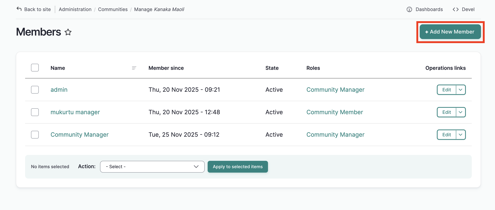

2) In the *Username* field, add their username. A menu of usernames will populate as you type. Select the username you wish to add. 

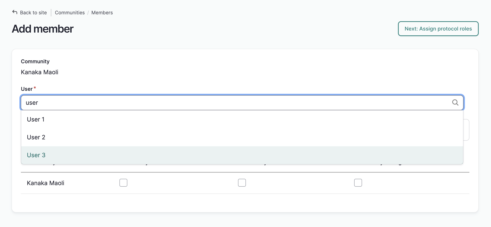

3) Select their role(s).

4) Select their membership state. In most cases, the default "active" state is correct.

5) Select "Save".

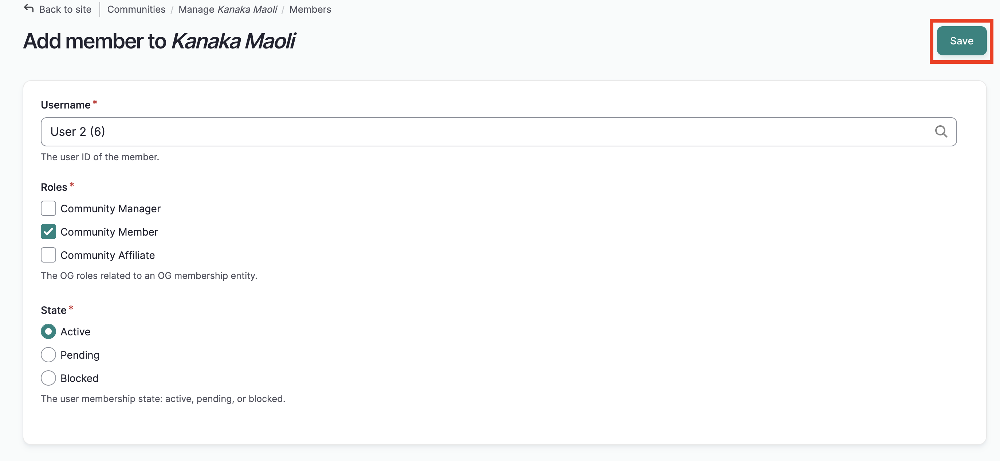

6) A blank form will load with a success message. You can continue to add more members if you wish.

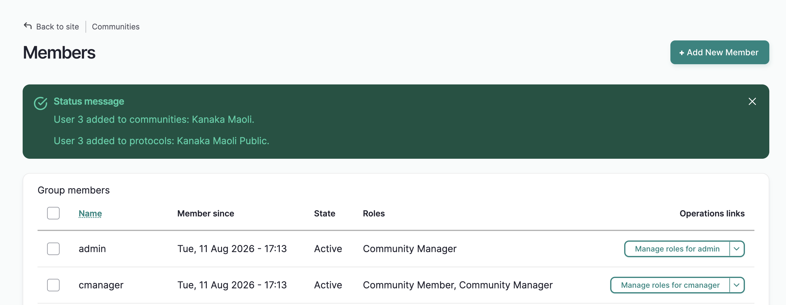

## Manage members individually
1) To manage users individually, from the community members page, select "edit" on the far right of their row. 

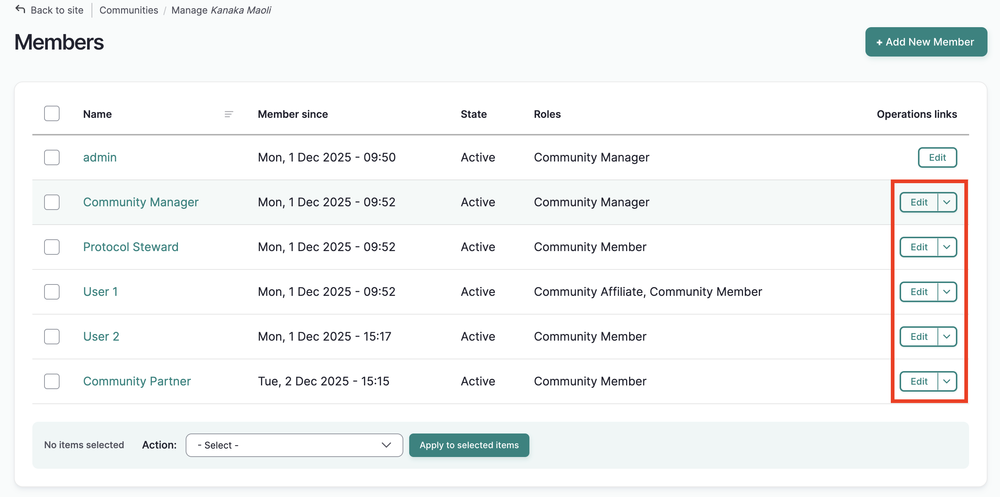

2) A membership edit form will display.

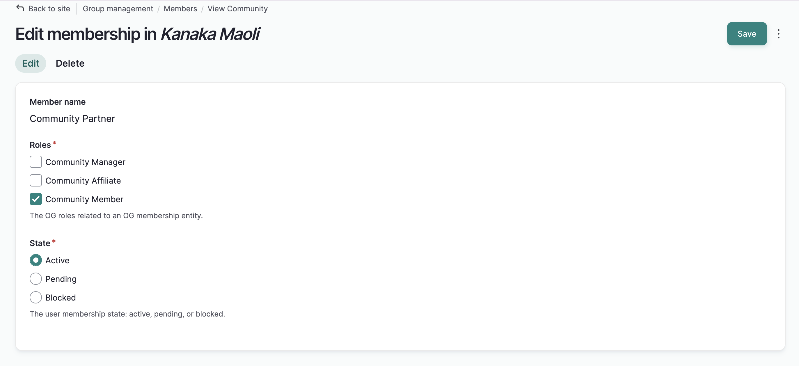

3) Deselect the role you wish to remove, and select the role you wish to assign. While it's possible to assign more than one role to a community member, users will almost always have one role. 

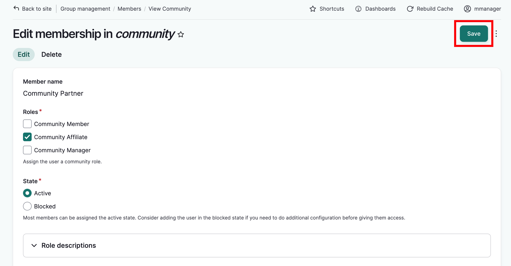

4) To edit their state, select the correct state (active, pending or blocked)

5) Select save. You will be returned to the manage members page and a success message will display.

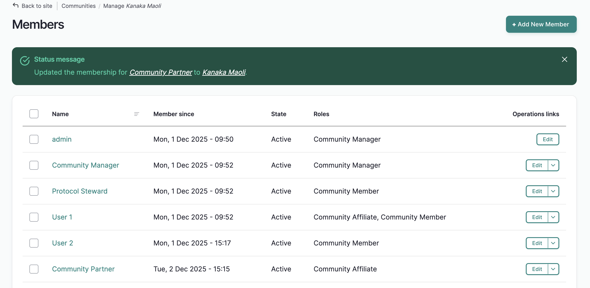

## Manage multiple members

You can manage multiple members by using the action menu. Use this menu to:

- Add roles to the selected membership(s) 
    - This option assigns community roles (manager, affiliate) to users.
- Approve the pending membership(s) 
    - This option approves community membership from users who have requested it.
- Block the selected membership(s) 
    - This option blocks community members from viewing the community page.
- Delete the selected membership(s)
    - This option removes users from the community.
- Remove roles from the selected membership(s)
    - This option removes community roles (manager, affiliate) from community members.
- Unblock the selected membership(s)
    - This option restores access to the community page.

1) To use any of these actions on one or more members, from the manage members page, check the box next to each name you wish to manage. 

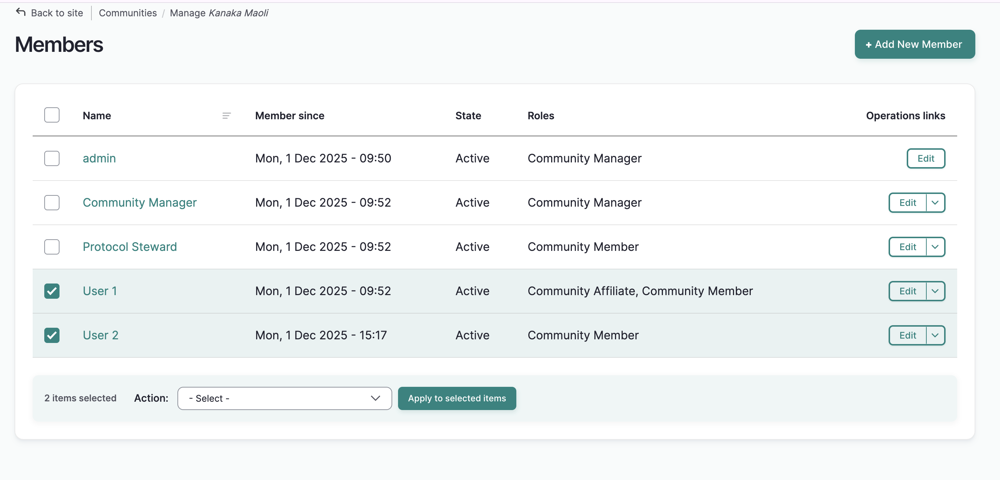

2) Using the action menu, select the action you wish to apply. 

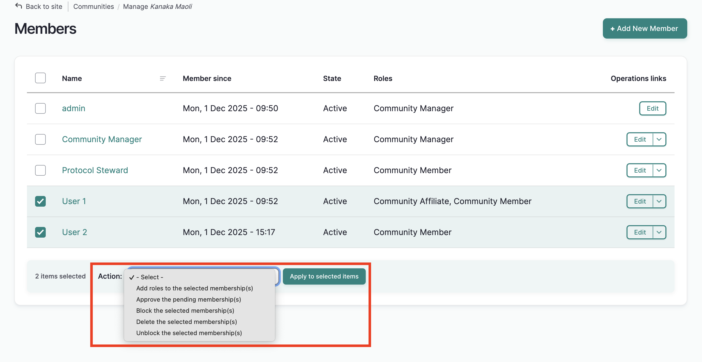

3) Select **Apply to selected items**. The action will be applied to all selected members.

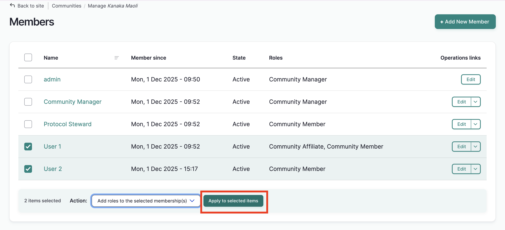

4) You will receive different results depending on the action item you select. Below are descriptions of the results of applying steps 1-3 above for each action item, and any additional instructions as needed.

### Add roles to the selected membership(s)
1. Complete steps 1-3.
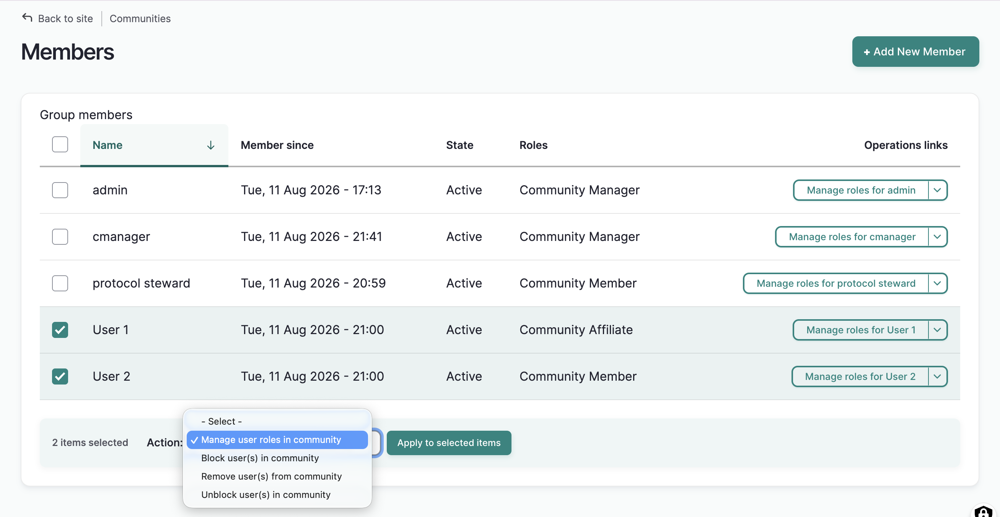
2. Uncheck the role you wish to remove. Check the role you wish to assign and select **Submit**.

3. The manage members page will re-load with a sucess message. User roles for each selected member will be updated.

### Approve the pending membership(s)
1. Complete steps 1-3.
    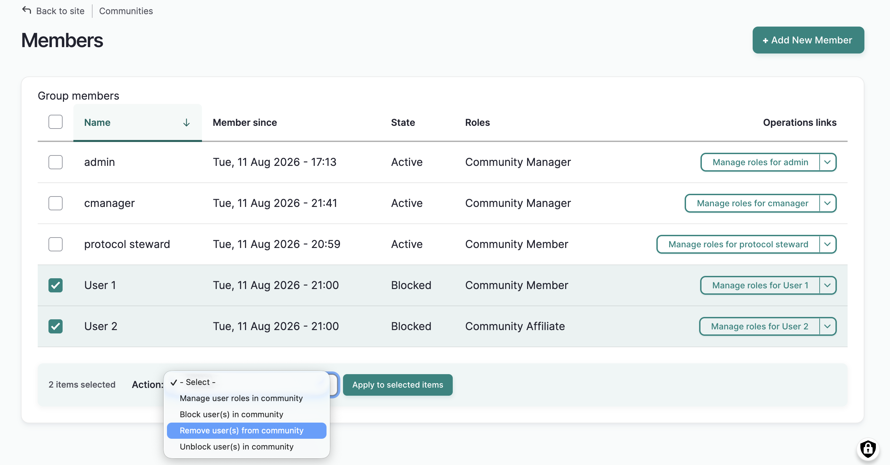

2. The manage members page will re-load with a success message. The selected users state will change from "Pending" to "Active"
    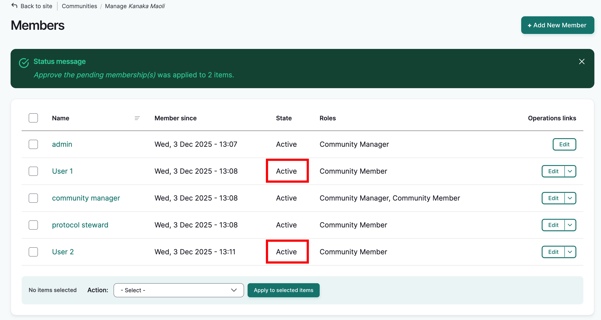

### Block the selected membership(s)
1. Complete steps 1-3.
    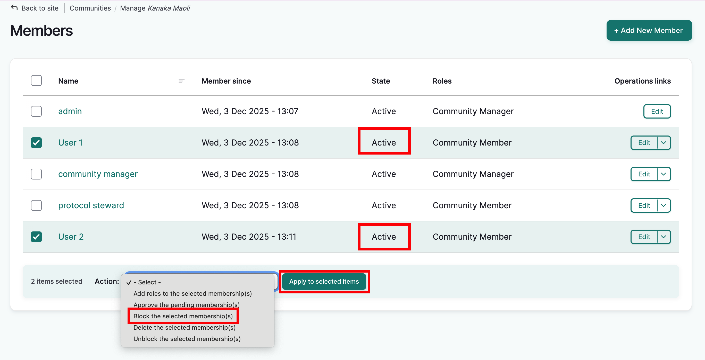

2. The manage members page will re-load with a success message. The selected users will be blocked.

    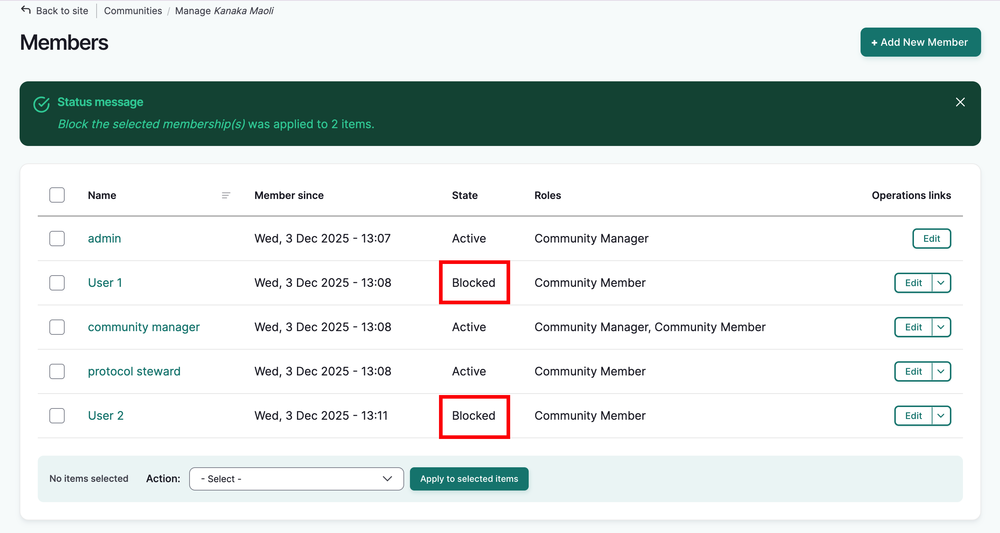

### Delete the selected membership(s)
1. Complete steps 1-3.

    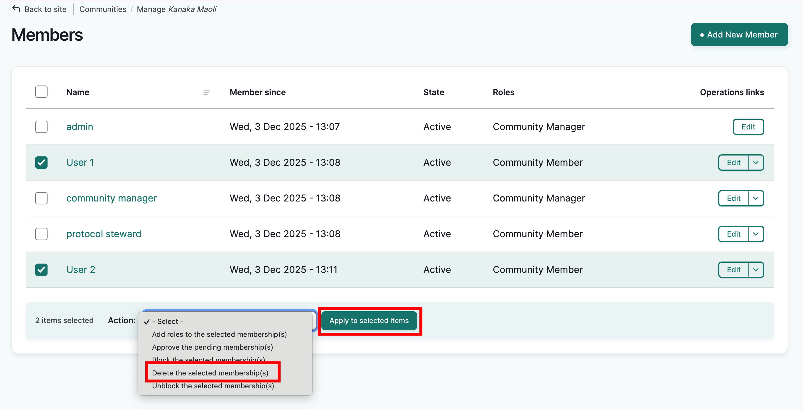

2. The manage members page will re-load with a success message. The selected users will be deleted.
    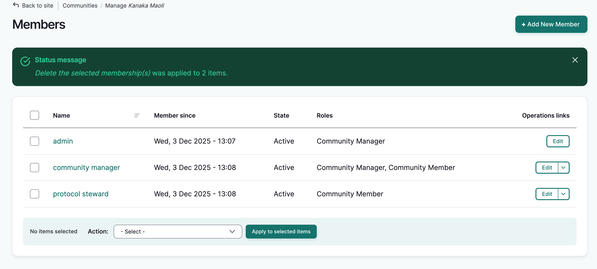

### Unblock the selected membership(s) 
1. Complete steps 1-3
    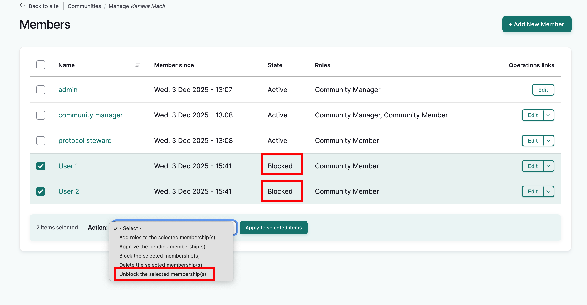

2. The manage members page will re-load with a success message. The selected users will be unblocked.
    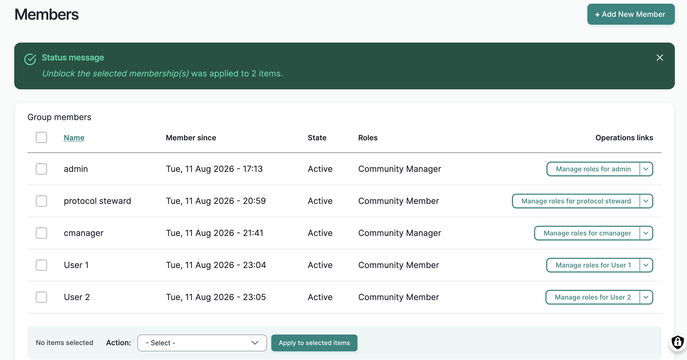
