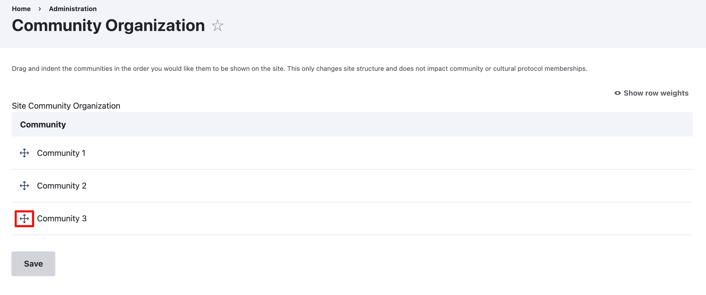
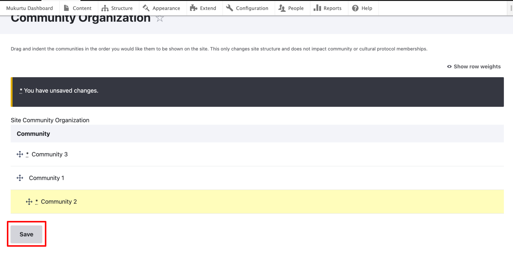
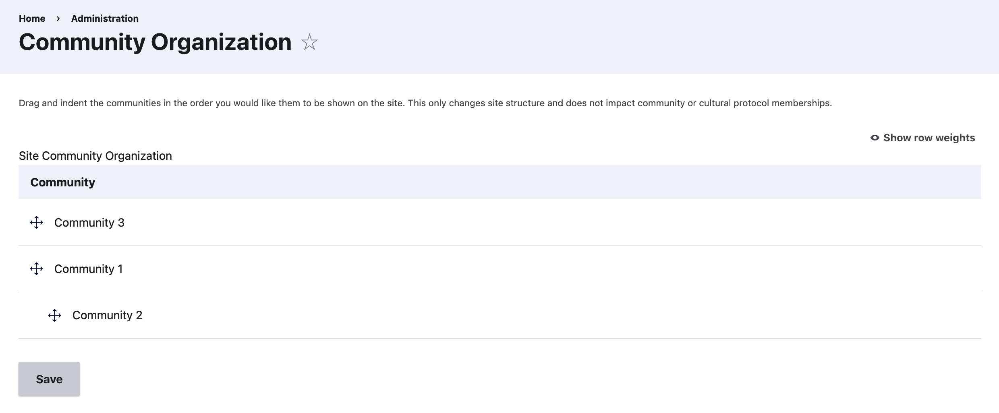
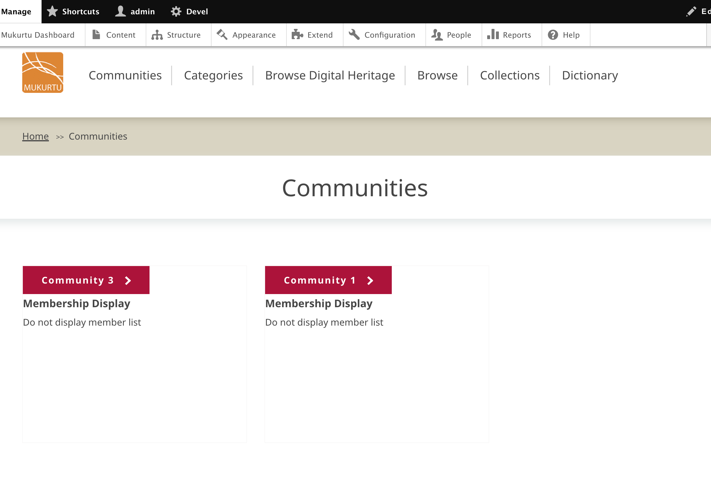

---
tags:
    - communities, cultural protocols, and categories
---

# Manage Community Organization

!!! roles "User roles"
    Mukurtu administrator

You can organize communities into top-level and sub-communities. This is most commonly used in particularly large sites to indicate the organizational structure of a complex group of communities. For example, in a site where there is an organization that has independent departments set up as communities (eg: a national museum with their archives department, and collections department as communities), this would allow you to indicate a hierarchical connection between these communities.

The result of this is that only the top-level community will be displayed on the home page and communities browse page. The sub-communities will be listed on the top-level community's page. All communities in this arrangement retain their independent protocols and membership, this only affects the visual arrangement of the communities.

1) From the dashboard, under communities, select **community organization**.

SCREENSHOT SHOWING WHERE TO FIND COMMUNITY ORGANIZATION LINK

2) You will see a list of all communities on the site. Select the handle next to a community you wish to move and drag it to your desired location.

3) Drag the community up and down to re-order, to the right to create sub-communities, and to the left to create a higher-level community.

4) When you are satisfied with your arrangement, select Save.

The community organization page will reload with the new community arrangement. 

Top level communities will be visible on the Community page, with sub-communities in the sidebar of their parent community.

