# Manage Protocol Members

!!! roles "User roles"
	Protocol steward
  
## Add a new member
!!! Requirement
	Users must be enrolled as a member of the protocol's parent community before they can be enrolled and assigned roles in the protocol.

1. To add a new member to a protocol, as a protocol steward, navigate to the desired protocol and select "Manage", then select **Add Member**.

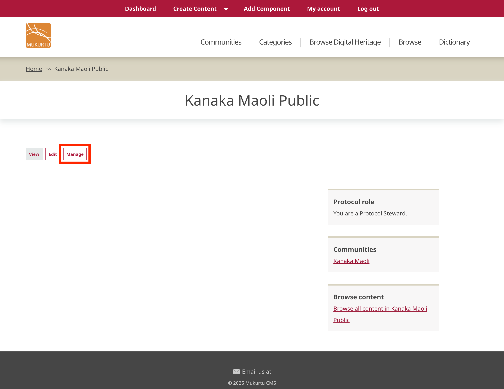

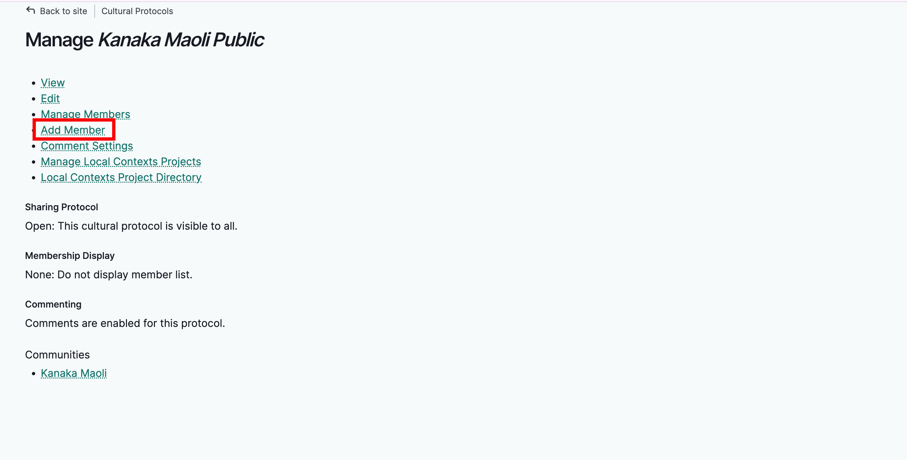

A blank **Add member** form will load.

2. In the *Username* field, begin entering their username. A list of community members will autopopulate. Select the correct user. If you do not see the user you're looking for, make sure they have been added to the protocol's community. See [Manage Community Members](../3Cs/ManageCommunityMembershipAndRoles.md).

3. Select their role(s). In order of responsibility: 

    - Protocol members can view content but cannot add or edit.
    - Protocol affiliates can view content but cannot add or edit. This is a designation for community partners that mirrors the community affiliate role.
    - Contributors can create, edit, and delete their own digital heritage items, person records and media assets.
    - Curators can create, edit, and delete their own collections and upload media assets. 
    - Community record stewards can add community records to content, as well as edit and delete them.
    - Language contributors can add, edit, and delete their own dictionary words and word lists.
    - Language stewards can add, edit, and delete ALL dictonary words and word lists and also add media assets.
    - Protocol stewards can manage protocol membership, add, edit, and delete all content and media assets, manage the look and feel of the protocol page, and manage Local Contexts labels and notices.

    !!! Tip
        To learn about protocol roles in greater detail, see [User Roles](../users/user-role-types.md)

4. Select their membership state.

- Active members can act as normal, based on their user role and permissions.
- Pending members cannot view the protocol page or take protocol related actions until they are changed to active members. This may be useful if one protocol steward enrolls a user and asks a protocol steward to review and approve their membership.
- Blocked members cannot view the protocol page of a strict protocol, or take protocol related actions until they are changed back to active members. This may be useful if a user takes unapproved actions and their account should be temporarily suspended within this protocol (accounts can also be blocked at the site level by a Mukurtu Manager see [Manage User Accounts from a Site-wide Role](../users/manage-user-accounts-site-wide.md)).

5. Select "Save".

    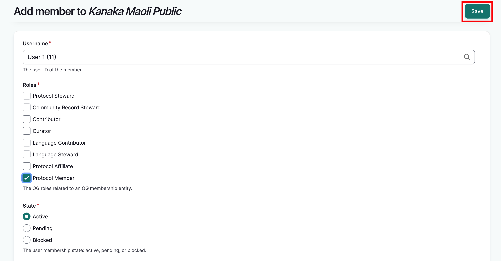

A blank form will load and a success message will be displayed. If you wish to add additional users, you may continue to do so.

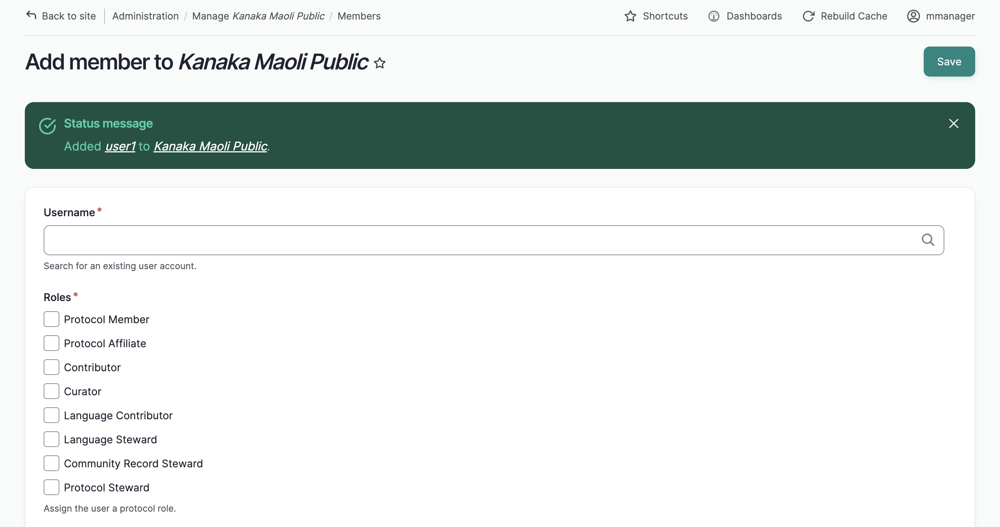

## Manage members individually

To manage existing protocol members, from the members page select the "edit" button in the row of the user you wish to manage.

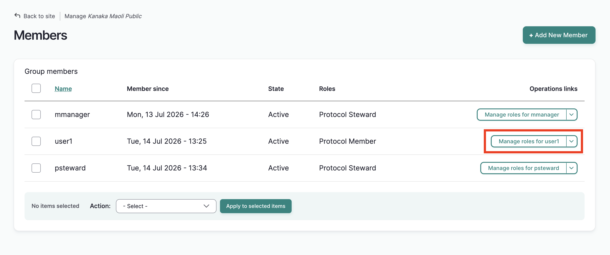

1. Uncheck the boxes of protocol roles you wish to remove. 
2. Check the boxes of the roles you wish to add. In this example, we've added the contributor role.
3. To edit their state, select the appropriate state.

    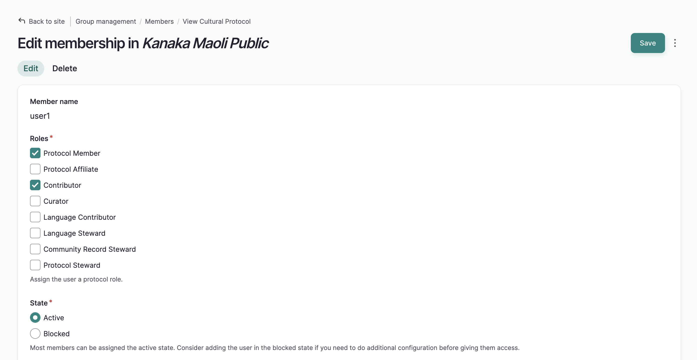

4. Select "save". The form will reload with a success message.

    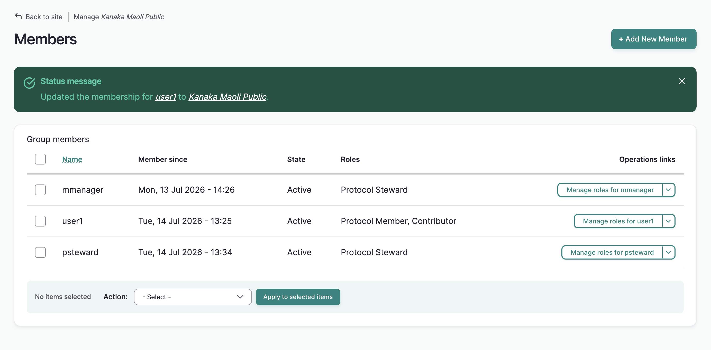

### Delete Users

1. To delete a user from the protocol, from the members page, select the drop-down arrow next to the "edit" button in the user's row, and select "Delete."
    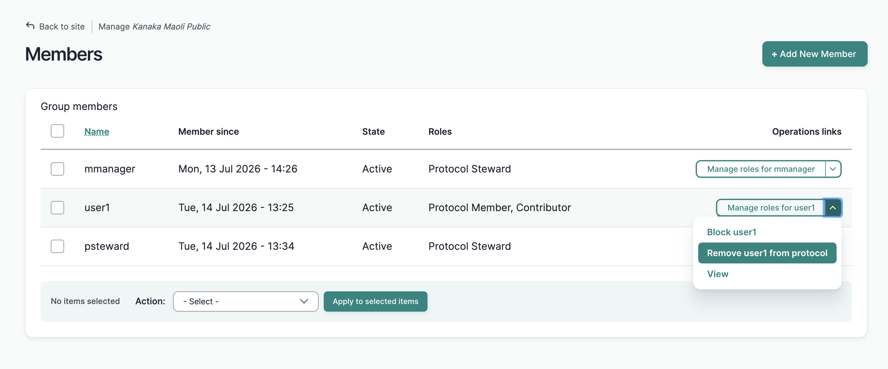

2. A pop up window will display a warning. Select "Delete." A success message will be displayed and the user will be deleted from the protocol. Note that they have not been deleted from the community or the site and can be re-added to the protocol at any time.

    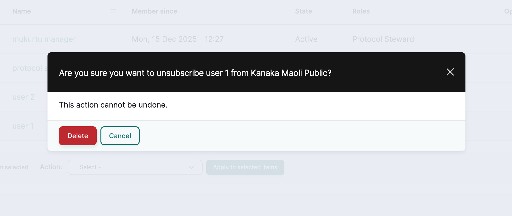

    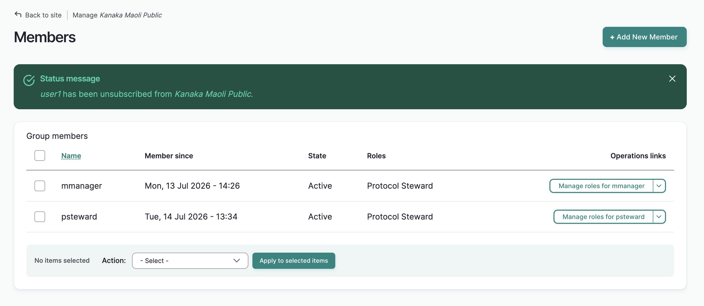

## Manage members in bulk

  You can manage multiple members by using the action menu. Use this menu to:

- Add roles to the selected membership(s) 
    - This option assigns protocol roles (member, affiliate, curator, contributor, language contributor, language steward, protocol steward)
- Approve the pending membership(s) 
    - This option approves protocol membership from users who have requested it.
- Block the selected membership(s) 
    - This option blocks the user from accessing the protocol page, content (if the protocol is strict) and any permissions the user had within the protocol.
- Delete the selected membership(s)
    - This option removes users from the protocol.
- Unblock the selected membership(s)
    - This option restores all protocol access and permissions to blocked users.

1. To use any of these actions on one or more members, from the members page, check the box next to each name you wish to manage. 
2. Using the action menu, select the action you wish to apply. 
3. Select "Apply to selected items". The action will be applied to all selected members.
4. You will receive different results depending on the action item you select. Below are descriptions of the results of applying steps 1-3 above for each action item, and any additional instructions as needed.

### Add roles to the selected membership(s)

1. Complete steps 1-3.

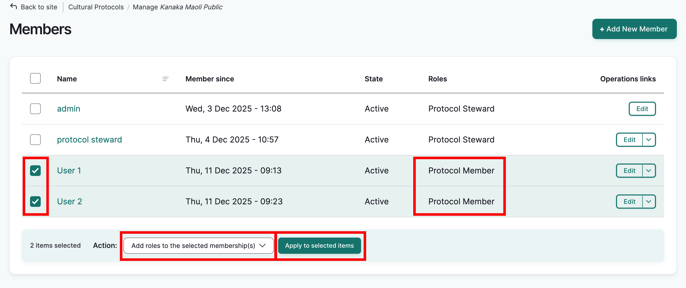

2. Select the role you wish to assign. 

    To assign multiple , hold down the command key on a Mac or CTRL on a PC to select multiple non-adjacent roles. To select multiple adjacent roles, holding the shift key (Mac and PC), select the first and last roles you would like to assign. All roles in between will also be selected. 

    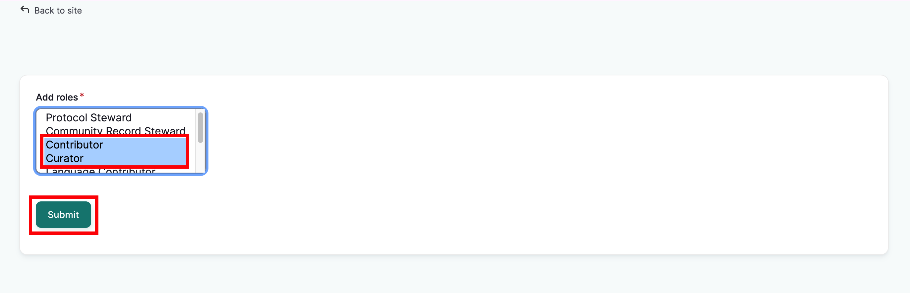 

3. Select "Submit". The members page will reload and a success message will be displayed. The newly added roles will appear in the **Roles** column.

    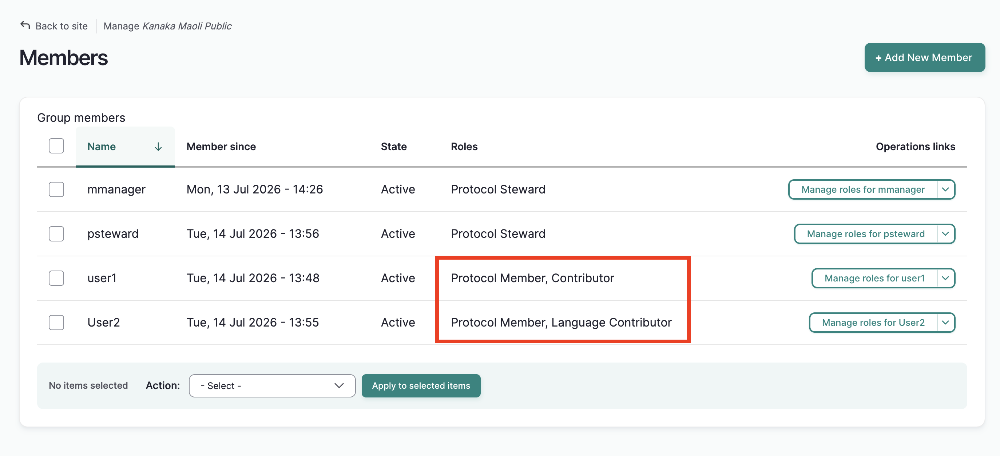

### Approve the pending membership(s)

1. Complete steps 1-3.

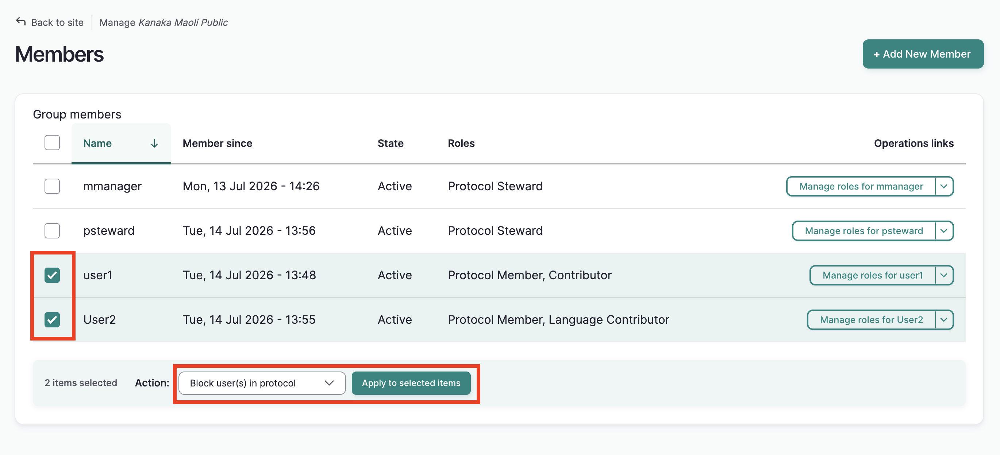

2. The members page will re-load with a success message. The selected users state will change from **Pending** to **Active**.

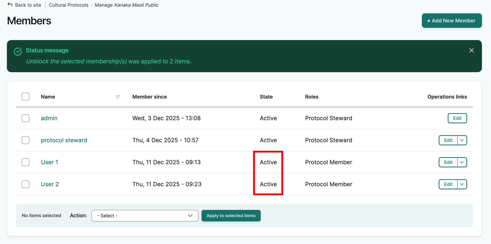

### Block the selected membership(s)

1. Complete steps 1-3.

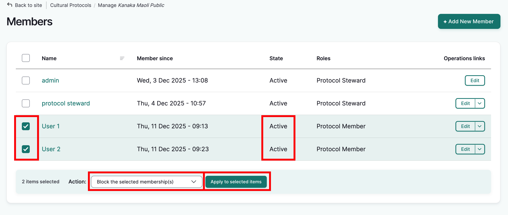

2. The members page will re-load with a success message. The selected users will be blocked.

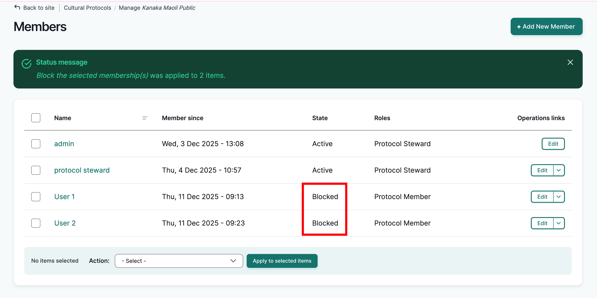

### Delete the selected membership(s)

1. Complete steps 1-3.

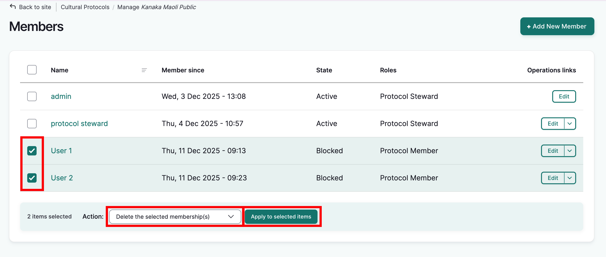

2. The members page will re-load with a success message. The selected users will be deleted. 

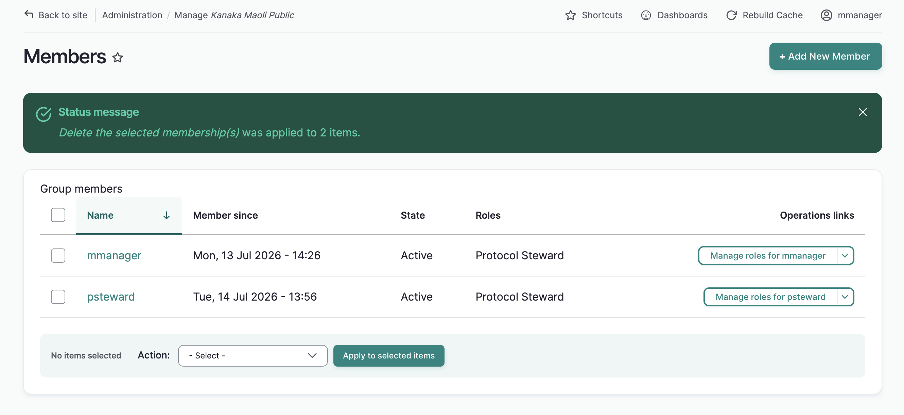

### Unblock the selected membership(s) 

1. Complete steps 1-3

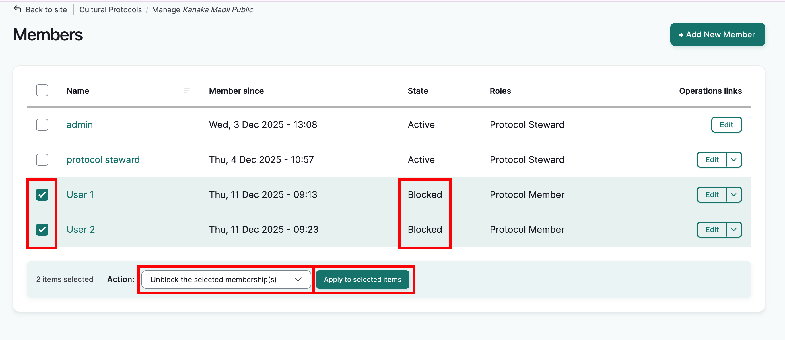

2. The members page will re-load with a success message. The selected users will be unblocked and set to **Active**.

