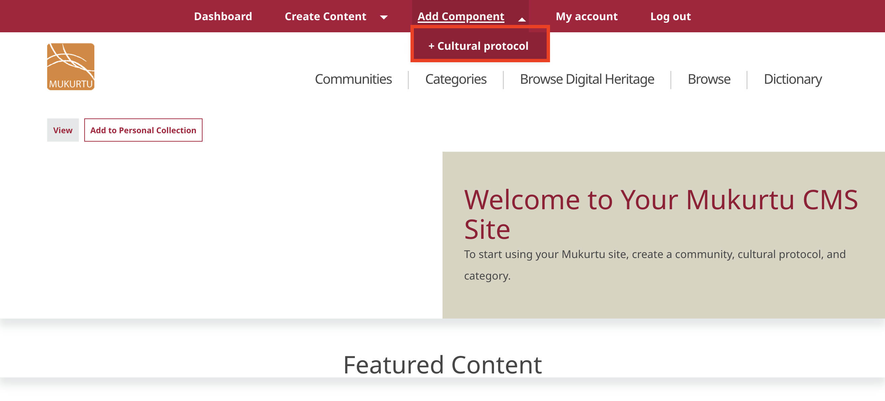
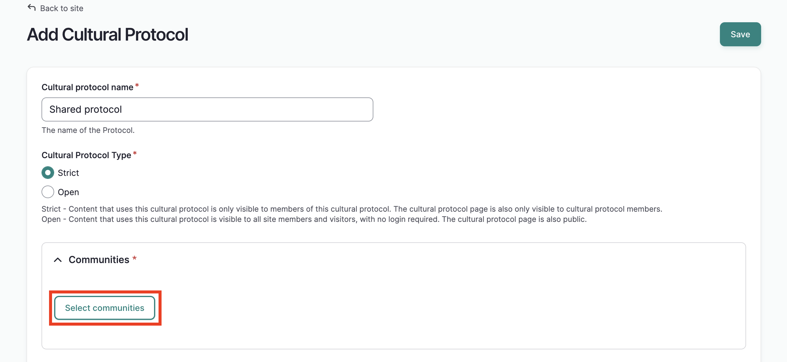
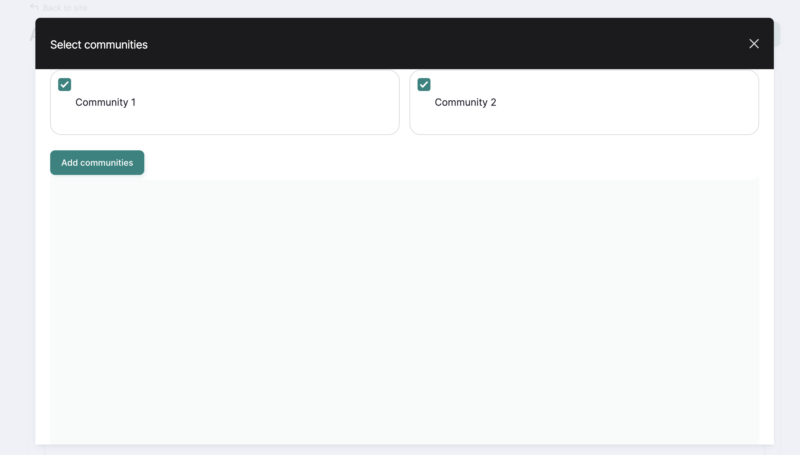
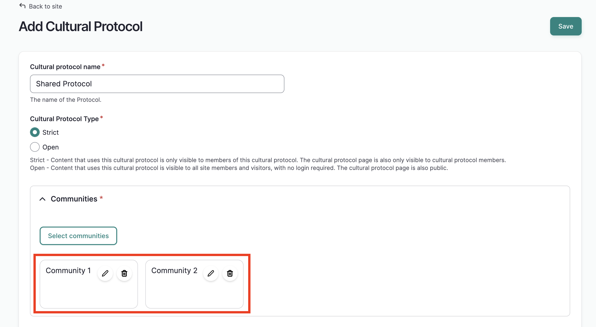
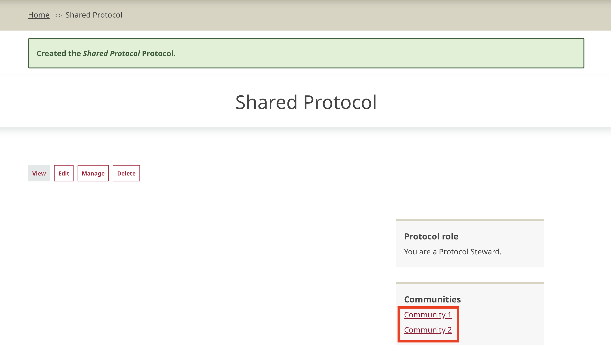
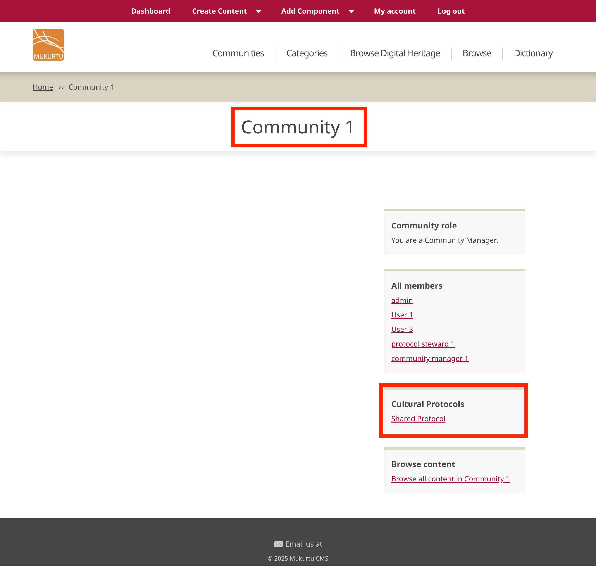
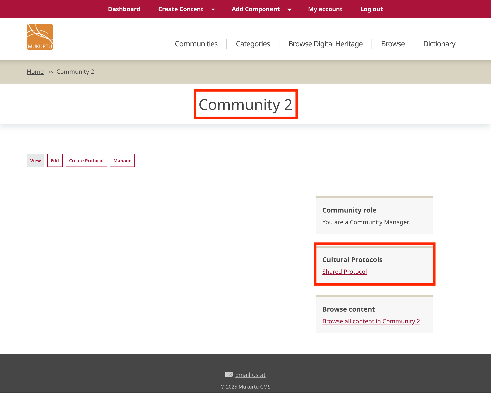
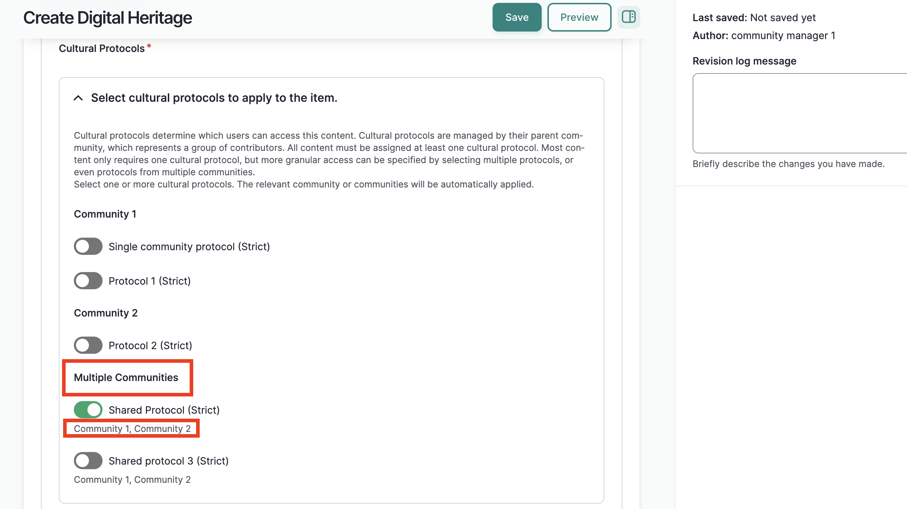
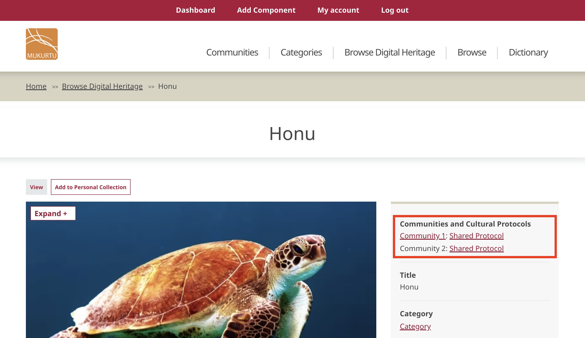
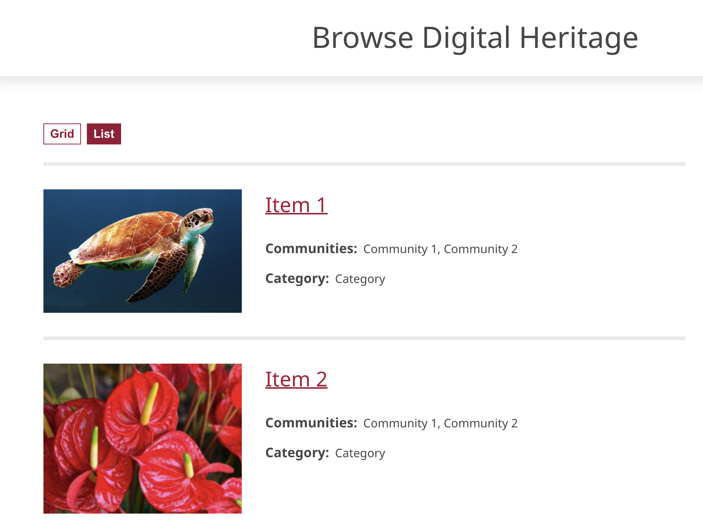

---
tags:
    - communities, cultural protocols, and categories
---
# Shared Protocols

!!! Roles "User roles" 
    Community manager, protocol steward

In a Mukurtu site, protocols typically belong to one community. At times, however, related families, villages, clans, or other communities might want to manage access to certain shared pieces of content with the same set of protocols while keeping their communities distinct. This is possible by adding multiple communities to a protocol, creating a shared protocol. This article covers creating shared protocols, managing membership, applying them to content, and what to expect in front-end display.

## Creating a shared protocol
Community managers of more than one community can create a shared protocol for the communities they manage. 

To do so, as a community manager, from the main menu, hover over **Add Component** and select **+Cultural Protocol**

Name your protocol, select the cultural protocol type, and select "Select Communities." 

!!! Tip
     It is  helpful to give the protocol a distinct name. This helps users recognize the protocol within content and across communities.

A window will open that displays all the communities you manage. Select the parent communities for the protocol, then select "Add Communities." 

You will be returned to the form, and the parent communities will be listed under **Communities**.

Continue filling out the form as needed, and select "Save."

The protocol page will load and a success message will be displayed. You will see all parent communities listed to the right under **Communities**

!!! Tip
    The steps to add multiple communities can be repeated with existing protocols as well. To do so, navigate to a protocol and select "Edit." Repeat the above steps to add additional communities to the protocol. 

On the community pages of both parent communities, you'll find the shared protocol listed under **Cultural Protocols**

## Managing shared protocols
Like any other protocol, protocol stewards manage shared protocols. Protocol stewards can belong to any of the protocols parent communities. The community manager who created the protocol is automatically a protocol steward. Each site should determine their own guidelines for managing shared protocols. For example, should each parent community have a protocol steward, or is one protocol steward sufficient, regardless of community membership? 

### Adding and managing users
Protocol stewards add and remove users, and manage user roles. They can see and add all members of all parent communities regardless of their own membership in those communities.

The steps to add users and assign user roles are the same as with typical protocols. For detailed instructions, see [Manage Protocol Members](../3Cs/ManageProtocolMembershipandRoles.md)

## Assigning shared protocols to content
Shared protocols are assigned to content like any other protocol. In a content form (i.e. digital heritage, dictionary word, etc.) they are listed in the cultural protocol field under "Multiple Communities." The parent communities of the shared protocol are listed below the protocol. Toggle the protocol to green to assign it to the content item.

## Display in content items
In a content item, protocols and communities are listed together under "Communities and Cultural Protocols" in the right side-bar. They are displayed as **Community name: Protocol name.**

A shared protocol will display in the same format. However, because the protocol has multiple parent communities, it will be repeatedly listed with each parent community. 

Note that access to a shared protocol does not mean access to every parent community. In the screenshot below, this user is only a member of Community 1. They can access their community and the shared protocol. The user does not belong to Community 2 (a strict community), and therefore does not have access to that community page. 

!!! tip
    Parent communities will be listed in the order they were created. 

## Display in browse and search

On the browse page, a content item will display all associated communities based on the protocol(s) assigned to the item. Whether the protocol is a shared protocol makes no difference in display. In the screenshot below, Item 1 is assigned one shared protocol, with Community 1 and Community 2 as parent communities. Item 2 is assigned two single community protocols, one each from Community 1 and Community 2. 

Update this screenshot when facets are working
 

Will need to add a section on search once that's up and running.