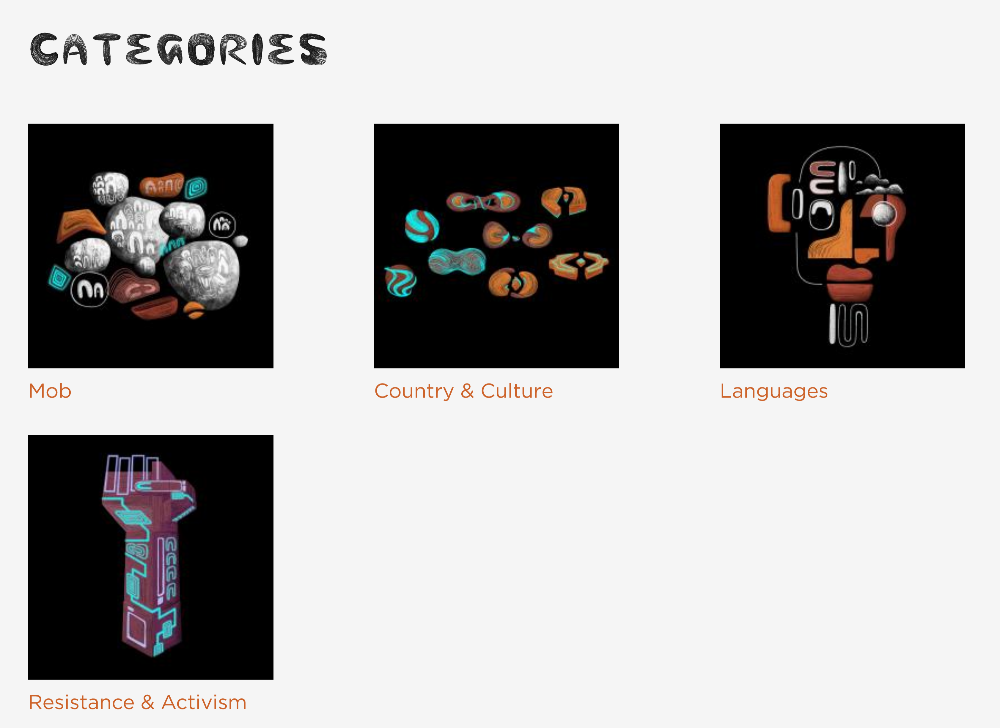

# Understanding Categories

!!! question "User Role:"
    Mukurtu Administrators

Categories are high-level descriptive terms that help users discover digital heritage items. All communities on the site share the same set of categories.

Each digital heritage item must belong to one or more category, so select categories to reflect the types of items within your site.

If the categories are too broad they won’t help users narrow down their search, but if they are too narrow they may not represent the scope of the site. Make sure that the category terms you choose make sense to your users by avoiding jargon and overly technical terms.

Most sites have between 10-15 categories. If more granular terms are needed, other taxonomies such as Keywords can be applied.

There are many ways categories can be used. Some examples include:

- The Plateau Peoples' Web Portal:
The Plateau Peoples' Web Portal uses categories to help users discover content on their site by grouping items by type and use. They also use categories as a targeted assertion of their position as the independent governments of the nations whose artifacts are accessible through this repository by using Government to Government Relations as one of their 12 categories.

- Gather from the State Library of New South Wales:
Gather is a repository whose stated goal is to connect Aboriginal communities with collections and stories from the State Library of New South Wales. They use the categories function in a unique manner, highlighting their four categories by working with Jake Duczynsky, a Gamilaraay and Mandandanji artist and animator to design animated category icons.

