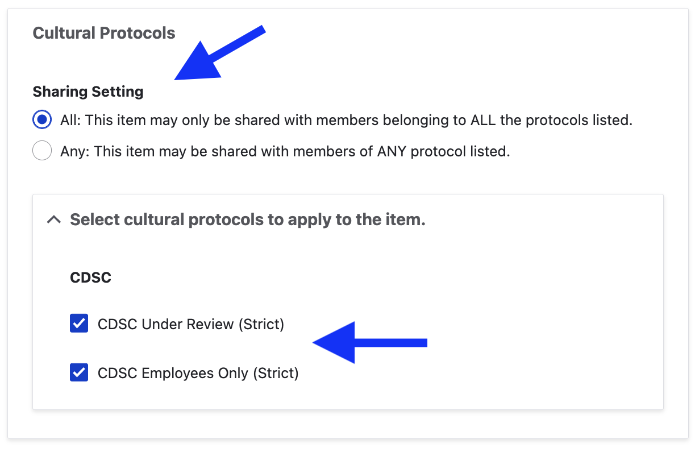

# Understanding Sharing Settings

For content with multiple protocols assigned, sharing settings help to determine a content item's level of access. You will see this setting on all content types (digital heritage, dictionary word, person record and collection) The setting is a  choice between *all* or *any*. 

**All**: An item with multiple protocols may only be viewed by members of ALL assigned protocols. 

**Any**: An item with multiple protocols may be viewed by a member of ANY assigned protocols.

For example, an item may be listed under two protocols: Dancers and Singers. Using the *Any* setting means the item could be viewed by anyone who is a member of the Dancers protocol, and anyone who is a member of the Singers protocol. It is the more inclusive option.

Using the *All* setting means the item would only be available to users who are members of both the Dancers *and* Singers protocols.

!!! note
    If you are only applying one protocol to the item, you may choose either setting.

## Using sharing settings
Select the setting that provides the most appropriate access to the content.

1. Under the Cultural Protocols settings of your content item form (digital heritage, dictionary, person record and collections), select the *sharing setting* you would like to use.

2. Select the protocols you would like to apply to the content.

