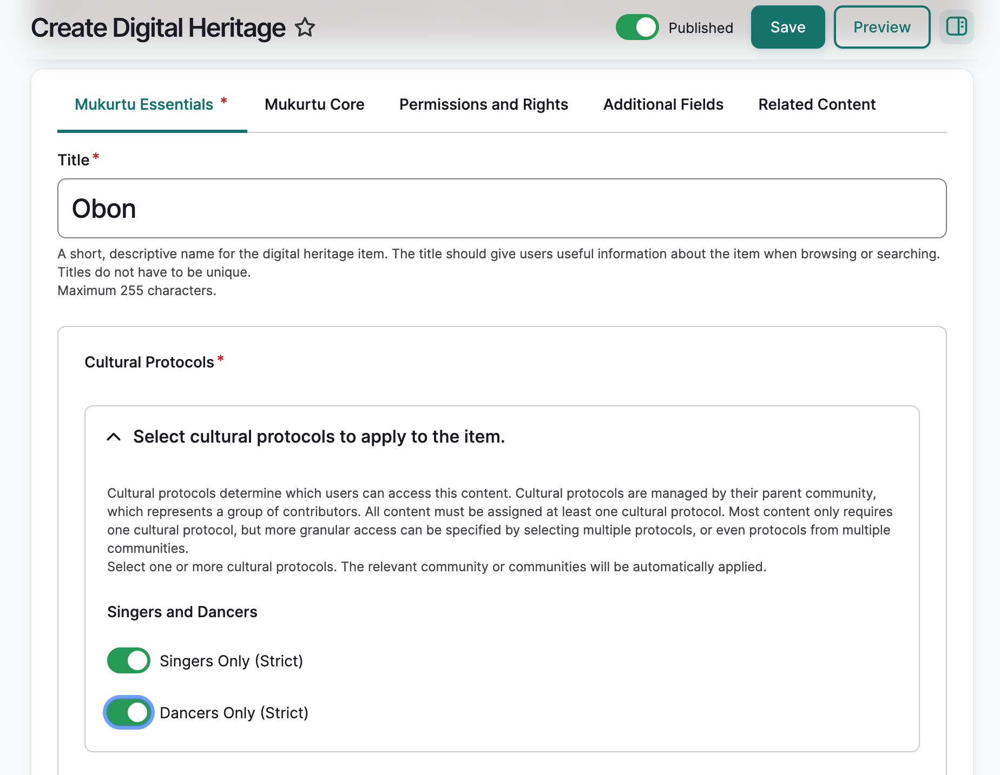
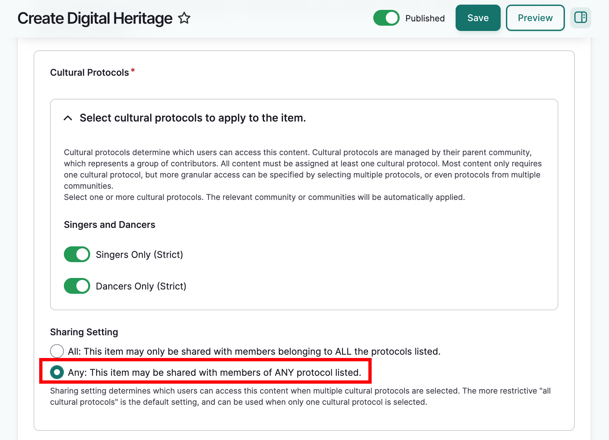
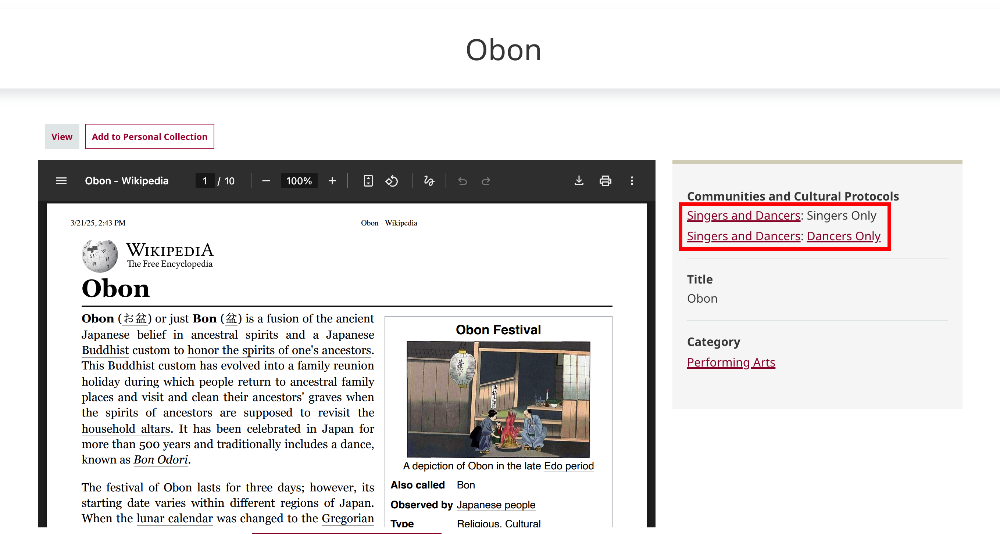
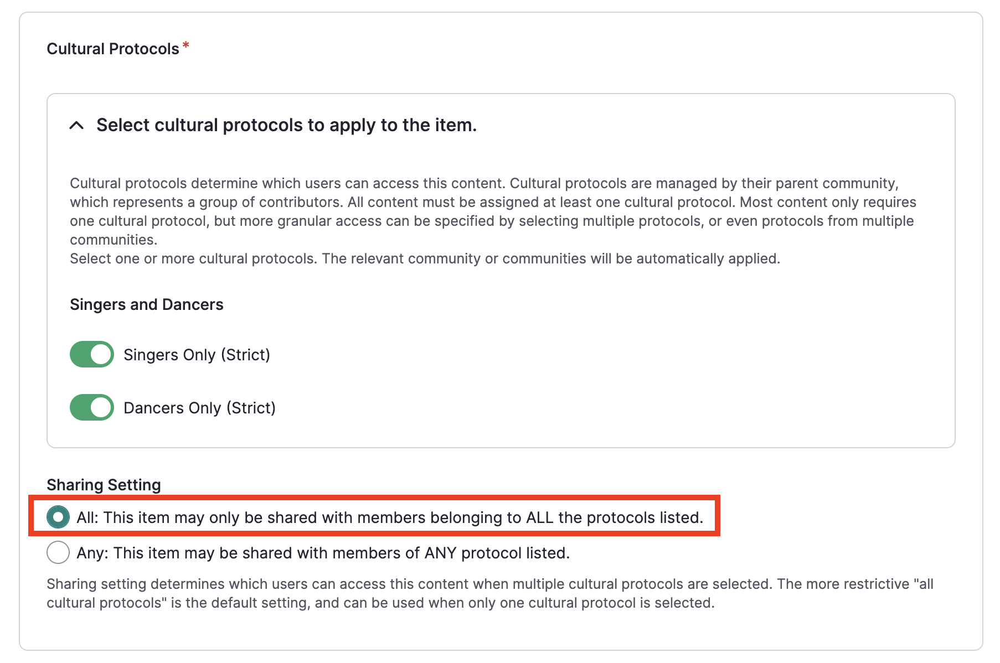
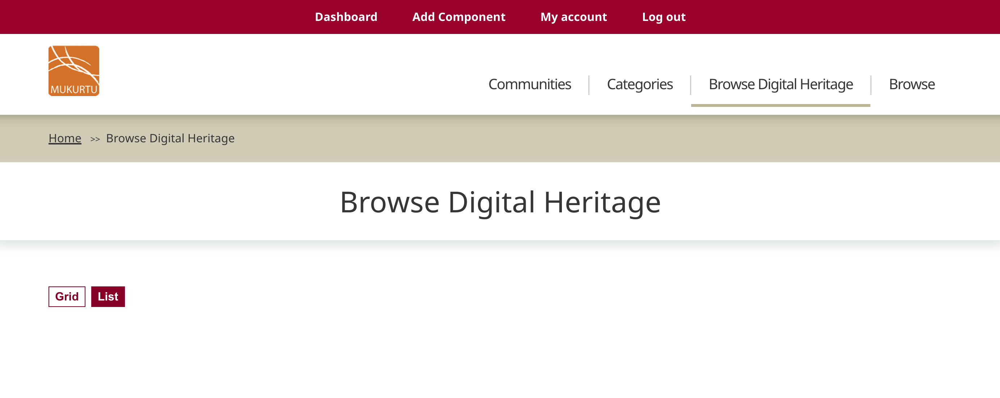
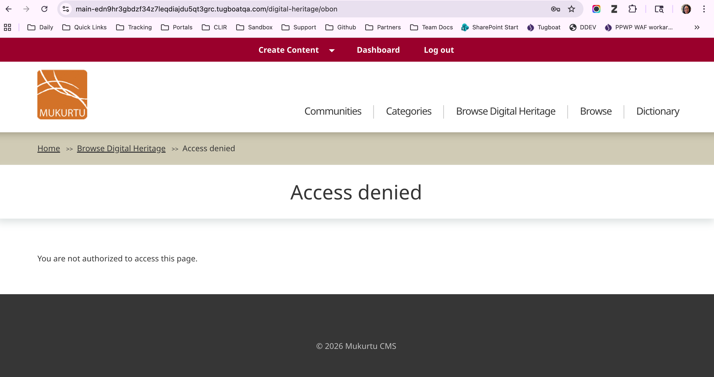
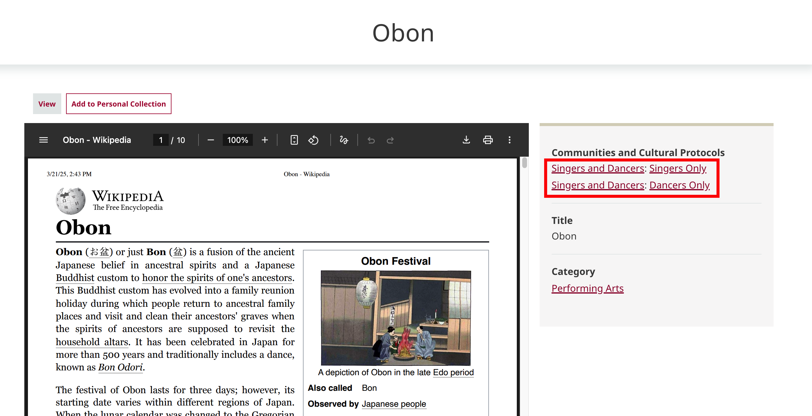

---
tags:
    - communities, cultural protocols, and categories
---

# Understanding Sharing Settings

For content with multiple protocols assigned, sharing settings help to determine a content item's level of access. You will see this setting on all content types (digital heritage items, dictionary words, person records, collections, and word lists) and media assets. The setting is a choice between *all* or *any*. 

**All**: An item with multiple protocols may only be viewed by members of ALL assigned protocols. 

**Any**: An item with multiple protocols may be viewed by a member of ANY assigned protocols.

For example, an item may be listed under two protocols: Dancers and Singers. Using the *Any* setting means the item could be viewed by anyone who is a member of the Dancers protocol, and anyone who is a member of the Singers protocol. It is the more inclusive option.

Using the *All* setting means the item would only be available to users who are members of both the Dancers *and* Singers protocols.

!!! note
    If you are only applying one protocol to the item, either setting will work. By default, the "All" setting will be applied.

## Using sharing settings

1. Within a content form (digital heritage items, dictionary words, person records, collections, and word lists) or media asset, select the protocols you would like to apply.

    

2. Select the *sharing setting* you would like to use.

    

## How sharing settings affect display

Here is an example of how each sharing setting affects content visibility: 

In the Singers and Dancers community, there are two strict protocols: Singers Only and Dancers Only. 

The community has two members: Singer 1 and Dancer 1. Singer 1 has been added to the Singers Only protocol. Dancer 1 has been added to the Dancers Only protocol. 

A digital heritage item has been uploaded under both protocols, and uses the *Any* sharing setting. 

When either user is logged in, they will be able to view the item. In this case, we are logged in as Dancer 1. Notice that the "Singers Only" protocol is visible but is not a live link because Dancer 1 is not a member of that protocol and should not have access.

Let's change the sharing setting on this same item to **All**.

!!! Warning
    Changing the sharing setting on a content item does not automatically update the sharing setting for media assets within the content item. Be sure to update sharing settings for media assets as needed. Failure to do so could result in inconsistent access to media assets. For more on editing media assets, see [Edit Media Assets](../media/ManageMediaAssets.md#edit-media-assets). 

Despite being logged in as Singer 1 or Dancer 1, the item is not visible via direct link, or from the browse page, because these users need to belong to BOTH protocols to view the item. 

The browse page:

Direct link to the digital heritage item:

Now let's say we've added Singer 1 to the Dancers Only protocol. They now belong to both protocols.

Logged in as Singer 1, with our sharing setting for this item still set to *All*, we can now see the item. Note that both protocols are now linked because Singer 1 belongs to both. In this scenario, Dancer 1 would still be unable to view the item because they do not belong to both protocols.

By using sharing settings, access to content with multiple protocols assigned can be fine-tuned.