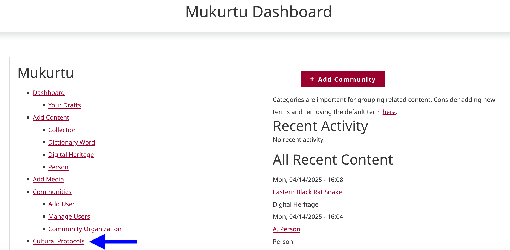

# Create a cultural protocol

>User role: Community Manager 
>
Reminder: You must create a community before creating a cultural protocol.

**Quick Steps**  

- From the Mukurtu Dashboard, select **Cultural Protocols**

- *Cultural Protocol Name*: Name your protocol. It's help to describe the organization or group associated with this protocol and access level. (i.e. CDSC Public)

- *Sharing Protocol*: Select *Strict* to limit access to certain community members and *Open* to allow access to all community members.

- Add a community. Begin typing to auto-populate the field with existing communities. Note that you must be a community manager in the other communities to add them to the protocol.

- Add a custom URL if desired.

- Select **Save**. 

From the Mukurtu Dashboard, select **Cultural Protocols**

Select **Add Protocol**

Name your protocol. It's helpful to describe the organization or group associated with this protocol and access level. (i.e. CDSC Public)

Add a community. Begin typing the name of the community to add it to this protocol. Communities will auto populate as you type. You may add additional communities to this protocol by selecting **Add another item**. If you wish to credit someone else as the protocol's author, you may do so in the "Authored by" field. Note that they must be a community member.

If you wish to have a custom URL, you may add customizations here. Otherwise, select **Save**. 
