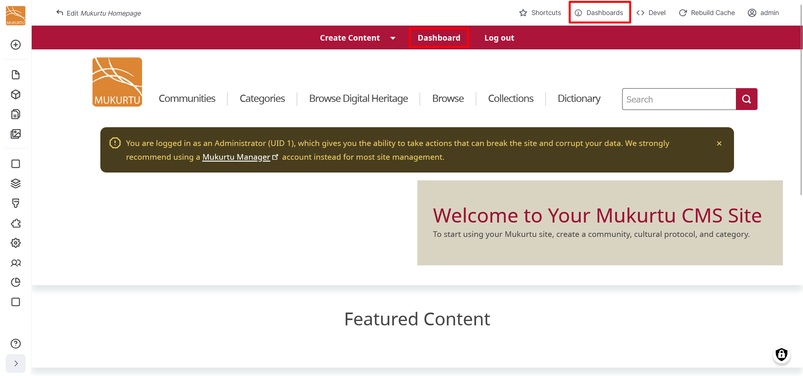
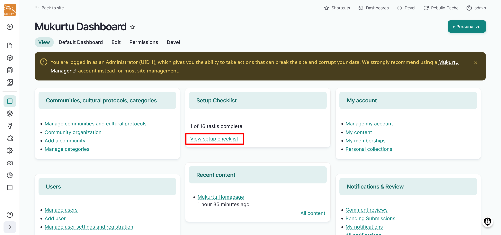
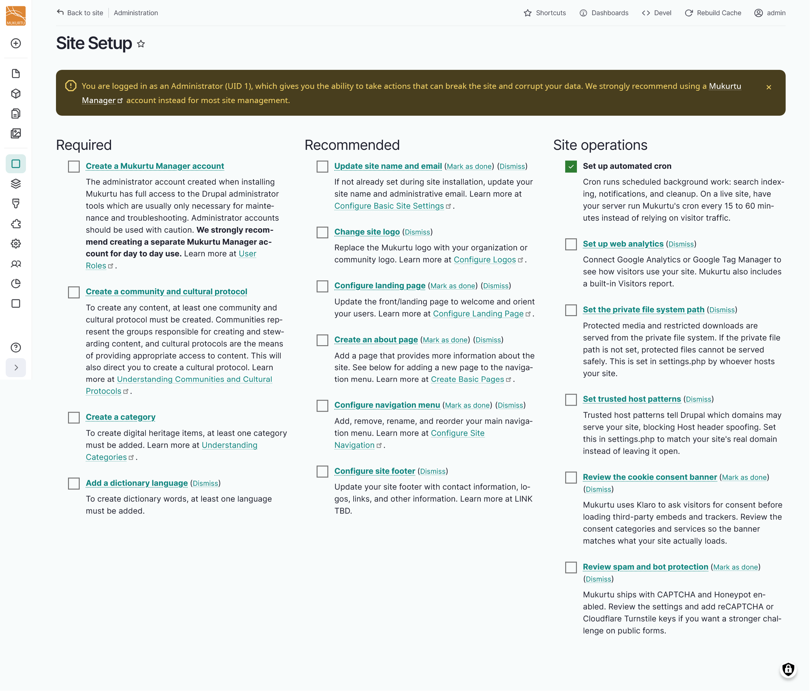

---
tags:
    - getting started
---

# Site Setup Checklist 

!!! roles "User role"
    Administrator, Mukurtu manager

Once your Mukurtu 4 site is installed, there are some steps that need to be completed before you can start adding content. This site setup checklist will walk you through setting up these structural and administrative steps. To get started, log in to your default administrator account and navigate to the **Dashboard**.

Under the **Setup Checklist** section, select the **View setup checklist** link.

Tasks are divided into three labelled columns: 

**Required** outlines tasks that must be completed before you can add content to your site, such as creating a community and cultural protocol or creating a category.

**Recommended** includes site personalization tasks, such as updating your site name and email or changing your site logo. 

**Site Operations** includes structural tasks, such as setting up a private file system path and reviewing spam and bot protection. 

## Required 

Tasks in the **Required** column will be automatically checked off when they are complete.

### Create a Mukurtu Manager Account

Follow the **Create a Mukurtu Manager Account** link to create a Mukurtu manager account. You should use a Mukurtu manager account for day to day use.

For more information on creating user accounts, including a Mukurtu manager account, refer to [Create User Accounts from a Site-wide Role](../users/creating-account-site-wide.md#fill-out-the-add-user-form).

### Create a community and cultural protocol

To create any content or add any media assets, at least one community and cultural protocol must be created. Communities represent the groups responsible for creating and stewarding content, and cultural protocols are the means of providing appropriate access to content. Creating a community will then direct you to create a cultural protocol. For more information about communities and cultural protocols, refer to [Create a Community and Initial Cultural Protocol](../communities-cultural-protocols-categories/CreateACommunityAndInitialCulturalProtocol.md).

### Create a category

To create digital heritage items, at least one category must be added. For more information about creating categories, refer to [Create Categories](../communities-cultural-protocols-categories/CreateCategories.md).

### Add a dictionary language

To create dictionary words, at least one language must be added. For more information on adding a language, refer to [Configure the Dictionary: Add a Language](../dictionary/ConfigureTheDictionary.md#add-a-language)

## Recommended

Some tasks in the **Recommended** column will be checked off when they are complete. You can also select **Mark as done** or **Dismiss** to mark a task as complete or to dismiss a task if it does not apply to your site.

### Update site name and email

If not already set during site installation, you can configure your site name and administrative email. For instructions, refer to [Configure Basic Site Settings](../site-settings/ConfigureBasicSettings.md).

### Change site logo

You can replace the Mukurtu logo with your organizational or community logo. For instructions, refer to [Configure Logos](../look-and-feel/ConfigureLogo.md).

### Configure landing page

You can configure the landing page to welcome and orient your users. For instructions, refer to [Configure Landing Page](../look-and-feel/ConfigureLandingPage.md).

### Create an about page

You can create an about page to provide more information about your site. For instructions, refer to [Create and Edit Basic Pages](../look-and-feel/CreateBasicPage.md).

!!! tip
    If you create a new basic page, remember to add it to your navigation menu.

### Configure navigation menu

You can add, remove, rename, and reorder links in your main navigation menu. For instructions, refer to [Configure Site Navigation](../look-and-feel/ConfigureSiteNavigation.md).

### Configure site footer

You can add contact information, logos, links, and other information to your site footer. For instructions, refer to [Configure Site Footer](../look-and-feel/ConfigureFooter.md).

## Site operations

The site operations column includes includes structural tasks, such as setting up a private file system path and reviewing spam and bot protection.

Some tasks in the **Site operations** column will be checked off when they are complete. You can also select **Mark as done** or **Dismiss** to mark a task as complete or to dismiss a task if it does not apply to your site.

### Set up automated cron

This is checked off when you build your site because cron is automatically set to run every hour. However, it is recommended on a live site for cron to run every 15-60 minutes. For more information on configuring cron refer to [Cron Configuration](../site-maintenance/CronConfiguration.md).

### Set up web analytics

You can connect a Google Analytics or Google Tag Manager to see how visitors use your site. Mukurtu also includes a built-in Visitors report. For more information on configuring Google Analytics or Tags refer to [Configure Google Analytics](../site-settings/ConfigureGoogleAnalytics.md). 

To enable or disable tracking of visitors using the Mukurtu Visitors module, navigate to your **Dashboard** in the **Site settings** section and select the **Analytics settings** link. 

- Tracking is enabled by default. To disable tracking, select the **Disabled** radio button, then select "Save configuration". 

    

To view analytics provided by the Mukurtu Visitors module, navigate to your **Dashboard** in the **Site settings** section and select the **Analytics** link. 

### Set the private file system path

Protected media and restricted downloads are served from the private file system. If the private file path is not set, protected files cannot be served safely. This is set in settings.php by whoever hosts your site. For more information refer to 