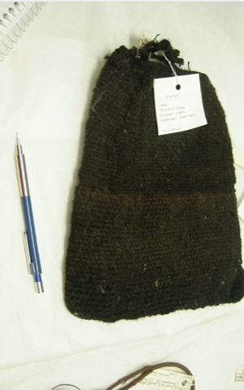

# What does Mukurtu mean?

The word “mukurtu” ((MOOK-oo-too) in Warumungu means “dilly bag.” Dilly bags hold sacred items and are accessible by acting responsibly within the community and gaining the permission of knowledgeable community leaders. 

Like the dilly bag the archive is a “safe keeping place,” a community repository for cultural materials and knowledge that grows from continued use, dialogue and negotiations. 

The Warumungu community maintains the original archive at the Nynikka Nyunyu Art and Culture Centre where people access their materials, deposit new content, add knowledge and information to existing content, and create new materials.

