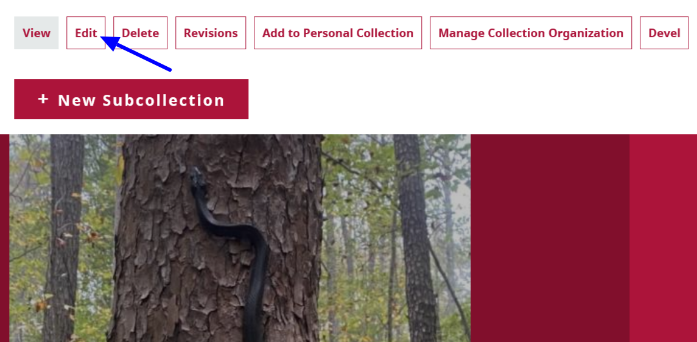
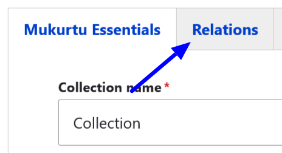
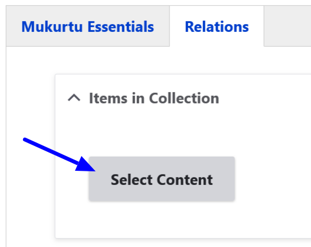
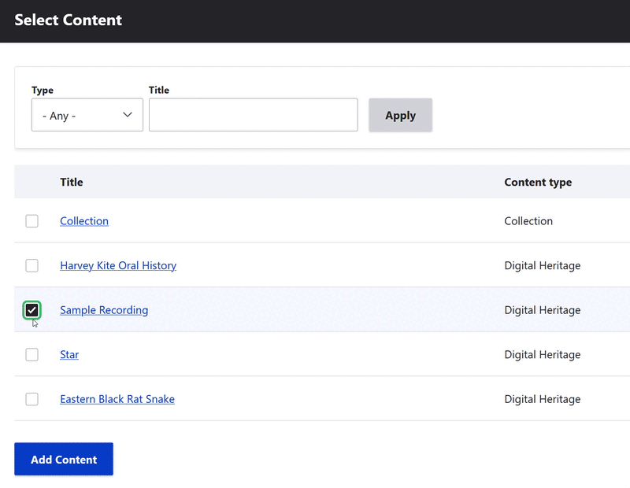
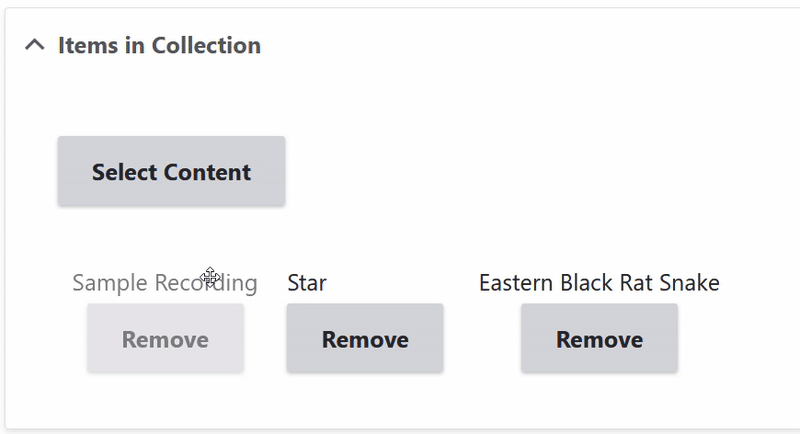

---
tags:
    - collections
    - content
---

# Add Content and Arrange a Collection

!!! roles "User roles:" 
    Protocol steward, Curator
    
Protocol Stewards and Curators can add content and arrange the collections they administer through the collections page. 

## Add content

Select the collection you want to add content to. 

Select the **Edit** link above the collection. 

Select the **Relations** tab.

In the **Items in Collection** field, select the "Select Content" button.

Select the checkbox for all the content you wish to add to your collection. Then select the "Add Content" button at the bottom of the pop-up window to add your content.

Select the "Save" button at the bottom of the screen to save your collection.

### Arrange content 

Navigate to the collection you want to rearrange, then select the **Edit** link above the collection.

Select the **Relations** tab. In the **Items in the Collection** field, select and drag the content in your collection to rearrange their order. Select the "Remove" button to delete content from the collection.

Select the "Save" button at the bottom of the screen to save your collection.
