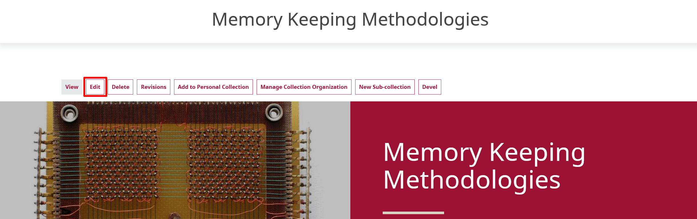
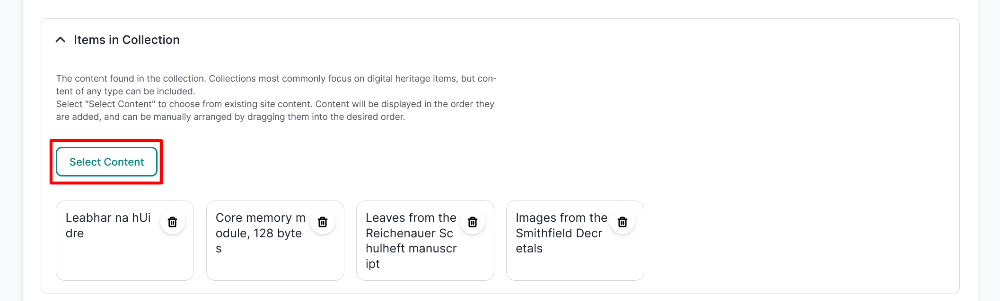
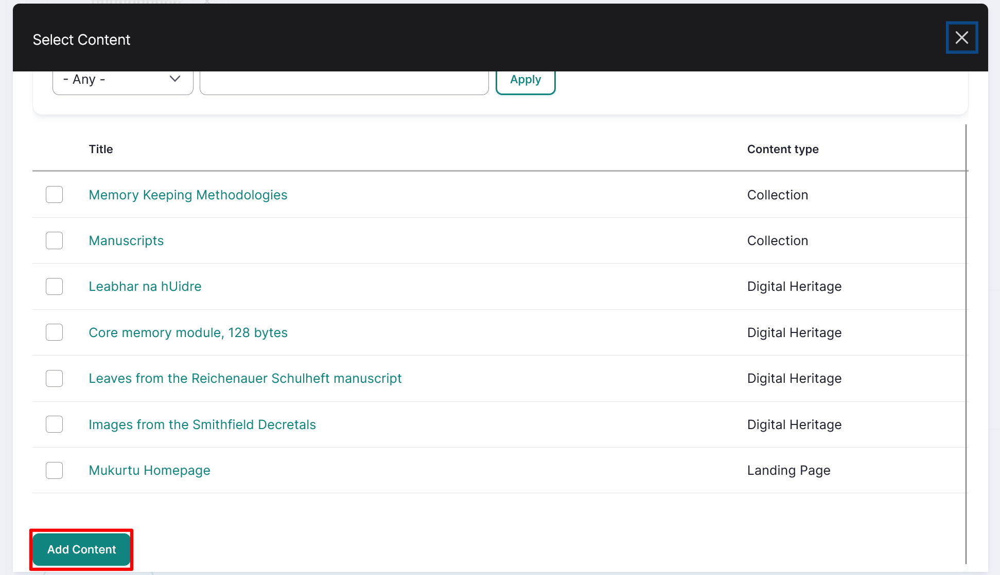
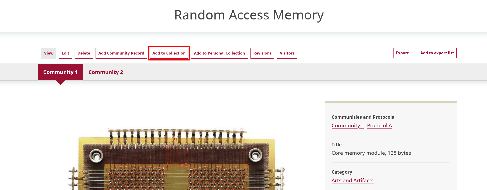
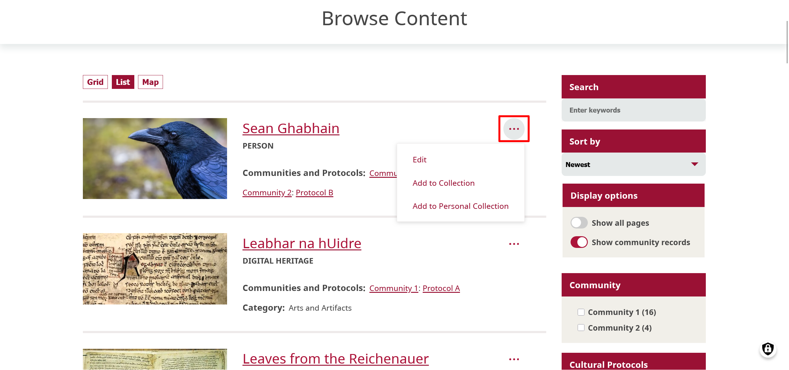
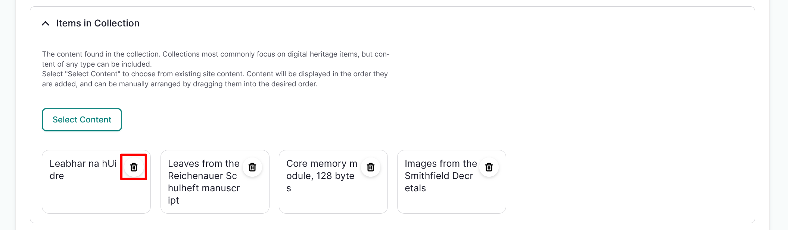
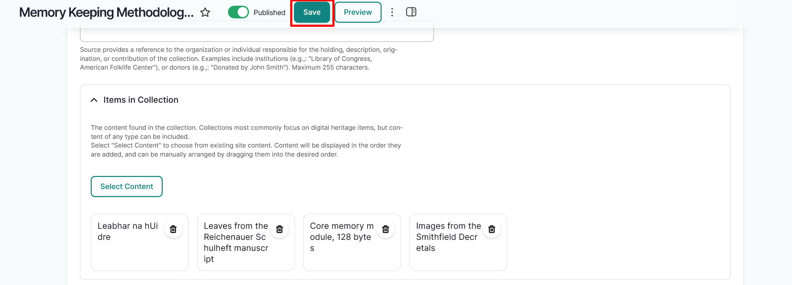

---
tags:
    - collections
    - content
---

# Curate a Collection

!!! roles "User roles" 
    Protocol steward, curator
    
Collections are a tool used to group and arrange content in a structured way, or to provide additional context. They can also be used to provide an exhibit-type experience.

Protocol stewards and curators can curate the content within the collections they are responsible for. This article demonstrates adding and arranging content within a pre-existing collection.

## Add content

You can add content to a collection from the collection page, a content item, or from the quick action menu while browsing.

### From a collection

1. Navigate to the collection you want to manage. Select the **Edit** link below the collection title.

    

2. In the **Mukurtu Essentials** tab, navigate to the **Items in Collection** field and select the "Select Content" button. 

    

    !!! tip 
        You can filter content by type or search by title.
        
4. Use the checkboxes to select content to add to the collection. Select the "Add Content" button below the content list to add selected content to the collection. You can add digital heritage items, dictionary words, person records, and word lists to your collection.

    

5. By default, content will be displayed on the collection page in the order it was added to the collection. You can also rearrange the content if needed.

    To use the default order select the "Save" button at the top of the page to save your changes.

### From content

You can add content you are viewing to a collection.

1. To add content to a collection from the content page, select the "Add to Collection" button above the content you want to add to a collection. 

    

2. Select the collection you want to add the content to, then select the "Add to Collection" button.

### From browse

You can add content to an existing collection while browsing using the quick action kebab menu. 

1. To add content to a collection while browsing, select the quick action kebab menu, then select **Add to collection** from the dropdown.

    

2. Select the collection you want to add the content to, then select the "Add to Collection" button.

## Arrange a collection 

1. Navigate to the collection you want to rearrange, and select the **Edit** button from the menu below the collection title.

2. In the **Mukurtu Essentials** tab, navigate to the **Items in the Collection** field. Select and drag the content into the preferred order. 

    To remove content from the collection, select the "Remove" icon.

    
   
3. Select the "Save" button at the top of the page to save your changes.

    