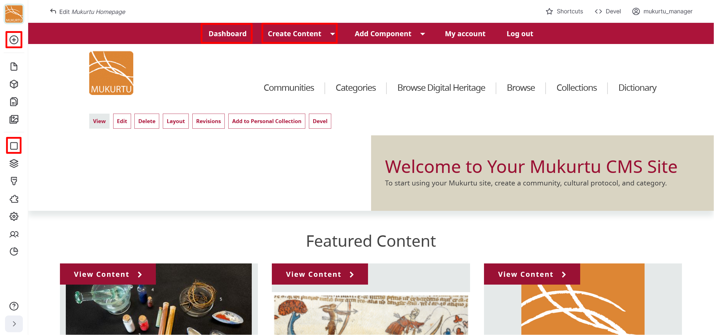
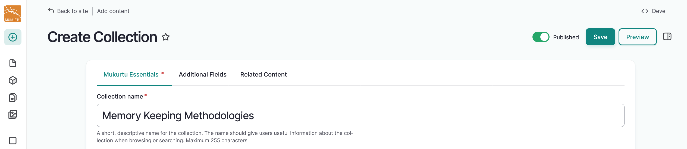
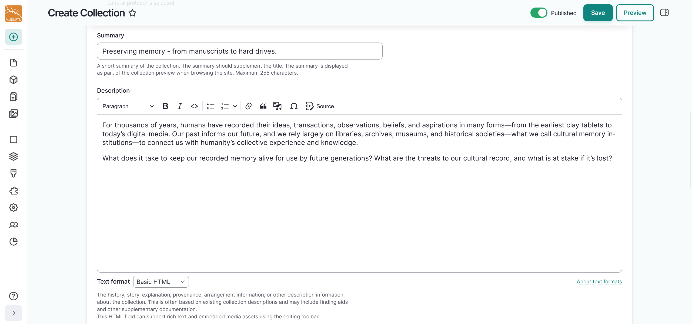
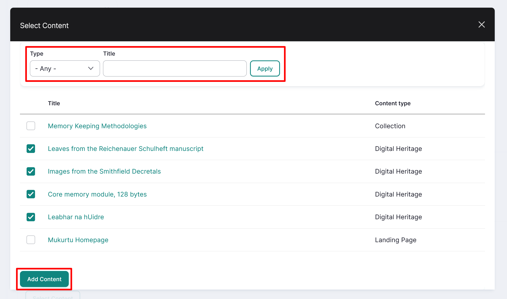
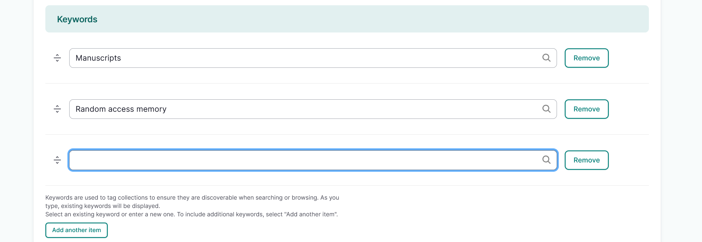
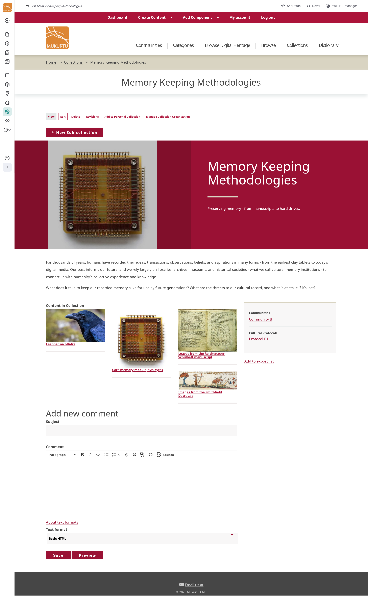

# Create a Collection

!!! roles "User roles" 
    Protocol steward, curator

Collections are a tool to group and arrange content. They can be used to provide additional context to materials and to provide users a more guided or curated experience. The creator of the collection can arrange the content in a structured way, provide a description of the collection, and select a featured image. Display of individual items within the collection is still controlled by their specific cultural protocols.

## Create a new collection 

There are several different ways to get started creating a collection in Mukurtu. You can create a collection from the **Create Content** dropdown menu, from the **+** icon on your left-hand sidebar, or from the **Dashboard** links in the header or the left-hand sidebar. 

    
Select **Collection** to begin creating your collection. The remaining steps to create a collection are the same.

## Mukurtu essentials

1. Use the *Collection name* field to provide a name for your collection. The collection name should give users useful information about the collection when browsing or searching.

    - This is a required field.

2. Use the toggle to apply cultural protocols to your digital heritage item. 

    - This is a required field.

### Sharing settings

3. Select a **Sharing setting**. Sharing setting has two options: you can select **Any** or **All**. 

    - Any is the less restrictive setting as it means that the content can be shared with people belonging to any one or more of the protocols selected. 
    - All is more restrictive as users must belong to all the selected protocols to view the digital heritage item. 
    - This is a required field.

4. Use the *Summary* field to give a brief statement describing your collection. This can be used to provide information about the meaning or structure of the collection, and is displayed as part of the collection preview when browsing the site. This field is plain text and limited to 255 characters. 
5. Use the *Description* field to provide history, a story, an explanation, provenance, arrangement information, or other descriptive information about the collection. This is often based on existing collection descriptions and may include finding aids and other supplementary documentation. This is a full text HTML field that can support images, documents, audio or video recordings, or embeds.

    

6. Use the *Image* field to select a featured thumbnail image. This image is used on the collection page and in previews across the site, and may be drawn from content in the collection or selected to complement the collection. For instructions on how to add a thumbnail image, refer to the [Upload Media Assets: Image](../../media/ByTypeMediaUpload/Image) article. 

    !!! tip
        The summary, description, and thumbnail fields help users browse your collections by providing context and a more curated experience.

7. Use the *Source* field as a reference to the organization or individual responsible for the holding, description, origination, or contribution of the collection. This could include institutions (eg: `Library of Congress, American Folklife Center`) or donors (eg: `Donated by John Smith`). 
8. In the **Items in Collection** section, select the "Select Content" button to add items to your collection.  Collections most commonly focus on digital heritage items, but content of any type can be included.

    !!! tip 
        You can filter content by type or search by title.

    - Select the checkbox beside all the content you wish to include in the collection, then scroll down and select "Add Content".

    

9. Use the **Sub-Collections** section to add any sub-collections by selecting the "Select Content" button. Sub-collections can provide more internal structure or organization and may reflect existing physical arrangement (eg: boxes, folders, subfolders), topical groupings, or any other arrangement that will help users navigate the collection. Sub-collections can be multiple levels deep.

    !!! requirement
        Sub-collections must have already been created to be added from this section.

## Additional fields

1. Use the *Keywords* to add any keywords to your collection. Keywords are used to tag collections to ensure they are discoverable when searching or browsing. They are more flexible and specific than categories. Consider adding 3-5 keywords to your collection by selecting the "Add another item" button to add additional keywords fields.

    
 
2. Select *Map Points* for your collection. Map points is a detailed, interactive mapping tool that allows placing and drawing multiple locations related to a collection. This field is also used for the browse by map tools. Refer to [Create Map Points](../location-data/CreateMapPoints.md) for detailed instructions on creating map points.

    !!! tip
        Note that this mapping data will be shared with the same users or visitors as the rest of the collection. If the location is sensitive, carefully consider using this field.You can include points, paths, rectangles, or polygons to indicate physical location references for your collection. 

3. Add a *Location Description* to provide additional context and depth to the location(s) connected to the collection. This is a full HTML field that also supports additional media.
4. Use the *Location* field to provide a taxonomic location term for your collection. This can be a named place, or places, that are closely connected to the collection. Examples include the location where a photo was taken, places named in a story, or the site where an object was created.
5. Use the *Local Contexts* field to apply Traditional Knowledge labels to your collection. 
    
    !!! tip
        To start a project or for more information on Local Contexts projects, labels, and notices, visit [Local Contexts](https://localcontexts.org/).

    - Select your Local Contexts project from the dropdown. 
    - Select Local Contexts labels and notices to assign to the collection.  

    
      
## Related content

Use the "Select Content" button in the **Related Content** section to add any related content to the collection. Related content includes anything that has a close connection to the collection but is not in the collection, including digital heritage items, dictionary words, person records, or even other collections. It can be used to spotlight content outside of the collection or to guide users to other content. 

Select the "Save" button to save your collection.

