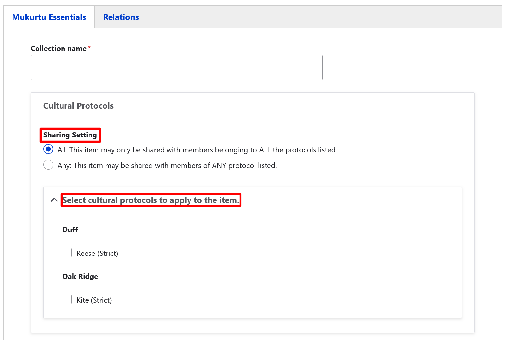

# Create a Collection

!!! roles "User roles" 
    Protocol steward, Curator

To provide context or connections for some items or groups of items, communities may choose to use Mukurtu's Collections feature. Collections are a useful feature that help protocol stewards and curators arrange content in ways that help provide a more comprehensive context for that content. The creator of the collection determines the way the collection is arranged, including the order in which content is displayed. Users only see those items they have access to based on their cultural protocols. Collections provide users with a more curated or guided experience of the site's content. 

## Create a new collection 

1. There are two ways to create a collection in Mukurtu. You can create a collection from your **Dashboard** or by selecting **Add Content**.
    
    - To create a collection from your dashboard, select **Dashboard** and scroll down to the **Collection** link. 

    

    - To create a collection from **Add Content** select the **Add Content**, then select the **Collection** link.

    

    The remaining steps to create a collection are the same.

2. Use the *Collection name* field to provide a name for your collection. This is a required field.
3. Select a **Sharing setting**. Sharing setting has two options: you can select **Any** or **All**. Any is the less restrictive setting as it means that the content can be shared with people belonging to any one or more of the protocols selected. All is more restrictive as users must belong to all the selected protocols to view the collection. This is a required field.
4. Apply cultural protocols by selecting the checkbox beside any cultural protocols that should be applied to this collection. 
    
    !!! requirement
        Collection name, sharing settings, and cultural protocols are required fields.

    

5. Use the *Summary* field to provide a summary of your collection. This field is limited to 255 characters. 
6. Use the *Description* field to provide a description of your collection. This is a full HTML field that also supports additional media.
7. Use the *Image* field to select a representative thumbnail image for your collection. Select the "Add media" button to access the media library. You can either upload an image or select one from your media library.
    - From your computer: select the "Choose File" or "Browse" button to upload an image from your computer. The terms on the button are browser dependent. 
    - From the media library: select the checkbox on the image you want to add as a thumbnail. 

    Select the "Insert selected" button to insert your thumbnail.
   
    

8. Select any *Keywords* you want to apply to your collection. If you need to add more than two keywords, select the "Add another item" button to add additional keywords fields.

    

9. In the *Source* field provide information indicating the resource, collection, or institution where the collection was contributed or originated.  
10. Select *Map Points* for your collection. You can include points, paths, rectangles, or polygons to indiciate physical location references for your collection. **IDEALLY THIS SHOULD LINK TO A MAPPING TUTORIAL**
    - To add a point, select the first draw marker at the top right of the map. 
    - To add a polyline, select the second draw marker to the right of the map.
    - To add a rectangle, select the third draw marker to the right of the map.
    - To add a polygon, select the fourth draw marker to the right of the map. 

    

11. Add a *Location Description*. If a location has identifying characteristics but is not able to be pinpointed on a map this field can be used instead of the mapped location. It can also be used to add additional context to the map points. This is a full HTML field that can also supports additional media.
12. In the *Location* field, provide a taxonomic location term for your collection.
13. If your collection should have Traditional Knowledge labels, select your Local Contexts project from the dropdown. Then select Local Contexts labels and notices to assign to the collection. To start a project or for more information on Local Contexts projects, labels, and notices, visit the [Local Contexts](https://localcontexts.org/).
    
    You can save your Collection at this point, or return to the top of your page to select the **Relations** tab to add content to your collection.

14. In the **Items in Collection** section, select the "Select Content" button. Digital heritage items, person records, dictionary words, and other content can be included in a collection. 

    !!! tip 
        You can filter content by type or search by title.

15. Select the checkbox beside all the content you wish to include in the collection, then scroll down and select "Add Content".

    

16. If you choose to create any sub-collections, they can be added by selecting the "Select Content" button in the **Sub-Collections** section. Sub-collections must have already been created to be added from this section.
17. If you have any related content to the collection, select the "Select Content" button in the **Related Content** section.
18. Select whether you want to save this collection as a draft or as a published collection. Select either **Draft** or **Published**, then select the "Save" button. You also have the option to preview your collection by selecting "Preview".