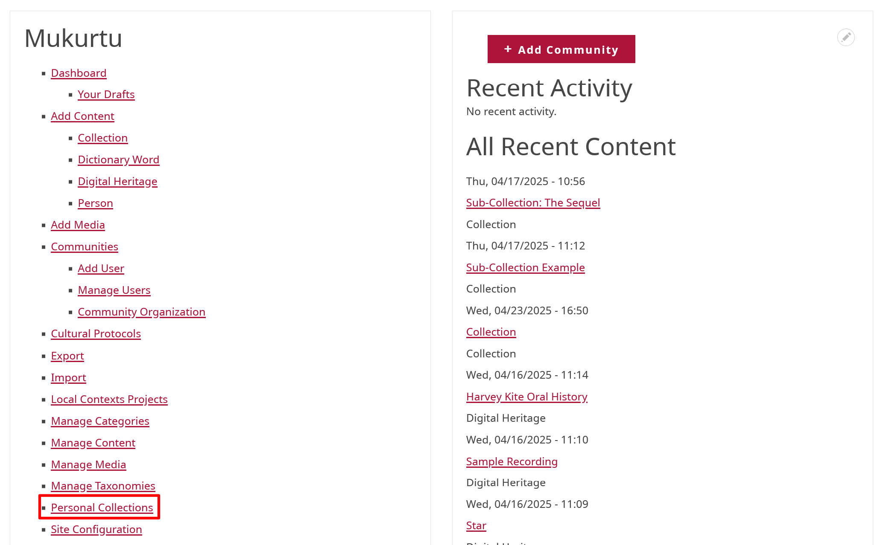
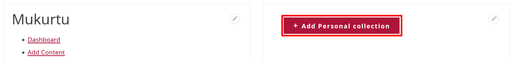
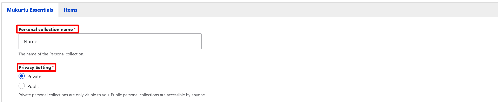
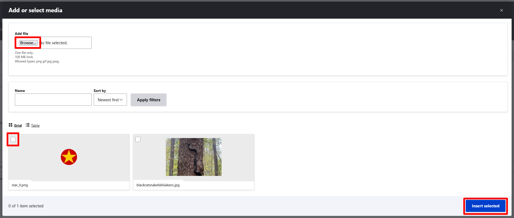
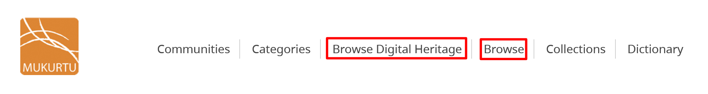
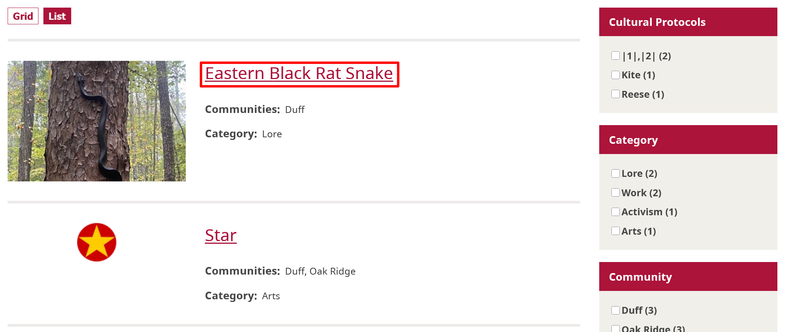
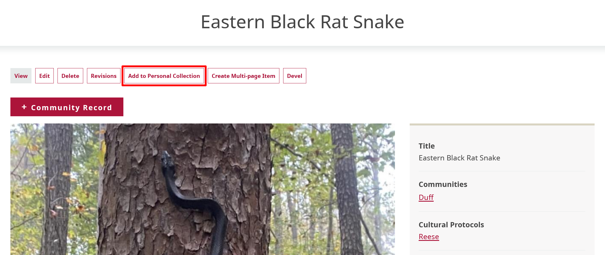

---
tags:
    - collections
    - content
---
# Create and Manage a Personal Collection

!!! roles "User roles"
    Registered Users

Registered Mukurtu CMS users can create and manage personal collections. Personal collections are created and managed through the dashboard or from any content item. Personal collections are useful for consolidating content or organizing it according to your needs. You can designate your personal collections as either public or private by selecting the appropriate sharing setting when creating or editing your collection.

You can create a personal collection from your dashboard or from content. The bulk of this article addresses creating a personal collection from your dashboard. Select the Create a personal collection from content section for instructions.

## Create a new personal collection

1. To create a personal collection, navigate to "Personal Collections" in your dashboard. 

    

2. Select the **Create a new personal collection** dropdown menu. 

    

3. In the *Personal collection name* field, enter a name for your collection.

4. Select a **Privacy Setting**. Personal collections can be either public or private. Private personal collections are only visible to you, while public personal collections are accessible by anyone with the proper cultural protocols.

    

5. Enter a *Summary* and a *Description* for your personal collection. 

6. You may choose to add a thumbnail to your personal collection. Select "Add media" to upload an image or select one from the media library.

    - Browse to insert your image file or select an image from your media library. Select the "Insert selected" button to assign your thumbnail.

    

7. You can select "Save" to save your personal collection at this point, or navigate to the top of the page and select the **Items** tab to add content items.

8. From the **Items** tab, select the "Select Content" button. 

    !!! tip 
        You can filter content by type or search by title.

    - Scroll down and select the checkbox beside the content items you want to add to your personal collection.
   
    - Select "Add Content" to add the items to your personal collection.

    

9. Select "Save".

## Create a personal collection from content

1. Select **Browse** or **Browse Digital Heritage** to navigate to content. 

    

2. Select the content you want to add to your personal collection.

    

3. Select the "Add to personal collection" button from the menu bar of the content.

    

4. The remaining steps are the same as creating a new personal collection from your dashboard. 

## Manage a personal collection

To manage a personal collection, navigate to "Personal Collections" through the dashboard. 

1. Select the collection you want to manage.

2. Select "Edit" at the top of the collection. 

    **ADD A SCREENSHOT HERE**

3. Either edit the personal collection information in the **Mukurtu Essentials** tab or add new items to the personal collection in the **Items** tab.

4. Select "Save" to save any changes to the personal collection.