---
tags:
    - collections
    - content
---
# Create and Manage a Personal Collection

!!! roles "User role"
    Authenticated user

## Create a personal collection

1. There are three ways to create personal collections: from the dashboard, while browsing, or on the fly from any content page.

    - To create a personal collection from your dashboard, navigate to "Personal Collections" in your dashboard. 

    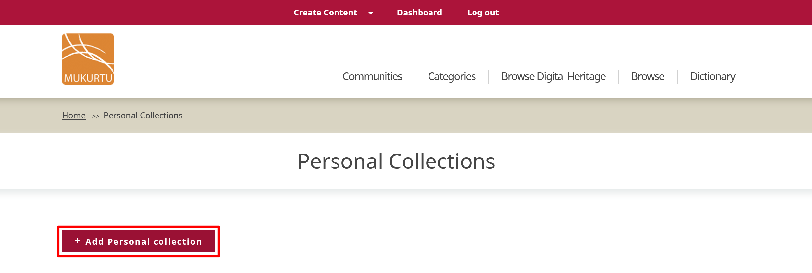

    - To create a personal collection while browsing, select the quick action kebab menu, then select **Add to Personal Collection** from the dropdown.

    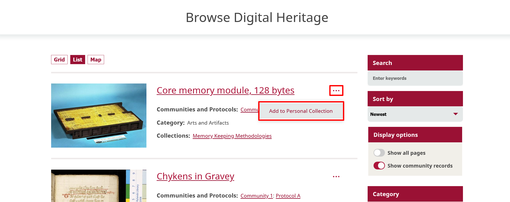

    - To create a personal collection from content, select **Browse** or **Browse Digital Heritage** to navigate to content. 

        - Select the content you want to add to your personal collection.
        - Select the "Add to personal collection" button from the menu bar of the content.

    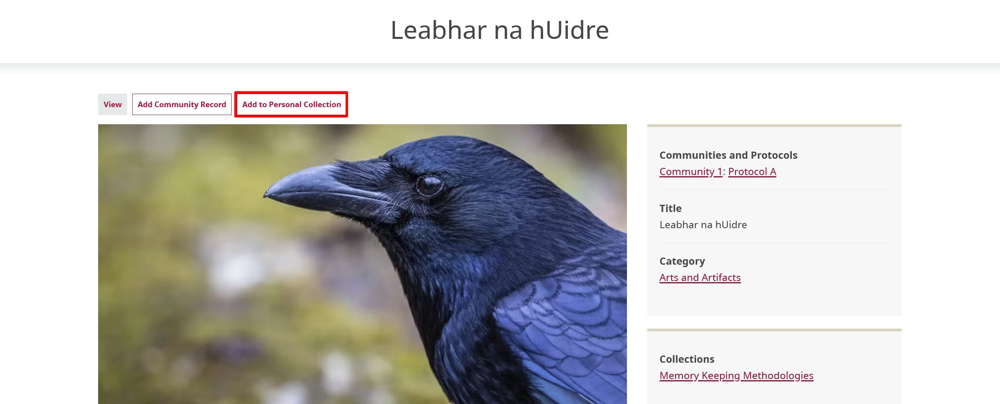

    The remaining steps are the same as creating a new personal collection from your dashboard. 

2. Select the **Create a new personal collection** dropdown menu. 

    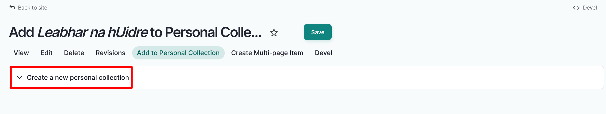

3. In the *Personal collection name* field, enter a name for your collection.
4. Select a **Privacy Setting**. Personal collections can be either public or private. Private personal collections are only visible to you, while public personal collections are accessible by anyone. Privacy settings do not override assigned cultural protocols. Any items under strict protocols are only accesible to protocol members.

    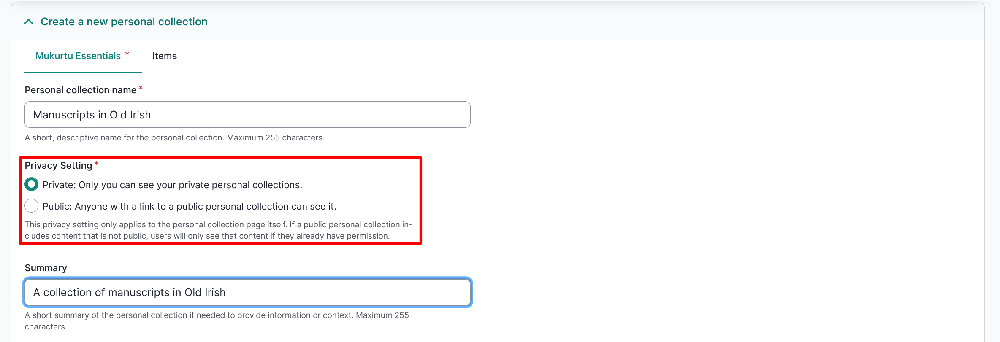

5. Enter a *Summary* and a *Description* for your personal collection. 
6. You may choose to add a thumbnail to your personal collection. Select "Add media" to upload an image or select one from the media library. For instructions on how to add a thumbnail image, refer to the [Upload Media Assets: Image](../media/ByTypeMediaUpload/Image.md) article. 

    !!! tip
        You may choose to add a summary, description, and thumbnail to your personal collection. These are helpful for keeping multiple private personal collections organized. If your personal collections are public these fields can help other users browse your personal collection.

7. Select "Save" to save your personal collection at this point, or navigate to the top of the page and select the **Items** tab to add content.

    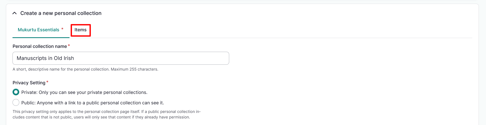

8. From the **Items** tab, select the "Select Content" button. 

    !!! tip 
        You can filter content by type or search by title.

    - Scroll down and select the checkbox beside the content you want to add to your personal collection.
    - Select "Add Content" to add the content to your personal collection.

    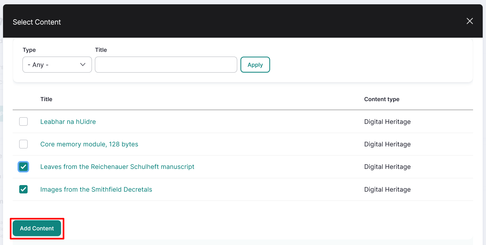

9. Select "Save".

## Manage a personal collection

To manage a personal collection, navigate to "Personal Collections" through the dashboard. 

1. Select the collection you want to manage.
2. Select "Edit" at the top of the collection. 

    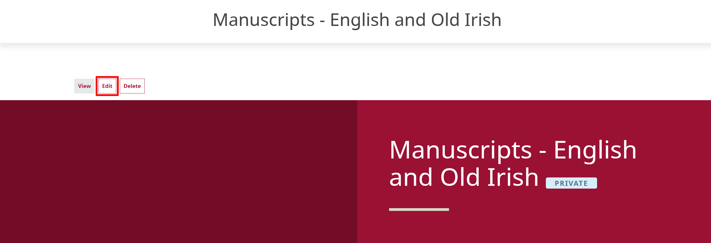

3. Either edit the personal collection information in the **Mukurtu Essentials** tab or add new items to the personal collection in the **Items** tab.
4. Select "Save" to save any changes to the personal collection.

## Add content to a personal collection

- To add content to a personal collection while browsing, select the quick action kebab menu, then select **Add to Personal Collection** from the dropdown. Then select your personal collection from the dropdown menu in the modal.

    

    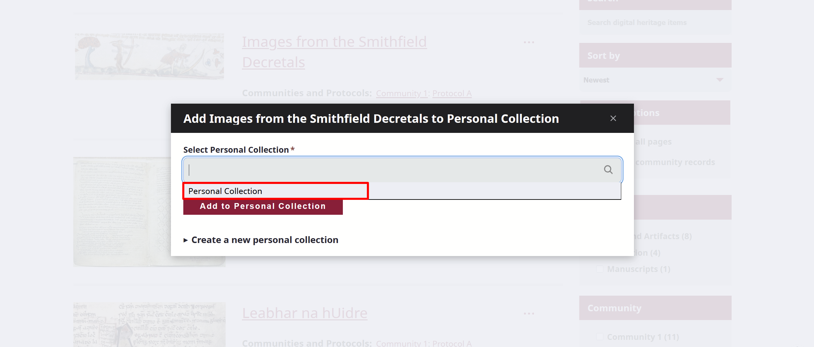

- To add content to a personal collection from content, select **Browse** or **Browse Digital Heritage** to navigate to content. 

    - Select the content you want to add to your personal collection.
    - Select the "Add to personal collection" button from the menu bar of the content.

    

## Browse a personal collection

There are three different views that can be used to browse a personal collection: List, Grid, and Map view. The map view aggregates all of the map points data from any content in the personal collection and displays it on the map. 

List View:

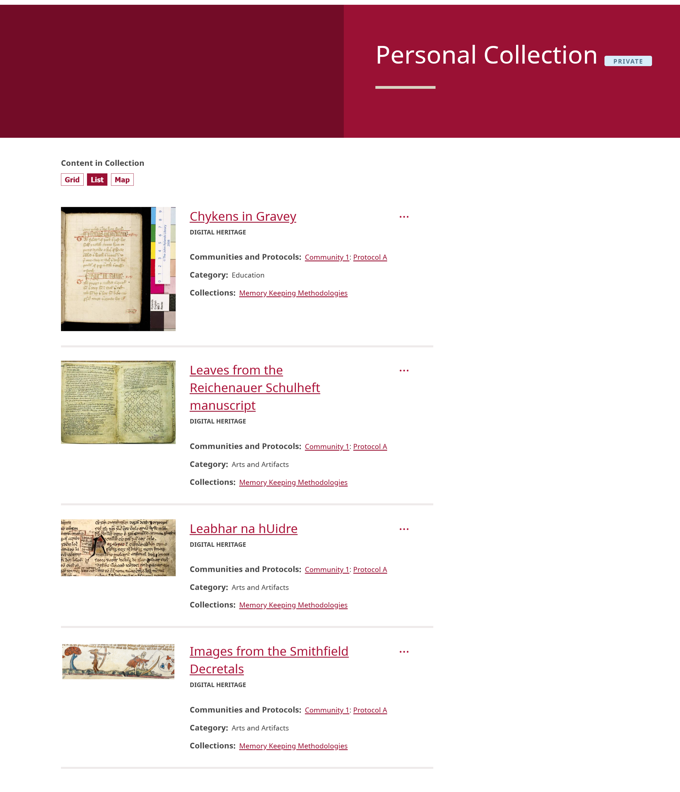

Grid View:

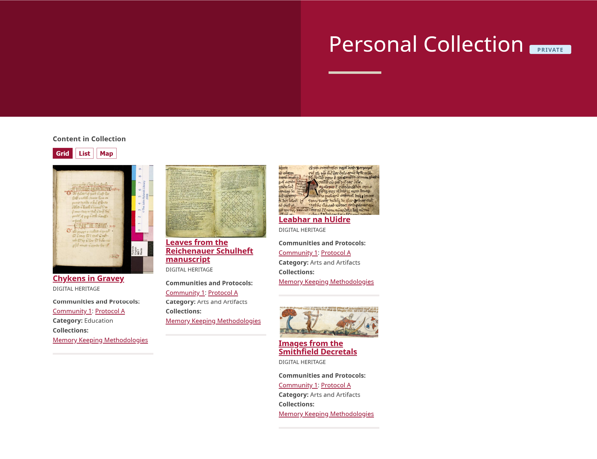

Map View: 

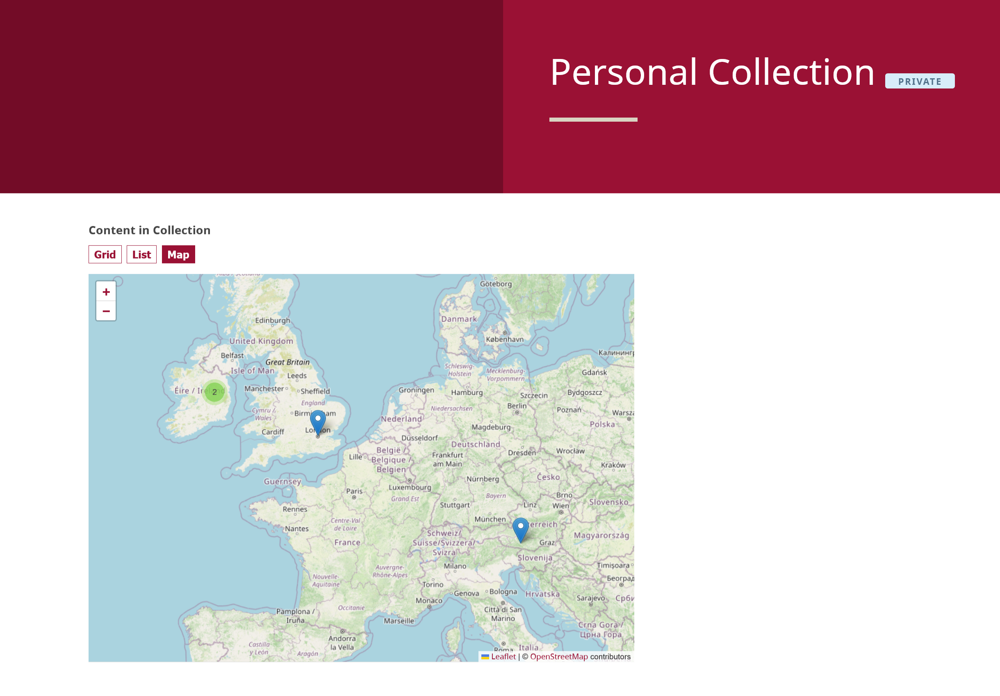