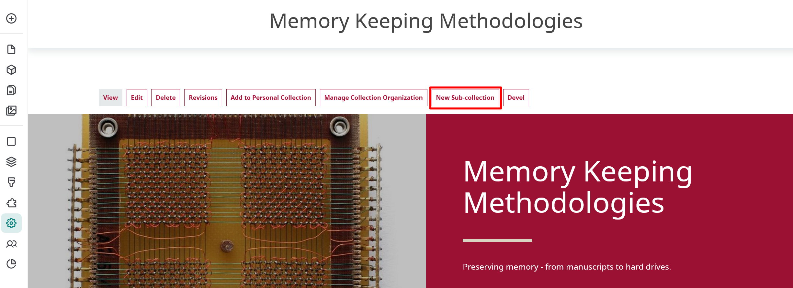
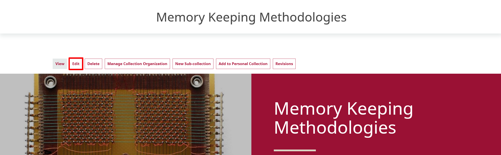
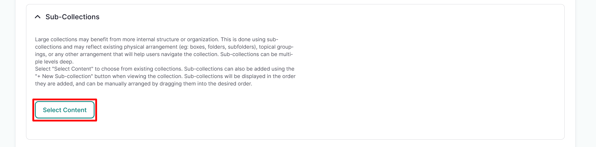
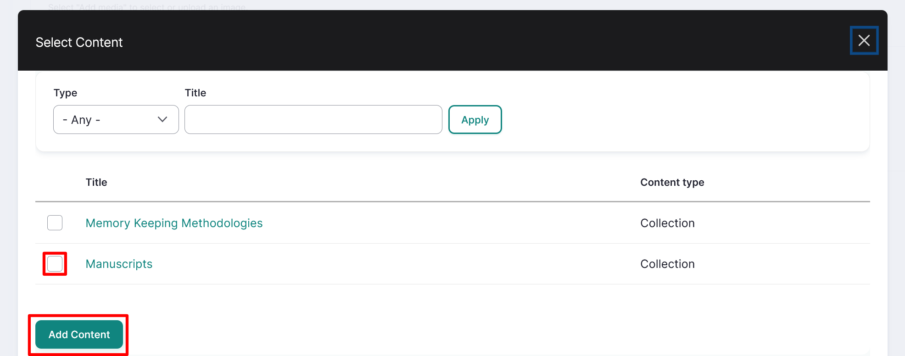
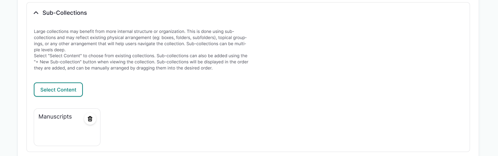
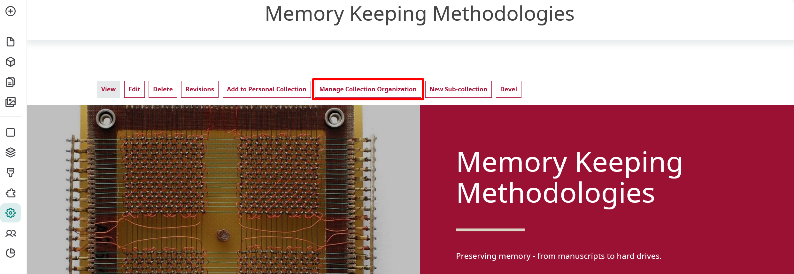
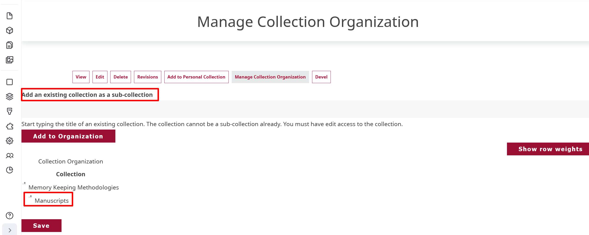

# Sub-collection Organization

!!! roles "User roles" 
    Protocol steward, curator

Collections can be extended by including sub-collections. These can provide more internal structure or organization and reflect may existing physical arrangement (eg: boxes, folders, subfolders), topical groupings, or any other arrangement that will help users navigate the collection. Sub-collections can be multiple levels deep.

Sub-collections include all the same fields as a regular collection, and can have different cultural protocols than their parent collection. 

There are two ways to create a sub-collection:

- By creating a new sub-collection from the top level collection page after the top level collection is saved.
- By assigning an existing collection as a sub-collection within the top level collection. This is useful if you already have existing collections and later want to rearrange them, or you accidentally created a collection that should have been a sub-collection.

## New sub-collection

You can create a new sub-collection from a top level collection page.

1. Select the "New Sub-collection" button at the top of the top level collection page.

    

2. Create your sub-collection by going through the same processes you used to create your top level collection. Those instructions are found in the [Create a Collection](CreateCollection.md) article.

## Assign existing sub-collection

There are two different ways to assign an existing collection as a sub-collection. These are completed from the top level collection page. You can assign a sub-collection by editing the top level collection or by selecting the "Manage Collection Organization" button. 

### From "Edit" 

1. From the top level collection page, select "Edit".

    
 
2. Scroll to the **Sub-collections** field, then select the "Select Content" button.

    

3. Select any collections you want to assign as a sub-collection by selecting the checkbox beside the collection, then select "Add Content". 

    

4. Check to make sure your sub-collection was properly assigned. Then select the "Save" button at the top of the page to save your sub-collection.

    !!! tip
        Select the "Remove" button if you need to remove a sub-collection.

    

### From "Manage Collection Organization" 

1. From the top level collection page, select "Manage Collection Organization".

    

2. Start typing the sub-collection name in the text box to bring up a list of your existing sub-collections. Select the sub-collection you want to assign, then select "Add to Organization".
3. Your new sub-collection will populate under Collection. You must click and drag it under the top-level collection to assign it as a subcollection.

    !!! warning
        You must select and drag the sub-collection under the parent collection before saving for it to be assigned as a sub-collection.

    

4. Select "Save" to save your collection organization. 

    !!! tip 
        This is also how you create sub-collections for personal collections.