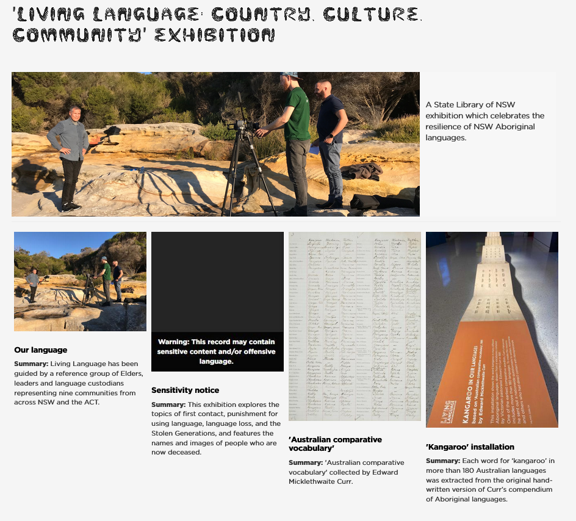
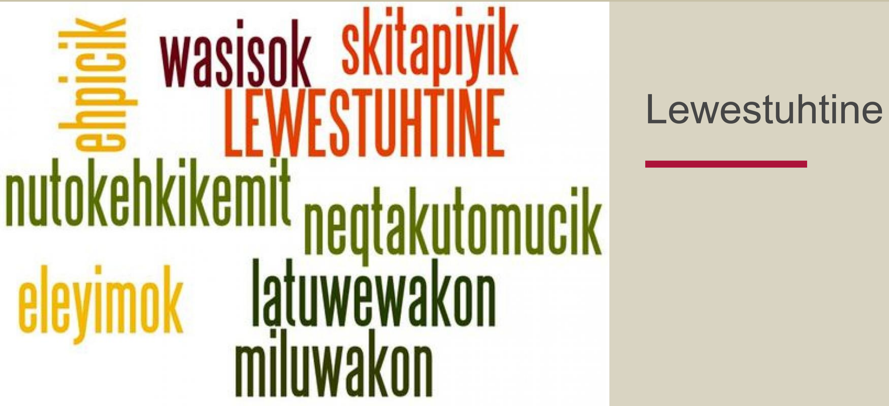
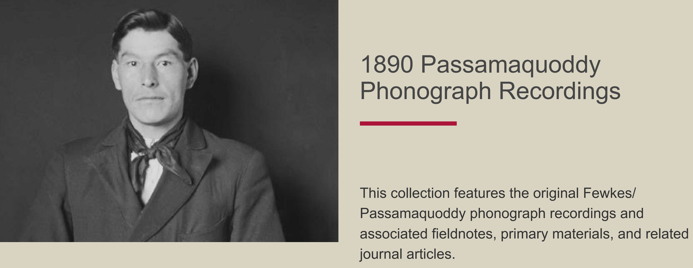
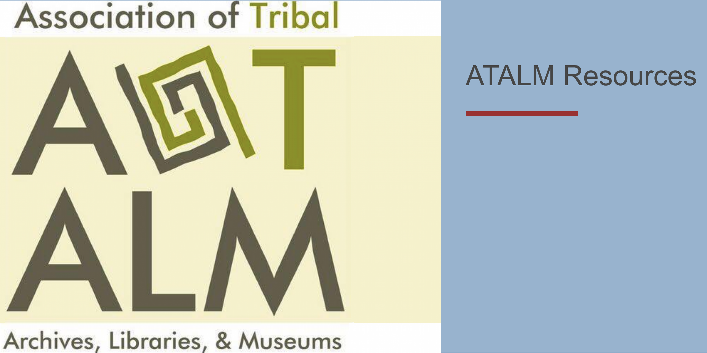

# Understanding Collections

!!! roles "User roles" 
    Protocol steward, curator, authenticated user

There are two types of collections in Mukurtu: personal collections and collections curated by protocol stewards and curators. The bulk of this article addresses administrator curated collections. For more information on personal collections, please navigate to the Personal Collections subheading in this article or visit [Create and Manage a Personal Collection](PersonalCollection.md).

## Collections 

The default browse view in Mukurtu sorts content by the most recently updated, which may not be the way communities prefer to organize some content. To provide context or connections for some items or groups of items, communities may choose to use Mukurtu's Collections feature. Collections are a useful feature that help protocol stewards and curators arrange content in ways that help provide a more comprehensive context for that content. The creator of the collection determines the way the collection is arranged, including the order in which content is displayed. Users only see those items they have access to based on their cultural protocols. Collections provide users with a more curated or guided experience of the site's content.

There are many ways to use the collections feature. Some communities use it to create digital exhibits, such as Gather's [Living Language: Country, Culture, Community Exhibition](https://gather.sl.nsw.gov.au/collection/living-language-country-culture-community-exhibition).

Some communities use it to format educational resources and provide access to lesson plans and materials, such as the Passamaquoddy People's [Lewestuhtine collection](https://passamaquoddypeople.com/collection/lewestuhtine). 

The Passamaquoddy People also used the collections feature to provide structure and context for the [1890 Passamaquoddy Phonograph Recordings](https://passamaquoddypeople.com/collection/1890-passamaquoddy-phonograph-recordings), which feature the digitized phonograph recordings as well as associated field notes and related journal articles.

Another example of how collections have been used is from the Sustainable Heritage Network, who used the collections feature to provide consolidated access to resources from the [Association of Tribal Archives, Libraries, and Museums (ATALM)](https://sustainableheritagenetwork.org/collection/atalm-resources) including full sessions, short video tutorials, presentations, and speeches from the 2014-2019 ATALM Annual Conferences.

## Personal collections

All users can create and manage their own personal collections. Personal collections have several uses, such as saving content so you can easily find it again later, or curating a list of resources to share with students or colleagues.

Personal collections share most of same features as regular collections - adding, removing, and rearranging content, and using sub-collections. Instead of the regular cultural protocols, personal collection pages can either be kept private, or you can make a personal collection page public to share with others.

## Sub-collections

Collections and personal collections can both be extended by adding sub-collections, which work like sub-folders and provide a hierarchical structure to further arrange content within the collection. Sub-collections include all the same fields as a regular collection, and can have different cultural protocols than their parent collection. 