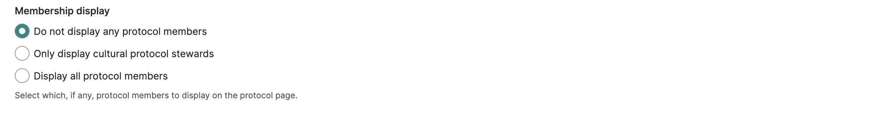

---
tags:
    - communities, cultural protocols, and categories
---
# Create a Community and Initial Cultural Protocol

!!! User roles 
    Mukurtu manager

In Mukurtu 4, creating a new community will automatically prompt you to create a cultural protocol for that community. This article walks you through that initial setup. 

## Create a community

1. As a Mukurtu manager, from the dashboard, select **Add a Community**

    

2. Enter a *community name* and *description*. You can use the *description* field to introduce your community, share background and history, information about who to contact with questions, and any other information you would like visitors to know. 

    

3. In the *community page visibility field*, select **Community Only** or **Public**: 

    - **Community Only** limits community page access to community members only.
    - **Public** allows public access to the community page.

    

    !!! Note
        If community page visibility is set to "community only", and that community includes an open protocol, visitors will be able to see the community name, although they won't be able to access the community page itself. Unless that difference in access between the community and protocol pages is something you intentionally want, we recommend setting the community page visibility to "public" if it includes any open protocols.  

4. Select the *membership display setting*. Choose one of: 

    - **Do not display any community members** does not display any community members on the community page.
    - **Only display community managers** displays community managers and not community members on the community page.
    - **Display all community members** displays all members on the community page.

    

At this point, you have the option to add community members and assign user roles. If you are currently unsure about role assignments, or you have not yet created the necessary user accounts, you can select "Save" at the top of the page and manage the community membership later. If you do this, you will not be able to add protocol members on the next page, as protocols are populated using the community membership. Group memberships can be edited at any time from their respective manage pages. See [Manage Community Members](../communities-cultural-protocols-categories/ManageCommunityMembershipAndRoles.md) and [Manage Protocol Members](../communities-cultural-protocols-categories/ManageProtocolMembershipandRoles.md) for more information.

!!! tip
    Only site users with the active status can be added to a community. Blocked or pending users cannot be added from this form.

### Add community members and assign roles  

Under Community Members, the role descriptions section describes community roles. It is there for reference while adding community members. You can collapse or expand it as needed.

1. To add new members, use the search bar to search for users. All active users will display, and username will auto-filter as you type. 

    

2. Select the user you want to add, and select "Add" to the right of the search bar. The user will appear in the table below. Repeat steps 1 and 2 to add additional members.

    

3. Select one or more user roles to for each new member by selecting the corresponding checkboxes. Select "Remove" to remove users from the group. 

    By default, the user that creates the community will be added to the community and assigned the community manager role. The community manager role cannot be removed from the creator in this form.

    

    !!! requirement
        All users must be assigned at least one community role or the form will not save.

4. When you're finished, select "Save" at the top of the page 

## Create a protocol

Once you have created a community, you will be directed to create a cultural protocol for that community. Every community must have at least one cultural protocol. 

1. Name your cultural protocol. It's helpful to name the community associated with this protocol and indicate the type of access provided. For example, public collections at the Washington State University Library Manuscripts, Archives and Special Collections (WSU-MASC) might use the protocol, WSU-MASC Public.

2.  Under *Protocol Type*, select **strict** or **open**.

    - **Strict**: Items under strict protocol are only visible to logged in protocol members. The protocol page will not be visible to the public.
    - **Open**: Items under open protocol are accessible to all visitors, including those without user accounts.

!!! Note
    If community page visibility is set to "community only", and that community includes an open protocol, visitors will be able to see the community name, although they won't be able to access the community page itself. Unless that difference in access between the community and protocol pages is something you intentionally want, we recommend setting the community page visibility to "public" if it includes any open protocols.

3. Add an optional description. Descriptions display on the protocol page and may include information about the purpose of the protocol, the type of content under this protocol, and who to contact if you have questions.

    

4. Select the *membership display* setting. Choose from one of: 

    - **Do not display any protocol members** does not display any community members on the community page.
    - **Only display procotol stewards** displays community managers and not community members on the community page.
    - **Display all protocol members** displays all members on the community page.

    

    At this point, if you have added community members in the previous form, you can add some or all of them to this protocol and assign protocol roles. If you do not have community members yet, or are currently unsure of role assignments, you can skip this step and manage protocol membership later. See [Manage Protocol Members](../communities-cultural-protocols-categories/ManageProtocolMembershipandRoles.md) for instructions.

    In the Protocol Members section, you can collapse and expand protocol role descriptions, which are there for reference as you add new members:

    

    !!! Requirement
        Users must be a member of the protocol's parent community before they can be enrolled in the protocol.

    !!! tip
        For more in-depth information about user roles, see [User Role Types](../users/user-role-types.md)

### Add protocol members and assign roles
    
5. To add new members, use the search bar to search for users. The community members that were added on the previous form will display, and options will narrow as you type. 

    

6. Select the user you want to add, and select "Add" to the right of the search bar. The user will appear in the table below. Repeat steps 1 and 2 to add additional members.

    

7. Select one or more user roles to for each new member by selecting the corresponding checkboxes. Select "Remove" to remove users from the group. 

    

    !!! requirement
        All users must be assigned at least one protocol role or the form will not save.
        
    By default, the user that creates the protocol will be added to the protocol and assigned the protocol steward role. The protocol steward role cannot be removed from the creator in this form.

8. Select either "Save and Create Another Protocol" if you have additional protocols to add, or "Save" if you are done. You can always add additional protocols later. These buttons are sticky at the top of the page.

    - "Save and create another protocol" generates a fresh form with a confirmation message.
    - "Save" takes you to the manage community page with a confirmation message.

    

This is the manage community page with the confirmation message displayed. From this page you can edit your community, manage membership, manage the look and feel of the page, add cultural protocols, and manage Local Contexts labels and notices. Equivalent pages also exist for protocols. They allow for similar management by protocol stewards.
 
 

This is the community page. It will be visible to community members. If it is a public page, it will be visible to all site visitors. 

