---
tags:
    - communities, cultural protocols, and categories
---

# Create a Cultural Protocol

!!! roles "User Roles"
    Community Manager 

There are several ways to create a new cultural protocol. A separate article discusses [creating a community and initial cultural protocol](CreateACommunityAndInitialCulturalProtocol.md).

This article covers two other methods for creating a cultural protocol: from the dashboard, and from a community page.

## Create a cultural protocol from the dashboard

1. As a community manager, from the Mukurtu Dashboard, select **Add a cultural protocol**

     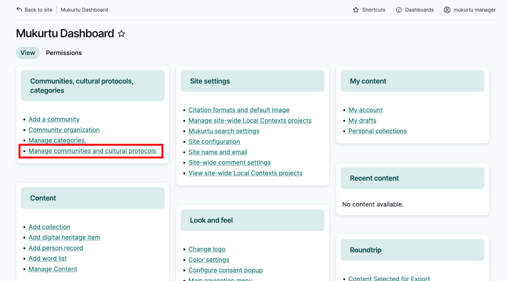 

2. Name your protocol. It's helpful to name the community associated with this protocol and indicate type of access provided. For example, public collections at the Washington State University Library Manuscripts, Archives and Special Collections (WSU-MASC) might use the protocol, WSU-MASC Public.

    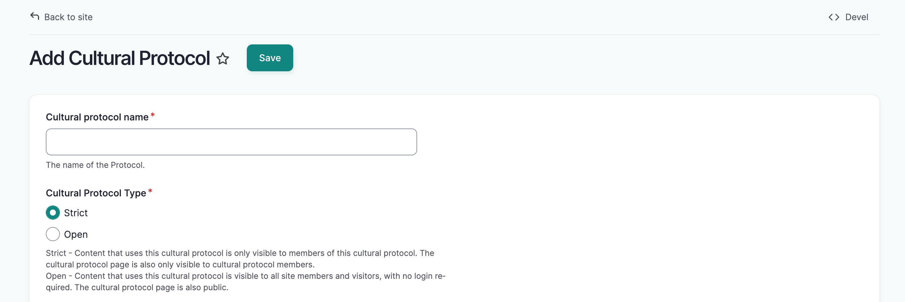 

3. Select a cultural protocol type. Cultural protocol types determine who can access the protocol page and items under this protocol.

    - **Strict**: Items under strict protocol will only be visible to logged in protocol members. The protocol page will not be visible to the public.

    - **Open**: Items under open protocol are accessible to all visitors, including those without user accounts.

    !!! Note
        If community page visibility is set to "community only", and that community includes an open protocol, visitors will be able to see the community name, although they won't be able to access the community page itself. Unless that difference in access between the community and protocol pages is something you intentionally want, we recommend setting the community page visibility to "public" if it includes any open protocols. 

4. Select "Select Communities." A window will open that lists all communities of which you are a community manager. Select each community you wish to add, and select "Add communities."

    It's possible that related families, villages, clans, or other communities might want to keep their communities distinct and manage access to certain shared pieces of content with the same set of protocols. This is done by adding multiple communities to a protocol. To learn more about shared protocols, see [Understanding Shared Protocols](../communities-cultural-protocols-categories/SharedProtocols.md)

    !!! Requirement
        You must be a community manager in every community you wish to add.

    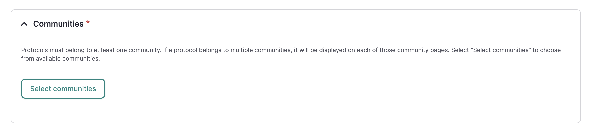 

    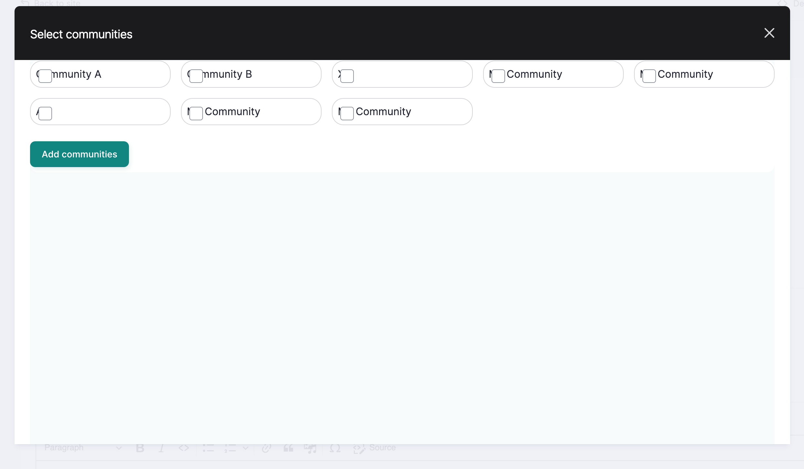 

5. Add an optional description. Descriptions display on the protocol page and may include information about the purpose of the protocol, the type of content under this protocol, and who to contact if you have qustions.

    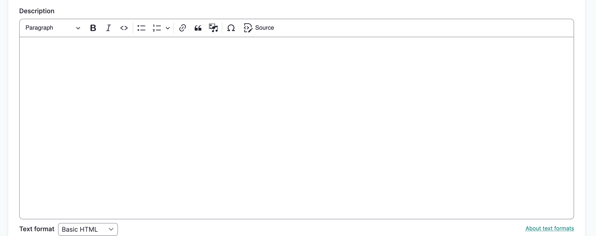   

6. Select the *membership display setting*. Choose from one of: 

    - **Do not display** does not display any protocol members on the protocol page.
    - **Display protocol stewards** displays protocol stewards and not protocol members on the community page.
    - **Display all members** displays all members on the protocol page.

    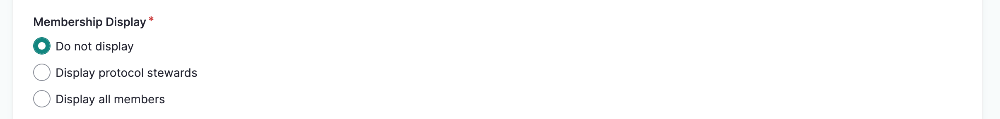

    At this point you can add community members to the new protocol. Protocol role descriptions are availble and can be expanded as a reference. 

    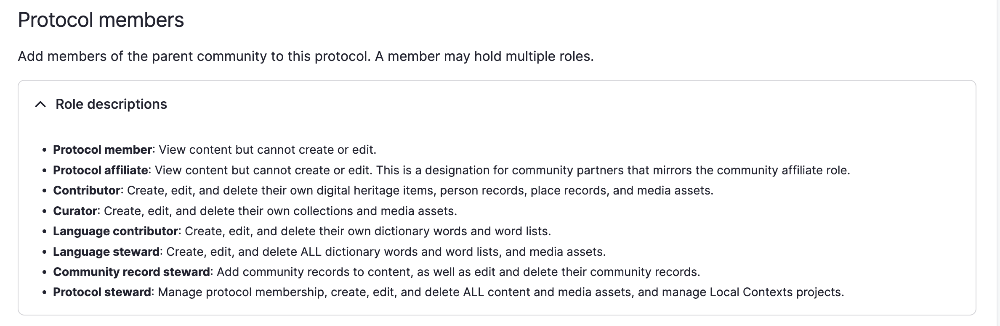

    In order of increasing responsibility, protocol user roles are: 

    - **Protocol members** can view content but cannot add or edit.
    - **Protocol affiliates** can view content but cannot add or edit. This is a designation for community partners that mirrors the community affiliate role.
    - **Contributors** can create, edit and delete their own digital heritage items, person records and media assets.
    - **Curators** can create, edit and delete their own collections and upload media assets. 
    - **Community record stewards** can add community records to content, as well as edit and delete them.
    - **Language contributors** can add, edit and delete their own dictionary words and word lists.
    - **Language stewards** can add, edit and delete ALL dictonary words and word lists and also add media assets.
    - **Protocol stewards** can manage protocol membership, add edit and delete all content and media assets, manage the look and feel of the protocol page, and manage Local Contexts labels and notices.

7. To add new members, use the search bar to search for users. Existing community members will display, and options will narrow as you type. 

8. Select the user you want to add, and select "Add" to the right of the search bar. The user will appear in the table below. Repeat steps 1 and 2 to add additional members.

    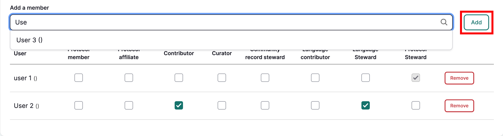

9. Select one or more user roles to for each new member by selecting the corresponding checkboxes. Select "Remove" to remove users from the group. 

    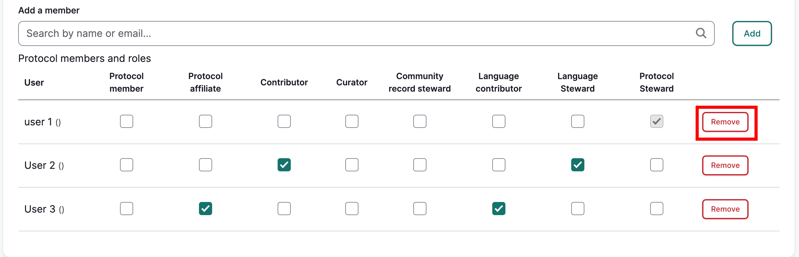

    !!! requirement
        All users must be assigned at least one protocol role or the form will not save.
        
    By default, the user that creates the protocol will be added to the protocol and assigned the protocol steward role. The protocol steward role cannot be removed from the creator in this form.

10. When you are finished, select "Save and create another protocol" to generate a fresh form, or "Save" to return to the community page.

11. The community page will load with a success message. 

    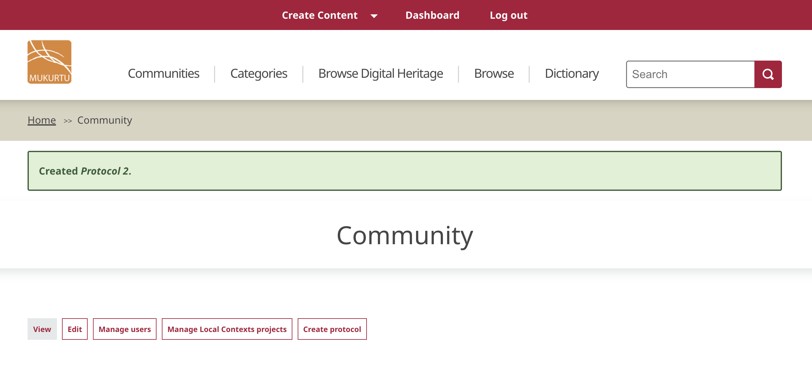

## Create a cultural protocol from a community page

!!! roles "User Roles"
    Community Manager

1. To add a protocol through an existing community, navigate to that community's page. 

    You can view community pages by selecting **Communities** in the main menu.
    
    Select the appropriate community, then select **Create Protocol**.

    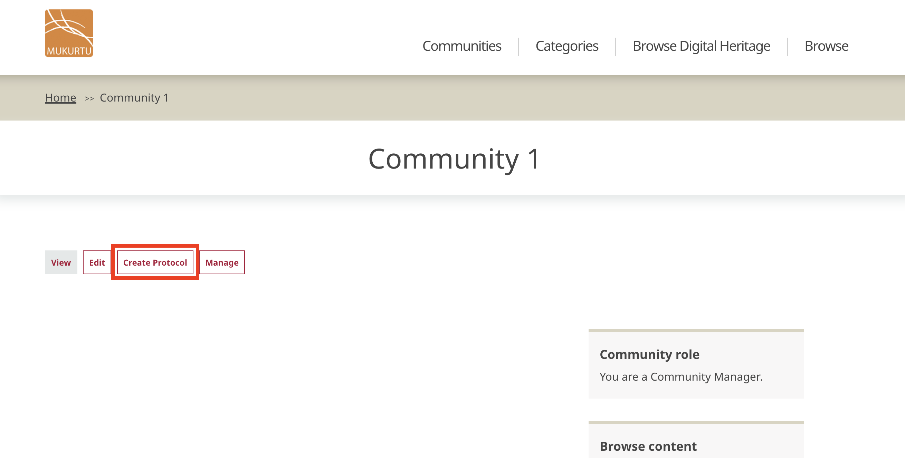

2. Add a *protocol name*, and select a *protocol type* by selecting one of:

    - **Strict**: Items under strict protocol are only visible to logged in protocol members. The protocol page will not be visible to the public.
    - **Open**: Items under open protocol are accessible to all visitors, including those without user accounts.

    !!! Note
        If community page visibility is set to "community only", and that community includes an open protocol, visitors will be able to see the community name, although they won't be able to access the community page itself. Unless that difference in access between the community and protocol pages is something you intentionally want, we recommend setting the community page visibility to "public" if it includes any open protocols.

    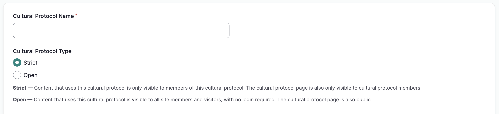

3. By default, the protocol belongs to the community through which the create protocol form was accessed. Additional communities can also be added to create a shared protocol. See [Understanding Shared Protocols](../communities-cultural-protocols-categories/SharedProtocols.md) for more information.

    !!! Requirement
        You must be a community manager in every community you wish to add.

4. Select "Select Communities." A window will open that lists all communities of which you are a community manager. Select each community you wish to add, and select "Add communities."

    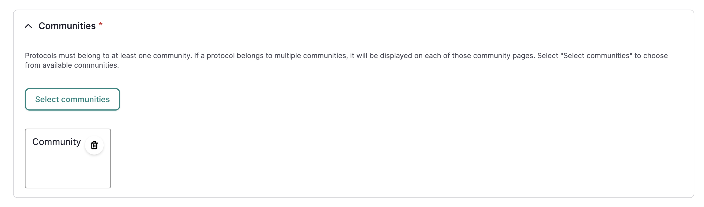 

     

4. Add an optional description. Descriptions display on the protocol page and may include information about the purpose of the protocol, the type of content under this protocol, and who to contact if you have qustions.

5. Select the *membership display setting*. Choose from one of: 

    - **Do not display any protocol members** does not display any protocol members on the protocol page.
    - **Only display cultural protocol stewards** displays protocol stewards and not protocol members on the protocol page.
    - **Display all protocol members** displays all members on the protocol page.

        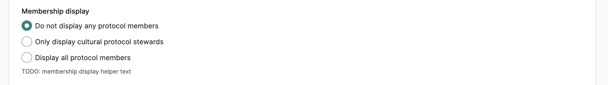

    At this point, you can add protocol members and assign user roles or skip this step and add members at another time. Role descriptions are available in the form for reference.

    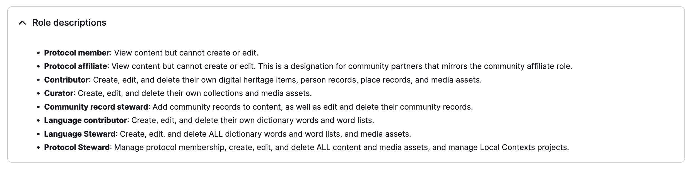

    In order of increasing responsibility, protocol user roles are: 

    - Protocol members can view content but cannot add or edit.
    - Protocol affiliates can view content but cannot add or edit. This is a designation for community partners that mirrors the community affiliate role.
    - Contributors can create, edit and delete their own digital heritage items, person records and media assets.
    - Curators can create, edit and delete their own collections and upload media assets. 
    - Community record stewards can add community records to content, as well as edit and delete them.
    - Language contributors can add, edit and delete their own dictionary words and word lists.
    - Language stewards can add, edit and delete ALL dictonary words and word lists and also add media assets.
    - Protocol stewards can manage protocol membership, add edit and delete all content and media assets, manage the look and feel of the protocol page, and manage Local Contexts labels and notices.

    !!!Tip
        See [User Roles](../users/user-role-types.md) for more detail on protocol user roles.

6. To add new members, use the search bar to search for users. Existing community members will display, and options will narrow as you type. 

7. Select the user you want to add, and select "Add" to the right of the search bar. The user will appear in the table below. Repeat to add additional members.

    

8. Select one or more user roles to for each new member by selecting the corresponding checkboxes. Select "Remove" to remove users from the group. 

    

    !!! requirement
        All users must be assigned at least one protocol role or the form will not save.
        
    By default, the user that creates the protocol will be added to the protocol and assigned the protocol steward role. The protocol steward role cannot be removed from the creator in this form.

9. When you are finished, **Save and create another protocol** to generate a fresh form, or **Save** to return to the community page.

10. The community page will load with a success message. 

    
