---
tags:
    - communities, cultural protocols, and categories
---

# Edit Community Settings

!!! Roles "User role" 
	Community manager

Communities can have a range of settings that can be updated once the community is created. Certain fields and settings are only available after the community has been created. 

## Open the edit form

1. Navigate to the community you wish to edit. Communities can be accessed two ways:

	- From the navigation menu:

	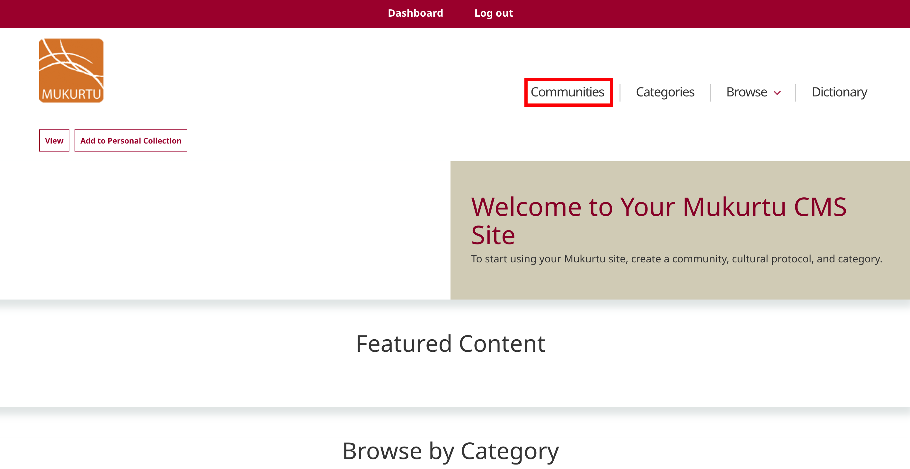

	- From the dashboard:

	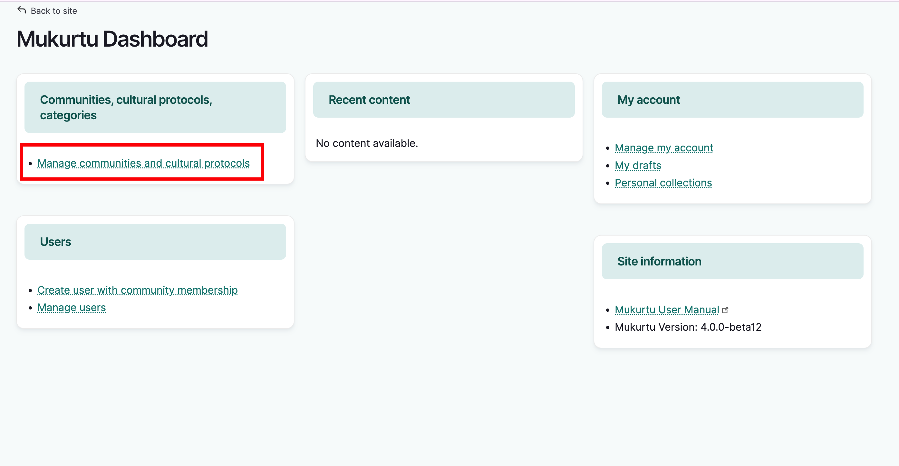

2. From the community menu options, select **edit**. The community form will open with its current settings.

	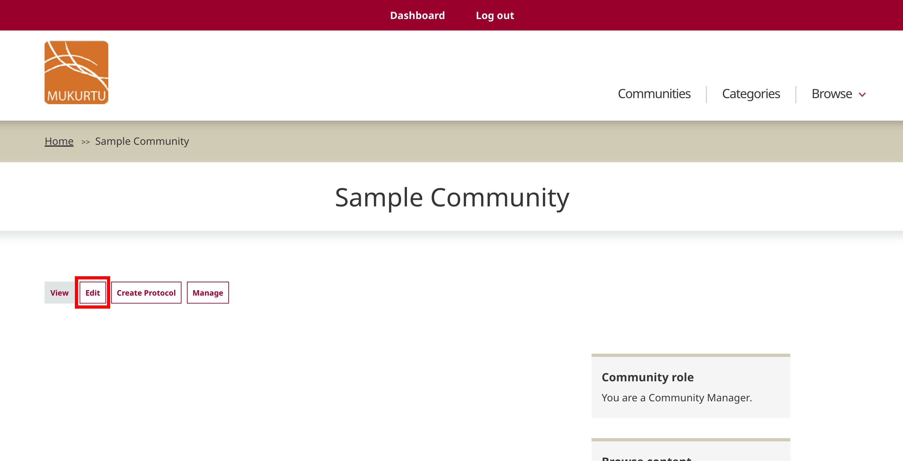

## Community name and description

Edit the *community name* and *description* as needed.

## Local Contexts description

Local Contexts provides labels and notices that are applied to content. These are a combination of graphics and text that communicate standards for respectful interaction with heritage collections and data as dictated by Indigenous communities. If you are using Local Contexts labels for content within this community, you may add or update a description for Local Contexts projects. This will be displayed in the community's Local Contexts directory page. For more on Local Contexts, see [Understanding the Local Contexts Hub](../local-contexts/UnderstandingTheLocalContextsHub.md)

## Community page visibility

You can change the community page visibility by selecting one of: 

- **Community Only** - The community page will only be visible to community members who are logged in.
- **Public** - The page will be visible to the public regardless of login.

## Membership display

Determine which, if any, community members are displayed on the community page by selecting one of:

- **Do not display any community members** does not display any community members on the community page.
- **Only display community managers** displays community managers and not community members on the community page.
- **Display all community members** displays all members on the community page.

## Banner and thumbnail images

Banner and thumbnail images are optional styling elements. Banners appear across the top of a community page. Thumbnails appear on community browse pages and can help to make a community more easily recognizable, especially if there are many communities represented on your site. 

Banners generally maintain a 3:1 ratio which may change depending on screen size. Smaller screens will crop banner images. We recommend minimum dimensions of 1800x600px for best rendering.

Thumbnail images generally maintain a 4:3 ratio. Anything larger than this will be cropped to that size in display. The image files themselves will not be altered. Thumbnails will resize responsively to smaller screen sizes. We recommend minimum dimensions of 800x600px for best rendering.

This is what communities with thumbnails will look like on the community browse page.

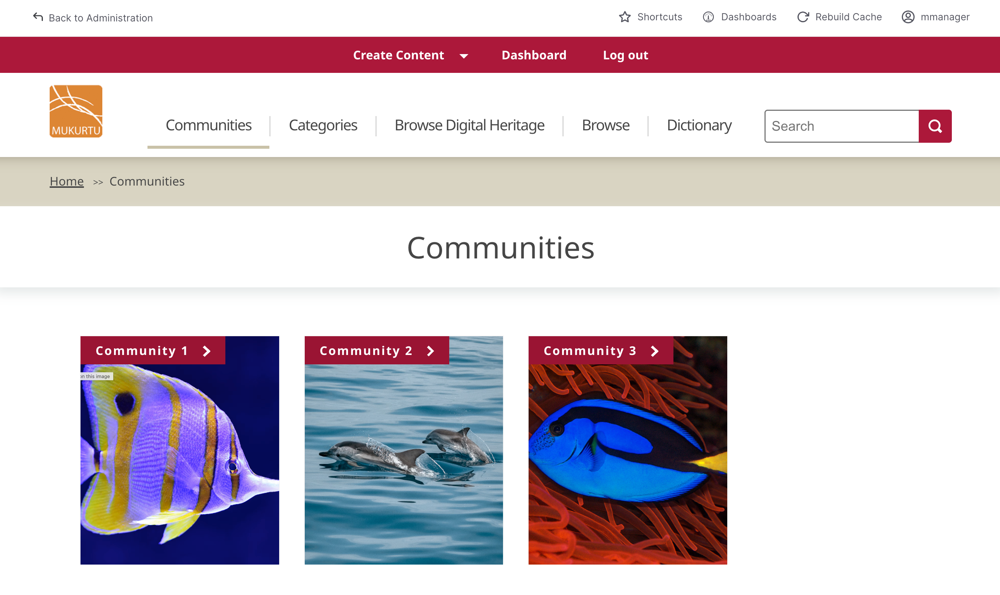

This is what a community page looks like with a banner.

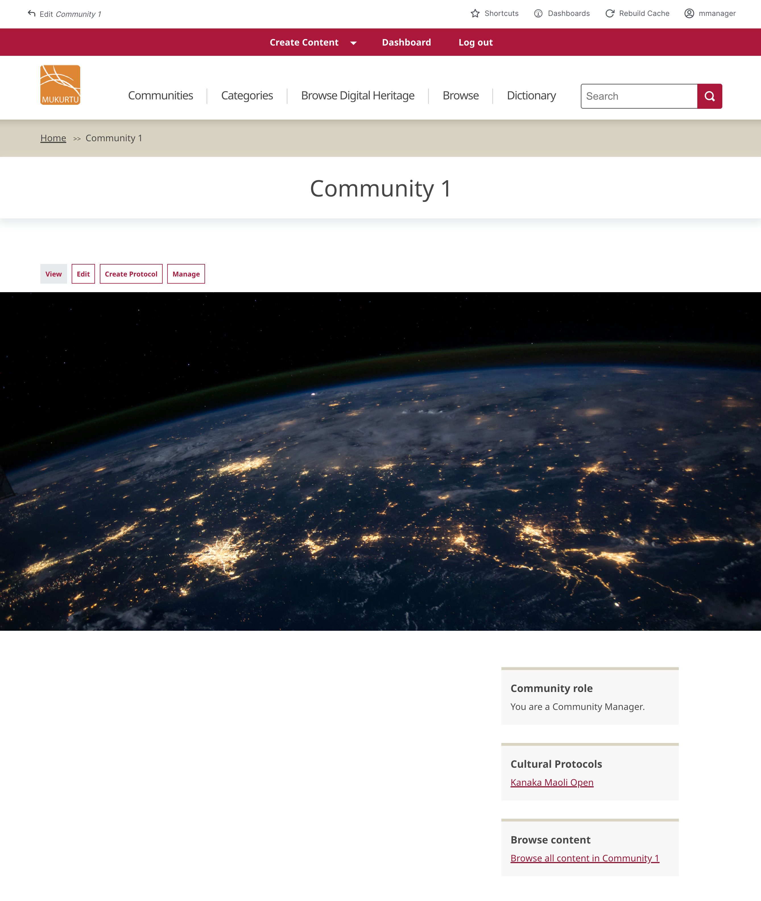

1. Under the image type (banner or thumbnail) you want to add, select "Add media."

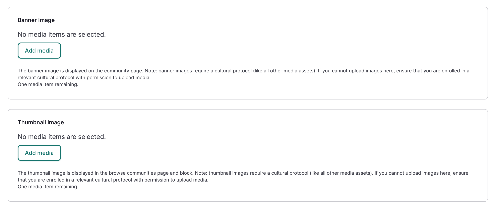

2. Browse for image files on your computer or select existing images. If you cannot upload media, make sure you are a member of a relevant cultural protocol with permission to upload media. 
 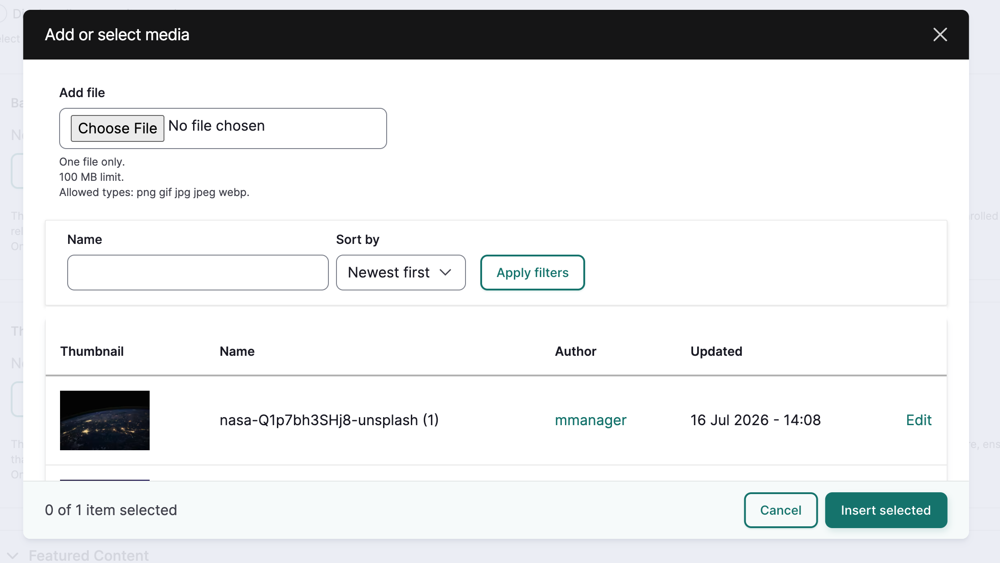

3. Add alt text and protocols to any new images. Make sure you choose protocols that enable visibility to your target audience. 
4. Populate optional fields as needed.
5. Save your changes. Then, with your image selected, select "Insert Selected." 

	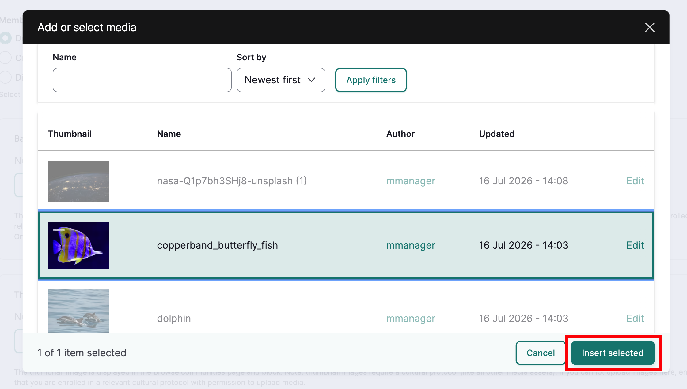

## Featured content

Featured content gives users a preview of selected content contributed by the community. It displays the title and thumbnail of the content on the community page. Custom thumbnails are added by editing the content directly. This may be especially useful for non-image media such as audio and PDFs, which will otherwise display a stock graphic.  

1. Expand *featured content* and select "Select Content." 
2. Use the dropdown menu to narrow your search by content type, and the *search* field to search for specific content.
3. All available content is displayed below the search bar. Check the box next to each piece of content you wish to feature.
4. Select "Add Content."

	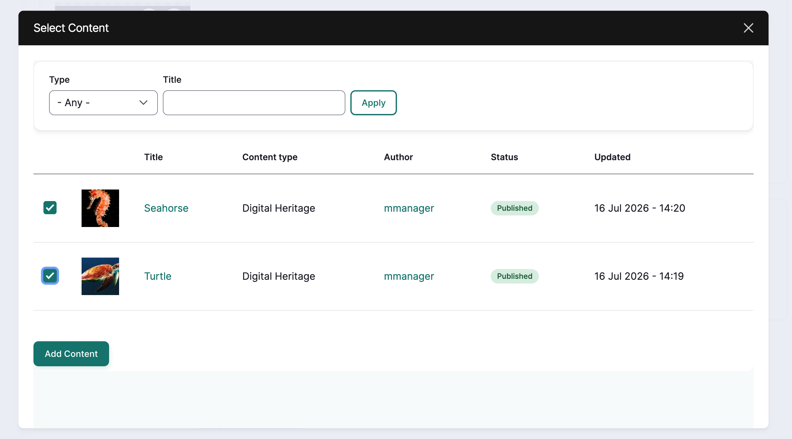

5. Remove featured content by selecting the grey trash can icon on the right of each content item.

	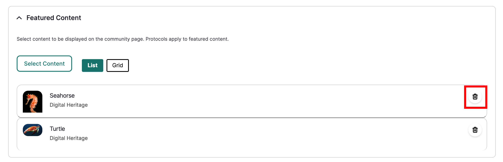

!!! tip
	Protocols still apply to this content and media assets, so make sure to choose content that will be viewable by your target audience.

## Community types

!!! requirement
	A Mukurtu administrator must configure community types before they can be used here. See [Managing Taxonomies](../taxonomies/ManagingTaxonomies.md) for more information.

Community types help to organize the communities on your Mukurtu site. For example, a site might have tribal communities, libraries, and families contributing to a site. These can all be assigned a type for streamlined display and easy browse and search. 

Select the appropriate type for your community. 

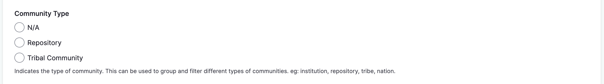

## Save
When your changes are complete, select "Save." You will be taken to your community page and all changes will be displayed.

 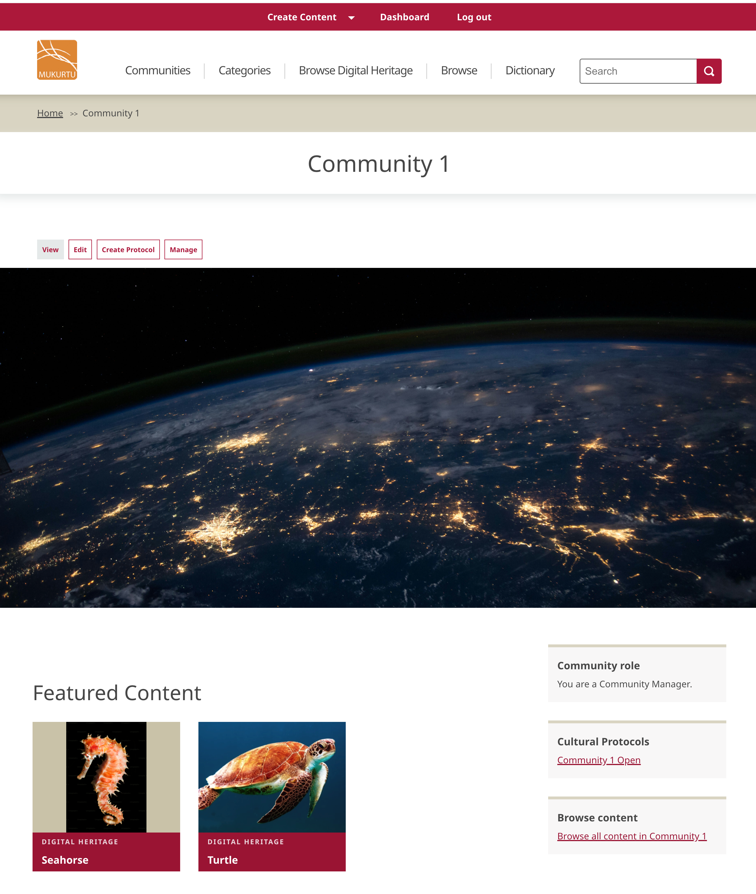

