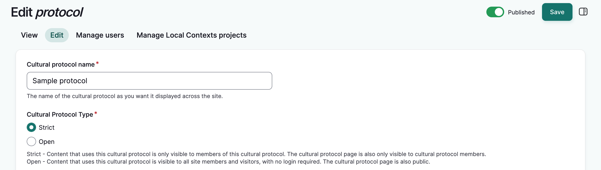
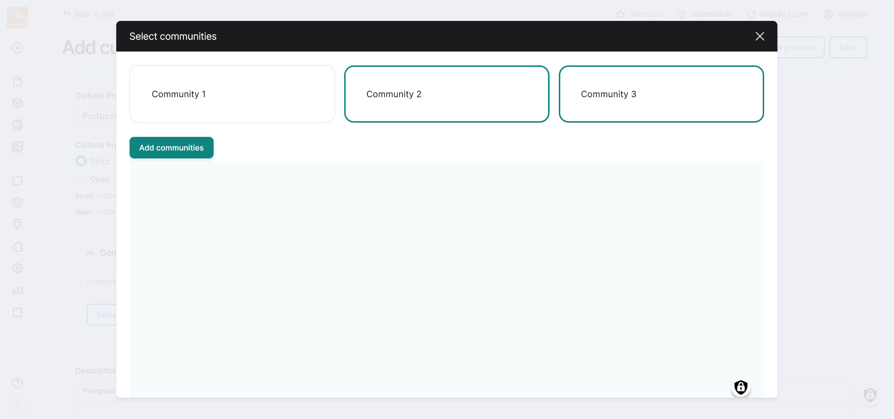
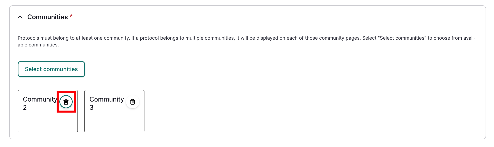
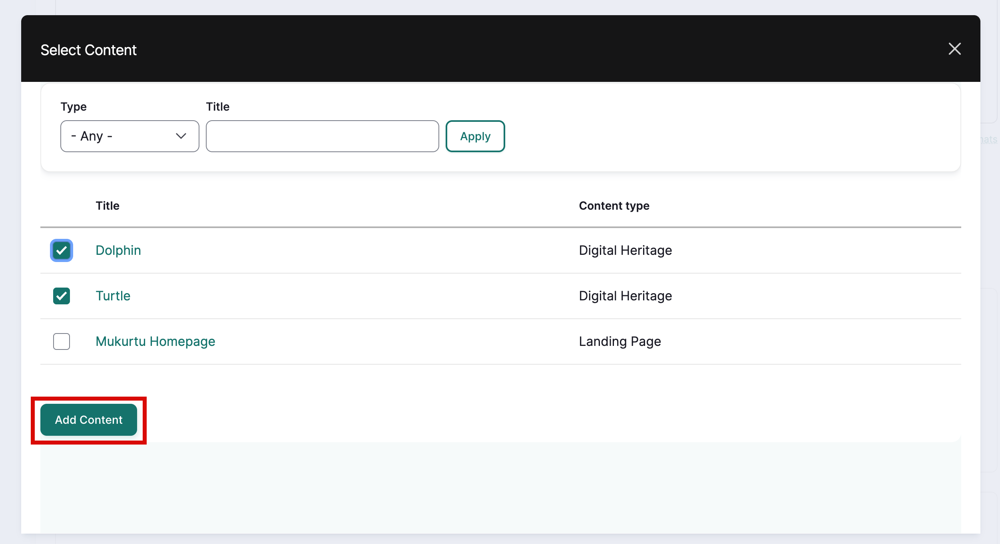
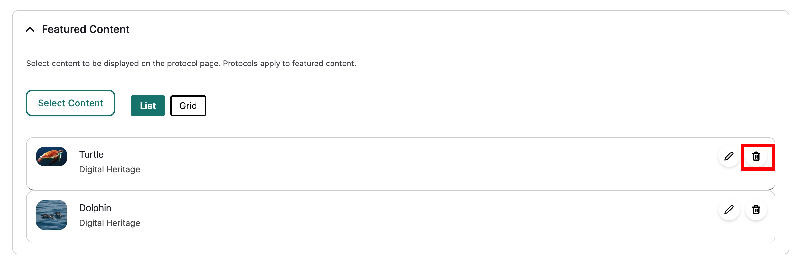
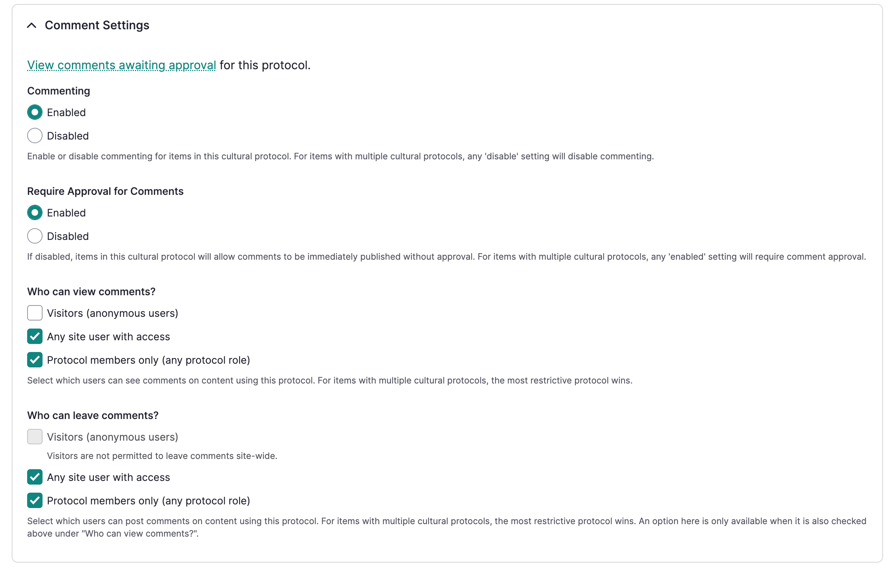
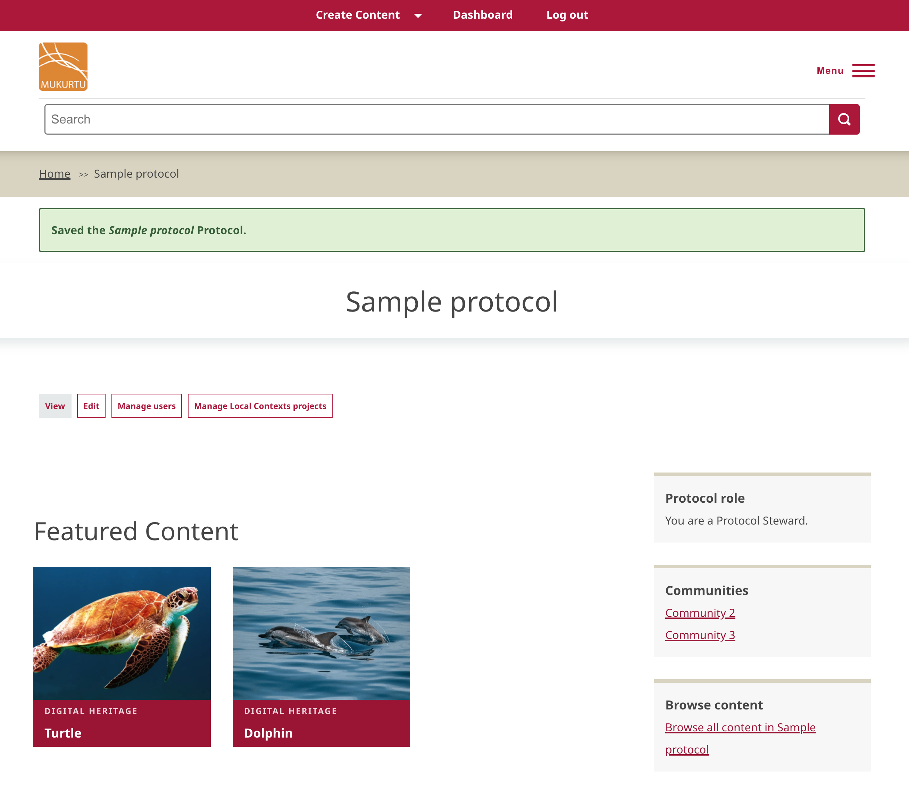

---
tags:

    - communities, cultural protocols, and categories
---

# Edit Cultural Protocol Settings

!!! roles "User role"
    
    Protocol steward

Cultural protocols can have a range of settings that can be updated once the protocol is created. Certain fields and settings are only available after the protocol has been created. To edit an existing protocol, navigate to the protocol, and select **edit**.

## Protocol Name

Use this field to edit the protocol name. It's helpful to name the community associated with this protocol and indicate type of access provided. For example, public collections at the Washington State University Library Manuscripts, Archives and Special Collections (WSU-MASC) might use the protocol, WSU-MASC Public.

## Protocol type 
    
There are two types of protocols, strict and open. Select the appropriate protocol type.
    
**Strict** - Content that uses this cultural protocol is only visible to members of this cultural protocol. The cultural protocol page is also only visible to cultural protocol members.

**Open** - Content that uses this cultural protocol is visible to all site members and visitors, with no login required. The cultural protocol page is also visible.

## Add/Remove communities

Each protocol is managed by at least one parent community. Protocols can also be managed jointly by multiple communities. If this is the case, additional parent communities can be assigned here. All parent communities will be displayed on the protocol page. See [Understanding Shared Protocols](../communities-cultural-protocols-categories/SharedProtocols.md) for more information.
 
1. To add a parent community, select "Select Communities". 

2. Select each community you would like to add. Select "Add Communities".

3. To remove a community, select the trash can icon in the top right corner of each community.

!!! Tip
    You must be a community manager in every community you wish to add.

## Description

Add or edit the protocol description. Descriptions display on the protocol page and may include information about the purpose of the protocol, the type of content under this protocol, and who to contact if you have questions.

## Local Contexts Description

Local Contexts provides labels and notices that are applied to content. These are a combination of graphics and text that communicate standards for respectful interaction with heritage collections and data as dictated by Indigenous communities. If you are using Local Contexts labels for content within this protocol, you may add or update a description for Local Contexts projects. This will be displayed in the protocol's Local Contexts directory page. For more on Local Contexts, see [Understanding the Local Contexts Hub](../local-contexts/UnderstandingTheLocalContextsHub.md).

## Membership display

Use this setting to determine how members are displayed on a cultural protocol page:

- **Do not display:** does not display protocol members
- **Display protocol stewards:** displays only users assigned to the protocol steward role
- **Display all members:** displays all protocol members regardless of role

## Banner image

The banner is an optional styling element that appears across the top of a protocol page. 

Banners generally maintain a 3:1 ratio which may change depending on screen size. Smaller screens will crop banner images. We recommend minimum dimensions of 1800x600px.

1. Select "Add media."
2. Browse for an image file on your computer or select an existing image.
3. Add alt text and protocols to your image. Make sure you choose protocols that enable visibility to your target audience.
4. Populate optional fields as needed. See [Media Asset Metadata](../media/MediaAssetMetadata.md) to learn more about these fields.
5. Save your changes, then select "Insert Selected".

## Featured content

Featured content gives users a preview of selected content. It displays the title and thumbnail of the content on the protocol page. 

1. Expand featured content field and select "Select Content".
2. Use the dropdown menu to narrow your search by content type, and the search field to search for specific content.
3. All available content is displayed below the search bar. Check the box next to each piece of content you wish to feature.
4. Select "Add Content".

     UPDATE WHEN MODAL IS FIXED

5. Remove featured content by selecting the grey trash can icon on the top right corner of each piece of content.

    

## Comment Settings

The comment settings allow you to control comments for content within this protocol. You can:

- **Enable/disable commenting** - Enable or disable commenting for items in this cultural protocol. For items with multiple cultural protocols, any 'disable' setting will disable commenting.

- **Require approval for comments**- If disabled, items in this cultural protocol will allow comments to be immediately published without approval. For items with multiple cultural protocols, any 'enabled' setting will require comment approval.

- **Choose who can view comments** - visitors, site users with access, and protocol members only. For items with multiple cultural protocols, the most restrictive protocol wins.

- **Choose who can leave comments** - visitors, site users with access, and protocol members only. For items with multiple cultural protocols, the most restrictive protocol wins. Available options will depend on who can view comments (i.e. if visitors can't view comments, they won't be allowed to leave comments.)

## Save

When you are satisfied with your changes, select "Save." A success message will be displayed on the cultural protocols page. 

