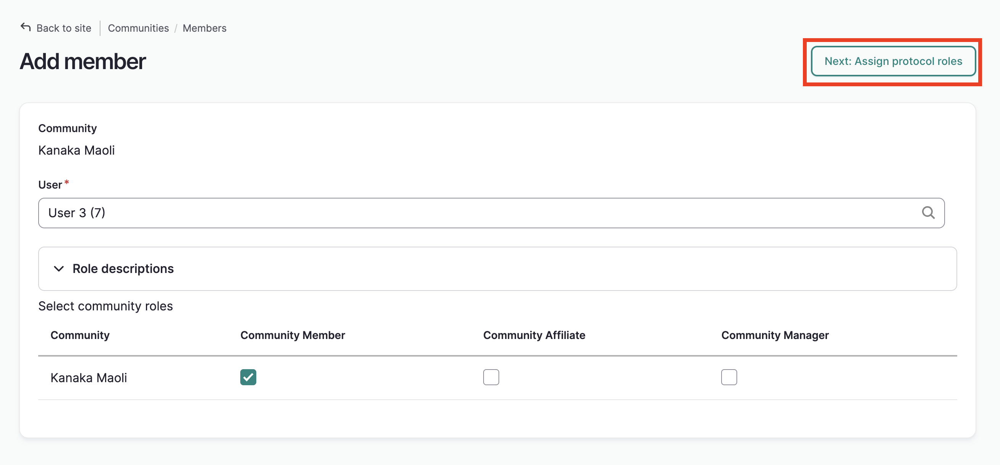
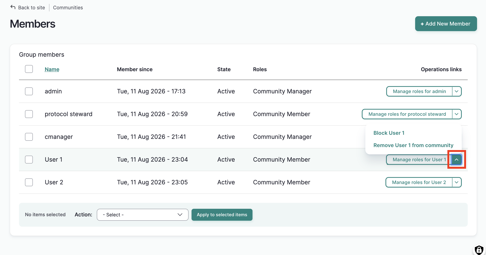
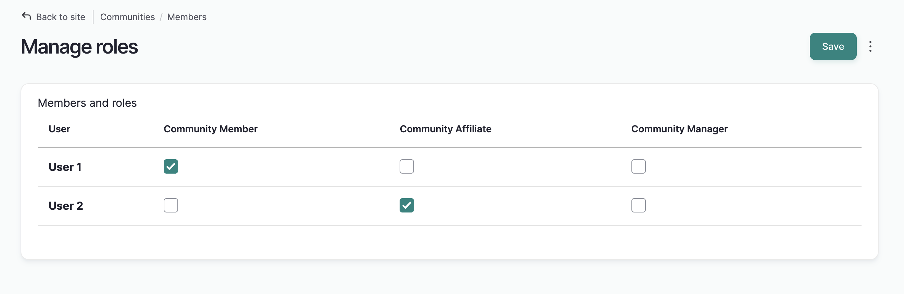
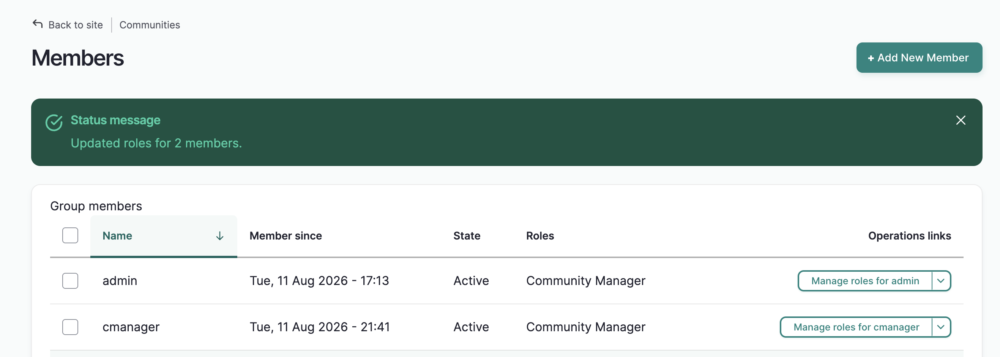

# Manage Community Members

!!! roles "User role"
    Community manager

Community managers are responsible for adding and managing community members. This article provides instruction for managing existing members both individually and in bulk. For details on adding new members as a community manager, see [Create User Accounts as a Community Manager](../users/create-user-accounts-community-manager.md)

## Manage members page

To begin, navigate to the community you wish to manage and select "Manage users."

The **Manage Members** page displays a table that lists all of the community members. You can see how long they've been a community member, their assigned roles, and their membership state. The operations links on the far right allow you to block, remove and manage user roles for each community member.

## Add a new member

!!! Requirement
    Users need to be registered on the site before they can be added to a community. See [Create User Accounts](/docs/users/create-user-accounts-community-manager.md) for detailed instructions.
    
1) To add a new member, select "Add New Member".

2) In the *User* field, add their username. A list of usernames will populate as you type. Select the username you wish to add. If you do not see the username you're looking for, make sure the user has an account on the site.

3) Assign their community role(s). 

There are three community roles: community members, community affiliates and community managers

- **Community members** have basic membership in the community. This role is assigned to all community members by default.  If they have not been added to any protocols, they can view the community page and any public content. 

- The **community affiliate** role is designated for users who aren't part of the community but work with the community in some capacity that requires a level of access to community content. Some examples include researchers, archivists, and other collaborative partners. Community affiliates may be assigned other roles and protocols within the community.

- **Community managers** are responsible for managing membership in the community. They can create and manage new user accounts, add and remove users from communities, create new cultural protocols, and manage Local Contexts projects and directories. Community managers are also responsible for the look and feel of the community page. This includes the title, banner and thumbnail images, description, featured content and other display settings.
    For more on user roles, see [User Roles](../users/user-role-types.md)

5) When you've assigned community roles, save your selections by selecting "Assign protocol roles". If you are not a protocol steward, you will be redirected to the community membership page. If you are also a protocol steward of protocols within the community, you can add the user to those protocols and assign protocol roles on the following page.

6) When you've assigned the user to the appropriate protocols, select "Save." The community membership page will load and display a success message. 

## Manage members individually
1) To manage users individually, from the community members page, select the "manage roles" button on the far right of the user's row. 

2) A membership edit form will display.

3) Deselect the role you wish to remove, and select the role you wish to assign. While it's possible to assign more than one role to a community member, users will almost always have one role. 

4) To edit their state, select the correct state (active, or blocked)

5) Select save. You will be returned to the manage members page and a success message will display.

By selecting the dropdown menu in the operations links, you can also block and remove individual users from the community. Note that the "remove" option is only available if the user doesn't have any protocol memberships within the community.

## Manage multiple members

You can manage multiple members by using the action menu. Use this menu to:

**Manage user roles in community**: This option assigns community roles (manager, affiliate, member) to users.

**Block user(s) in community**: This option blocks community members from viewing the community page.

**Remove user(s) from community**: This option removes users from the community.
    
**Unblock user(s) in community**: This option restores access to the community page.

1. To use any of these actions on one or more members, from the manage members page, check the box next to each name you wish to manage. 
    

2. Using the action menu, select the action you wish to apply. 

3. Select **Apply to selected items**. The action will be applied to all selected members.

4. You will receive different results depending on the action item you select. Below are descriptions of the results of applying steps 1-3 above for each action item, and any additional instructions as needed.

### Manage user roles in community

1. Complete steps 1-3. 

    

2. A table will list the selected users and the community user roles. The users' current roles are selected. Uncheck the role you wish to remove. Check the role you wish to assign and select **Submit**.

    

3. The manage members page will reload with a sucess message. User roles for each selected member will be updated.

    

### Block user(s) in community

!!!Tip
    Blocking a user from a community with automatically block them from that community's protocols. They not be able to view any items under strict protocols within the community. A "community blocked" status is also indicated on protocol membership pages.

1. Complete steps 1-3.

    

2. The manage members page will reload with a success message. The selected users will be blocked.

    

### Remove user(s) from community

!!! Requirement
    You must first remove the user from any protocols within the community before removing them from the community. Failure to do so will result in a warning message.

1. Complete steps 1-3.

    

2. The users will be removed from the community.

    

### Unblock user(s) in community

1. Complete steps 1-3

    

2. The manage members page will reload with a success message. The selected users will be unblocked.

    
