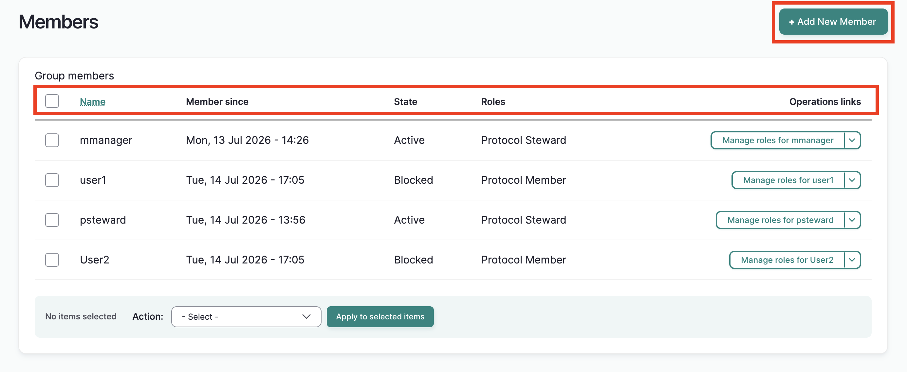
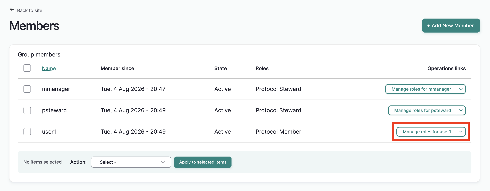
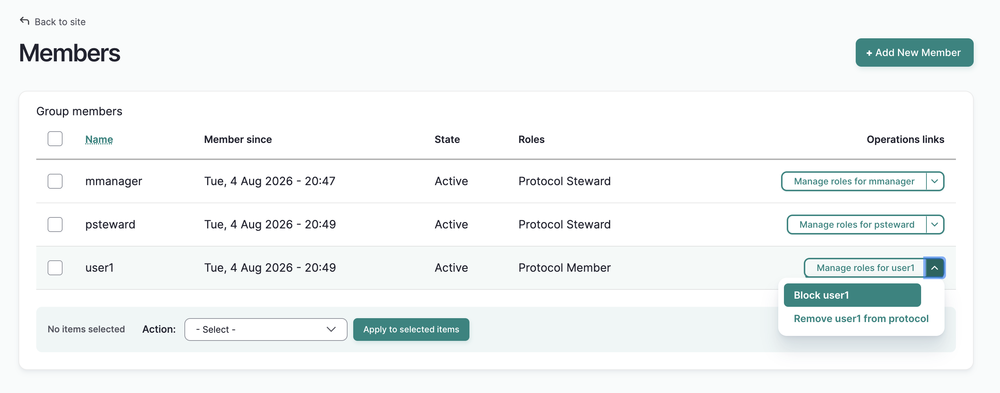

# Manage Protocol Members

!!! roles "User roles"
	Protocol steward
  
## Add a new member
!!! Requirement
	Users must be enrolled as a member of the protocol's parent community before they can be enrolled and assigned roles in the protocol.

1. To add a new member to a protocol, as a protocol steward, navigate to the desired protocol and select "Manage users."

A table displays all protocol members. You can see their user name, length of membership, their membership state and protocol roles. An operations menu on the far right allows you to manage their roles. The dropdown arrow in the operations menu allows you to block and remove users from the protocol.

Select the "Add new member" button at the top right.

A blank **Add Member** form will load.

2. In the *Username* field, begin entering their username. A list of community members will autopopulate. Select the correct user. If you do not see the user you're looking for, make sure they have been added to the protocol's community. See [Manage Community Members](../communities-cultural-protocols-categories/ManageCommunityMembershipAndRoles.md).

3. Select their role(s). Role descriptions can also be found at the bottom of the form. In order of responsibility: 

    - Protocol members can view content but cannot add or edit.
    - Protocol affiliates can view content but cannot add or edit. This is a designation for community partners that mirrors the community affiliate role.
    - Contributors can create, edit, and delete their own digital heritage items, person records and media assets.
    - Curators can create, edit, and delete their own collections and upload media assets. 
    - Language contributors can add, edit, and delete their own dictionary words and word lists.
    - Language stewards can add, edit, and delete ALL dictonary words and word lists and also add media assets. 
    - Community record stewards can add community records to content, as well as edit and delete them.
    - Protocol stewards can manage protocol membership, add, edit, and delete all content and media assets, manage the look and feel of the protocol page, and manage Local Contexts labels and notices.

    !!! Tip
        To learn about protocol roles in greater detail, see [User Roles](../users/user-role-types.md)

4. Select their membership state.

    - Active members can act as normal, based on their user role and permissions.
    - Blocked members cannot view the protocol page of a strict protocol, or take protocol related actions until they are changed back to active members. This may be useful if a user takes unapproved actions and their account should be temporarily suspended within this protocol (accounts can also be blocked at the site level by a Mukurtu Manager see [Manage User Accounts from a Site-wide Role](../users/manage-user-accounts-site-wide.md)).

    

5. Select "Save".

A blank form will load and a success message will be displayed. If you wish to add additional users, you may continue to do so.

## Manage members individually

Existing protocol members are managed from the membership page.

### Manage protocol roles

1. To view the user's protocol membership settings, select the "Manage roles" button.

    

2. The user's membership page will open. You can remove and assign roles, and change their state. When you're finished, select "Save."

### Block/Unblock User

To block a user, select "block user" from the operations dropdown menu. The user will be blocked and the protocol page and content will be inaccessible to the user (if the protocol is strict). Protocol related actions are also restricted.

Perform the same action to unblock the user.

### Remove Users

1. To remove a user from the protocol, select "Remove user" from the operations dropdown mnenu. 

    

2. A pop up window will display a warning. Select "Delete." A success message will be displayed and the user will be deleted from the protocol. Note that they have not been deleted from the community or the site and can be re-added to the protocol at any time.

    

    

3. You will be returned to the protocol members page and a success message will display. Any changes you made to the user will be reflected in the table. 

## Manage members in bulk

  You can manage multiple members by using the action menu. Use this menu to:

- Manage user roles in protocol
    - Add or remove user roles to the selected user(s).
- Block user(s) in protocol
    - Block the selected user(s) from accessing the protocol page, content (if the protocol is strict) and any permissions the user had within the protocol.
- Remove user(s) from protocol
    - Remove the selected users from the protocol. They will no longer have access to the protocol page, content (if the protocol is strict) and any permissions the user had within the protocol. 
- Unblock user(s) in protocol
    - This option restores all protocol access and permissions to blocked users.

You can apply any of these actions on one or more users with the following steps:

1. From the members page, check the box next to each name you wish to manage. 

2. Using the action menu, select the action you wish to apply. 

3. Select "Apply to selected items". The action will be applied to all selected users.

You will receive different results depending on the action item you select. Below are descriptions of the results of applying steps 1-3 above for each action item, and any additional instructions as needed.

### Manage user roles in protocol

1. Complete steps 1-3.

2. On the following page, select or deselect roles for each user. 
    

     

3. Select "Save". The members page will reload and a success message will be displayed. The updated roles will appear in the **Roles** column.

    

### Block user(s) in protocol

1. Complete steps 1-3.

2. The members page will re-load with a success message. The selected users state will change from **Active** to **Blocked**.

### Remove user(s) from protocol

1. Complete steps 1-3.

    

2. The members page will re-load with a success message. The selected users are no longer listed on the manage page. They can no longer access content under the protocol (if protocol is strict). 

    

### Unblock user(s) in protocol

1. Complete steps 1-3

    

2. The members page will re-load with a success message. The selected users will be unblocked and set to **Active**. They will be able to view materials and act in accordance with their assigned roles.

    
