# Manage Content

!!! roles "User role"
    Mukurtu manager, protocol steward, language steward, contributor, language contributor

## Accessing the content Page

The content page is accessible through the dashboard in the Content section, in the left-hand menu (if you're a Mukurtu manager or administrator) or by appending /admin/content to your URL (i.e. `http://mymukurtusite.org/admin/content`)

From the dashboard:
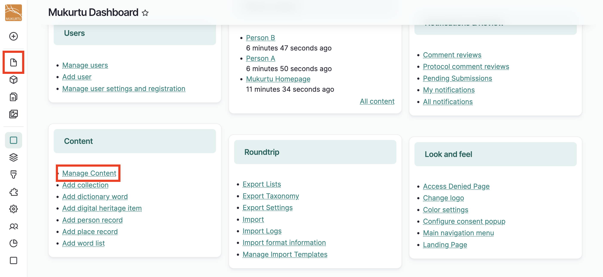

## Content page overview

The content page displays all accessible content as determined by your protocol memberships. An "Add content" button at the top allows you to create a new content item.

Content filters allow you to search and filter existing content.

A table displays the title, content type, community, the date and time of last change, and status (draft, awaiting review, published, etc.) of accessible content. Order content by a particular column by selecting the column name. 

An action menu displays on the far right, which applies per-row actions. The options in this menu vary according to your permissions. 

Bulk actions at the bottom of the page allow you to apply an action to multiple items.

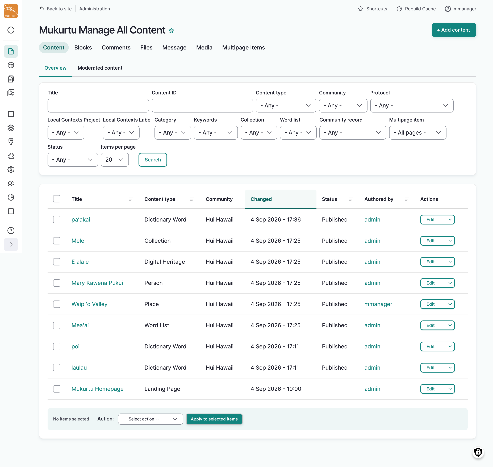

## Content filters

Content filters allow you to search for and filter content by a variety of parameters. You can use one or more filters concurrently to narrow search results. 

For example:

- The content and collection filters can find all person records within a specific collection.
- The content and Local Contexts label filters can find digital heritage items that use a specific label.
- The status and community filters can find draft content within a specific community.

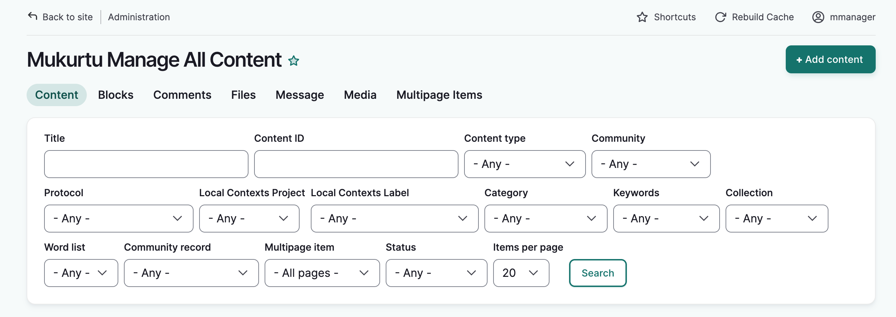

Content filters include: 

- **Title**: The title of the content item - use partial or full titles

- C**ontent ID**: Each content item is automatically assigned a unique ID number at creation. It can be found in the URL when editing an existing item.

    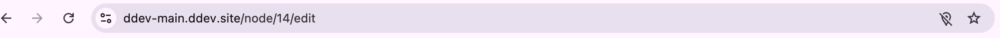

- **Content type**: Filter by digital heritage item, dictionary words, place records, person records, word lists and collections.

- **Community**: Display all content items belonging to the selected community. 

- **Protocol**: Display all content items belonging to the selected protocol.

- **Local Contexts Projects**: Display all content using any labels with in the specified project. 

- **Local Contexts Labels**: Display all content across projects, that are using the selected label.

- **Category**: Display digital heritage items using the selected category.

- **Keywords**: Display all content items using the selected keyword.

- **Collection**: Display all content within the selected collection.

- **Word list**: Display all dictionary words within the selected word list.

- **Community record**: Determine whether search results include community records, or display the original record only.

- **Multipage item**: Determine whether search results include all pages of a multipage item, or the first page only.

- **Status**: Display all the content with the selected publishing status. Available statuses will vary depending on your publishing workflow. See: LINK to publishing worksflows

To use the filters, select the parameters you want to search by, select how many items per page you want to display, and select "Search."

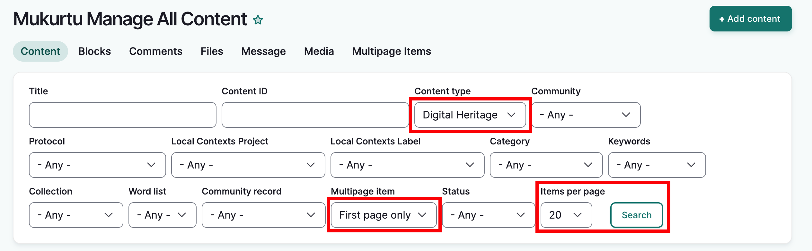 

Once you've run a search, a reset button displays next to the search button. This resets the filters for a new search.

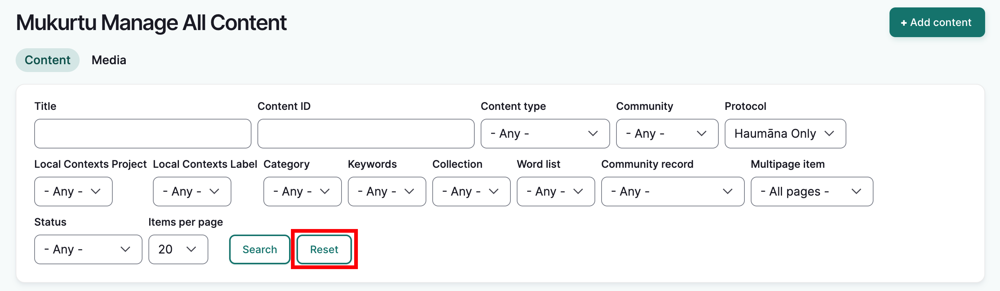

The content list updates dynamically according to the content filters used. From there you can take several actions, depending on your roles and permissions.

## Managing Content Individually

Options for managing content individually appear in the actions menu on the far right. This menu has several options whose visibility depends on the user's roles and permissions. It is common for this menu to display differently item by item depending on the user's permissions.

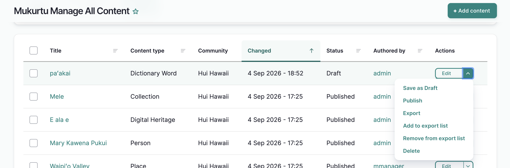

|  Action           | Who can perform the action?                       |
|-------------------------|---------------------------------------------------|
| Edit                    | Mukurtu manager, Protocol steward, Content author |
| Save as draft           | Mukurtu manager, Protocol steward, Content author |
| Publish                 | Mukurtu manager, Protocol steward, Content author |
| Export                  | Mukurtu manager, Roundtrip manager                |
| Add to export list      | Mukurtu manager, Roundtrip manager                |
| Remove from export list | Mukurtu manager, Roundtrip manager                |
| Delete                  | Mukurtu manager, Protocol steward, Content author |

### Applying action menu items

**Save as draft,** **Publish**, **Archive** and **Unpublish** are simple status changes. Selecting them will reload the page and change the status of the item.

#### Edit
This action opens the content's edit page. Make any desired edits and select **Save**. The updated content page will load.

#### Save as draft
This action moves the content to a draft state. It is not publically available, and can be edited and re-published. 

#### Publish
This action moves the content to a published state. It is now publically available, and can be viewed by anyone with permission. 

#### Archive
This action moves the content to an archived state. It is inaccessible to all users and visitors including the content author. Only Mukurtu managers or administrators can remove the archive state and restore the item to a draft state, where it can be edited and published again.

#### Unpublish
This action will unpublish the item. The item will no longer be visible on the front-end of the site, but can be edited and republished.

#### Export
This action walks you through the export settings to export metadata, or metadata and media assets. See [Exporting Content](../roundtrip/ExportingContent.md)

1. Select "Export" from the action menu

2. Select the desired export settings See [Export Settings]ADD LINK

3. Select "Start export"

4. Your export results will load. Select "Download Export." Your export will download.
 
#### Add to export list
Export lists are lists of content that are curated with the intent of exporting the content together. Selecting "Add to export list" opens a page with options to create a new export list, or add the item to an existing export list.  LINK TO EXPORT LIST ARTICLE covers this in greater detail.

1. Select "Add to export list" from the action menu

2. Use the dropdown menu to select an existing export list, or,

3. Add a list title in the **Create a new list** field

4. Select "Add to list" 

    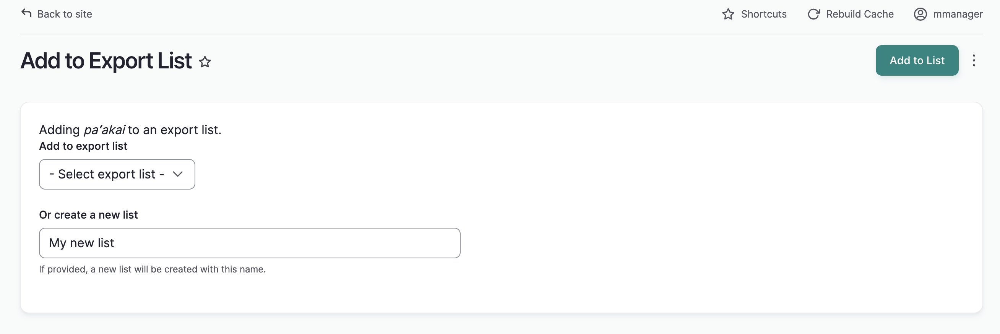

5. The content page will reload with a success message. The item will be added to the selected list.

#### Remove from export list
This action removes the item from an export list.

1. Select "Remove from export list" from the action menu

2. Select the list you would like to remove the item from and select "Remove from list"

    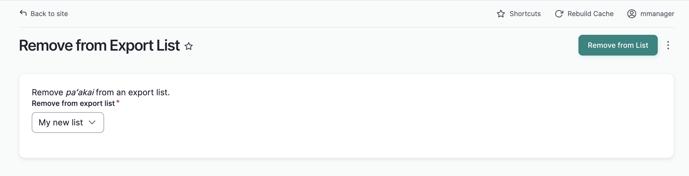

3. The content page will reload with a success message. The item will be removed from the selected list.

#### Delete
!!! Warning
    Deleted items cannot be recovered. Use with caution!

This action deletes the item completely. After selecting "delete", a message will ask for confirmation. Select "delete" and the content page will reload with a success message. The item is no longer listed.

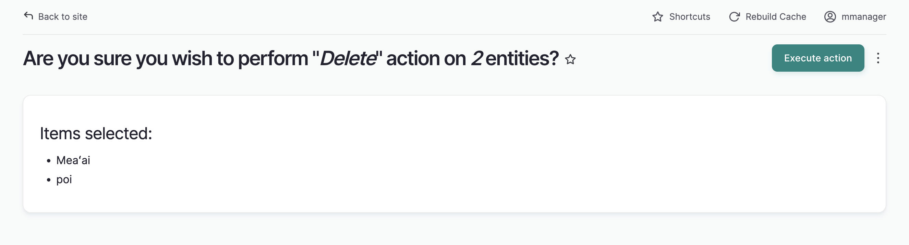

### Bulk Actions

Like the per-item action menu, the options available in the bulk action menu are determined by the user's roles and permissions. Bulk action menu options appear if they can be applied to at least one item. They may not be applicable to all listed content. For example, contributors can see content made by other users within their protocol, but they cannot delete any items except their own. 

If you try to apply an action without proper permissions, you will receive an access denied message for that item. Changes to other items you DO have permission to alter will be processed.

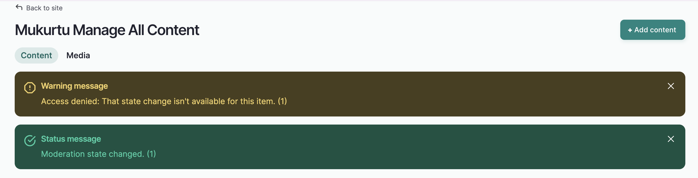

If an action is not working as expected, ensure you have the proper permission to perform that action. 

| Bulk Action             | Who can perform the action?                       |
|-------------------------|---------------------------------------------------|
| Restore to draft        | Mukurtu manager, Protocol steward, Content author |
| Publish                 | Mukurtu manager, Protocol steward, Content author |
| Add to export list      | Mukurtu manager, Roundtrip manager                |
| Remove from export list | Mukurtu manager, Roundtrip manager                |
| Delete                  | Mukurtu manager, Protocol steward, Content author |
| Archive                 | Mukurtu manager                                   |
| Export                  | Mukurtu manager, Roundtrip manager                |

1. To use any of these actions on one or more content items, check the box next to each item you wish to manage.

2. Using the action menu at the bottom of the page, select the action you wish to apply.

3. Select **Apply to selected items**. The action will be applied to all selected content.

    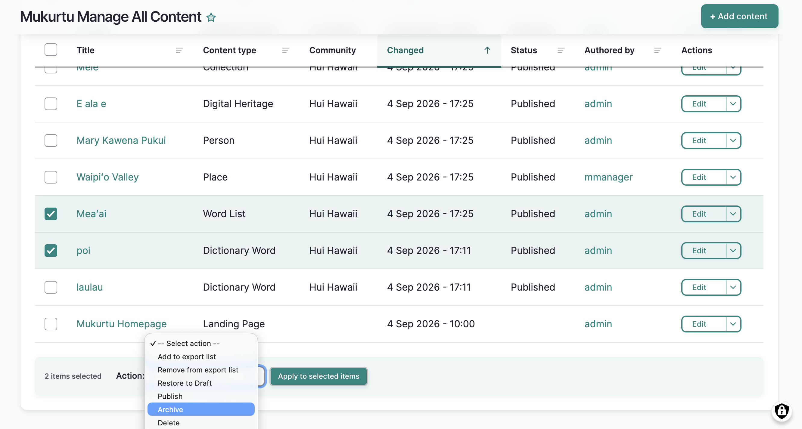

4. You will receive different results depending on the action item you select. 

**Publish**, **Unpublish**, **Archive** and **Restore to Draft** are simple state changes. The page will reload with a success message, and the state of the items will be updated.

**Add to export list** and **Remove from export list** adds or removes items from export lists in the same way as single-item actions do. See the [Add to Export list](./manage-content.md#add-to-export-list) and [Remove from export list](./manage-content.md#remove-from-export-list) sections above and [Using Export Lists]ADD LINK for additional information.

**Delete**: This action deletes the item completely. After selecting "delete", a message will ask for confirmation. Select "execute action" and the content page will reload with a success message. The item is no longer listed.

**Export**: This action walks you through the same [export](./manage-content.md#export) settings detailed above, to export your content. See also [Exporting Content]ADD LINK

