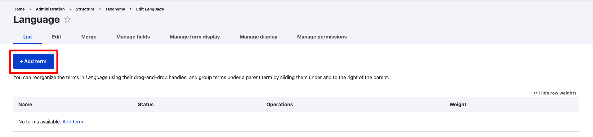
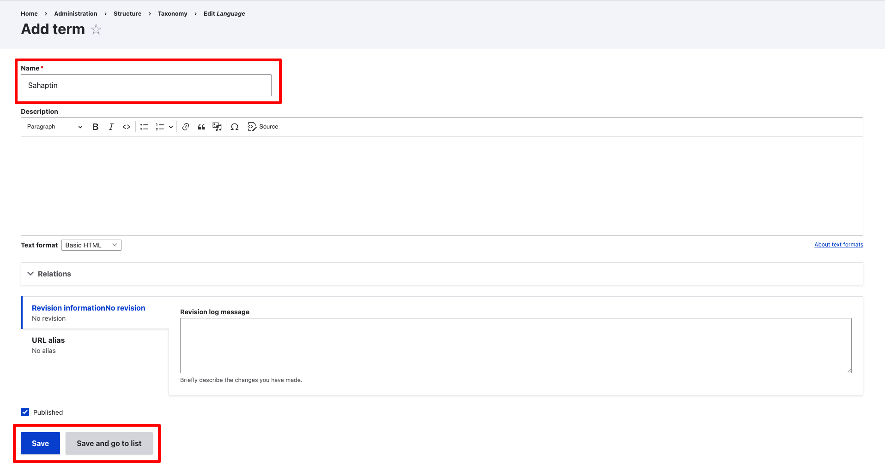
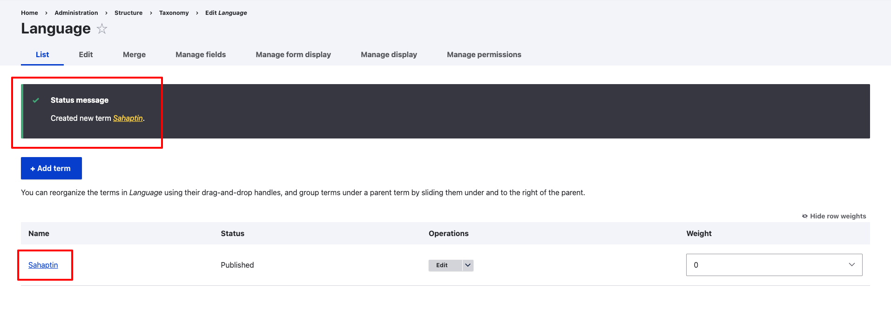

---
tags:
    - dictionary
    - taxonomies
---

# Add a Dictionary Language

!!! roles "User Roles"
    Mukurtu administrator, TBC

All dictionary words must be associated with one language listed in the language taxonomy. Languages can be added to the language taxonomy two ways:
- When a digital heritage item is created by using the *language* field. See [Creating a Digital Heritage Item](../digital-heritage-items/CreateDHItem.md) for more information.
- Directly adding a language to the language taxonomy.

To add a language, INSERT STEPS HERE

Or navigate directly to `/admin/structure/taxonomy/manage/language/overview`

If the language you want to use is already listed, no further action is needed.

If the language is not already listed, select "+ Add Term".

Enter the language name in the *Term* field, as you want it to appear on the site.
The *Description* field is optional, and display in INSERT CONTEXT HERE.
When ready:

- If you want to add more languages, select "Save" and the page will reload so you can continue to add more terms.
- If you do not need to add more languages, click "Save and go to list" to return to the language taxonomy list.

In either case, a confirmation message will be displayed, and you can now use this language when creating dictionary words.

