---
tags:
    - dictionary
    - taxonomies
---
# Configure the Dictionary

!!! roles "User Roles"
    Mukurtu manager

While the dictionary works with its' default configurations, its' settings can be customized to improve user experience and accuracy in front-end display. This article covers adding a language (required), customizing the glossary order, and configuring the dictionary's default language.

## Add a language

All dictionary words must be associated with one language, and that language must be listed in the language taxonomy list. Languages can be added to the language list in two ways:

- When a digital heritage item is created, if the language field has been used, those languages will be included in the languages list. See [Creating a Digital Heritage Item](../digital-heritage-items/CreateDHItem.md) for more information.
- Manually adding a language to the list.

To add a language to the list, first navigate to the language taxonomy page. 

1. From the dashboard, select **manage taxonomies**.

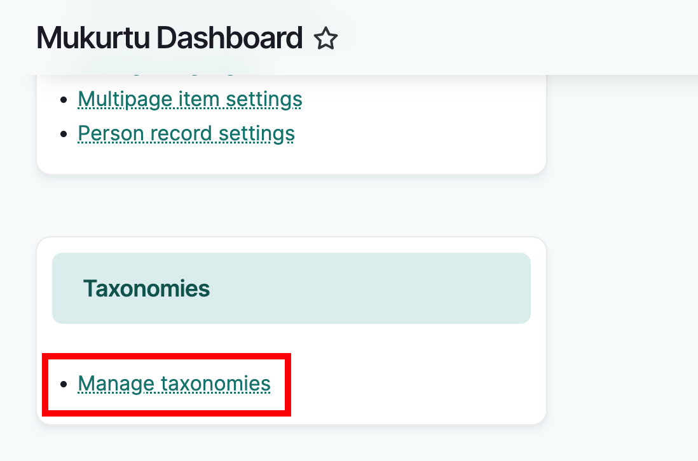

2. Scroll down to the language taxonomy, and select "List terms."

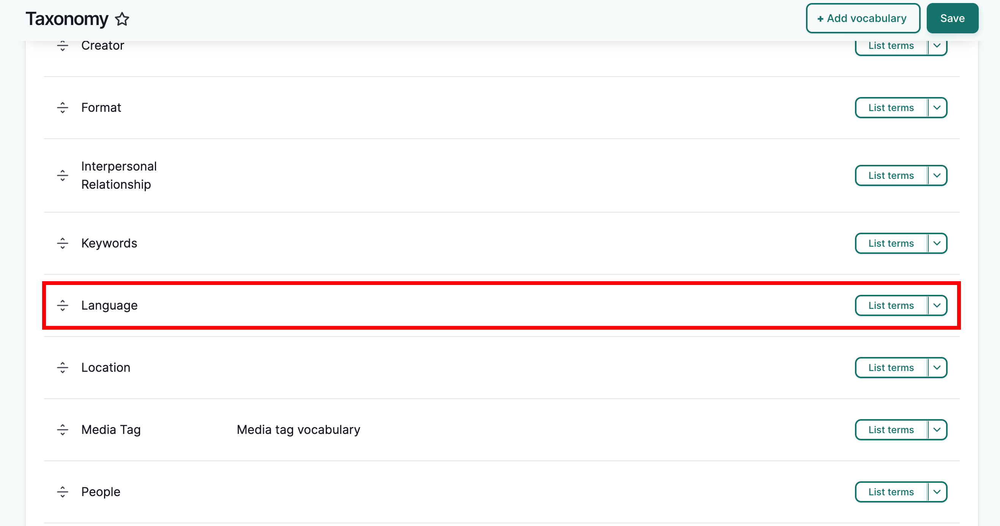

Or go directly to `/admin/structure/taxonomy/manage/language/overview`

If the language you want to use is already listed, no further action is needed.

If the language is not already listed, select "Add Term".

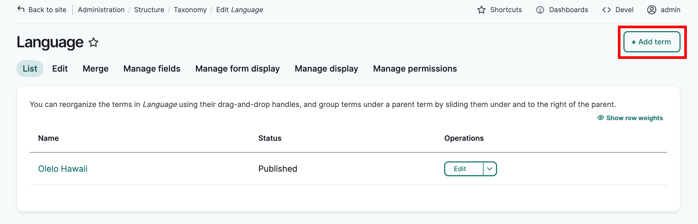

In the *Name* field enter the language name as you want it to appear on the site.

The *Description* field is optional, and can include information about the language i.e. history, regions where the language is spoken, related languages and dialects, etc. This will be displayed in the language's term page

When ready:

- If you need to add more languages, select "Save" and the page will reload so you can continue to add more terms, or;
- If you do not need to add more languages, click "Save and go to list" from the more actions menu (indicated by the three dots next to the "Save" button) to return to the language list.

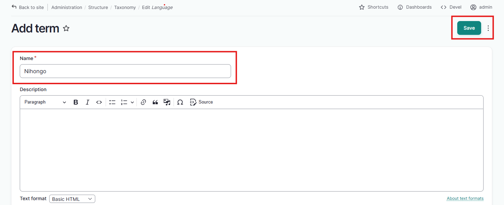

In either case, a confirmation message will be displayed, and you can now use this language when creating dictionary words.

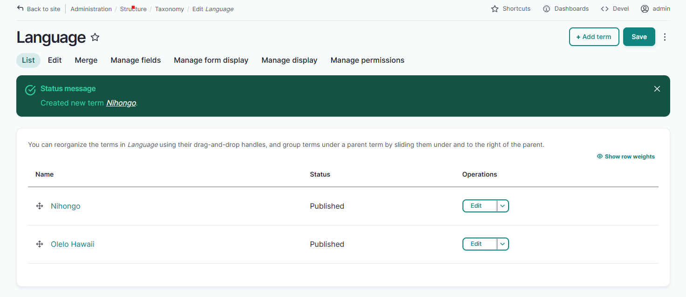

## Define the glossary order

As you create dictionary words, an index of characters will form at the top of the dictionary page. You can use the default unicode or alphabetical order to sort them, or you can define their order using the dictionary glossary order settings.

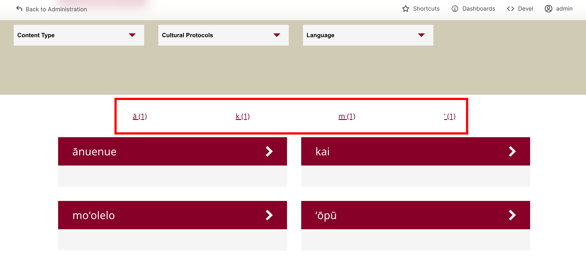

From the dashboard, select **Dictionary glossary order**

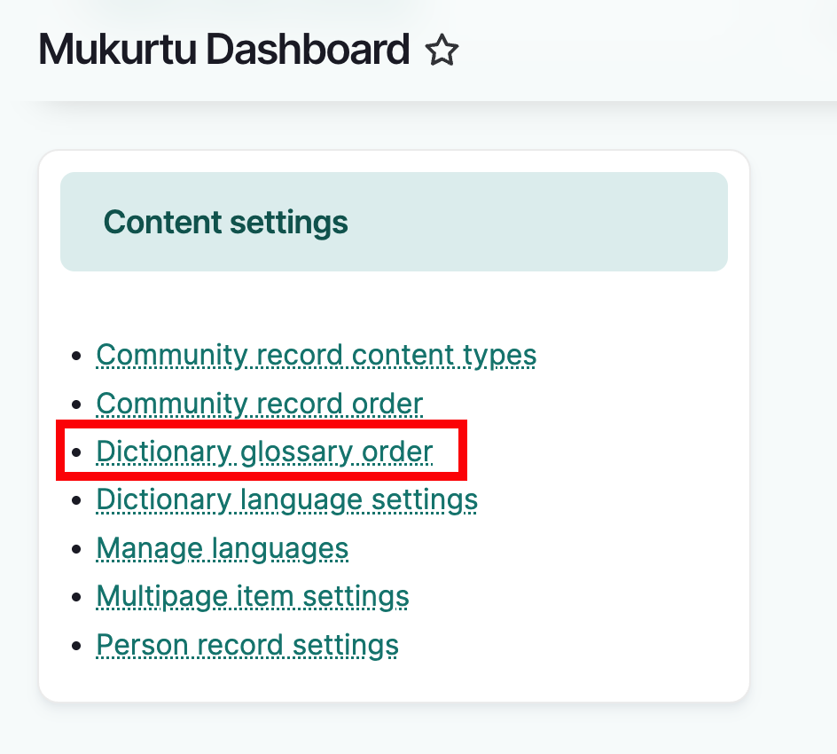

You will see a list of glossary entries. Glossary entries indicate the first character of a dictionary word and are either autopopulated based on the first chracter of the word, or customized in the glossary entry field in the dictionary word form. You will only see glossary entries for existing dictionary words. 

!!! Tip
    For more on the glossary entry field, see [Create a Dictionary Word](../dictionary/CreateDictionaryWord.md#glossary-entry)

The index can be arranged by the default unicode/alphabetical order, or by an order you define.

To do so, select one of:

- **Default sort** (unicode/alphabetical order) This will sort the index by the default unicode/alphabetical order.
- **User-defined sort** (drag to reorder below) This will allow you to create a custom order.

If you selected user-defined sort, the index will reflect the order indicated in the glossary entry list below. To reorder the glossary list, drag the characters into the preferred order and select "Save Configuration." 

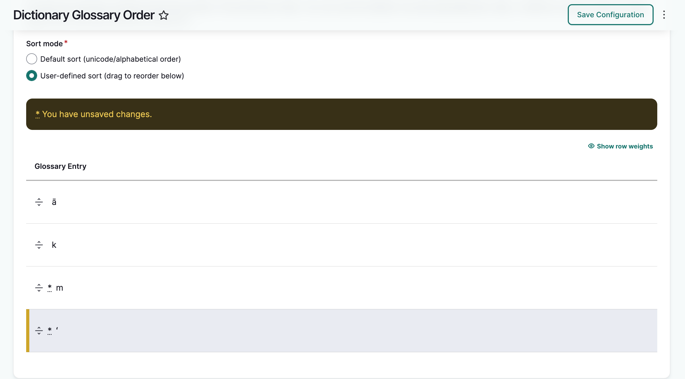

The glossary order in the dictionary will reflect the custom order you indicated.

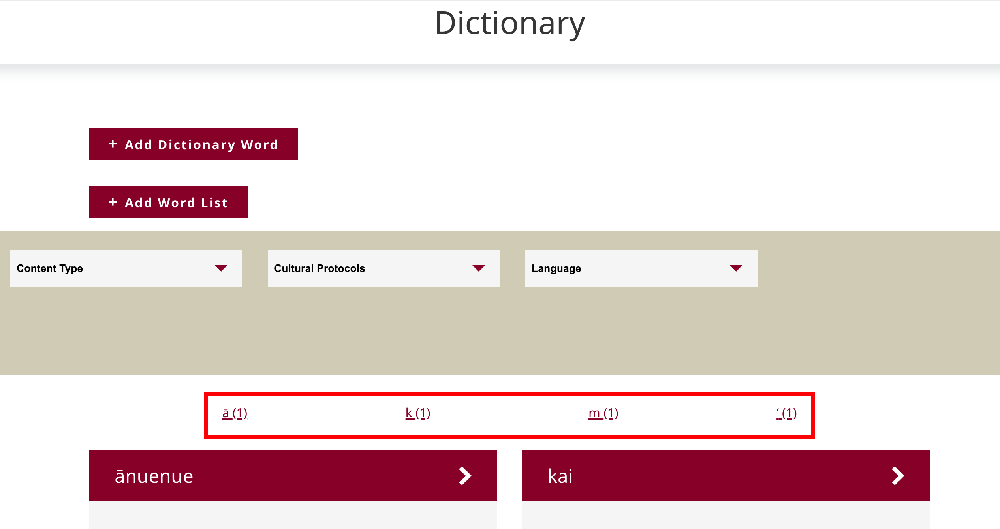

If you need to reset the glossary entry order back to the default, select the "more actions" menu and select "reset order to alphabetical." 

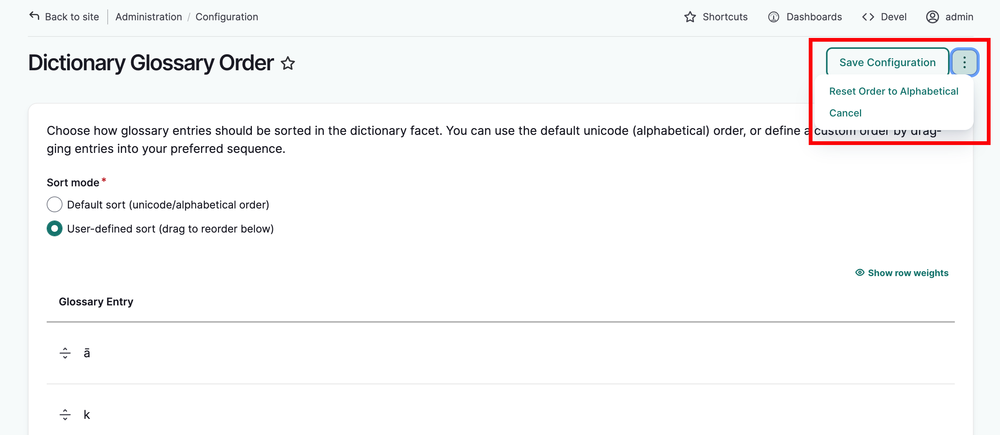

## Set a default language

Languages can be added to the language taxonomy list by using the language field in digital heritage items. As more content is added, the potential for several language terms grows. By default, all of these terms will be available in the dictionary. 

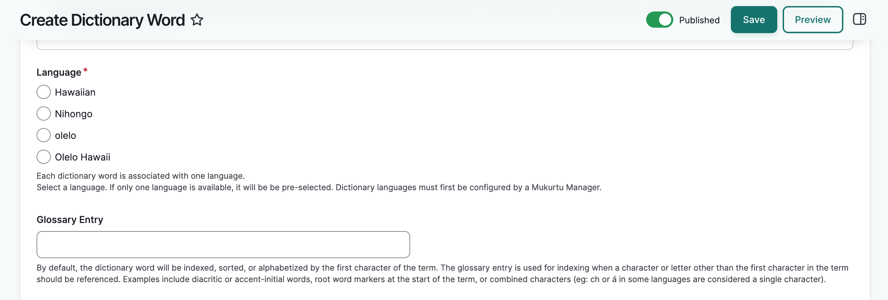

This can lead to confusion, especially if there are different names or spellings for the same language. To mitigate this, you can select the exact language terms you would like to use when creating dictionary words.

From the dashboard, scroll down to Content Settings. Select **Dictionary language settings**. You will see a list of languages available for use in the dictonary.

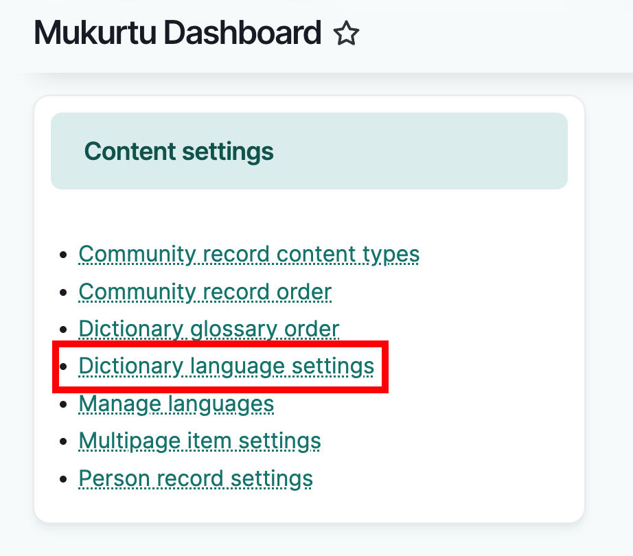

Check the box next to the language(s) you would like to use in the dictionary. Select "save configuration." A success message will display.

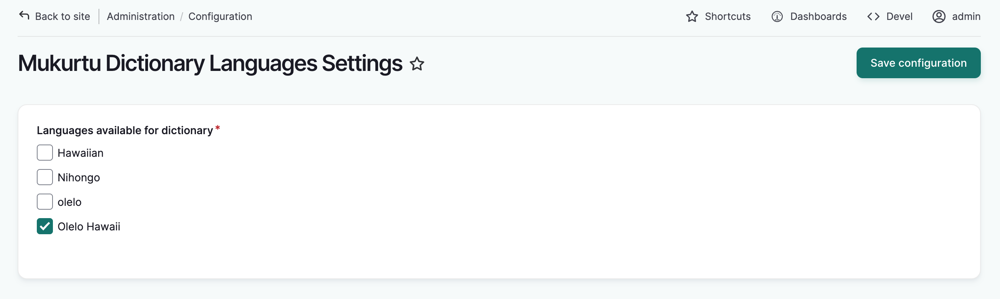

 In the dictionary word form, you will only see the selected language(s) listed and no others.

 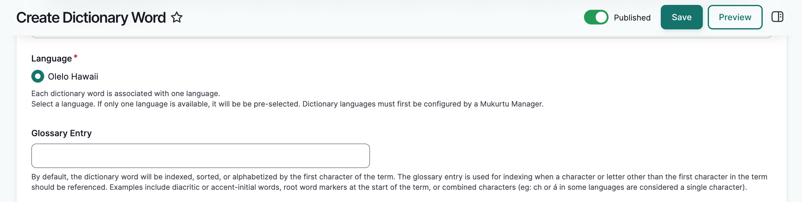