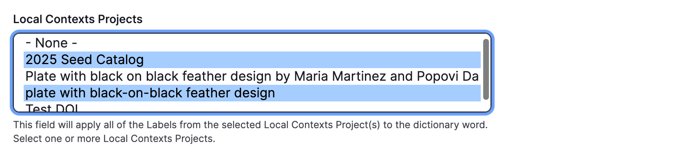
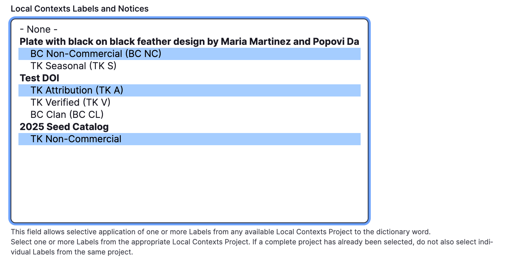

---
tags:
    - dictionary
    - content
---
# Create a dictionary word

!!! roles "User Roles"
    Protocol steward; language steward; language contributor

The dictionary is a core content type that allows you to capture language elements. The metadata is intended to capture the nuance of language but also includes visual enhancements such as support for media assets and maps. To learn more about the dictionary, see [Understanding the Mukurtu Dictionary](./UnderstandingTheMukurtuDictionary.md)

This article will walk you through creating a dictionary word and using word entries.

!!! Requirement
    Before you can create a dictionary word, you must first configure the dictionary. See [Configuring the Dictonary](./ConfiguringTheDictionary.md)

To create a dictionary word, from the dashbboard, select **Dictionary word**.

## Mukurtu Essentials

### Term

Add a term for your dictionary word. This is field is flexible and could be a phrase, or a prefix/suffix, or other language element.

- This is a required field

- 255 characters max.

### Protocol

Use the toggle to assign at least one cultural protocol to your dictionary word. 

- This is a required field.

### Sharing Setting

For content with multiple protocols assigned, sharing settings help to determine a content item's level of access. The setting is a choice between *all* or *any*. By default *all* will be selected.

**All**: An item with multiple protocols may only be viewed by members of ALL assigned protocols. 

**Any**: An item with multiple protocols may be viewed by a member of ANY assigned protocols.

### Language

!!! Requirement
    Dictionary languages must first be configured by Mukurtu Manager. To learn how to configure a language, see [Configuring the Dictionary](./ConfiguringTheDictionary.md)
    
Select a language. If only one language is available, it will be pre-selected. 

### Glossary Entry

!!! Requirement
    You must have the glossary configured before using the glossary entry field. For more information on configuring the glossary, see [Configuring the Dictionary](./ConfiguringTheDictionary.md)

The glossary entry field can be used in cases where you do not want the term to be indexed under the first character of the term. This field allows you to choose a different character under which to index the term. To use this field, enter the character you would like the term to be indexed under.

### Alternate Spelling

Use this field to add an alternate spelling (such as an older spelling) of the word. 

- 255 characters max.

### Translation

Add a translation of the term in the language of the site. To add additional translations, select **Add Another Item**
To reorder multiple translations, select the arrows and drag them up or down.

- 255 characters max.

### Recording

Add a recording of the term being spoken by selecting "Add Media" There is no limit to the number of recordings you can add.

### Definition

Add a definition of the term. This is a rich text field, which can accommodate formatting and additional media. 

### Sample Sentences

Sample sentences can be used to demonstrate use of the word. You may add an unlimited number of sample sentences. They can be text, audio, or both combined. 

225 characters max.

1. Enter a sentence or phrase.

2. Select **Add Media** to add a recording. Only one recording per sentence can be added.

3. To add additional sample sentences, select **Add Sample Sentence**. Sample sentences can be reordered by selecting the arrow and dragging it up or down.

    

### Word Type

This field can be used for parts of speech, syntactic or grammatical categories. As you type, previously used word types will display. Select an existing word type or add a new one. To add additional word types, select **Add Another Item**. 

### Pronunciation

Add a pronunciation guide. This field can accommodate the notation system used by speakers and teachers of the language. It can also support rich text and embedding media assets.

 

### Source

Enter a source. Examples include a speaker, teacher, existing dictionary, or regions where this word is used.

- 255 characters max.

### Word Origin

Enter information about the history or etymology of the entry.

- 255 characters max.

### Contributor

1. Enter any entities (people, groups, tribes, clans, etc.) who aided in making the entry. Names can appear in any format. As you type, previous names of existing contributors will be displayed. 
2. Select an existing contributor or add a new name. 
3. To add additional contributors, select **Add another item**. Multiple contributors can be reordered by selecting the arrow and dragging the field up or down.

## Word Entries

Word entries are multiple entries that appear under one term. This allows you to capture additional meanings, conjugations, gendered or plural forms, etc. The metadata for a word entry is the same metadata in the Mukurtu Essentials tab, with the exception of cultural protocols, sharing setting, language, and glossary entry since those apply to the dictionary word as a whole. Please refer to [Mukurtu Essentials](CreateDictionaryWord.md#mukurtu-essentials)

You can add an unlimited amount of word entries by selecting **Add Word Entries** at the bottom of the word entry page.

## Additional Fields

### Thumbnail

Thumbnails can help you quickly identify a term. Select **Add media** to select from previously uploaded images or upload a new image. Thumbnail images generally maintain a 4:3 ratio. Anything larger than this will be cropped to that size in display. The image files themselves will not be altered. Thumbnails will resize responsively to smaller screen sizes. We recommend minimum dimensions of 800x600px for best rendering.

### Media Assets

You can add media assets to your dictionary word. Select **Add media** to select from previously uploaded media or upload a new media asset. There is no limit to the number of media assets you can add. 

### Keywords

Enter keywords as needed to make your dictionary word more discoverable. 

1) Begin typing a keyword. As you type, previously used keywords will be displayed. 

2) Select an existing keyword or add a new one. 

3) To add additional keywords, select **Add another item**. 

4) Multiple keywords can be reordered by selecting the arrow and dragging the field up or down.

### Locations

Dictionary words includes the same location tools as digital heritage items. 

### Map points

Mukurtu allows users to create and manage map points and areas using the embedded Leaflet maps. For detailed instructions on how to include *Map Points*, visit [Create Map Points](../location-data/CreateMapPoints.md)

### Location description

Use the *Location description* to provide a text or media reference to a geographical location. 

  - Location description is a rich text field that allows for longer descriptions or more information about the place(s) referenced in the content. 
  - It may be useful in cases where a general description of the places are provided, or more context is necessary. 
  - Location description can be used independently of other location fields and is a full HTML field that supports text, audio, images, and video.

### Location

Enter a *Location*. 

Location is a taxonomy field which can be useful to label and connect content using the same term. 
As you type, previously used location terms will be displayed. Select an existing term or add a new one. To add additional terms, select **Add another item**. Multiple terms can be reordered by selecting the arrow and dragging the field up or down.

### Local Contexts

!!! Requirement
    Local Contexts labels and notices must be configured before they can be applied to dictionary words. To learn how add a Local Context project to your Mukurtu site, see [Manage Local Contexts Projects](../local-contexts/ManageLocalContextsProjects.md)

1) To apply all the labels and notices from a project, select the appropriate project from the Local Contexts Projects dropdown menu.

2) Specific labels can be applied using the *Local Contexts labels and notices* menu. 

## Related Content

You can link dictionary words to other content on the site. 

1. Select "Select Content." A window will open that displays all available content. 

2. Narrow results by filtering by content type or using the search field and selecting "Apply."

3. Check the box next to each item you wish to add. Select "Add Content."

4. The item will appear under Related Content. To remove content, select the trashcan icon in the top right corner of the item.

