---
tags:
    - dictionary
    - content
---
# Create a Dictionary Word

!!! roles "User Roles"
    Protocol steward, language steward, language contributor

This article will walk you through creating a dictionary word and using word entries.

!!! Requirement
    Before you can create a dictionary word, you must first configure the dictionary. See [Configuring the Dictonary](./ConfiguringTheDictionary.md)

To create a dictionary word, as a protocol steward, language steward, or language contributor, from the Create Content menu, select **Dictionary word**.

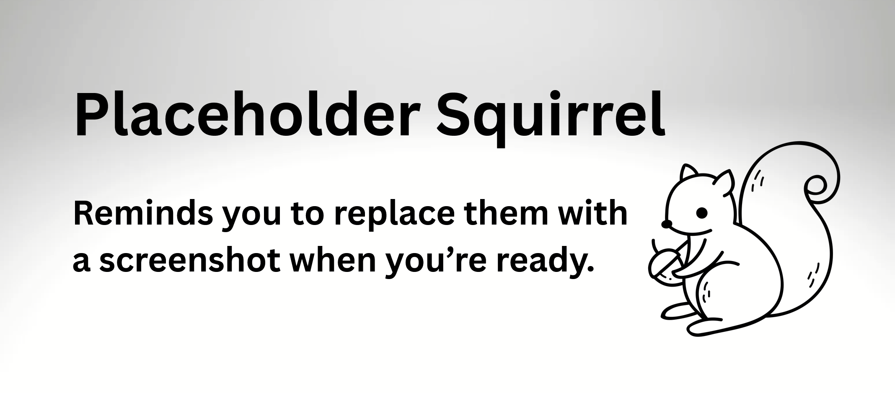

## Mukurtu Essentials

### Term

Add a term in the language of the dictionary. This may differ from the site language. This is field is flexible and could be a word, phrase, a prefix/suffix, or other language element.

- This is a required field

- 255 characters max.

### Protocol

Use the toggle to assign at least one cultural protocol to your dictionary word. 

- This is a required field.

!!! Tip
    Protocols determine a user or visitorʻs appropriate level of access to the dictionary word. For more on cultural protocols, see [Understanding Communities and Cultural Protocols](../communities-cultural-protocols-categories/UnderstandingCommunitiesAndCulturalProtocols.md).

### Sharing Setting

For content with multiple protocols assigned, sharing settings help to determine a content item's level of access. The setting is a choice between *all* or *any*. By default *all* will be selected.

**All**: An item with multiple protocols may only be viewed by members of ALL assigned protocols. 

**Any**: An item with multiple protocols may be viewed by a member of ANY assigned protocols.

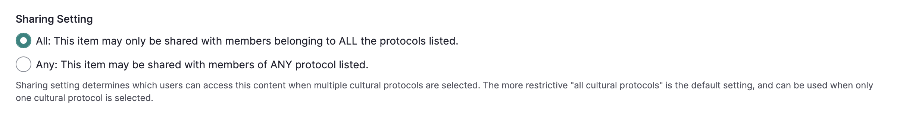

- This is a required field.

!!! Tip
    For more on sharing settings, see [Understanding Sharing Settings](../communities-cultural-protocols-categories/UnderstandingSharingSettings.md)

### Language

!!! Requirement
    Dictionary languages must first be configured by Mukurtu Manager. To learn how to configure a language, see [Configuring the Dictionary](./ConfigureTheDictionary.md)
    
Select a language. If only one language is available, it will be pre-selected. 

- This is a required field.

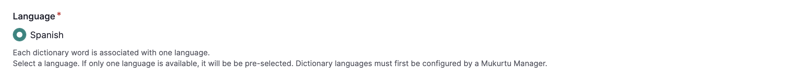

### Glossary Entry

!!! Tip
    Custom indexing can be applied by configuring glossary settings. See [Configuring the Dictionary](./ConfiguringTheDictionary.md) for detailed instructions.

The glossary entry field can be used in cases where you do not want the term to be indexed under the first character of the term. This field allows you to choose a different character under which to index the term. To use this field, enter the character you would like the term to be indexed under.

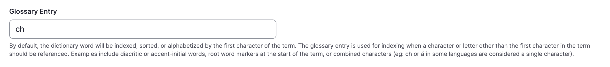

### Alternate Spelling

Use this field to add an alternate spelling of the word. Examples include historic spellings, regional differences, or popular spellings.

- 255 characters max.

### Translation

Add the closest one to one translation of the term in the language of the site. 

- To add additional translations, select **Add Another Item**

- To reorder multiple translations, select the arrows and drag them up or down.

- 255 characters max.

### Recording

Add an audio recording of the term being spoken by selecting "Add Media." There is no limit to the number of recordings you can add. For example, you may want to include recordings of older and younger speakers, or male and female speakers. 

 - This field only accepts audio files. 

!!! Tip
    For detailed instructions on uploading an audio file, see [By type media upload: Audio](../media/ByTypeMediaUpload/Audio.md)

### Definition

Add a definition of the term. This may be a one to one translation, or it may include more nuanced meanings, including historic or contextual meanings. You may also include most history of the background or etymology of the word. This is a rich text field, which can accommodate formatting and additional media. 

### Sample Sentences

Sample sentences can be used to demonstrate use of the word. You may add an unlimited number of sample sentences. They can be text, audio, or both combined. 

- 225 characters max.

    1. Enter a sentence or phrase.
       
        

    2. Select **Add Media** to add a recording. Only one recording per sentence can be added.
        
        

    3. To add additional sample sentences, select **Add Sample Sentence**. Sample sentences can be reordered by selecting the arrow and dragging it up or down.

        

### Word Type

This field can be used for parts of speech, syntactic or grammatical categories. 

1. As you type, previously used word types will display. 

2. Select an existing word type or add a new one. To add additional word types, select **Add Another Item**. 

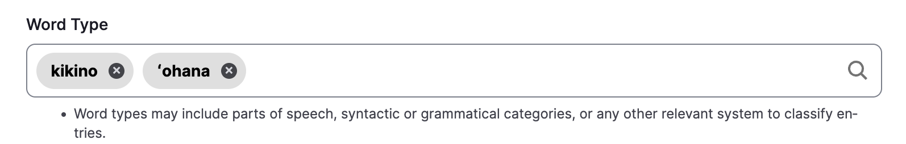

### Pronunciation

Add a pronunciation guide. This field can accommodate the notation system used by speakers and teachers of the language. It can also support rich text and embedding media assets.

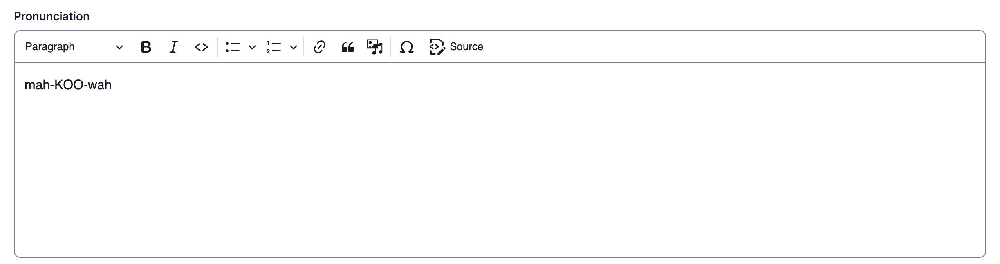 

### Source

Enter a source. Examples include a speaker, teacher, existing dictionary, language learning materials, or regions where this word is used.

- 255 characters max.

### Word Origin

Enter information about the history or etymology of the entry. This may include the origin language of a borrowed word or the date a word came into the language.

- 255 characters max.

### Contributor

1. Enter any entities (people, groups, tribes, clans, etc.) who aided in making the entry. Names can appear in any format. As you type, previous names of existing contributors will be displayed. 

2. Select an existing contributor or add a new name. 

3. To add additional contributors, select **Add another item**. 

4. Multiple contributors can be reordered by selecting the arrow and dragging the field up or down.

## Word Entries

Word entries are multiple entries that appear under one term. This allows you to capture additional meanings, conjugations, gendered or plural forms, etc. The metadata for a word entry is the same metadata in the Mukurtu Essentials tab, with the exception of cultural protocols, sharing setting, language, and glossary entry since those apply to the dictionary word as a whole. Please refer to [Mukurtu Essentials](CreateDictionaryWord.md#mukurtu-essentials)

You can add an unlimited amount of word entries by selecting **Add Word Entries** at the bottom of the word entry page.

## Additional Fields

### Thumbnail

Thumbnails can help you quickly identify a term. Select **Add media** to select from previously uploaded images or upload a new image. Thumbnail images generally maintain a 4:3 ratio. Anything larger than this will be cropped to that size in display. The image files themselves will not be altered. Thumbnails will resize responsively to smaller screen sizes. We recommend minimum dimensions of 800x600px for best rendering.

### Media Assets

You can add media assets to your dictionary word. Select **Add media** to select from previously uploaded media or upload a new media asset. There is no limit to the number of media assets you can add. 

### Keywords

Keywords are terms used to describe content to ensure that the item will be discoverable when searching or browsing.They are more flexible and specific than categories. 

1) Begin typing a keyword. As you type, previously used keywords will be displayed. 

2) Select an existing keyword or add a new one. 

3) To add additional keywords, select **Add another item**. 

4) Multiple keywords can be reordered by selecting the arrow and dragging the field up or down.

### Locations

Location tools are available for all content types, including dictionary words. These tools could be used to map the regional usage of words and phrases, associate words with specific locations, and add rich descriptions to locations that are associated with words.

### Map points

Mukurtu allows users to create and manage map points and areas using the embedded Leaflet maps. For detailed instructions on how to include *Map Points*, visit [Create Map Points](../location-data/CreateMapPoints.md)

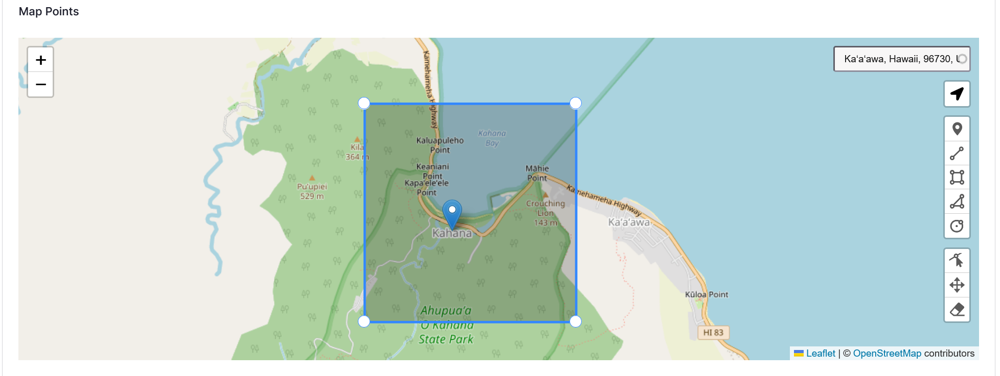

### Location description

Use the *Location description* to provide a text or media reference to a geographical location. 

  - Location description is a rich text field that allows for longer descriptions or more information about the place(s) referenced in the content. 
  - It may be useful in cases where a general description of the places are provided, or more context is necessary. 
  - Location description can be used independently of other location fields and is a full HTML field that supports text, audio, images, and video.

    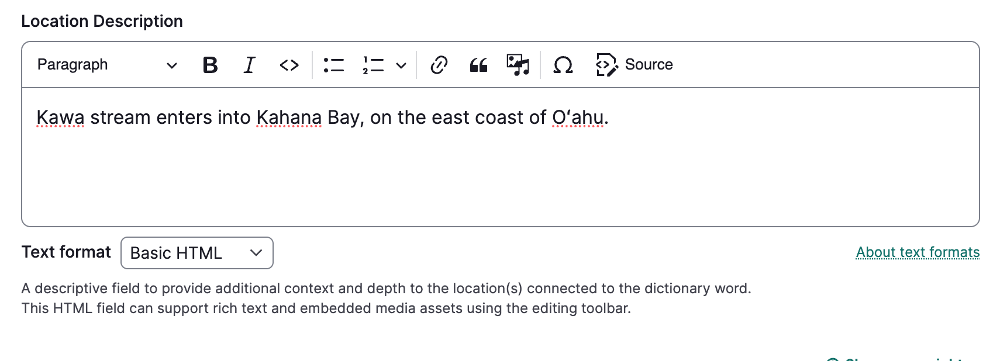

### Location

Enter a *Location*. 

Location is a taxonomy field which can be useful to label and connect content using the same term. 

1. Begin entering a term. As you type, previously used location terms will be displayed. 

2. Select an existing term or add a new one. 

3. To add additional terms, select **Add another item**. 

4. Multiple terms can be reordered by selecting the arrow and dragging the field up or down.

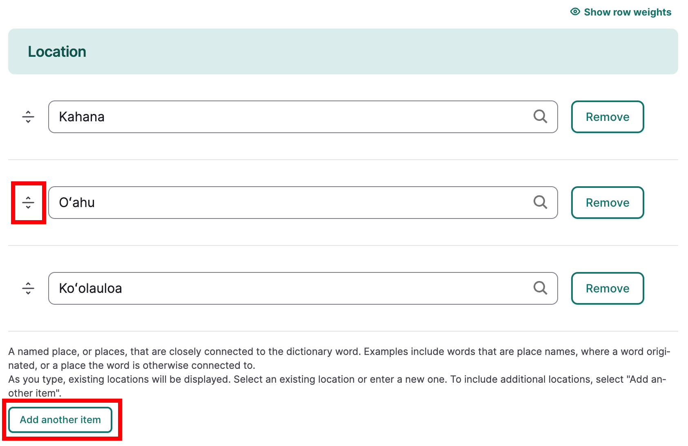

### Local Contexts

Use the **Local Contexts** field to apply Traditional Knowledge labels to your dictionary word. To start a project or for more information refer to [Understanding the Local Contexts Hub](../local-contexts/UnderstandingTheLocalContextsHub.md) or visit [Local Contexts](https://localcontexts.org/).

Select your Local Contexts project from the list. This field will apply all of the Labels from the selected Local Contexts Project(s) to the dictionary word.

### Local Contexts Labels

Select one or more Labels from the appropriate Local Contexts Project. 

!!! tip
    If a complete project has already been selected, do not also select individual Labels from the same project. 

## Related Content

The **related content** field can help provide connections between your dictionary word and other site content or to help guide users when browsing content. Examples include stories, oral histories or songs that use the word, photos displayed as digital heritage items that depict the word, or person records for language speakers.

- Select the "Select content" button. Additional digital heritage items, person records, other dictionary words, and other content can be included as related content. 

    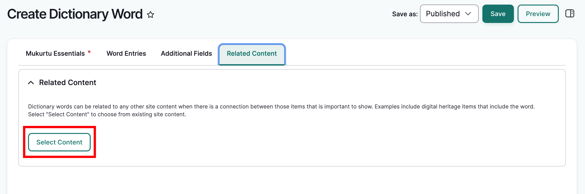
    !!! tip 
        You can filter content by type or search by title.

- Select the checkbox beside all the content you wish to include as related content, then scroll down and select "Add Content".

    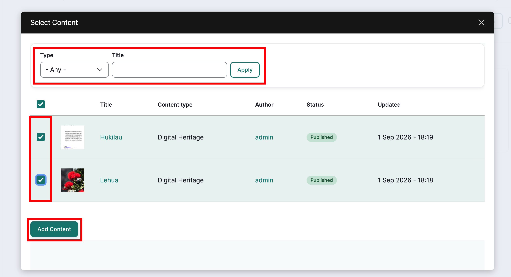

4. The item will appear under Related Content. To remove content, select the trashcan icon in the top right corner of the item.

    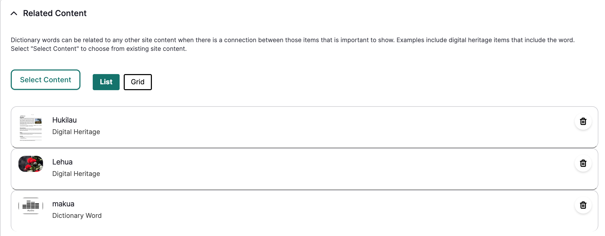

## Save

When you are finished filling out all relevant metadata fields, select "Save" which is sticky at the top right corner of the page.

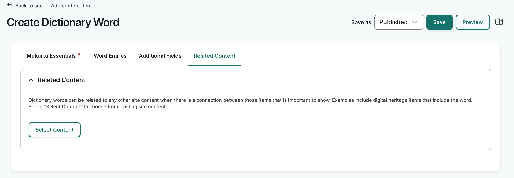

The term will display along with a success message.

