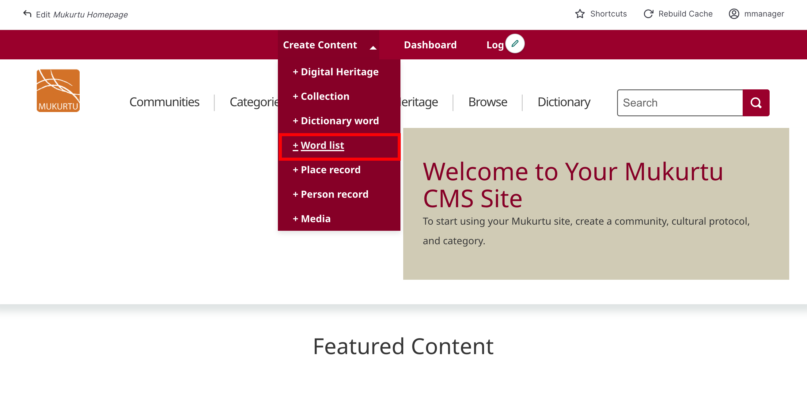
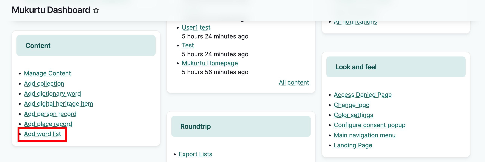
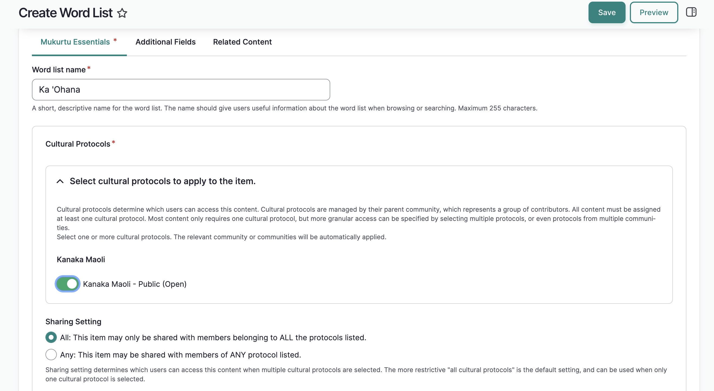
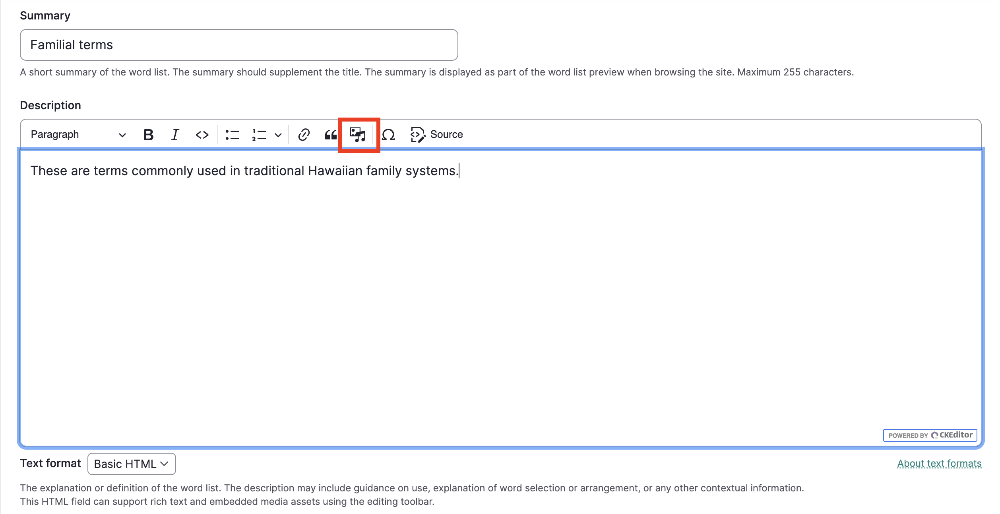
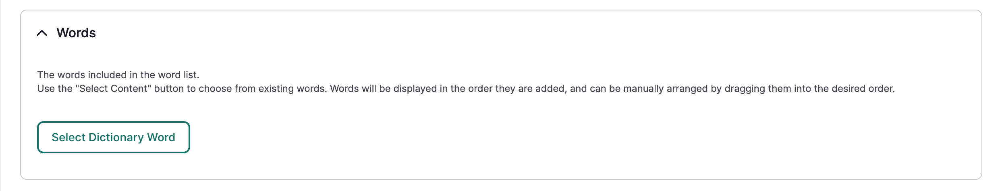
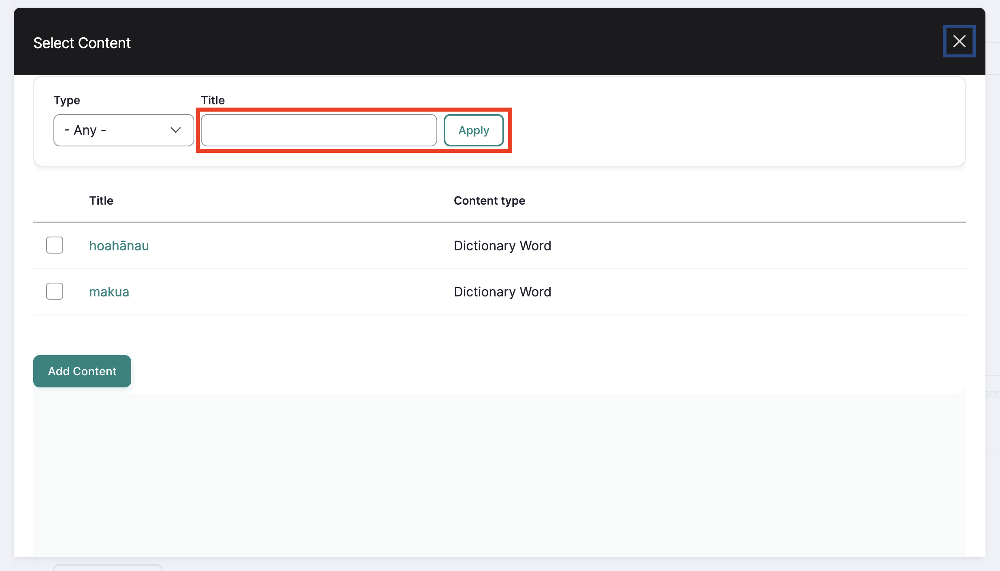
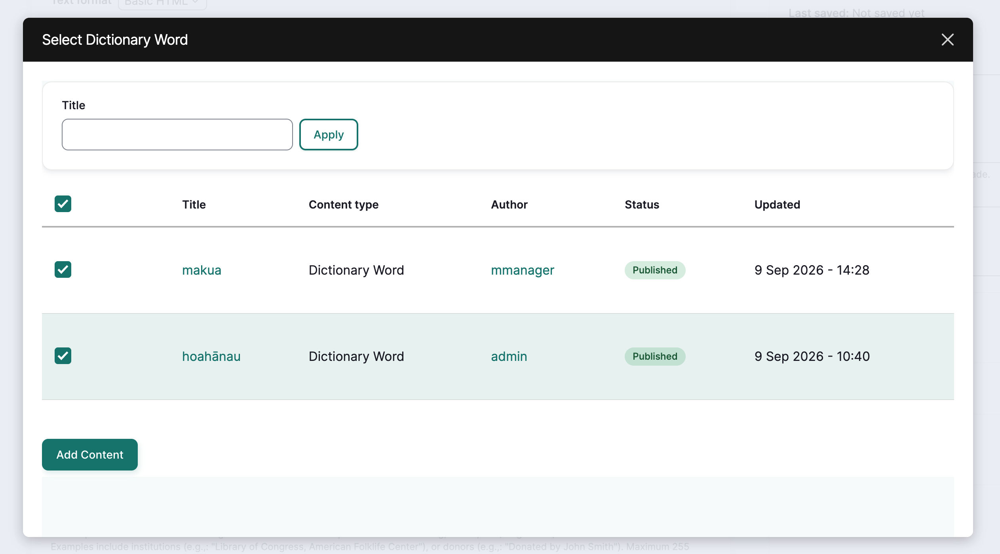
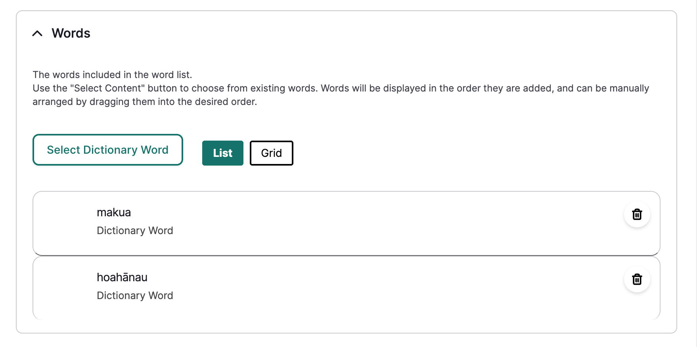
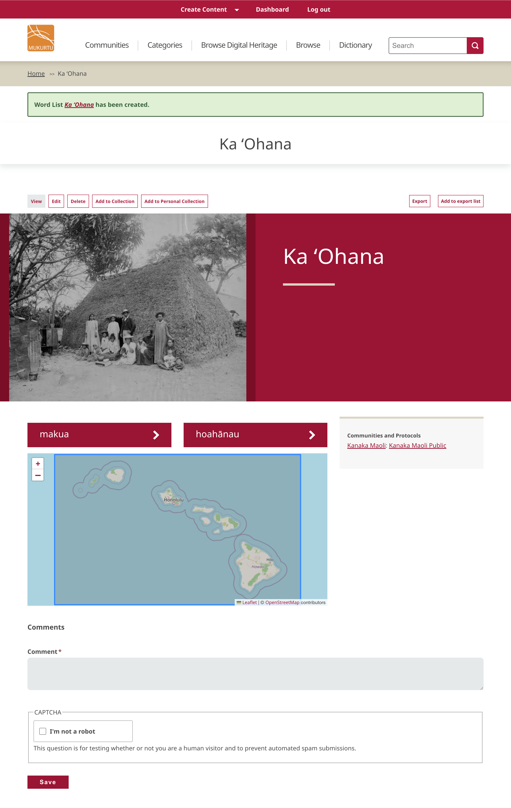

---
tags:
    - dictionary
---

# Word Lists

!!! roles "User roles"
    Protocol steward, language steward, language contributor

Word lists behave like collections, but they are exclusively for arranging dictionary words. They can be used to group words by topic, region, part of speech, etc., and provide users a more guided or curated experience. The creator of the word list can arrange the content in a structured way, provide a description of the word list, and select a featured image. Display of individual items within the collection is still controlled by their specific cultural protocols.

Follow the steps below to create a word list.

## From the navigation menu

From the create content dropdown menu, select **word list**.

## From the dashbaord

In the content section of the dashboard, select the **add word list** link.

## Mukurtu essentials

1. Give your word list a short, descriptive name. It should give users useful information about the list when browsing or searching.

    - Maximum 255 characters
    - This is a required field

2. Use the toggle to select one or more cultural protocols for your word list.
    - This is a required field

3. Select a sharing setting. Sharing settings determine which users can access content when multiple protocols are applied. By default, the "All" setting will be applied.

    - **All**: An item with multiple protocols may only be viewed by members of ALL assigned protocols.

    - **Any**: An item with multiple protocols may be viewed by a member of ANY assigned protocols.
    
    - This is a required field

4. A short summary of the word list can be added as a supplement to the title. The summary is displayed in the word list preview.

    - Maximum 255 characters.

5. Enter text or media assets in the *Description* field to provide a longer and more nuanced description of your word list. This is a full text HTML field that can support images, documents, audio or video recordings, or embeds.

    

6. To add words to the word list, in the *Words* field, select "Select Content."

    

    1. A window will open that displays all available dictionary words. Enter a word in the title field and select "Apply" to narrow down your options.

        

    2. Check the box next to each word you want to add to your word list and select "Add Content."

        

    3. You will be returned to the main form with your selected words displayed. You can reorder the words by selecting and dragging them into a preferred order. To remove a word, select the trashcan icon in the top right-hand corner of each word.

        

7. Use the *Image* field to add a featured image. This image is used on the word list page and in previews across the site, and may be drawn from available content on the site. For instructions on how to add a thumbnail image, refer to the [Upload Media Assets: Image](../media/ByTypeMediaUpload/Image.md) article.

8. Use the *Source* field to refer to the source of the language knowledge. This could include dictionaries, speakers, songs, oral histories, language learning mateirals, or other language sources. 

## Additional Fields

1. Use the *Keywords* to add any keywords to your word list. Keywords are used to tag word lists to ensure they are discoverable when searching or browsing. They are more flexible and specific than categories. Include as many keywords as needed. Select exisitng keywords or add new ones. Drag to reorder keywords. Select the "x" to delete.

2. Select *Map Points* for your word list. Map points is a detailed, interactive mapping tool that allows placing and drawing multiple locations related to a word list. This field is also used for the browse by map tools. Refer to [Create Map Points](../location-data/CreateMapPoints.md) for detailed instructions on creating map points.

    !!! tip
        Note that this mapping data will be shared with the same users or visitors as the rest of the word list. If the location is sensitive, carefully consider using this field.You can include points, paths, rectangles, or polygons to indicate physical location references for your word list.

3. Add a *Location Description* to provide additional context and depth to the location(s) connected to the word list. This is a full HTML field that also supports additional media.

4. Use the *Location* field to provide a taxonomic location term for your word list. This can be a named place, or places, that are closely connected to the word list. Examples include the place names that use words from the word list and the region where the words of the word list originated. Include as many locasions as needed. Select exisitng locations or add new ones. Drag to reorder locations. Select the "x" to delete.

5. Use the *Local Contexts* field to apply Traditional Knowledge labels to your word list.

    !!! tip
        To start a project or for more information on Local Contexts projects, labels, and notices, visit [Local Contexts](https://localcontexts.org/).

    !!! tip
         See [Apply Labels and Notices to Site Content](../local-contexts/ApplyLabelsAndNoticesToSiteContent.md) for more detail on applying labels and notices.

    1. Select your Local Contexts project from the dropdown.

    2. Select Local Contexts labels and notices to assign to the word list.

    

## Related Content

1. Use the "Select Content" button in the **Related Content** section to add any related content to the word list. Related content includes anything that has a close connection to the word list but is not in the word list, including digital heritage items, other dictionary words, person records, or even other word lists. It can be used to spotlight content outside of the word list or to guide users to other content.

2. Select the "Save" button to save your word list.

3. The word list page will display with a success message.
    
