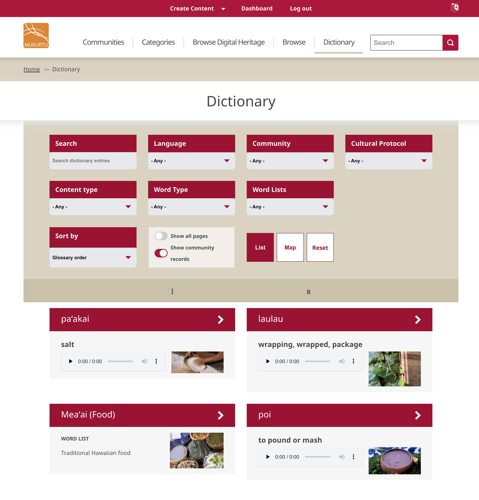

---
tags:
     - dictionary
---

# Understanding the Dictionary

The dictionary is comprised of dictionary words and word lists and is one of the main content types within Mukurtu. Dictionary words use a different set of metadata fields than digital heritage items, and are focused more on granular language elements rather than digital heritage broadly. 

## Dictionary Words
The core of a dictionary word is usually a combination of text and audio recordings. While we use the terms "dictionary" and "dictionary words", the tool is more flexible than that, and can support words, sentences, phrases, word parts, or other elements of language. 

Some of the metadata fields within dictionary words are repeatable. These are word entries, and they allow users to create dictionary words that capture the nuance of language with word and spelling variations.

Note that all fields within the dictionary and across the entire Mukurtu platform support UTF-8 character encoding. If your language uses UTF-8 characters, you should be able to enter them using your existing keyboard and they should display without any customization.

## Word Lists

Word lists are collections of dictionary words. They can be grouped in any way. Some common groupings are by topic, part of speech, language community, etc. 

## Browsing the Dictonary

You can view the dictionary at /dictionary or by selecting the dictionary in the main menu of the home page. The dictionary displays all words and [word lists](../dictionary/WordLists.md) accessible to the user regardless of language.

A number of filters lets you find what youʻre looking for. Use the search bar to search for a term, or use the built-in filters to filter by language, community, cultural protocol, content type (dictionary word or word list), word type and word list. 

Sort results can be ordered by glossary order or search relevance, and if youʻve enabled [multi-page items](../content-settings/MultipageItemConfiguration.md) or [community records](../digital-heritage-items/UnderstandCommunityRecords.md) for dictionary words, you can choose whether your search results display just the base item, or includes pages and/or community records. 

Finally, you can preview your dictonary words as a list or on a map. Dictionary word previews can include the word, translation, recording and thumbnail image. Word lists previews can include the word list title, summary and thumbnail image.

## Dictionary Word Management

Dictionary words and word lists are managed within protocols. There are two user roles within a protocol that are dedicated to creating and managing dictionary words: the language steward and language contributor. For more information on these roles, refer to [Dictionary Roles](DictionaryRoles.md).

To configure the dictionary, refer to [Configure the dictionary](ConfigureTheDictionary.md).

To create a dictionary word, refer to [Create a dictionary word](CreateDictionaryWord.md).

To create a word list, refer to [Create a word list](WordLists.md).

For a list of dictionary word metadata, refer to [Dictionary Word Metadata](DictionaryWordMetadata.md).
