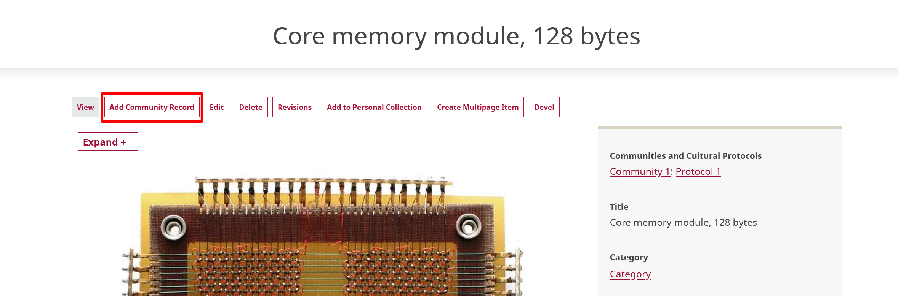
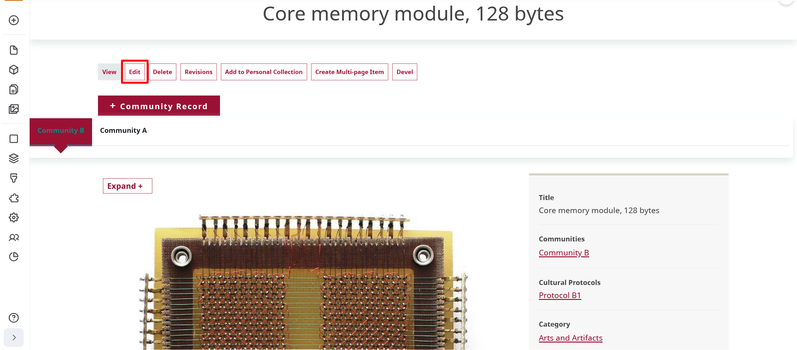

---
tags:
    - content
    - digital heritage items
---
# Create Community Records

!!! roles "User roles"
    Protocol steward, community record steward

Community records allow for multiple layers of information and knowledge to be shared within one item. They are a tool used to provide multiple sets of metadata, and to push back on the concept of a singular, canonical record. Follow the instructions below to add and edit community records.

## Add a community record

To add a community record, a user must be a protocol steward of at least one of the cultural protocols of the digital heritage item that they are creating the community record from. If multiple strict protocols are going to be used, it is best practice to make the digital heritage item the most public of the records. Multiple community records can be added to a digital heritage item.

To create a community record, select the "+ Community Record" button. 

Community records are created the same way as digital heritage items. The only difference between creating a community record and creating a digital heritage item is that there is no media asset field in community records. For detailed instructions on how to create a digital heritage item, visit [Create a Digital Heritage Item](CreateDHItem.md).

## Edit a community record

To edit a community record, navigate to the record you want to edit and select the "Edit" button.

