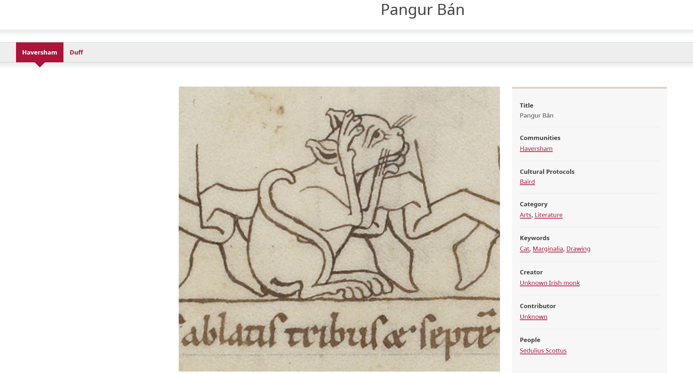

---
tags:
    - content
    - digital heritage items
---
# Create Community Records

!!! roles "User roles"
    Protocol steward, community record steward

Community records allow for multiple layers of information and knowledge to be shared wihtin one item. They are a tool used to provide multiple sets of metadata, and to push back on the concept of a singular, canonical record. Community records can be used for several different purposes, such as preserving a community-provided knowledge alongside institutional (library, archive, or museum) catalog records, enabling community members to add their own unique knowledge about the item. They also allow members of multiple communities to share their own information without having to edit or erase other community members’ contributions, as well as to help promote appropriate access to knowledge. This builds a more comprehensive description for a digital heritage item and empowers communities to describe an item's attributes or specific cultural significance more accurately.

An important note is that within Mukurtu, a community simply means a group of people with shared responsibility for material or knowledge. In most sites this does represent tribal or Indigenous communities, groups, clans, etc, but Mukurtu communities can also be used to represent institutions and organizations (whether Indigenous or not). This concept carries through to community records. Any type of community can create the original digital heritage item, and then subsequent records will all be called "community records", regardless of who is creating them. While some sites first create the digital heritage item from a repository-based catalog record and later add traditional and cultural knowledge in the form of community records, other sites first create the digital heritage item from their community knowledge and later add instiutional metadata in the form of community records. 

When a community record is created from a digital heritage item, they are displayed together and share the same media asset. The rest of the metadata is completely independent. Community records can have different sets of cultural protocols from the initial digital heritage item, which can be an effective tool for ensuring select metadata fields are shared with the right people.

!!! tip
    The "community" in community record refers to any Mukurtu communities. 

In the example below, the first image shows the some of the metadata from a digital heritage item. 

The next image shows a community record on the same digital heritage item. The media asset is shared, but many of the metadata fields are entirely different, or include different content.

## Add a community record

To add a community record, a user must be a protocol steward of at least one of the cultural protocols of the digital heritage item that they are creating the community record from. Even though a community record can have its own set of protocols, the user must be able to access the initial digital heritage item to view its community record. If multiple strict protocols are going to be used, it is best practice to make the digital heritage item the most public of the records. Multiple community records can be added to a digital heritage item.

To create a community record, select the "+ Community Record" button. 

Community records are created the same way as digital heritage items. The only difference between creating a community record and creating a digital heritage item is that there is no media asset field in community records. For detailed instructions on how to create a digital heritage item, visit [Create a Digital Heritage Item](CreateDHItem.md).

## Edit a community record

To edit a community record, navigate to the record you want to edit. Select the record tab for the record you want to edit, then select the "Edit" button.

