---
tags:
    - digital heritage item
    - content
---
# Create a Digital Heritage Item

!!! roles "User roles"
    Protocol steward, contributor

Digital heritage items are one of the main content types of Mukurtu. At their core they offer a combination of media and metadata to tell a story and move beyond the notion of isolated items or records, which allows for more context and relationships. Terminology at cultural heritage institutions may vary, so digital heritage items may represent items, records, content, belongings, objects, songs, stories, or other similar concepts. Digital heritage items can incorporate a range of media types, including images, documents, audio and video recordings, and embedded items. 

Mukurtu Core metadata schema is an extension of Dublin Core. For more information on digital heritage metadata fields, refer to the [Digital Heritage Item Metadata Fields](DHMetadataFields.md) article.

Follow the instructions to create a digital heritage item.

## Mukurtu essentials

### Title

Use the *Title* field to provide a title for your digital heritage item. The title should give users useful information about the item when browsing or searching.

- This is a required field.

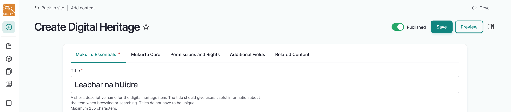

### Cultural protocols

Use the checkboxes to apply cultural protocols to your digital heritage item. 

- This is a required field.

### Sharing settings

Use the checkboxes to select a **Sharing setting**. Sharing setting has two options: you can select **Any** or **All**. 

- Any is the less restrictive setting as it means that the content can be shared with people belonging to any one or more of the protocols selected. 
- All is more restrictive as users must belong to all the selected protocols to view the digital heritage item. 
- This is a required field.

### Category

Categories are high-level descriptive terms that group digital heritage items together and help users browse and discover digital heritage items. 

- Check the box beside each relevant category.
- Each Digital Heritage Item must belong to at least one category. 
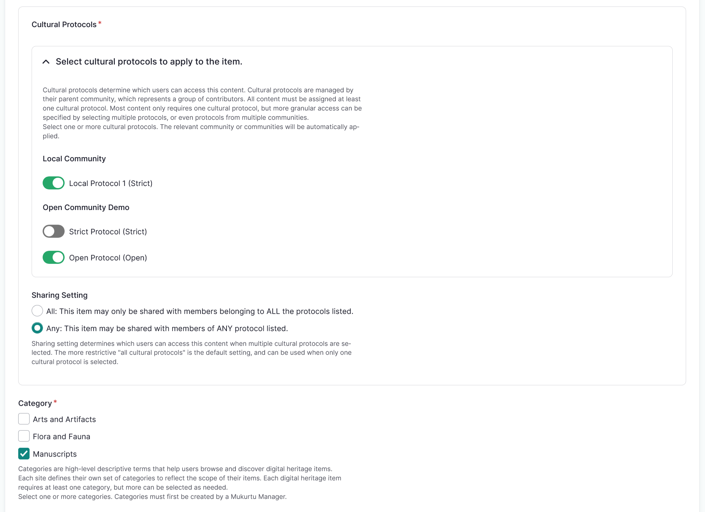

### Media Assets

Media assets are the core element of Digital Heritage Items and can be images, documents, video, embeds, or audio files. Digital heritage items can include more than one media asset. Media assets are not required for digital heritage items. For instructions on how to add a media asset, refer to the [Create Media Assets](/docs/media/CreateMediaAssets.md) article.

- You can add multiple media assets by selecting more than one media asset from the media modal. 
- To reorder your media assets, select your media assets and drag them into the order you prefer.

### Summary

Use the *Summary* field to provide a brief description of your digital heritage item. 

- The summary is displayed with the digital heritage item teaser when browsing, and can help distinguish between items with similar or identical titles. 
- This field is limited to 255 characters. Other fields allow for longer, more in-depth description. 

### Creator

Use the *Creator* field to enter the name of the creator of the digital heritage item.  Names can be in any format that is appropriate for the content, eg: `John Smith` or `Smith, John`. For more information on who should be included as a Creator, refer to the [Digital Heritage Item Metadata Fields](DHMetadataFields.md) article.

- If more than one person should be listed as a creator, use the "Add another item" button to add additional creator text boxes. 
- Select and drag the arrows to the left the creator text box to reorder your creators if necessary. 
- To remove a creator, select the "Remove" button.

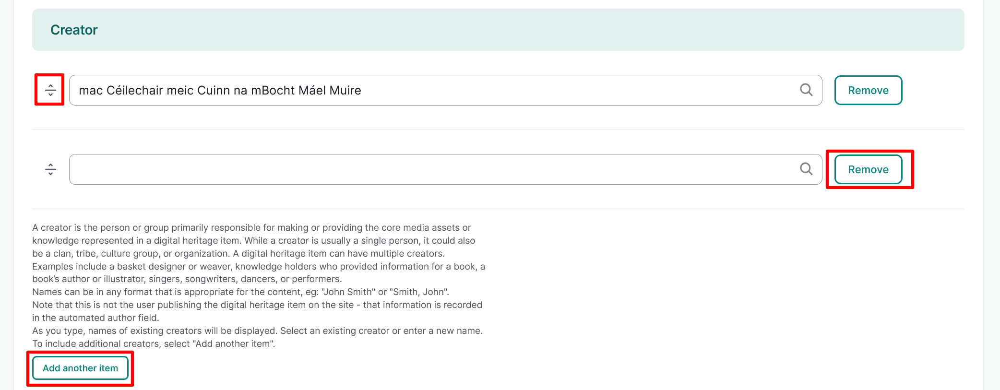

### Contributor

Use the *Contributor* field to enter the name of the contributor of the digital heritage item.  Names can be in any format that is appropriate for the content, eg: `John Smith` or `Smith, John`. For more information on who should be included as a Contributor, refer to the [Digital Heritage Item Metadata Fields](DHMetadataFields.md) article.

- If more than one person should be listed as a contributor, use the "Add another item" button to add additional contributor text boxes. 
- Select and drag the arrows by the contributor text box to reorder your contributors if necessary. 
- To remove a contributor, select the "Remove" button.

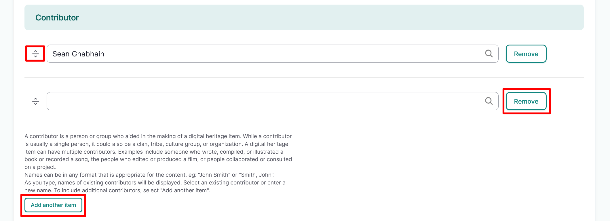

### Original date

In the **Original Date** section enter the creation date of the media asset or information represented in the digital heritage item. The date should be as precise as possible, and either the year, year-month, or year-month-day can be entered.

### Date description

Use the *Date Description* field when a strictly formatted date is not known appropriate. This can refer to the date the media asset was made, written, recorded, or filmed. 

- Some examples of approximate timeframes or circa dates can include `Summer YYYY` or `circa 1800s`.
- This field is limited to 255 characters.

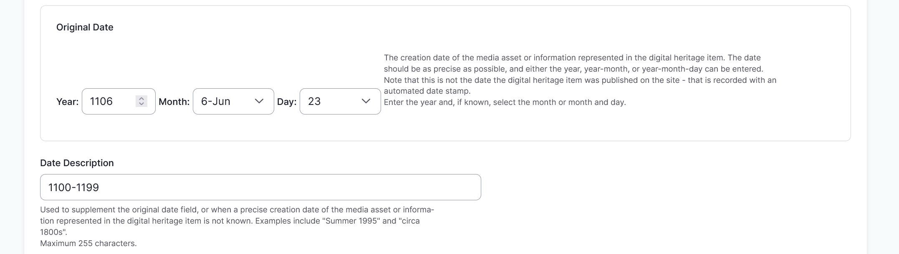

## Mukurtu core

### Cultural narrative

Enter text or media assets in the *Cultural narrative* field. This is a full text HTML field that can support images, documents, audio or video recordings, or embeds. 

To add media, select the "Insert Media" icon from the field's toolbar. Follow the steps in the [Media Assets](#media-assets) section of this article to select media assets or to add new media assets to your library.

The *Cultural narrative* field is used to add historical or social context, expert community knowledge, community stories, and other relevant context to the digital heritage item. This is generally information that is community specific.

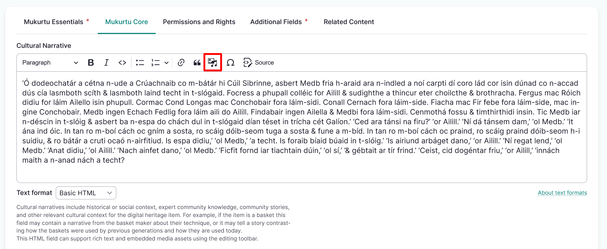

### Traditional knowledge

Enter text or media assets in the *Traditional knowledge* field. This is a full text HTML field that can support images, documents, audio or video recordings, or embeds. 

To add media, select the "Insert Media" icon from the field's toolbar. Follow the steps in the [Media Assets](#media-assets) section of this article to select media assets or to add new media assets to your library.

The *Traditional knowledge* field is used to add in-­depth community-specific knowledge about the digital heritage item, and is often used to provide information of social, spiritual, or esoteric significance. 

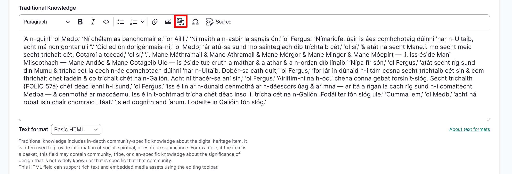

### Description

Enter text or media assets in the *Description* field. This is a full text HTML field that can support images, documents, audio or video recordings, or embeds. 

To add media, select the "Insert Media" icon from the field's toolbar. Follow the steps in the [Media Assets](#media-assets) section of this article to select media assets or to add new media assets to your library.

The *Description* field can include physical characteristics (i.e. photograph, manuscript, newspaper clipping), content information (i.e. what is depicted, content of text), and any other generally relevant information. 

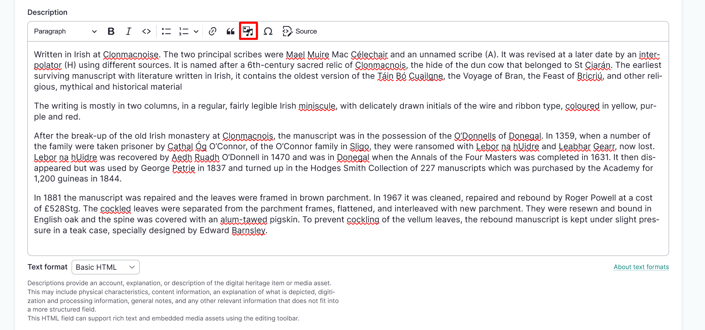

## Permissions and rights

### Local Contexts Projects

Use the **Local Contexts** field to apply Traditional Knowledge labels to your collection. To start a project or for more information refer to [Understanding the Local Contexts Hub](../local-contexts/UnderstandingTheLocalContextsHub.md) or visit [Local Contexts](https://localcontexts.org/).

Select your Local Contexts project from the list. This field will apply all of the Labels from the selected Local Contexts Project(s) to the digital heritage item.

### Local Contexts Labels

Select one or more Labels from the appropriate Local Contexts Project. 

!!! tip
    If a complete project has already been selected, do not also select individual Labels from the same project. 

### Citing Indigenous Elders and Knowledge Keepers

These fields enable Mukurtu users to create a citation from the Elders and Knowledge Keepers who gave context to the digital heritage item. Fill in as many of the fields as possible to generate a citation.

#### Name of the Elder of Knowledge Keeper

Use the *Name of the Elder or Knowledge Keeper* field to enter the individual's name. Users should ensure that the name appears according to the Knowledge Keeper's or community's preferences and includes their appropriate title or status. 

#### Nation or Community

Enter the name of their *Nation or Community*. Including the Knowledge Keeper's Nation or community foregrounds the importance of relationships when it comes to Indigenous knowledges and recognizes which nations hold which teachings. 

#### Treaty territory

Enter the name of the *Treaty terrority*. Only used if applicable and indicated by the Knowledge Keeper.

#### City or community they live in

Enter the name of the *City or community they live in*. Knowledge Keepers may live in places that differ from the origins of their knowledge, nation, or birthplace, and, in some cases, this may be an important relationship they want to recognize. Only used if applicable and indicated by the Knowledge Keeper.

#### A brief description or title of the teaching

Enter *A brief description or title of the teaching*. Information such as the familial provenance of the teaching could be included here. For example, the citation might read: `Story about the sisters of the river as told to [Name of story keeper] by their grandmother [or the grandmother’s name].` This element should be discussed with the Knowledge Keeper, to properly describe or classify the knowledge they are sharing.

#### Date

Enter the date the communication took place. This should be formatted in the year, year-month, or year-month-day format. As precise a date as possible is preferred.

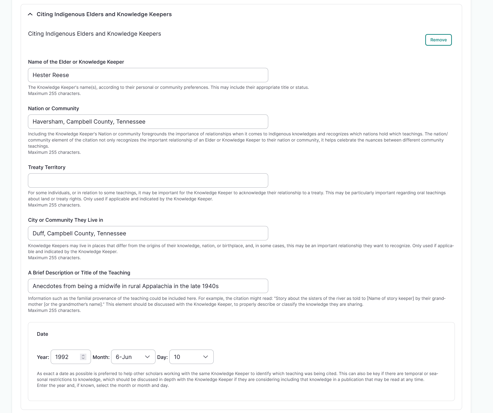

### Rights and usage

Enter a statement in the *Rights and Usage* field about who holds the legal rights to the digital heritage item, media asset, or presented knowledge. Consider adding contact information if the rights holder should be contacted for permission to use, reproduce, circulate, reference, or cite the digital heritage item.

### Rights Statements

Select a rights statement from the dropdown menu. For more information on rights statements, visit [rightsstatement.org](https://rightsstatements.org/en/).

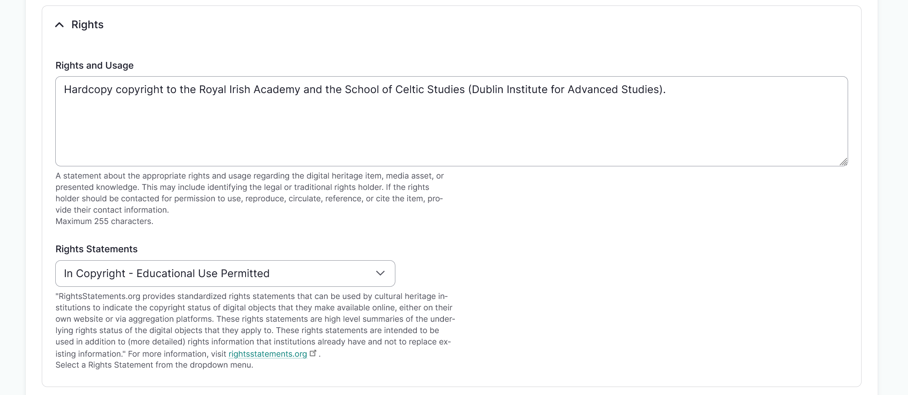

### Licensing options

Select a creative commons license from the dropdown menu. 

   - Creative Commons licenses are an extension of copyright that allow a copyright holder to specify the ways in which their work may be altered, shared, and used. 
   - For more information on Creative Commons licensing, visit [creativecommons.org](https://creativecommons.org/).

## Additional fields

### Type

Use the *Type* field to describe the nature, genre, or function of the media asset or digital heritage item. Examples include `Image`, `Text`, `Sound`, `Video`, or `Physical object`.

- To add more than one format type, select the "Add another item" button and enter the type description. 
- This can be useful if you want to detail both the physical and digital types of a digital heritage item or media asset.

### Format

Use the *Format* field to enter the format of the digital heritage item. 

- Format is the specific physical or digital manifestation of the digital heritage item, including physical format (`pamphlet`, `glass slide`, `open reel`), duration (`90 minutes`), extent (`20 pages`, `11 sheets`), dimensions (`4x6"`, `12x6x8cm`), file format (`PDF`, `JPG`, `MP3`, `MP4`), or other additional information as needed.
- To add more than one format type, select the "Add another item" button and enter the required format description. 
- This can be useful if you want to detail both the physical and digital formats of a digital heritage item or media asset.

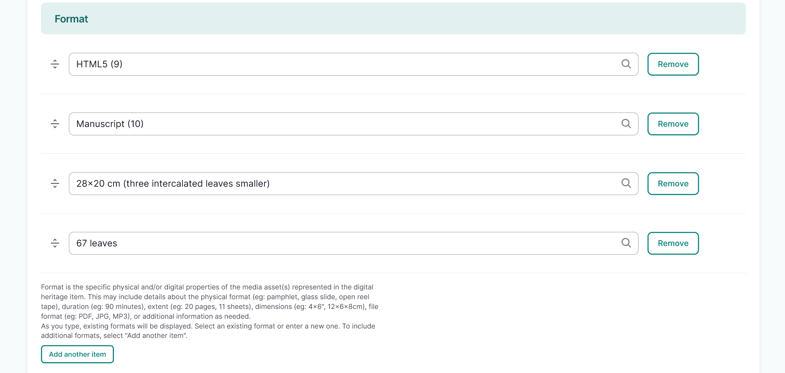

### Identifier

Use the *Identifier* field to provide a unique, unambiguous reference to your digital heritage item or media asset. 

- Identifiers are often provided by the contributing institution or organization so the original item can be located. 
- Examples can include call numbers or accession numbers. 

### Keywords

Use the *Keywords* field to add any keywords to your collection. 

- Keywords are terms used to describe content to ensure that the item will be discoverable when searching or browsing. 
- They are more flexible and specific than categories. 
- Consider adding 3-5 keywords to your collection by selecting the "Add another item" button to add additional keywords fields. 
- This field feeds into the keywords taxonomy.

### Language

Use the *Language* field to enter the language or languages used in the digital heritage item or media asset. 

- This includes text, audio, video. 
- This field feeds into the language taxonomy.

### Map points

Mukurtu allows users to create and manage map points and areas using the embedded Leaflet maps. For detailed instructions on how to include *Map Points*, visit [Create Map Points](../map-points).

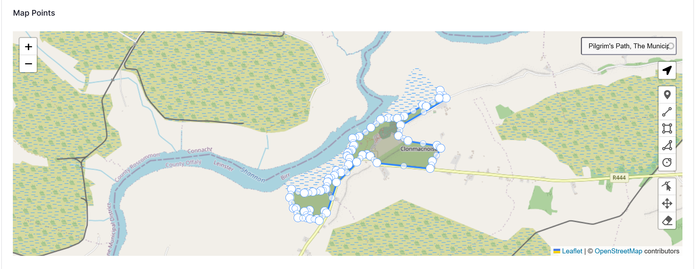

### Location description

Use the *Location description* to provide a text or media reference to a geographical location. 

  - Location description is a rich text field that allows for longer descriptions or more information about the place(s) referenced in the content. 
  - It may be useful in cases where a general description of the places are provided, or more context is necessary. 
  - Location description can be used independently of other location fields and is a full HTML field that supports text, audio, images, and video.

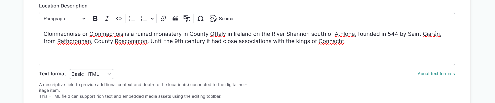

### Location

Enter a *Location*. 

  - Location is a taxonomy field which can be useful to label and connect content using the same term. 
  - Content can list multiple location terms, for example if multiple locations are mentioned, or a place is identified by multiple names.

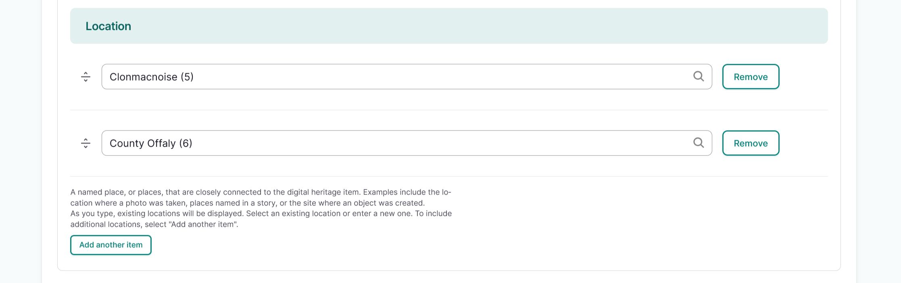

### Source

Enter a *Source* in the field. 

- Source can a reference to a resource, collection, or institution the digital heritage item or media asset was contributed or originated from. 
- Examples include collections such as the `McWhorter Collection`, institutions such as the `Library of Congress`, `American Folklife Center`, or donors such as `Donated by John Smith`. 

### Publisher

Enter a *Publisher* in the field. A publisher can be a person, organization, or service responsible for publishing the digital heritage item or media asset.

Multiple publishers can be added by selecting the "Add another item" button. 

### External links

Additional links can be added to a digital heritage item. This is most commonly used if the item is available elsewhere online and you want to direct users to that record or website. To add additional links, select "Add another Item" and repeat with a new URL and link text.

#### URL

Enter the *URL*. This must be an external link such as `https://www.example.com/`. 

#### Link text

Enter the *Link text*. This is the text that will display on your page as the link.

### Subject

Use the *Subject* field to provide a subject for your digital heritage item. 

- The subject is the main topic or topics of the digital heritage item. They can be tailored to meet the needs of your site or derived from existing controlled vocabularies such as Library of Congress Subject Headings or Getty Art and Architecture Thesaurus. 
- If more than one subject should be applied, use the "Add another item" button to add additional subject text boxes. 
- Select and drag the arrows by the subject to reorder them if necessary. 
- To remove a subject, select the "Remove" button.

### Transcription

Use the *Transcription* field to provide a text transcription of an audio or video recording or of the text in an image or document. This HTML field can support rich text and embedded media assets using the editing toolbar.

### People

Use the *People* field to enter the name of any people represented or referenced in your digital heritage item or media asset. Names can be in any format that is appropriate for the content, eg: `John Smith` or `Smith, John`. 

- If more than one person should be listed, use the "Add another item" button to add additional people text boxes. 
- Select and drag the arrows by the people field to reorder your people if necessary. 
- To remove a person field, select the "Remove" button.
- This field feeds into the People taxonomy.

    !!! tip
        The people field may be used to identify people identifiable in a photograph, people speaking in an audio recording, present in a video, or referenced in a document. The People field is a way to identify people that may have been left out of the record because they were not a Creator or Contributor.

## Related content

### Related content

The **related content** field can help provide connections between your digital heritage item and other site content or to help guide users when browsing content. Examples include multiple photos of a place, objects discussed in an oral history, or dictionary words that appear in a digital heritage item. 

- Select the "Select content" button. Additional digital heritage items, person records, dictionary words, and other content can be included as related content. 

    !!! tip 
        You can filter content by type or search by title.

- Select the checkbox beside all the content you wish to include as related content, then scroll down and select "Add Content".

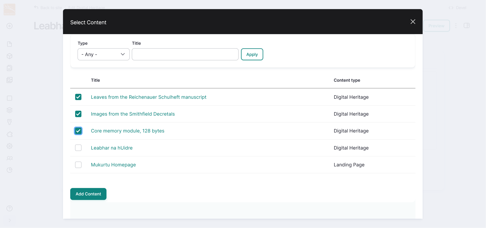