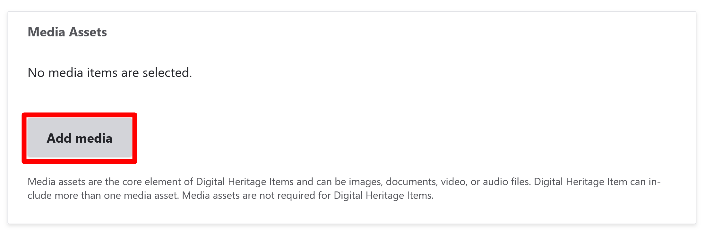
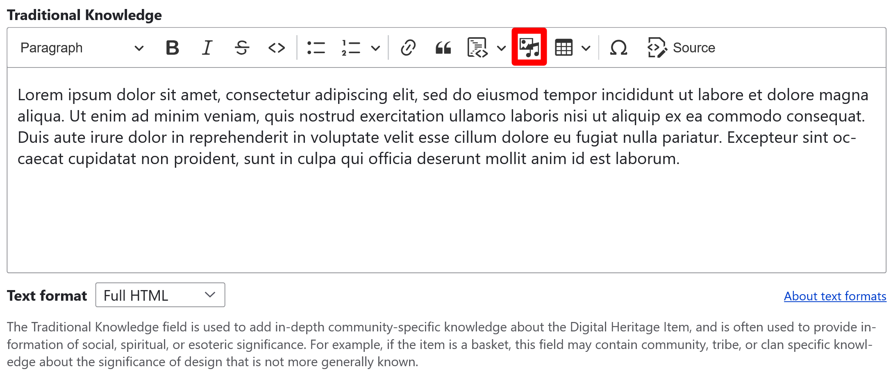

---
tags:
    - digital heritage item
    - content
---
# Create a Digital Heritage Item

!!! roles "User roles"
    Protocol steward, contributor

Digital heritage items are one of the main content types of Mukurtu. At their core they offer a combination of media and metadata to tell a story and move beyond the notion of isolated items or records to allow for more context and relationships. Terminology at cultural heritage institutions may vary, so digital heritage items may represent items, records, content, belongings, objects, songs, stories, or other similar concepts. Digital heritage items can incorporate a range of media types, including images, documents, audio and video recordings, and embedded items. 

Mukurtu Core metadata schema is an extension of Dublin Core.

Follow the instructions to create a digital heritage item.

## Mukurtu essentials

### Title

Use the *Title* field to provide a title for your digital heritage item. The title should give users useful information about the item when browsing or searching.

- This is a required field.

### Cultural protocols

1. Use the checkboxes to apply cultural protocols to your digital heritage item. 

    - This is a required field.

2. Use the checkboxes to select a **Sharing setting**. Sharing setting has two options: you can select **Any** or **All**. 

    - Any is the less restrictive setting as it means that the content can be shared with people belonging to any one or more of the protocols selected. 
    - All is more restrictive as users must belong to all the selected protocols to view the digital heritage item. 
    - This is a required field.

### Category

Categories are high-level descriptive terms that group digital heritage items together and help users browse and discover digital heritage items. Categories are unique to each site and reflect the scope of the items included. One set of Categories is used to describe all digital heritage items within the site. 

- Check the box beside each relevant category.
- Each Digital Heritage Item must belong to at least one category. 

### Summary

Use the *Summary* field to provide a brief description of your digital heritage item. 

- The summary is displayed with the digital heritage item teaser when browsing, and can help distinguish between items with similar or identical titles. 
- This field is limited to 255 characters. Other fields allow for longer, more in-depth description. 

### Media Assets

Media assets are the core element of Digital Heritage Items and can be images, documents, video, embeds, or audio files. Digital heritage items can include more than one media asset. Media assets are not required for digital heritage items. To add a media asset, follow the instructions below.

#### Upload a file

1. Navigate to the **Media Assets** section.
2. Select the "Add Media" button. 

    

3. Select the type of content you want to add. You can upload an audio file, document, image, or video file.
4. Select the "Choose File" or "Browse" button to upload a file. 

    !!! tip
        The text of the upload button depends on your browser. 

    - Select an file from your file explorer.        
    - If you selected the incorrect file, remove it by selecting the "Remove" button after the file uploads.

Fill out the remaining metadata according to the [Media Upload Instructions by Media Type](ByTypeMediaUpload.md) article.

#### Insert a remote asset

1. Navigate to the **Media Assets** section.
2. Select the "Add Media" button. 
3. Select the type of content you want to add. Insert the link for a remote video or SoundCloud asset.

Fill out the metadata according to the [Media Upload Instructions by Media Type](ByTypeMediaUpload.md) article.

#### Insert an external embed

1. Navigate to the **Media Assets** section.
2. Select the "Add Media" button. 
3. Select the external embed option. 

Fill out the metadata according to the [Media Upload Instructions by Media Type](ByTypeMediaUpload.md) article.

### Creator

Use the *Creator* field to enter the name of the creator of the digital heritage item. This field can be formatted as `Last, First`, `First Last`, `Last, "Nickname" First` or any other format that makes sense for your organization. 

- If more than one person should be listed as a creator, use the "Add another item" button to add additional creator text boxes. 
- Select and drag the arrows by the creator's name to reorder your creators if necessary. 
- To remove a creator, select the "Remove" button.

!!! tip
    A creator can be a person or people, a clan, tribe, or cultural group, an organization that is primarily responsible for providing the essential knowledge or labor that goes into making a digital heritage item or media asset. For example, the Creator field could list who designed or made a basket, the knowledge holders who provided the information for a book or the book’s author or illustrator, or the singers, songwriters, dancers, or performers who bring to life cultural materials.

### Contributor

Use the *Contributor* field to enter the name of the contributor of the digital heritage item. This field can be formatted as `Last, First`, `First Last`, `Last, "Nickname" First` or any other format that makes sense for your organization. 

- If more than one person should be listed as a contributor, use the "Add another item" button to add additional contributor text boxes. 
- Select and drag the arrows by the contributor's name to reorder your contributors if necessary. 
- To remove a contributor, select the "Remove" button.

!!! tip
    A Contributor can be a person, people, clan, tribal nation, community group or organization who aided in making the content of a digital heritage item or media asset. This could be the person who wrote, compiled, or illustrated a book or recorded a song, the people who edited or produced a film, or who collaborated or consulted on a project. 

### Date

Use the *Date Description* field when a strictly formatted date is not known appropriate. Some examples of approximate timeframes or circa dates can include `Summer YYYY` or `circa 1800s`. This can refer to the date the media asset was made, written, recorded, or filmed. This field is limited to 255 characters.

In the **Original Date** section enter the date associated with the digital heritage item, if known. Acceptable formats are `YYYY`, `YYYY-MM`, or `YYYY-MM-DD`.

## Mukurtu core

### Cultural narrative

Enter text or media assets to the *Cultural narrative* field. This is a full text HTML field that can support images, documents, audio, or video recordings. 

To add media, select the "Insert Media" icon from the field's toolbar. Follow the steps in the [Media Assets](#media-assets) section of this article to select media assets or to add new media assets to your library.

The *cultural narrative* field is used to add historical or social context, expert community knowledge, community stories, and other relevant context to the digital heritage item. This is generally information that is community specific.

### Traditional knowledge

Enter text or media assets to the *Traditional knowledge* field. This is a full text HTML field that can support images, documents, audio, or video recordings. 

To add media, select the "Insert Media" icon from the field's toolbar. Follow the steps in the [Media Assets](#media-assets) section of this article to select media assets or to add new media assets to your library.

The *traditional knowledge* field is used to add in-­depth community-specific knowledge about the digital heritage item, and is often used to provide information of social, spiritual, or esoteric significance. 

### Description

Enter text or media assets to the *Description* field. This is a full text HTML field that can support images, documents, audio, or video recordings. 

To add media, select the "Insert Media" icon from the field's toolbar. Follow the steps in the [Media Assets](#media-assets) section of this article to select media assets or to add new media assets to your library.

The *description* field can include physical characteristics (i.e. photograph, manuscript, newspaper clipping), content information (i.e. what is depicted, content of text), and any other generally relevant information. 

## Permissions and rights

### Local Contexts

Use the **Local Contexts** field to apply Traditional Knowledge labels to your collection. 
    
!!! tip
    To start a project or for more information on Local Contexts projects, labels, and notices, visit [Local Contexts](https://localcontexts.org/).

- Select your Local Contexts project from the dropdown. 
- Select Local Contexts labels and notices to assign to the collection.  

### Citing Indigenous Elders and Knowledge Keepers

These fields enable Mukurtu users to create a citation from the Elders and Knowledge Keepers who gave context to the digital heritage item. Fill in as many of the fields as possible to generate a citation.

1. Use the *Name of the Elder or Knowledge Keeper* field to enter the individual's name. Users should ensure that the name appears according to the Knowledge Keeper's or community's preferences and includes their appropriate title or status. 
2. Enter the name of their *Nation or Community*. This refers to the Indigenous nation/community that holds this knowledge and connects the Knowledge Keeper to their nation/community. Be as specific as possible.
3. Enter the name of the *Treaty terrority*. This refers to the territories that that hold treaties with the Knowledge Keeper's nation or community. Use only if applicable, such as for oral histories regarding treaties and land rights. 
4. Enter the name of the *City or community they live in*. Knowledge Keepers may live in a place other than where their knowledge originated. Use this field if they would like to acknowledge the place, nation, or community where they reside.
5. Enter *A brief description or title of the teaching*. This field may be used to describe the knowledge and its provenance, such as `Creation Story as told to me by my grandfather who heard it from his father` or any other description or classification the Knowledge Keeper would like to include. 
6. Enter the date the communication took place. Be as specific as possible. Acceptable formats are `YYYY`, `YYYY-MM`, or `YYYY-MM-DD`. 

### Rights

- Rights and usage

    Enter a statement in the *Rights and Usage* field about who holds the legal rights to the digital heritage item, media asset, or presented knowledge. Consider adding contact information if the rights holder should be contacted for permission to use, reproduce, circulate, reference, or cite the digital heritage item.

- Rights Statements

    Select a rights statement from the dropdown menu. For more information on rights statements, visit [rightsstatement.org](https://rightsstatements.org/en/).

### Licensing options

Select a creative commons license from the dropdown menu. Creative Commons licenses are an extension of copyright that allow a copyright holder to specify the ways in which their work may be altered, shared, and used. For more information on Creative Commons licensing, visit [creativecommons.org](https://creativecommons.org/).

## Additional fields

### Format

Use the *Format* field to enter the format of the digital heritage item. Format is the specific physical or digital manifestation of the digital heritage item, including physical format `pamphlet`, `glass slide`, `open reel`, duration or extent ``90 minutes`, `20 pages`, dimensions `4x6"`, `12x6x8cm`, digital filetype `PDF`, `JPG`, `MP3`, `MP4`, or other details as needed.

To add more than one format type, select the "Add another item" button and enter the required format description. This can be useful if you want to detail both the physical and digital formats of a digital heritage item or media asset.

### Type

Use the *Type* field to describe the nature, genre, or function of the media asset or digital heritage item. Examples include `Image`, `Text`, `Sound`, or `Video`.

To add more than one format type, select the "Add another item" button and enter the type description. This can be useful if you want to detail both the physical and digital types of a digital heritage item or media asset.

### Identifier

Use the *Identifier* field to provide a unique, unambiguous reference to your digital heritage item or media asset. Identifiers are often provided by the contributing institution or organization so the original item can be located. Examples can include call numbers or accession numbers. 

### Keywords

Use the *Keywords* field to add any keywords to your collection. Keywords are terms used to describe content to ensure that the item will be discoverable when searching or browsing. They are more flexible and specific than categories. Consider adding 3-5 keywords to your collection by selecting the "Add another item" button to add additional keywords fields. This field feeds into the keywords taxonomy.

### Language

Use the *Language* field to enter the language or languages used in the digital heritage item or media asset. This includes text, audio, video. This field feeds into the language taxonomy.

### Locations

- Mukurtu allows users to create and manage map points and areas using the embedded Leaflet maps. For detailed instructions on how to include *Map Points*, visit [Create Map Points](../map-points).

- Use the *Location description* to provide a text or media reference to a geographical location. Location description is a rich text field that allows for longer descriptions or more information about the place(s) referenced in the content. It may be useful in cases where a general description of the places are provided, or more context is necessary. Location description can be used independently of other location fields and is a full HTML field that supports text, audio, images, and video.

- Enter a *Location*. Location is a taxonomy field which can be useful to label and connect content using the same term. Content can list multiple location terms, for example if multiple locations are mentioned, or a place is identified by multiple names.

### Source

Enter a *Source* in the field. Source can a reference to a resource, collection, or institution the digital heritage item or media asset was contributed or originated from. Examples include collections such as the `McWhorter Collection`, institutions such as the `Library of Congress`, `American Folklife Center`, or donors such as `Donated by John Smith`. 

### Publisher

Enter a *Publisher* in the field. A publisher can be a person, organization, or service responsible for publishing the digital heritage item or media asset.

Multiple publishers can be added by selecting the "Add another item" button. 

### External links

Additional links can be added to a digital heritage item. This is most commonly used if the item is available elsewhere online and you want to direct users to that record or website. 
- Enter the *URL*. This must be an external link such as `https://www.example.com/`. 
- Enter the *Link text*. This is the text that will display on your page as the link.
- To add additional links, select "Add another Item" and repeat with a new URL and link text.

### Subject

Use the *Subject* field to provide a subject for your digital heritage item. The subject is the main topic or topics of the digital heritage item. They can be tailored to meet the needs of your site or derived from existing controlled vocabularies such as Library of Congress Subject Headings or Getty Art and Architecture Thesaurus. 

- If more than one subject should be applied, use the "Add another item" button to add additional subject text boxes. 
- Select and drag the arrows by the subject to reorder them if necessary. 
- To remove a subject, select the "Remove" button.

### Transcription

Use the *Transcription* field to provide a text transcription of an audio or video recording or of the text in an image or document. Including a transcription allows the text to be discoverable when searching for Digital Heritage Items. This is a plain text field with no character limit.

### People

Use the *People* field to enter the name of any people represented or referenced in your digital heritage item or media asset. This field can be formatted as `Last, First`, `First Last`, `Last, "Nickname" First` or any other format that makes sense for your organization. 

- If more than one person should be listed, use the "Add another item" button to add additional people text boxes. 
- Select and drag the arrows by the people field to reorder your people if necessary. 
- To remove a person field, select the "Remove" button.
- This field feeds into the People taxonomy.

    !!! tip
        The people field may be used to identify people identifiable in a photograph, people speaking in an audio recording, present in a video, or referenced in a document. The People field is a way to identify people that may have been left out of the record because they were not a Creator or Contributor.

## Related content

### Related content

The **related content** field can help provide connections between your digital heritage item and other site content or to help guide users when browsing content. 

- Select the "Select content" button. Additional digital heritage items, person records, dictionary words, and other content can be included as related content. 

    !!! tip 
        You can filter content by type or search by title.

- Select the checkbox beside all the content you wish to include as related content, then scroll down and select "Add Content".

