---
tags:
    - collections
    - content
    - digital heritage items
    - metadata
    - person records
    - taxonomies
---
# Manage Keywords

!!! roles "User role"
    Mukurtu administrator

Users can generate new keywords when content is created. There is a chance that errors need to be corrected, such as misspellings, capitalization inconsistency, or duplicate entries. You can manage keywords by editing, deleting, and merging them.

- Editing a keyword will apply to all digital heritage items that use that keyword.
- Deleting a keyword will remove it from all digital heritage items that use it.
- Merging one keyword into another will replace all instances of the initial keyword in content with the updated keyword.

To manage keywords navigate to your **Dashboard** and select **Manage taxonomies** from the menu.

Navigate to **Keywords** and select **List Terms** from the dropdown menu.

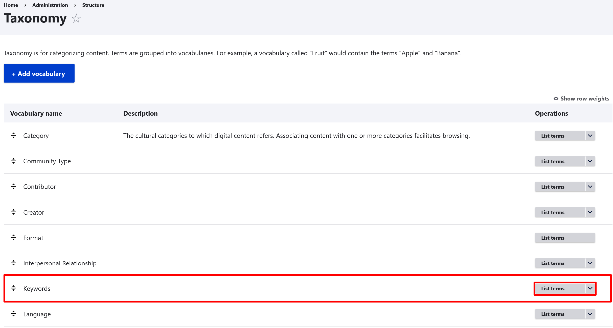

## Edit a keyword

1. To edit a keyword, select the "Edit" button from the dropdown beside the keyword. 
2. Enter your preferred edits in the *Name* field. You can choose to enter a description in the *Description* field at this point. 

    !!! tip
        Descriptions can be helpful if you have two terms that are similar or that need further definition.

3. Select the "Save" button to save your keyword.

## Merge keywords

If you have two similar keywords, you can merge them into one term. This is helpful if you need to merge pluralized terms or other duplicate entries.

Select the **Merge** tab. You can merge terms into a new term or an existing term. 

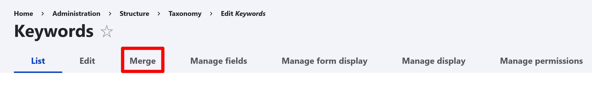

### New term

1. To merge multiple terms into a new target term, select all terms to merge here. Select the "Next" button.

    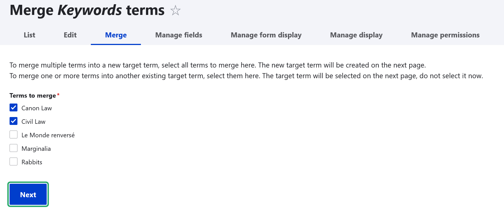

2. Enter the name of your new term into the *New Term* field. 

    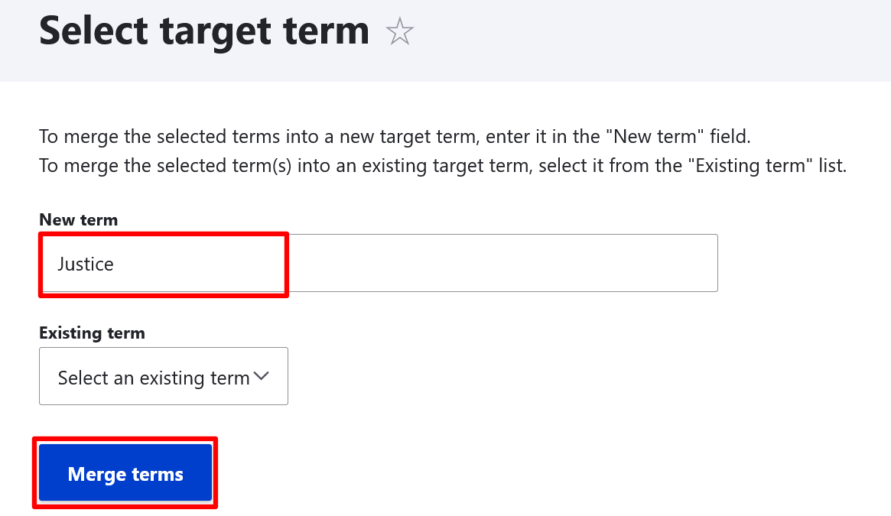

3. Select the "Merge terms" button.

4. You will be redirected to a page asking if you are sure you want to merge your terms. If you do want to merge your terms, select the "Confirm merge" button. 

    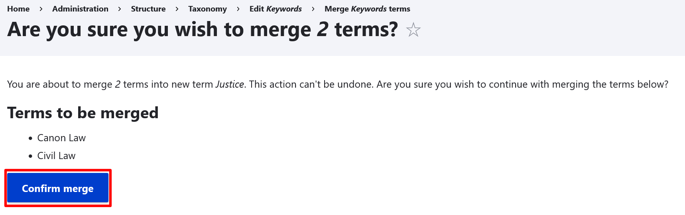

    !!! warning
        Merging keywords cannot be undone.

5. Once your terms are merged, you will be redirected to a confirmation page.

    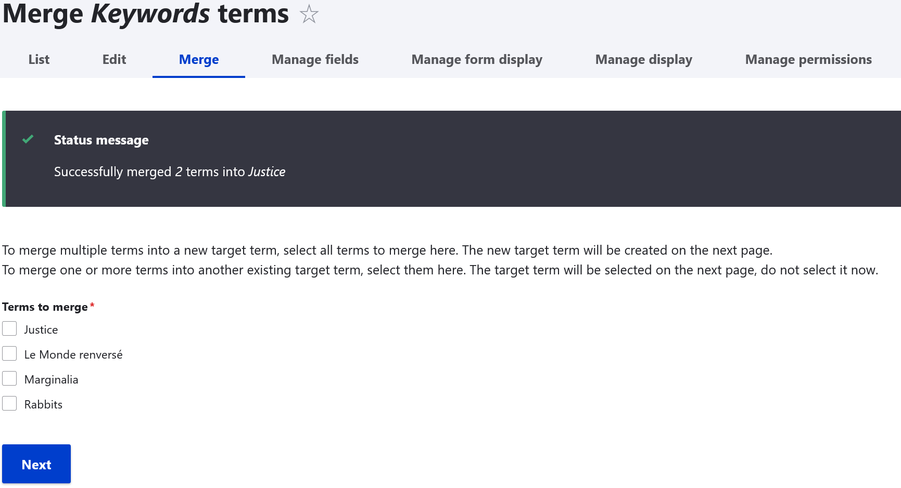

### Existing term

1. To merge one or more terms into another existing target term, select them here. Select "Next".

    !!! warning
        If you are merging terms into another existing term, the target term will be selected on the next page. Do not select it now. 

    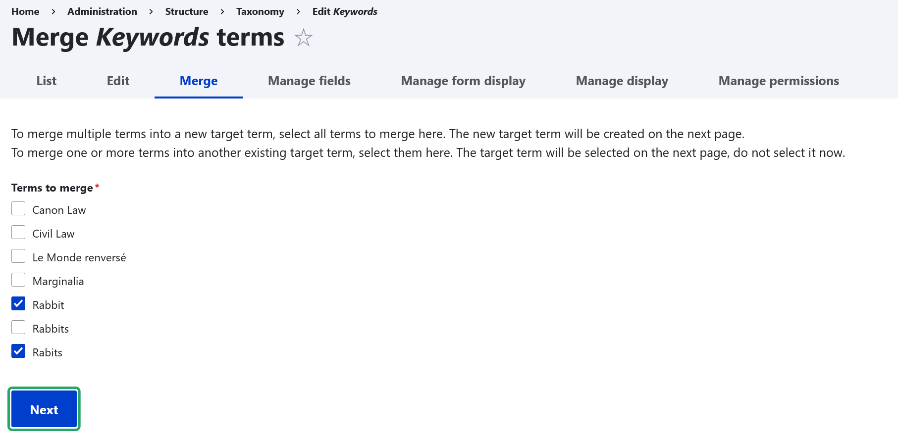

2. From the *Existing term* dropdown menu, select the keyword term you want to merge your other terms into. 

    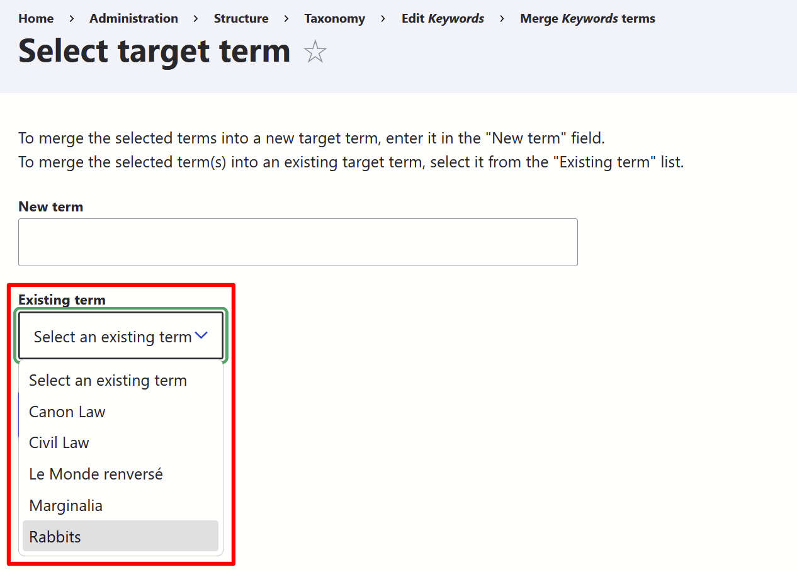

3. Select the "Merge terms" button.

    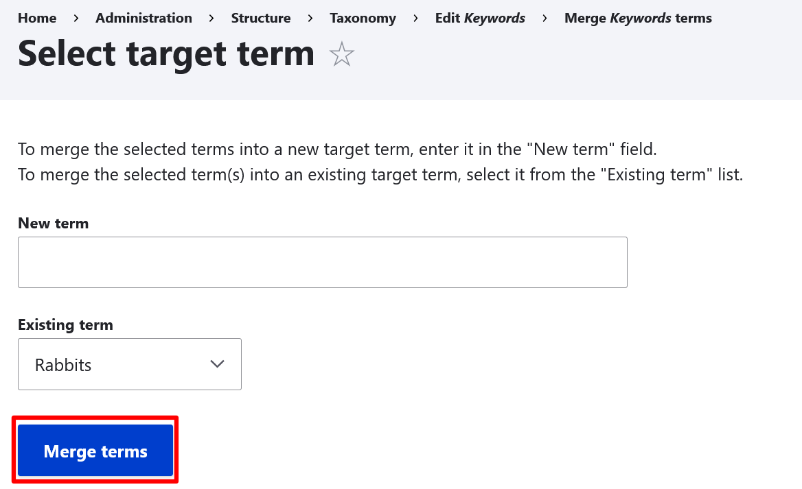

4. You will be redirected to a page asking if you are sure you want to merge your terms. If you do want to merge your terms, select the "Confirm merge" button. 

    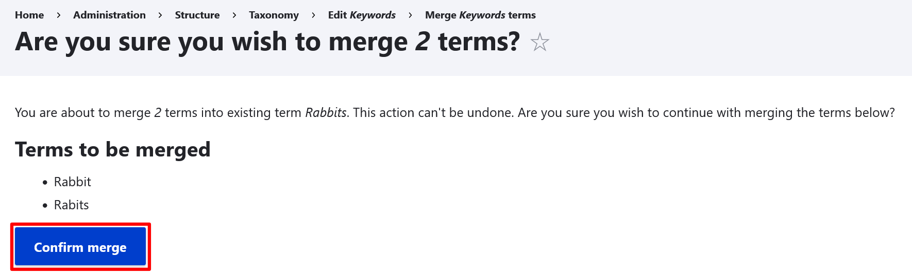

    !!! warning
        Merging keywords cannot be undone.

5. Once your terms are merged, you will be redirected to a confirmation page.

    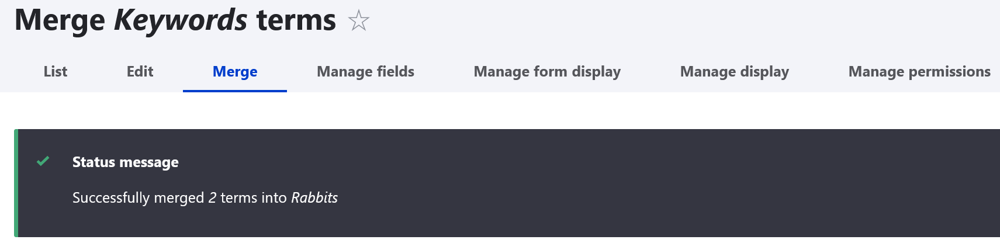
    
## Delete a keyword

To delete a keyword, select the "Delete" button from the dropdown. A pop-up will ask you to confirm that you want to delete your keyword. If you want to delete your keyword, select "Delete".

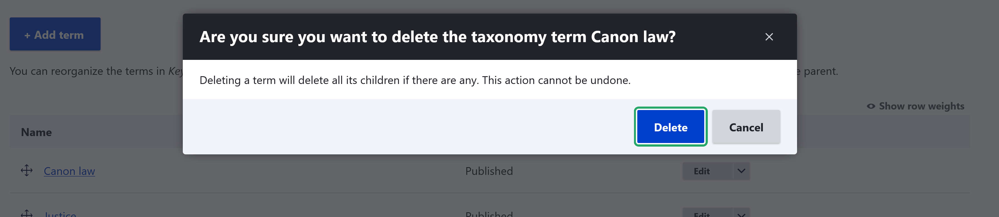

