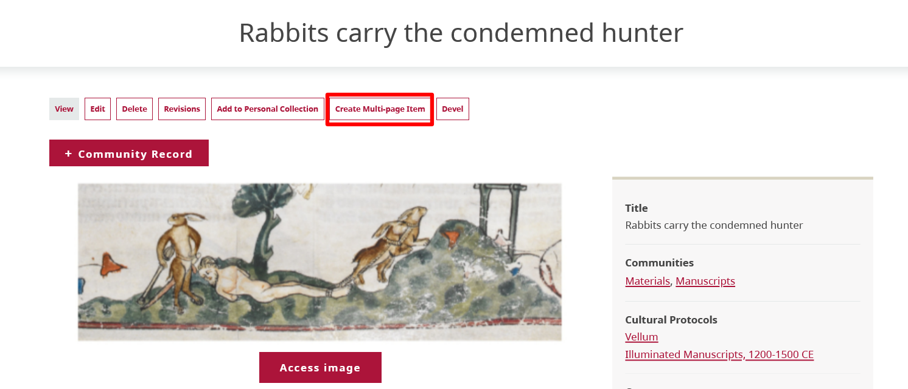
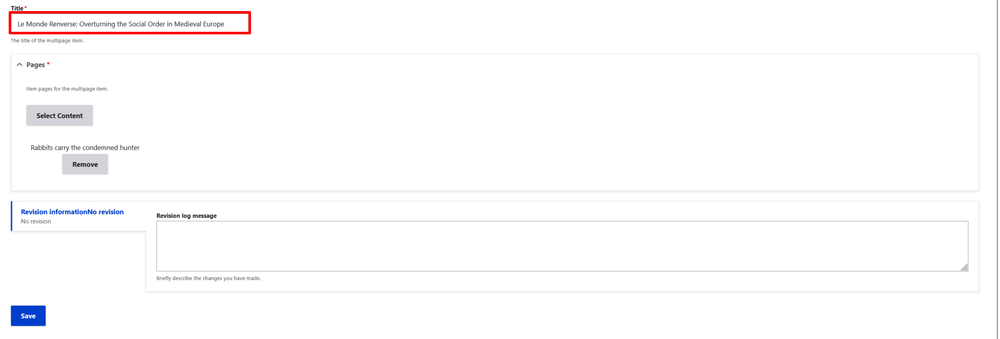
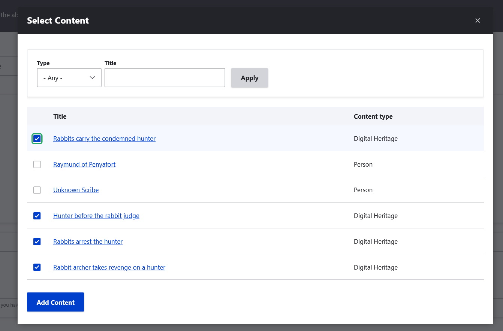

---
tags:
    - digital heritage item
    - content
---
# Multipage Items

!!! roles "User roles" 
    Protocol steward, contributor

Multipage items are additions to digital heritage items that allow multiple pages with unique metadata to be added to an item. The pages can be navigated and browsed within the same digital heritage item. This allows for granular page-level description, which makes individual pages discoverable in site-wide search.  

One important note is that at this time all pages appear individually on the digital heritage browse page. While there are ways to work with this, some users find the display of multiple pages to add unwanted visual bulk to the browse pages. If you do not need unique page-level meatadata and prefer to avoid visual clutter on your browse pages, consider adding each page as a separate media asset within a single digital heritage item instead.

## Create a multipage item

1. From an existing digital heritage item, select the "Create Multipage Item" button in the toolbar below the item or record's title. 

    

2. Enter a title for your multipage item. This defaults to the title of the digital heritage item.

    !!! tip
        This is the umbrella title for the entire multipage item; the individual pages have their own titles. For example, if you are digitizing a yearbook this can be the title of the book. Subsequent pages are assigned their own title.

    

3. Select the checkbox by your current digital heritage item(s). Select the "Add content" button. 

    

4. Select the "Save" button.

## Add new pages

There are two different ways to add new pages to your multipage item: by adding existing digital heritage items into the multipage item or by creating new pages from the initial digital heritage item page. For both methods navigate to Browse or Browse Digital Heritage and select your multipage item.

### Add existing content to a multipage item

You can add existing digital heritage items to multipage items.

1. Select the "Edit" button. 

    

2. Select the "Select Content" button to add additional digital heritage items to add to your multipage item.

    

3. Select the checkbox by the digital heritage item or items you want to assign to your multipage item. Select the "Add content" button.

    

4. Select the "Save" button to save your multipage item.

### Create a new page in a multipage item

You can add new digital heritage items to multipage items.

1. Select the "Add new page" button.

    

2. New pages are created as additional digital heritage items. For more information on creating digital heritage items, visit [Create Digital Heritage Items](CreateDHItem.md).
3. When your new item or record is complete, select the "Save" button. 
4. Select the "Save" button to save your multipage item.

## Edit your multipage item

Edit your multipage item by selecting any page from Browse or Browse Digital Heritage. 

- Reorder the pages in your multipage item by selecting and dragging individual pages.

    

- Remove a page by selecting the "Remove page" button below the page you want to remove.

    

- To edit individual pages, select the **Edit** icon by hovering over the digital heritage item and selecting the "Edit" button from the menu.

    

## Browse multipage item CAN'T WRITE THIS YET BECAUSE IT ISN'T THEMED